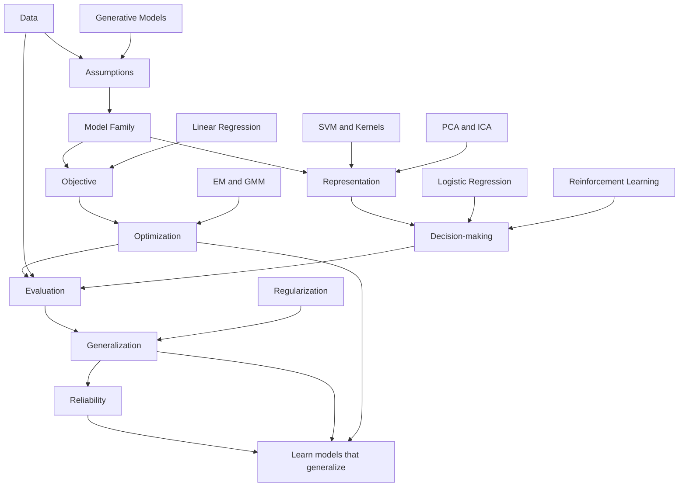

# CS229 Global Concept Map

## 1. Central Question

Given data, assumptions, objectives, and computational constraints, how can we learn models that generalize?

这个问题把 CS229 的所有模块连接起来：data 决定可观察信息，assumptions 决定模型边界，objective 决定优化方向，computational constraints 决定可行算法，generalization 决定模型是否能在训练集之外成立。

## 2. Core Axes

* Data: 样本、特征、标签、噪声、缺失、分布变化和 synthetic experiment design。
* Model: linear models, GLMs, generative models, kernels, neural networks, clustering models, dimensionality reduction 和 RL value/policy models。
* Objective: least squares, likelihood, margin objective, regularized risk, reconstruction error, clustering distortion, expected return。
* Optimization: closed-form solution, gradient descent, Newton's method, constrained optimization, duality, EM, iterative dynamic programming。
* Generalization: train/test gap, bias-variance, regularization, model selection, learning theory。
* Evaluation: metrics, validation protocol, baselines, sanity checks, ablations, error analysis。
* Reliability: assumptions, robustness to noise/outliers, distribution shift, metric mismatch, reproducibility。
* Representation: feature geometry, kernels, PCA, ICA, learned hidden representations。
* Decision-making: classification decision boundaries, thresholding, policy selection, action-value tradeoffs。

## 3. Conceptual Map

## 4. Key Tensions

* fit vs generalization: 训练误差低不代表模型在新数据上可靠，尤其是在高维或数据噪声较强时。
* bias vs variance: 简单模型可能 underfit，复杂模型可能 overfit；regularization 和 model selection 是控制张力的工具。
* generative vs discriminative: generative models 建模 joint distribution 或 class-conditional distribution，discriminative models 直接建模 decision boundary 或 conditional probability。
* closed-form vs iterative optimization: normal equation 可解释但可能数值或规模受限，gradient-based methods 更通用但需要学习率、收敛和稳定性检查。
* theory vs empirical behavior: learning theory 提供边界和概念框架，但具体模型是否可靠仍需实验验证。
* benchmark performance vs real-world reliability: benchmark 分数可能掩盖 distribution shift, subgroup failure, calibration error 或 metric mismatch。

## 5. Personal Research Connections

Trustworthy ML 需要把 failure modes 与 assumptions 联系起来，而 CS229 的基础模型适合做这种最小可控实验。Reliable AI Systems 需要模型层、评估层和系统层共同可靠，CS229 先补模型层和评估层。LLM evaluation 可以借鉴 CS229 的 metric discipline, generalization thinking 和 error analysis，但本仓库不提前扩展到大模型训练。

Representation analysis 可以从 PCA, ICA, kernels 和 neural network basics 建立低维直觉。Causal reliability 可以从 distribution shift 与 correlation-based prediction 的失败开始提出问题，但不把本仓库改成 causal inference 课程。AI for Science / spatiotemporal forecasting 可以在 final mini project 中作为应用方向，但必须服务于 CS229 的推导、实现、验证和泛化分析。
