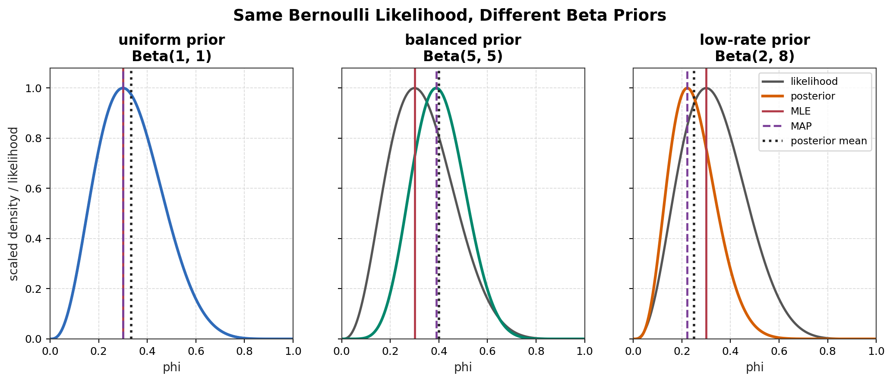
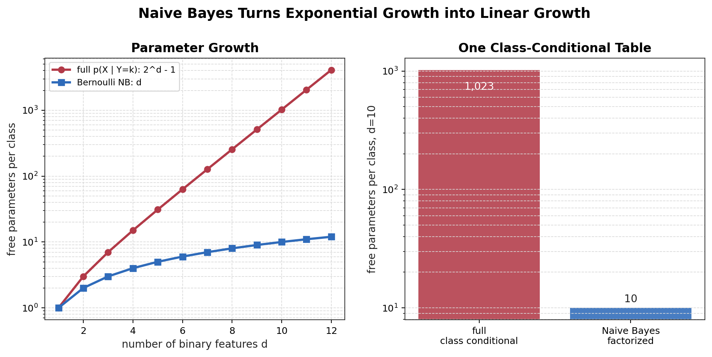
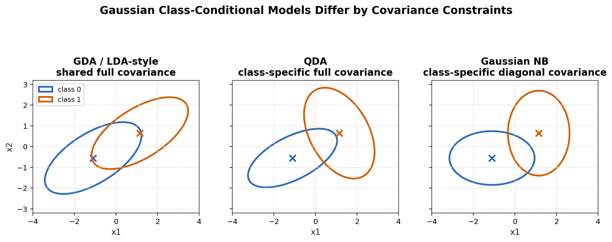

# Module 01: MLE、MAP 与 Naive Bayes

返回 [CMU supplement index](../README.md)。

## Source Metadata / 来源元数据

主课程来源：

CMU 10-601 Introduction to Machine Learning, Spring 2023

选用 lecture 来源：

* Lecture 16: PAC Learning / MLE + MAP，仅使用 MLE/MAP segment。
* Lecture 17: MLE/MAP + Naive Bayes，使用 MAP、Beta-Bernoulli、Bernoulli NB、Gaussian NB、Multinomial NB、generative vs discriminative 部分。

配套阅读：

* Tom Mitchell, *Estimating Probabilities: MLE and MAP*。
* Tom Mitchell, *Generative and Discriminative Classifiers: Naive Bayes and Logistic Regression*。

CMU 历史材料与公开实现参考：

* CMU 10-601 Spring 2023 schedule: <https://www.cs.cmu.edu/~mgormley/courses/10601-s23/schedule.html>
* CMU 10-601 Spring 2023 coursework: <https://www.cs.cmu.edu/~mgormley/courses/10601-s23/coursework.html>
* CMU 10-601 Fall 2013 course page archive: <https://web.archive.org/web/20131202063739/http://curtis.ml.cmu.edu:80/w/courses/index.php/Machine_Learning_10-601_in_Fall_2013>
* CMU 10-601 Fall 2013 syllabus archive: <https://web.archive.org/web/20140815014801/http://curtis.ml.cmu.edu/w/courses/index.php/Syllabus_for_Machine_Learning_10-601>
* Cohen 10-601 Naive Bayes page archive: <https://web.archive.org/web/20141017053234/http://curtis.ml.cmu.edu/w/courses/index.php/10-601_Naive_Bayes>
* scikit-learn Naive Bayes implementation reference: <https://scikit-learn.org/stable/modules/naive_bayes.html>

来源边界：

这些笔记是本仓库自己的中文综合与独立推导，不是 CMU 官方讲义的复制。CMU slides、Fall 2013/Cohen 页面、Mitchell readings 和 scikit-learn 文档只用于核查主题、术语、实现重点和阅读边界。

CMU Lecture 16 的 PAC learning 部分本模块故意不展开；PAC 部分会留到之后的 statistical-learning supplement。

## 1. 模块定位

这个模块不是从 Lecture 1 重新学习 CMU 10-601，也不是重复 CS229 Lecture 5。它是挂在 CS229 generative learning 节点上的专题补充层。

核心目标：

```text
CS229 L4/L5
-> 已经建立 generative model、GDA、NB factorization、likelihood view

CMU 10-601 selected module
-> 把 MLE/MAP 抽象成一般估计原则
-> 把 prior、posterior mode、pseudo-count、smoothing 的关系讲清楚
-> 把 Naive Bayes 变成可实现的计数算法和 log-space classifier
-> 用 Gaussian NB / Multinomial NB 补齐 CS229 L5 的模型谱系
```

本模块单独保留局部推导：

* [derivations/01-mle-map-beta-bernoulli.md](derivations/01-mle-map-beta-bernoulli.md)
* [derivations/02-bernoulli-nb-estimation-logistic-posterior.md](derivations/02-bernoulli-nb-estimation-logistic-posterior.md)
* [derivations/03-gaussian-multinomial-nb.md](derivations/03-gaussian-multinomial-nb.md)

这些文件不进入全局 `math-derivations/`，因为它们是 CMU supplement 的局部补充，而不是 CS229 lecture-ordered derivation record。

## 2. CS229 已经建立的内容

CS229 L4/L5 已经建立了这些主线知识：

* generative vs discriminative modelling；
* GDA 的 joint likelihood；
* GDA MLE；
* Naive Bayes 的核心 conditional-independence factorization；
* GDA posterior 可以化成 logistic form；
* sufficient statistics 说明数据中和参数相关的信息可以被低维统计量压缩。

所以这里不重复 GDA 全套推导，也不重画大量 Gaussian 图。这里补的是估计原则、先验解释、NB 变体和可实现性。

## 3. CMU 补充什么

CMU 10-601 的补充点：

1. 把 MLE 作为 general parameter-estimation principle，而不是只在某个模型里使用。
2. 把 MAP 写成 posterior optimization，严格区分 likelihood 和 posterior。
3. 明确 prior 在参数估计中的作用。
4. 用 Beta-Bernoulli 做最小完整例子。
5. 解释 pseudo-count，但不把 pseudo-count 当成真实历史样本。
6. 给出 Naive Bayes 的参数估计公式。
7. 加入 Gaussian Naive Bayes。
8. 加入 Multinomial Naive Bayes。
9. 强调 implementation-oriented parameter counting。
10. 从 CMU/Mitchell 视角比较 Naive Bayes 和 Logistic Regression。

学习链条：

```text
CS229 sufficient statistics
-> likelihood compression
-> CMU MLE recipe
-> MAP = likelihood + prior
-> Beta-Bernoulli posterior
-> pseudo-count and smoothing intuition
-> Bernoulli / Gaussian / Multinomial NB
-> log-space prediction
-> NB also induces logistic posterior
-> NB != logistic regression
```

## 4. CMU 的编程视角

CMU 10-601 的不同点不只是换一套公式。Spring 2023 L17 强调 Naive Bayes 的 closed-form MLE/MAP、快速训练和计数式实现；Fall 2013/Cohen 系列页面也把 Naive Bayes 放在概率分类、Matlab examples、vectorized code、multinomial implementation 和 prediction interpretation 的上下文中。

本模块因此把公式和代码结构绑定起来：

| 数学对象 | 编程对象 | 目的 |
| --- | --- | --- |
| $N_k$ | class-count array, shape `(K,)` | 估计 class prior |
| $N_{jk,1}$ | binary feature count matrix, shape `(K, d)` | Bernoulli NB 的 one-pass counting |
| $C_{jk}$ | sparse word-count matrix aggregate, shape `(K, d)` | Multinomial NB 的文本计数 |
| $\mu_{jk}, \sigma_{jk}^2$ | mean/variance arrays, shape `(K, d)` | Gaussian NB 的 continuous feature model |
| $\log\pi_k + \log p(x\mid Y=k)$ | score matrix / vectorized prediction | 避免概率连乘下溢 |

工程原则：

* training 尽量变成一次扫描数据后的计数或求和；
* prediction 在 log-space 中做加法，而不是在 probability-space 中连乘；
* 文本 Multinomial NB 应优先使用 sparse count representation；
* Gaussian NB 需要处理零方差或极小方差，否则 log-density 会数值不稳定；
* smoothing 是实现问题，也是 MAP/prior 的统计解释问题，但 posterior mean 和 MAP 不能混写；
* Bernoulli NB 的 binary log-odds 可以预先转成 $w$ 和 $b$，从而用线性 score 做预测；
* Naive Bayes 的速度来自强假设：把 full joint table 从指数规模压到线性规模。

这就是 CMU 对 CS229 的增量：CS229 已经说明“为什么这个模型成立”；CMU 帮我们把“这个模型如何被估计、存储、预测、调试”讲清楚。

## 5. MLE 作为一般框架

给定观测数据：

```math
\mathcal D
=
\{z^{(i)}\}_{i=1}^{m}.
```

参数模型为 $p(z\mid\theta)$。Maximum Likelihood Estimation 定义为：

```math
\hat\theta_{\mathrm{MLE}}
=
\underset{\theta}{\mathrm{argmax}}
\,
p(\mathcal D\mid\theta).
```

log form：

```math
\hat\theta_{\mathrm{MLE}}
=
\underset{\theta}{\mathrm{argmax}}
\,
\log p(\mathcal D\mid\theta).
```

必须区分：

* $\theta$ 是 candidate parameter；
* $\mathcal D$ 已经观察并固定；
* likelihood 是 $\theta$ 的函数；
* likelihood 不是 $P(\theta\mid\mathcal D)$；
* MLE 不使用 parameter prior。

如果样本 iid：

```math
p(\mathcal D\mid\theta)
=
\prod_{i=1}^{m}
p(z^{(i)}\mid\theta).
```

因此：

```math
\log L(\theta)
=
\sum_{i=1}^{m}
\log p(z^{(i)}\mid\theta).
```

CMU 的 recipe 很实用：写出 generative story，写 likelihood，取 log，求导，解 stationary equations，再检查最大值条件。代码实现上，这通常会暴露出真正需要从数据中累计哪些统计量。

## 6. 和 CS229 Sufficient Statistics 的连接

CS229 Lecture 4 已经讨论过 sufficient statistics。这里不重复整段，只保留和 MLE 相关的 bridge。

如果 likelihood 可以写成：

```math
L(\theta;\mathcal D)
=
h(\mathcal D)
g_{\theta}(S(\mathcal D)),
```

则 $h(\mathcal D)$ 与 candidate $\theta$ 无关，优化时不会改变 maximizer：

```math
\underset{\theta}{\mathrm{argmax}}
\,
L(\theta;\mathcal D)
=
\underset{\theta}{\mathrm{argmax}}
\,
g_{\theta}(S(\mathcal D)).
```

于是，参数估计中所有与 $\theta$ 有关的信息都可以通过：

```math
S(\mathcal D)
```

进入。

这条连接是：

```text
sufficient statistics
-> likelihood compression
-> parameter estimation
```

Bernoulli 只需要 $N_1$ 和 $N_0$，Multinomial 只需要 word counts，Gaussian 只需要 class-wise sums 和 squared sums；这些都不是经验捷径，而是模型假设下的 likelihood compression。

## 7. MAP 从 Bayes Rule 推导

Maximum A Posteriori Estimation 定义为：

```math
\hat\theta_{\mathrm{MAP}}
=
\underset{\theta}{\mathrm{argmax}}
\,
p(\theta\mid\mathcal D).
```

Bayes rule：

```math
p(\theta\mid\mathcal D)
=
\frac{
p(\mathcal D\mid\theta)p(\theta)
}{
p(\mathcal D)
}.
```

因为 $p(\mathcal D)$ 与 candidate $\theta$ 无关，所以：

```math
\hat\theta_{\mathrm{MAP}}
=
\underset{\theta}{\mathrm{argmax}}
\,
p(\mathcal D\mid\theta)p(\theta).
```

log form：

```math
\hat\theta_{\mathrm{MAP}}
=
\underset{\theta}{\mathrm{argmax}}
\,
\left[
\log p(\mathcal D\mid\theta)
+
\log p(\theta)
\right].
```

对比：

```text
MLE:
data likelihood only

MAP:
data likelihood + prior preference
```

所以 MAP 不是“把 MLE 换个名字”。MAP 改变的是优化目标：除了数据给出的 likelihood evidence，还加入 prior preference。

## 8. MLE / MAP / Full Bayesian Inference

### MLE

MLE 返回 point estimate：

```math
\hat\theta_{\mathrm{MLE}}.
```

它只优化 likelihood，不保留参数不确定性。

### MAP

MAP 返回 posterior mode：

```math
\hat\theta_{\mathrm{MAP}}.
```

它使用 prior，但最后仍然只返回一个点。

### Full Bayesian Inference

Full Bayesian inference 保留整个 posterior：

```math
p(\theta\mid\mathcal D).
```

预测时可以积分掉参数：

```math
p(y_*\mid x_*,\mathcal D)
=
\int
p(y_*\mid x_*,\theta)
p(\theta\mid\mathcal D)
d\theta.
```

本模块只把它作为概念边界，不展开 Bayesian course。

## 9. Beta-Bernoulli: Likelihood 和 MLE

假设：

```math
Y_i
\sim
\mathrm{Bernoulli}(\phi).
```

数据中：

```math
N_1
=
\sum_{i=1}^{m}
y_i,
```

并且：

```math
N_0
=
m-N_1.
```

likelihood：

```math
p(\mathcal D\mid\phi)
=
\prod_{i=1}^{m}
\phi^{y_i}
(1-\phi)^{1-y_i}
=
\phi^{N_1}
(1-\phi)^{N_0}.
```

log-likelihood：

```math
\ell(\phi)
=
N_1\log\phi
+
N_0\log(1-\phi).
```

求导：

```math
\frac{d\ell}{d\phi}
=
\frac{N_1}{\phi}
-
\frac{N_0}{1-\phi}.
```

令导数为 $0$：

```math
\frac{N_1}{\phi}
=
\frac{N_0}{1-\phi}.
```

交叉相乘：

```math
N_1(1-\phi)
=
N_0\phi.
```

整理：

```math
N_1
=
(N_1+N_0)\phi
=
m\phi.
```

所以：

```math
\hat\phi_{\mathrm{MLE}}
=
\frac{N_1}{m}.
```

这就是 empirical frequency。编程上只需要累计两个整数：success count 和 sample count。

## 10. Beta Prior 和 Posterior

加入 Beta prior：

```math
\phi
\sim
\mathrm{Beta}(\alpha,\beta).
```

density 的 proportional form：

```math
p(\phi)
\propto
\phi^{\alpha-1}
(1-\phi)^{\beta-1}.
```

posterior 与 likelihood times prior 成正比：

```math
p(\phi\mid\mathcal D)
\propto
\phi^{N_1}
(1-\phi)^{N_0}
\phi^{\alpha-1}
(1-\phi)^{\beta-1}.
```

合并幂次：

```math
p(\phi\mid\mathcal D)
\propto
\phi^{N_1+\alpha-1}
(1-\phi)^{N_0+\beta-1}.
```

所以：

```math
\phi\mid\mathcal D
\sim
\mathrm{Beta}
(
N_1+\alpha,
N_0+\beta
).
```

这就是 conjugacy：Bernoulli likelihood 乘 Beta prior 以后仍然得到 Beta posterior。

## 11. Beta-Bernoulli MAP

posterior log-density：

```math
\ell(\phi)
=
(
N_1+\alpha-1
)
\log\phi
+
(
N_0+\beta-1
)
\log(1-\phi)
+
C.
```

求导：

```math
\frac{d\ell}{d\phi}
=
\frac{
N_1+\alpha-1
}{
\phi
}
-
\frac{
N_0+\beta-1
}{
1-\phi
}.
```

设为 $0$：

```math
\frac{
N_1+\alpha-1
}{
\phi
}
=
\frac{
N_0+\beta-1
}{
1-\phi
}.
```

交叉相乘：

```math
(N_1+\alpha-1)(1-\phi)
=
(N_0+\beta-1)\phi.
```

展开并收集 $\phi$：

```math
N_1+\alpha-1
=
(
N_1+N_0+\alpha+\beta-2
)
\phi.
```

因为 $m=N_1+N_0$：

```math
\hat\phi_{\mathrm{MAP}}
=
\frac{
N_1+\alpha-1
}{
m+\alpha+\beta-2
}.
```

这个公式假设 posterior mode 在 interior。更准确地说，posterior 是：

```math
\mathrm{Beta}
(
N_1+\alpha,
N_0+\beta
).
```

若：

```math
N_1+\alpha
>
1
```

并且：

```math
N_0+\beta
>
1,
```

mode 在 $(0,1)$ 内部，上面的导数推导成立。若 $\alpha \leq 1$ 或 $\beta \leq 1$，或者数据计数太小导致 posterior shape parameter 不大于 $1$，mode 可能落在 boundary。不能机械套用 interior MAP 公式。

## 12. Pseudo-count Interpretation

MAP 公式可写成：

```math
\hat\phi_{\mathrm{MAP}}
=
\frac{
N_1+(\alpha-1)
}{
N_1+N_0+(\alpha-1)+(\beta-1)
}.
```

因此 $\alpha-1$ 看起来像 prior pseudo-counts for ones，$\beta-1$ 看起来像 prior pseudo-counts for zeros。

但这只是解释 prior 影响的一种方式，不是说数据中真的提前观察到了这些样本。更严格地说：

```text
pseudo-count is an interpretation,
not literal previously observed data.
```

连接关系：

```text
MAP
-> prior-induced smoothing
-> later Laplace smoothing
```

正式的 Laplace smoothing 放到 CS229 L6 / later CMU supplement 的边界里。本模块只说明 MAP/prior 如何产生 smoothing intuition。

## 13. Posterior Mean vs MAP

Beta posterior 为：

```math
\mathrm{Beta}
(
N_1+\alpha,
N_0+\beta
).
```

posterior mean：

```math
E[\phi\mid\mathcal D]
=
\frac{
N_1+\alpha
}{
m+\alpha+\beta
}.
```

MAP：

```math
\hat\phi_{\mathrm{MAP}}
=
\frac{
N_1+\alpha-1
}{
m+\alpha+\beta-2
}.
```

必须明确：

```text
posterior mean
!=
posterior mode
generally.
```

实现中最容易混的是：很多 library 或教材里的 additive smoothing formula 看起来像 posterior mean，而 MAP mode 的公式含有 $-1$ 和 $-2$。本模块后面写 NB smoothing 时会保持这个区分。

## 14. 图 1: MLE vs MAP Beta-Bernoulli



这张图展示同一份 Bernoulli data likelihood 下，不同 Beta priors 如何改变 posterior，并区分 MLE、MAP 和 posterior mean。图中英文标签是为了保证 matplotlib 字体环境稳定；中文解释保留在正文。

## 15. Bernoulli Naive Bayes

从 generative model 开始：

```math
P(Y=k)
=
\pi_k.
```

features：

```math
X_j
\in
\{0,1\}.
```

conditional-independence assumption：

```math
P(X=x\mid Y=k)
=
\prod_{j=1}^{d}
P(X_j=x_j\mid Y=k).
```

参数：

```math
\phi_{jk}
=
P(X_j=1\mid Y=k).
```

因此：

```math
P(X=x\mid Y=k)
=
\prod_{j=1}^{d}
\phi_{jk}^{x_j}
(
1-\phi_{jk}
)^{1-x_j}.
```

joint model：

```math
P(X=x,Y=k)
=
\pi_k
\prod_{j=1}^{d}
\phi_{jk}^{x_j}
(
1-\phi_{jk}
)^{1-x_j}.
```

CS229 已经给出这个 factorization；CMU 补充的是它为什么在实现上重要。

## 16. Parameter Counting

如果不用 conditional independence，binary vector：

```math
X
\in
\{0,1\}^{d}
```

对每个 class，$P(X\mid Y=k)$ 是定义在 $2^d$ 个 binary configurations 上的 categorical distribution。概率和为 $1$，所以每个 class 需要约：

```math
2^d-1
```

个自由概率参数。

使用 Bernoulli NB 后，每个 class 只需要：

```text
approximately d parameters per class
+
class prior.
```

也就是存储 $\phi_{1k},\ldots,\phi_{dk}$ 和 $\pi_k$。

```text
Naive Bayes turns exponential parameter growth
into linear parameter growth in feature dimension.
```

这就是 assumption 带来的 tractability。CMU/Cohen 讲义里把这一点直接连接到实现：不再估计完整 joint table，而是估计许多小的 conditional probability tables。

## 17. 图 2: NB Parameter Reduction



这张图的重点不是视觉复杂度，而是参数规模：full $p(X\mid Y)$ 需要枚举 $2^d$ 种配置，Naive Bayes 只保存 $d$ 个 class-conditional feature probabilities。

## 18. Bernoulli NB MLE

class count：

```math
N_k
=
\sum_{i=1}^{m}
\mathbf{1}
\{
y^{(i)}=k
\}.
```

class prior MLE：

```math
\hat\pi_k
=
\frac{N_k}{m}.
```

对 feature $j$ 和 class $k$：

```math
N_{jk,1}
=
\sum_{i=1}^{m}
\mathbf{1}
\{
y^{(i)}=k
\}
x_j^{(i)}.
```

Bernoulli NB feature parameter 的 MLE：

```math
\hat\phi_{jk}
=
\frac{
\sum_{i=1}^{m}
\mathbf{1}
\{
y^{(i)}=k
\}
x_j^{(i)}
}{
\sum_{i=1}^{m}
\mathbf{1}
\{
y^{(i)}=k
\}
}.
```

解释：

```text
numerator:
class k emails in which word j appears

denominator:
number of class k emails
```

所以 $\hat\phi_{jk}$ 是 empirical conditional frequency。

编程上：

```text
for each example:
    k = y[i]
    class_count[k] += 1
    feature_count[k, :] += x[i, :]
```

如果 $X$ 是 sparse binary matrix，`feature_count` 可以通过 class mask + sparse sum 得到，不需要对每个 zero 显式循环。

## 19. Bernoulli NB MAP

若对每个 feature/class 参数使用 independent Beta prior：

```math
\phi_{jk}
\sim
\mathrm{Beta}
(
\alpha,
\beta
).
```

定义：

```math
N_{jk,0}
=
N_k-N_{jk,1}.
```

posterior：

```math
\phi_{jk}\mid\mathcal D
\sim
\mathrm{Beta}
(
N_{jk,1}+\alpha,
N_{jk,0}+\beta
).
```

interior MAP：

```math
\hat\phi_{jk,\mathrm{MAP}}
=
\frac{
N_{jk,1}+\alpha-1
}{
N_k+\alpha+\beta-2
}.
```

prior 可以避免小样本下极端的 $0/1$ parameter estimates，但要注意：这不是自动等同于 Laplace smoothing。只有在明确选择相应 prior、并且说明使用的是 MAP mode 还是 posterior mean 时，公式才有严格解释。

## 20. Naive Bayes Prediction

统一预测规则：

```math
\hat y
=
\underset{k}{\mathrm{argmax}}
\,
P(Y=k\mid X=x).
```

由 Bayes rule：

```math
P(Y=k\mid x)
\propto
P(Y=k)p(x\mid Y=k).
```

所以：

```math
\hat y
=
\underset{k}{\mathrm{argmax}}
\,
\left[
\log\pi_k
+
\log p(x\mid Y=k)
\right].
```

Bernoulli NB：

```math
\hat y
=
\underset{k}{\mathrm{argmax}}
\,
\left[
\log\pi_k
+
\sum_{j=1}^{d}
x_j\log\phi_{jk}
+
(1-x_j)
\log(1-\phi_{jk})
\right].
```

这也是 CMU 编程视角的关键：prediction 不要连乘很多小概率，而是在 log-space 累加 score。

## 21. Gaussian Naive Bayes

CMU L17 把 Gaussian NB 列为 continuous feature 的 Naive Bayes 变体。它是 CS229 GDA/QDA 之后最重要的补充之一。

假设每个 feature：

```math
X_j
\mid
Y=k
\sim
\mathcal N
(
\mu_{jk},
\sigma_{jk}^2
).
```

并且：

```math
X_1,\ldots,X_d
\perp
\mid Y.
```

因此：

```math
p(x\mid Y=k)
=
\prod_{j=1}^{d}
\mathcal N
(
x_j;
\mu_{jk},
\sigma_{jk}^2
).
```

等价地，class-conditional covariance 是 diagonal：

```math
\Sigma_k
=
\mathrm{diag}
(
\sigma_{1k}^2,\ldots,\sigma_{dk}^2
).
```

MLE：

```math
\hat\mu_{jk}
=
\frac{1}{N_k}
\sum_{i=1}^{m}
\mathbf{1}
\{
y^{(i)}=k
\}
x_j^{(i)}.
```

```math
\hat\sigma_{jk}^2
=
\frac{1}{N_k}
\sum_{i=1}^{m}
\mathbf{1}
\{
y^{(i)}=k
\}
(
x_j^{(i)}-\hat\mu_{jk}
)^2.
```

编程上，Gaussian NB 训练可以维护 class-wise sums 和 squared sums。预测 score 为：

```math
s_k(x)
=
\log\pi_k
-
\frac{1}{2}
\sum_{j=1}^{d}
\left[
\log(2\pi\sigma_{jk}^2)
+
\frac{(x_j-\mu_{jk})^2}{\sigma_{jk}^2}
\right].
```

实现时需要 variance floor 或类似稳定化处理，避免 $\sigma_{jk}^2=0$ 造成除零或无限 log-density。

## 22. Gaussian NB 与 GDA/QDA 的关系

### GDA

CS229 的 GDA / LDA-style model 通常写成：

```math
X\mid Y=k
\sim
\mathcal N(\mu_k,\Sigma).
```

它使用 shared full covariance，因此允许 feature covariance structure，但不同 class 共享同一个 $\Sigma$。

### QDA

QDA 写成：

```math
X\mid Y=k
\sim
\mathcal N(\mu_k,\Sigma_k).
```

它允许 class-specific full covariance。

### Gaussian NB

Gaussian NB 写成：

```math
X\mid Y=k
\sim
\mathcal N
(
\mu_k,
\mathrm{diag}
(
\sigma_{1k}^2,\ldots,\sigma_{dk}^2
)
).
```

它允许 class-specific variance，但不允许同一 class 内不同 features 之间有 covariance。

更严格的层级：

```text
GDA / LDA-style:
shared full covariance

QDA:
class-specific full covariance

Gaussian Naive Bayes:
class-specific diagonal covariance
```

它们都属于：

```text
Gaussian class-conditional generative classifiers
```

但 covariance assumptions 不同。不要简单说 Gaussian NB 就是 CS229 GDA 的严格子模型，因为 classical CS229 GDA 是 shared full covariance，而 Gaussian NB 常见形式是 class-specific diagonal covariance。更准确的说法是：它们是在 Gaussian class-conditional family 中选择了不同 covariance constraints。

## 23. 图 3: GDA / QDA / Gaussian NB



图中三组二维 covariance ellipses 对应 shared full、class-specific full、class-specific diagonal 三种假设。这个图只用于补充 covariance 约束，不重复 CS229 L5 的 GDA 可视化。

## 24. Multinomial Naive Bayes

CMU L17 正式把 Multinomial NB 列为 Naive Bayes model for integer features。Cohen NB 页面也强调文本任务中常把文档看成多次从词表中抽词。

Bernoulli event model：

```text
word present / absent
```

Multinomial event model：

```text
word occurrence counts
```

定义：

```math
X_j
=
\text{count of vocabulary item }j.
```

document length：

```math
N
=
\sum_{j=1}^{d}
X_j.
```

conditional model：

```math
X
\mid
Y=k
\sim
\mathrm{Multinomial}
(
N,
\theta_k
).
```

其中：

```math
\sum_{j=1}^{d}
\theta_{jk}
=
1.
```

probability mass：

```math
p(x\mid Y=k)
=
\frac{N!}{\prod_{j=1}^{d}x_j!}
\prod_{j=1}^{d}
\theta_{jk}^{x_j}.
```

对固定文档 $x$ 预测时，$N!/\prod_j x_j!$ 与 class $k$ 无关，可以从 $\mathrm{argmax}$ 中去掉。

词计数：

```math
C_{jk}
=
\sum_{i:y^{(i)}=k}
x_j^{(i)}.
```

class total word count：

```math
C_k
=
\sum_{j=1}^{d}
C_{jk}.
```

MLE：

```math
\hat\theta_{jk}
=
\frac{C_{jk}}{C_k}.
```

log-space prediction：

```math
\hat y
=
\underset{k}{\mathrm{argmax}}
\,
\left[
\log\pi_k
+
\sum_{j=1}^{d}
x_j\log\theta_{jk}
\right].
```

编程上，Multinomial NB 是非常典型的 sparse matrix 模型：训练累计 `(K, d)` 的 word-count table，预测可以做 sparse vector 与 `log_theta[k, :]` 的 dot product。

若使用 Dirichlet prior：

```math
\theta_k
\sim
\mathrm{Dirichlet}
(
\alpha_1,\ldots,\alpha_d
).
```

posterior：

```math
\theta_k\mid\mathcal D
\sim
\mathrm{Dirichlet}
(
C_{1k}+\alpha_1,
\ldots,
C_{dk}+\alpha_d
).
```

interior MAP：

```math
\hat\theta_{jk,\mathrm{MAP}}
=
\frac{
C_{jk}+\alpha_j-1
}{
C_k+\sum_{\ell=1}^{d}\alpha_{\ell}-d
}.
```

posterior mean：

```math
E[\theta_{jk}\mid\mathcal D]
=
\frac{
C_{jk}+\alpha_j
}{
C_k+\sum_{\ell=1}^{d}\alpha_{\ell}
}.
```

这里再次体现：smoothing formulas 必须说明是 MAP mode 还是 posterior mean。

## 25. Naive Bayes 也诱导 Linear Classifier

对 binary Bernoulli NB，推导 posterior odds：

```math
\log
\frac{
P(Y=1\mid x)
}{
P(Y=0\mid x)
}
=
\log
\frac{
\pi_1p(x\mid Y=1)
}{
\pi_0p(x\mid Y=0)
}.
```

代入 Bernoulli NB likelihood：

```math
=
\log\frac{\pi_1}{\pi_0}
+
\sum_{j=1}^{d}
\left[
x_j\log\frac{\phi_{j1}}{\phi_{j0}}
+
(1-x_j)
\log\frac{1-\phi_{j1}}{1-\phi_{j0}}
\right].
```

把不乘 $x_j$ 的项收进 bias：

```math
=
\log\frac{\pi_1}{\pi_0}
+
\sum_{j=1}^{d}
\log\frac{1-\phi_{j1}}{1-\phi_{j0}}
+
\sum_{j=1}^{d}
x_j
\left[
\log\frac{\phi_{j1}}{\phi_{j0}}
-
\log\frac{1-\phi_{j1}}{1-\phi_{j0}}
\right].
```

定义：

```math
b
=
\log\frac{\pi_1}{\pi_0}
+
\sum_{j=1}^{d}
\log\frac{1-\phi_{j1}}{1-\phi_{j0}}.
```

定义：

```math
w_j
=
\log
\frac{
\phi_{j1}(1-\phi_{j0})
}{
\phi_{j0}(1-\phi_{j1})
}.
```

于是：

```math
\log
\frac{
P(Y=1\mid x)
}{
P(Y=0\mid x)
}
=
b
+
\sum_{j=1}^{d}
w_jx_j.
```

也就是：

```math
P(Y=1\mid x)
=
\sigma
(
w^Tx+b
).
```

结论：

```text
Bernoulli Naive Bayes can also induce a logistic-form posterior.
```

这和 CS229 Lecture 5 的连接是：

```text
generative assumptions
-> discriminative posterior form
```

CS229 在 GDA 中展示过这条逻辑；CMU/Mitchell/Cohen 的 NB 视角说明 Bernoulli NB 也有类似结构。

## 26. But NB != Logistic Regression

Naive Bayes：

```text
estimate class priors
+
feature conditional probabilities
+
derive posterior.
```

Logistic regression：

```text
directly estimate conditional log-odds parameters.
```

所以即使 posterior functional form 都可以写成 logistic form，训练目标仍然不同：

* NB 最大化 joint likelihood $p(x,y)$，并依赖 conditional independence assumption。
* Logistic regression 最大化 conditional likelihood $p(y\mid x)$，直接学习 decision boundary / log-odds parameters。
* 有限样本下两者 estimator 不同。
* NB 通常数据效率高、训练快，但 model misspecification 会影响 calibration。
* Logistic regression 通常在 feature dependence 明显时更稳健，但需要迭代优化。

这部分只做 cross-reference，不重复 CS229 GDA 整段。

## 27. Generative vs Discriminative: CMU / Mitchell 视角

| 维度 | Naive Bayes | Logistic Regression |
| --- | --- | --- |
| 建模对象 | joint model $p(x,y)$ | conditional model $p(y\mid x)$ |
| 假设 | 给定 class 后 features 条件独立 | 直接假设 log-odds 形式 |
| 参数估计 | class counts、feature counts、closed-form MLE/MAP | numerical optimization |
| 数据效率 | 小样本时常很强，因为假设强 | 往往需要更多数据估计边界 |
| 错设风险 | feature dependence 会破坏 density estimate | 不需要建模 $p(x)$，对 feature dependence 更宽容 |
| 参数规模 | 由 NB 假设压到 $O(Kd)$ | 通常也是 $O(Kd)$，但含义不同 |
| 决策边界 | Bernoulli NB 可诱导 linear boundary；Gaussian NB 视 covariance 约束可线性或二次 | 线性 log-odds，除非手动加入 nonlinear features |
| calibration | 概率可能过度自信 | 通常 calibration 更好，但仍需验证 |
| computational properties | training one-pass counting，prediction dot product/log-score | training iterative，prediction cheap |

CMU 的重点是：NB 不一定是好 density estimator，但因为参数少、训练快、实现简单，在 classification 上经常很有竞争力。这个判断要和 CS229 的数学主线合起来理解：generative assumptions 不只是“建模选择”，也是 computational constraints。

## 28. 实现闭环

本模块以后接代码时，最自然的实现顺序是：

1. `BernoulliNB.fit(X_binary, y)`：累计 `class_count` 和 `feature_count`。
2. 区分 MLE、MAP mode、posterior mean 三种估计接口或注释。
3. `predict_log_proba` 使用 log-space score。
4. `MultinomialNB.fit(X_counts, y)`：使用 sparse count matrix 聚合 $C_{jk}$。
5. `GaussianNB.fit(X_real, y)`：累计 mean/variance，并加 variance floor。
6. 用 `score = X @ W.T + b` 理解 binary NB 的 logistic posterior induced linear form。
7. 用 calibration / error analysis 检查 NB 的 overconfidence 和 feature dependence 问题。

这里不写完整 lab，因为当前 CS229 PS1 正在独立进行。本模块只是为之后的实现、实验和补充练习建立清楚的数学-代码接口。

## 29. Figures

Generated figures:

| Figure | File | Incremental value |
| --- | --- | --- |
| Figure 1 | [figures/cmu10601-beta-bernoulli-mle-map.png](figures/cmu10601-beta-bernoulli-mle-map.png) | 对比同一 likelihood 下 MLE、MAP、posterior mean 的位置 |
| Figure 2 | [figures/cmu10601-nb-parameter-reduction.png](figures/cmu10601-nb-parameter-reduction.png) | 显示 full joint table 到 NB linear parameter table 的规模变化 |
| Figure 3 | [figures/cmu10601-gda-qda-gnb-covariance.png](figures/cmu10601-gda-qda-gnb-covariance.png) | 对齐 GDA / QDA / Gaussian NB 的 covariance assumptions |

Figure generation script:

* [scripts/generate_figures.py](scripts/generate_figures.py)

## 30. Coursework Boundary / 练习边界

CMU HW6 映射：

```text
HW6 - Generative Models (written)
status: parallel with CS229 PS1 / not yet started by Codex
```

临时检查官方 HW6 handout 后，确认它覆盖 Learning Theory and Generative Models，并含有 MLE/MAP 与 Naive Bayes 内容。因此：

```text
generative subset:
current

MLE/MAP subset:
current

Naive Bayes subset:
current

PAC subset:
deferred
```

不解 HW6，不复制题目，不加入答案。

## 31. PS1 Isolation / PS1 隔离

本模块不修改：

```text
assignments/ps1-supervised-learning/
```

也不解 PS1、不碰 PS1 answers、不改变 PS1 progress。CS229 PS1 仍然由用户独立同步完成。

## 32. Final Synthesis / 最终合成

这个模块在知识结构中的作用是：

| 节点 | CS229 已提供 | CMU supplement 补足 | 形成的理解 |
| --- | --- | --- | --- |
| Sufficient statistics | L4 解释哪些数据统计量保留参数信息 | MLE/MAP 直接使用这些统计量估计参数 | counts/sums 是 likelihood compression，不是技巧 |
| MLE | CS229 在多个模型中使用 MLE | CMU 抽象成一般估计原则 | likelihood 是 parameter function，不是 posterior |
| MAP | CS229 有 Bayesian/MAP 直觉 | CMU 从 Bayes rule 推导 posterior optimization | prior preference 和 data evidence 分开 |
| Beta-Bernoulli | CS229 多次使用 Bernoulli | CMU 给出完整 posterior、MAP、mean、pseudo-count | smoothing intuition 变得严格 |
| Bernoulli NB | CS229 给出 factorization | CMU 强调参数估计和 one-pass counting | NB 是可实现的生成式分类器 |
| Gaussian NB | CS229 重点是 GDA/QDA | CMU 加入 diagonal covariance case | Gaussian generative classifiers 的谱系更完整 |
| Multinomial NB | CS229 NB 讲得较简 | CMU/Cohen 补充 text count event model | 文本分类的 feature semantics 更清楚 |
| NB -> logistic posterior | CS229 展示 GDA -> logistic | CMU/Mitchell/Cohen 展示 Bernoulli NB -> logistic | logistic form 不等于 logistic regression training |

因此，CMU 10-601 在这里是一个 selective, topic-based supplement：它把 CS229 的 generative learning 主线补成更适合推导、实现和实验的完整逻辑。
