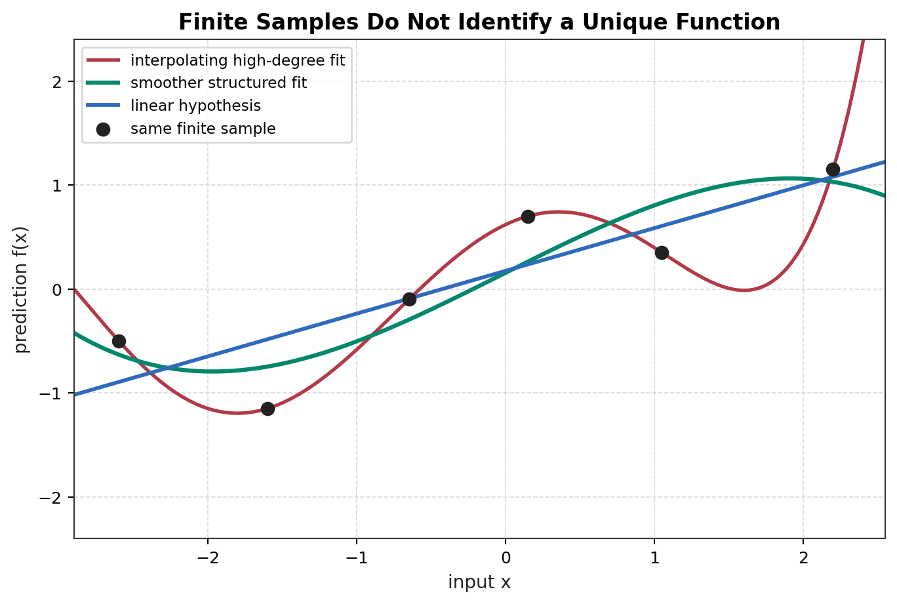
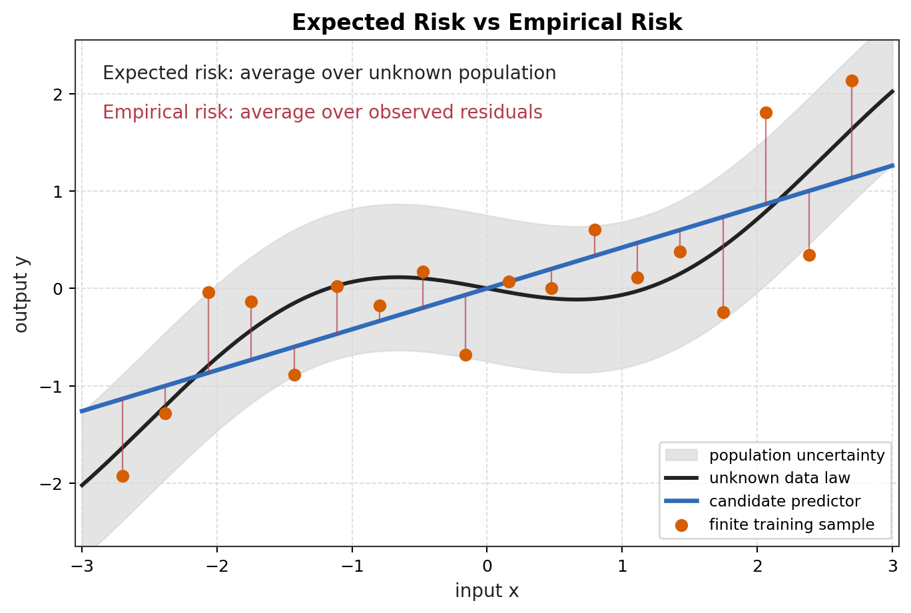

# Module 01: Statistical Learning Setting

返回 [MIT 9.520 / 6.860 supplement overview](../overview.md)。

## Source Metadata / 来源元数据

主课程来源：

MIT / CBMM Learning Hub, 9.520 / 6.860, *Statistical Learning Theory and Applications*。

当前选用：

* Class 02: Statistical Learning Setting。
* Class 02 slides: `class02_SLT.pdf`。
* L. Rosasco, T. Poggio, *Machine Learning: a Regularization Approach*, Chapter 1: Statistical Learning Theory。

Class 02 slides 使用 $P$ 表示 $\mathcal X\times\mathcal Y$ 上的未知 probability measure；Rosasco / Poggio notes 中也常见 $\rho$ notation。本模块正文统一写 $\rho$，第一次出现时把它说明为与 Class 02 的 $P$ 相同层级的 population distribution。

本模块只使用 Class 02 中和 CS229 Lecture 5 及之前直接相关的 statistical learning framework。后续的 uniform convergence、Rademacher complexity、stability 和 deep learning theory 不在当前范围内。

## Detailed Notes / 深入笔记

| File | 内容 |
| --- | --- |
| [derivations/01-statistical-risk-framework.md](derivations/01-statistical-risk-framework.md) | 从 unknown population distribution 到 expected risk、empirical risk、ERM，并连接 CS229 linear / logistic / GDA / NB |
| [derivations/02-excess-risk-and-consistency.md](derivations/02-excess-risk-and-consistency.md) | excess risk、$f^*$、$f_{\mathcal H}^*$、approximation / estimation limitation、consistency target |
| [derivations/03-target-functions-and-losses.md](derivations/03-target-functions-and-losses.md) | Class 02 的 conditional risk / target function 视角：square loss、0-1 classification、logistic loss 与 CS229 log-odds 的连接 |

## 1. 模块定位

CS229 早期的进入方式通常是：

```text
choose a model
fit parameters
derive the optimizer
```

MIT 9.520 / 6.860 的进入方式更抽象：

```text
unknown data-generating distribution
+ finite random sample
+ admissible function class
+ loss criterion
+ optimization rule
-> learned function with low expected risk
```

这个模块的目标不是再讲一次 supervised learning，而是把已经学过的 linear regression、logistic regression、GDA 和 Naive Bayes 放到同一个 statistical learning problem 里。

## 2. Random Variables, Realizations, and Samples

令 $X$ 表示 input random variable，$Y$ 表示 output random variable。它们的取值空间分别是：

```math
\mathcal X
```

和：

```math
\mathcal Y.
```

联合随机变量写成：

```math
(X,Y).
```

MIT notes 常用 $\rho$ 或 $\rho(x,y)$ 表示 unknown data-generating distribution。这里把 $\rho$ 理解为定义在 $\mathcal X\times\mathcal Y$ 上的 joint probability law：

```math
(X,Y)\sim\rho.
```

如果 CS229 笔记中写 $P_{\mathrm{data}}$、$p(x,y)$、$p(y\mid x)$ 或 $p(x\mid y)p(y)$，它们是在不同建模层次上描述同一个真实或假设的数据生成对象。本模块使用 $\rho$ 作为总体分布符号，强调它通常未知。

一个 training sample 是有限个 realization 的集合：

```math
S
=
\{(x_i,y_i)\}_{i=1}^{n}.
```

其中 $(x_i,y_i)$ 是随机变量 $(X,Y)$ 的第 $i$ 次观测值，不是新的总体分布。标准 statistical-learning setup 假设样本 iid：

```math
(x_i,y_i)
\overset{\mathrm{iid}}{\sim}
\rho,
\quad
i=1,\ldots,n.
```

这里严格区分：

| 对象 | 含义 |
| --- | --- |
| $X,Y$ | random variables |
| $x_i,y_i$ | observed realizations |
| $\rho$ | unknown population distribution |
| $S$ | finite random sample |
| $f$ | candidate prediction function |
| $\mathcal H$ | admissible hypothesis space |

## 3. Learning as Function Approximation from Finite Random Samples

Statistical learning 把学习看成从有限随机样本恢复预测函数。目标函数通常写成：

```math
f:\mathcal X\to\mathcal Y,
```

或者更一般地写成 score function：

```math
f:\mathcal X\to\mathbb R.
```

分类时，$f(x)$ 可以是 logit、score 或 class probability 的输入；回归时，$f(x)$ 通常直接是 real-valued prediction。

为什么 learning 是 inverse / ill-posed problem？

有限样本只约束有限个点：

```math
(x_1,y_1),\ldots,(x_n,y_n).
```

在这些点之外，存在无穷多个函数可以给出完全不同的预测，却在训练点上给出相同或近似相同的误差。即使在训练点上完全 interpolating，也不自动说明函数在 unseen input 上可靠。

因此 learning 不能只靠数据点本身完成。它还需要 inductive structure：

* hypothesis space 限制哪些函数可以被选择；
* loss function 定义怎样评价 prediction quality；
* regularization 对候选函数排序或施加结构偏好；
* optimization rule 决定在有限样本上如何实际求解。



这张图展示同一组有限训练点可以支持多条不同函数。MIT 视角的重点是：finite data alone do not identify a unique predictor；学习必须引入结构。

## 4. Loss Function

Loss function 记为：

```math
\ell(f(x),y).
```

它不是 probability 本身，而是 prediction quality criterion。它告诉我们当模型在输入 $x$ 上输出 $f(x)$、真实输出为 $y$ 时，应该付出多少损失。

CS229 已学模型直接相关的例子：

### Square Loss

对 regression：

```math
\ell(f(x),y)
=
(f(x)-y)^2.
```

Linear regression 选择 $f_w(x)=w^Tx$ 后，就是在线性函数类里最小化 squared prediction errors。

### Logistic / Log Loss

MIT 9.520 常使用 $y\in\{-1,+1\}$ 的 binary convention。对 score $f(x)\in\mathbb R$，logistic loss 可写成：

```math
\ell_{\log}(y,f(x))
=
\log(1+e^{-y f(x)}).
```

CS229 logistic regression 常用 $y\in\{0,1\}$。两种 convention 的转换是：

```math
y_{\pm}
=
2y_{01}-1.
```

其中 $y_{\pm}\in\{-1,+1\}$，$y_{01}\in\{0,1\}$。

当前不引入 hinge loss，因为 SVM 留到 CS229 L6-L7。

## 5. Expected Risk / Population Risk

对任意候选函数 $f$，expected risk 又称 population risk：

```math
R(f)
=
\mathbb E_{(X,Y)\sim\rho}
\left[
\ell(f(X),Y)
\right].
```

如果把 expectation 写成积分形式：

```math
R(f)
=
\int_{\mathcal X\times\mathcal Y}
\ell(f(x),y)
d\rho(x,y).
```

这是我们真正关心的量：模型在总体分布上的平均预测损失。

关键点是 $\rho$ unknown。学习者只看见有限样本 $S$，看不见完整 population distribution，所以 $R(f)$ 不能直接计算。这就是 statistical learning problem 的核心张力。

## 6. Empirical Risk

给定训练样本：

```math
S
=
\{(x_i,y_i)\}_{i=1}^{n},
```

empirical risk 定义为：

```math
\widehat R_n(f)
=
\frac{1}{n}
\sum_{i=1}^{n}
\ell(f(x_i),y_i).
```

它是 observable finite-sample proxy。它只在已经观察到的 $n$ 个样本上平均 loss。



必须严格区分：

| Quantity | 中文解释 | 是否可直接观测 |
| --- | --- | --- |
| $R(f)$ | expected risk / population risk；总体预测误差 | 不可直接观测，因为 $\rho$ unknown |
| $\widehat R_n(f)$ | empirical risk；训练样本上的平均损失 | 可计算，因为 $S$ 已观测 |

小 empirical risk 不自动意味着小 expected risk。模型可能只是在有限训练样本上表现好。

## 7. Empirical Risk Minimization

Empirical Risk Minimization 定义为：

```math
\hat f
\in
\underset{f\in\mathcal H}{\mathrm{argmin}}
\,
\widehat R_n(f).
```

这里 $\mathcal H$ 是 hypothesis space，也就是允许算法从中选择的函数集合。ERM 的含义不是“训练误差就是最终目标”，而是：因为 population risk 不能直接计算，所以先在可观察的 finite sample proxy 上求解。

### Linear Regression as ERM

令：

```math
\mathcal H_{\mathrm{lin}}
=
\{x\mapsto w^Tx:w\in\mathbb R^d\}.
```

选择 square loss 后：

```math
\widehat R_n(w)
=
\frac{1}{n}
\sum_{i=1}^{n}
(y_i-w^Tx_i)^2.
```

OLS 就是具体的 ERM：

```math
\hat w_{\mathrm{OLS}}
\in
\underset{w\in\mathbb R^d}{\mathrm{argmin}}
\,
\frac{1}{n}
\sum_{i=1}^{n}
(y_i-w^Tx_i)^2.
```

CS229 Lecture 2 的 normal equation 是这个 ERM 问题在 linear-square-loss 情况下的 closed-form solution。详细 algebra 见 [CS229 Lecture 2 derivation](../../../math-derivations/lecture-02-linear-regression/01-linear-regression-mle-map.md)。

### Logistic Regression as ERM

令 $f_w(x)=w^Tx$，使用 logistic loss：

```math
\widehat R_n(w)
=
\frac{1}{n}
\sum_{i=1}^{n}
\log(1+e^{-y_iw^Tx_i}).
```

这同样是 ERM，只是 loss 从 squared loss 换成 logistic loss。CS229 从 Bernoulli likelihood / GLM 推出该 objective；MIT 在这里把它读作 empirical logistic risk。

## 8. Generalization Gap

Generalization gap 是 population risk 与 empirical risk 的差：

```math
R(f)-\widehat R_n(f).
```

它衡量同一个 predictor 在真实总体和有限训练样本上的表现差异。

小训练误差不保证小 expected risk，原因包括：

* $\widehat R_n(f)$ 只用有限样本估计；
* $\mathcal H$ 可能太大，允许函数追随样本噪声；
* optimization 只降低 empirical objective，不直接观察 population objective；
* 训练样本分布可能不能代表未来数据。

这一节只是入口。Bias-variance、regularization、uniform convergence、Rademacher complexity 和 stability 都会从这个 gap 出发，但当前不证明 generalization bounds。

## 9. Excess Risk

令 $f^*$ 表示在所有 measurable predictors 中达到最小 population risk 的理想函数：

```math
f^*
\in
\underset{f}{\mathrm{argmin}}
\,
R(f).
```

学习算法从样本 $S$ 得到 $\hat f$。Excess risk 定义为：

```math
R(\hat f)-R(f^*).
```

它回答的问题是：learned predictor 比 population-level best predictor 多付出多少 expected loss。

实际分析常需要区分两个目标。因为学习者通常只能在 $\mathcal H$ 中选函数，定义：

```math
f_{\mathcal H}^*
\in
\underset{f\in\mathcal H}{\mathrm{argmin}}
\,
R(f).
```

于是可以把 excess risk 分成两类来源：

```math
R(\hat f)-R(f^*)
=
\left[
R(\hat f)-R(f_{\mathcal H}^*)
\right]
+
\left[
R(f_{\mathcal H}^*)-R(f^*)
\right].
```

第一项：

```text
estimation / finite-sample limitation
```

它来自有限样本和算法选择：即使 $\mathcal H$ 中存在较好的函数，$\hat f$ 也可能因为样本有限而没有选到 population-best-in-H。

第二项：

```text
approximation limitation
```

它来自 hypothesis space 本身：如果 $\mathcal H$ 太窄，哪怕有无限数据也达不到 unrestricted best predictor。

这不是后续 error-decomposition theory 的完整展开；这里只建立 Class 02 所需的目标结构。

## 10. Consistency

Consistency 不是一句“数据越多模型越好”。它必须说明 convergence target。

令学习算法在样本量 $n$ 时输出：

```math
\hat f_n.
```

相对于 hypothesis space $\mathcal H$，一种常见 consistency statement 是：

```math
R(\hat f_n)
\to
R(f_{\mathcal H}^*)
```

当 $n\to\infty$。收敛形式可以是 in probability、in expectation 或 almost surely，具体取决于定理设置。

如果目标是 unrestricted best predictor，则 statement 变成：

```math
R(\hat f_n)
\to
R(f^*).
```

这通常要求更强的假设或更灵活的函数类。当前模块只强调：consistent learning 必须说明 risk 收敛到哪个 population-level benchmark，而不是只观察训练误差。

## 11. Hypothesis Space as Inductive Bias

Hypothesis space 是 inductive bias。没有它，有限样本不能唯一决定函数。

CS229 L1-L5 中已经出现了多种限制方式：

| CS229 模型 | 限制了什么 | MIT 视角 |
| --- | --- | --- |
| Linear regression | prediction functions restricted to affine / linear maps | 在 $\mathcal H_{\mathrm{lin}}$ 中做 ERM |
| Logistic regression | conditional log-odds restricted to linear score | 在 linear score class 中最小化 logistic risk |
| GDA | restricts joint / class-conditional distribution family | 用 generative family 限制 admissible data laws |
| Naive Bayes | restricts class-conditional feature dependence | 通过 conditional independence 降低 hypothesis complexity |

统一说法：

```text
learning is possible only after restricting the admissible solution class.
```

CS229 的 generative / discriminative discussion 说明模型可以限制 joint distribution 或 conditional distribution；MIT 这里把两者都放到 hypothesis-space control 的框架下。

## 12. Regularization Introduction

Class 02 的一般形式可以写成 regularized ERM：

```math
\hat f_{\lambda}
=
\underset{f\in\mathcal H}{\mathrm{argmin}}
\left[
\widehat R_n(f)
+
\lambda\Omega(f)
\right].
```

其中：

| Symbol | 含义 |
| --- | --- |
| $\widehat R_n(f)$ | data fit；训练样本上的 empirical risk |
| $\Omega(f)$ | complexity / preference term；对候选函数的结构偏好 |
| $\lambda\geq0$ | trade-off parameter；控制 data fit 与结构偏好的相对权重 |

Regularization 不等同于“防止 overfitting 的魔法项”。它本质上是：

```text
restricting or ordering candidate solutions
using additional structural preference.
```

在 finite-sample inverse problem 中，很多函数都能很好地解释训练点；regularization 用额外结构偏好选择更稳定、更简单或更符合先验假设的解。

## 13. Current Boundary

本模块当前停止在 Class 02 的 foundational layer：

* probability setting；
* finite iid samples；
* function approximation from samples；
* loss；
* expected risk；
* empirical risk；
* ERM；
* generalization gap；
* excess risk；
* consistency；
* hypothesis-space control；
* regularized ERM。

后续内容 deferred：

```text
SVM
kernels
early stopping
sparsity
uniform convergence
Rademacher complexity
stability
deep learning theory
```

这些会在 CS229 到达对应节点后再进入。
