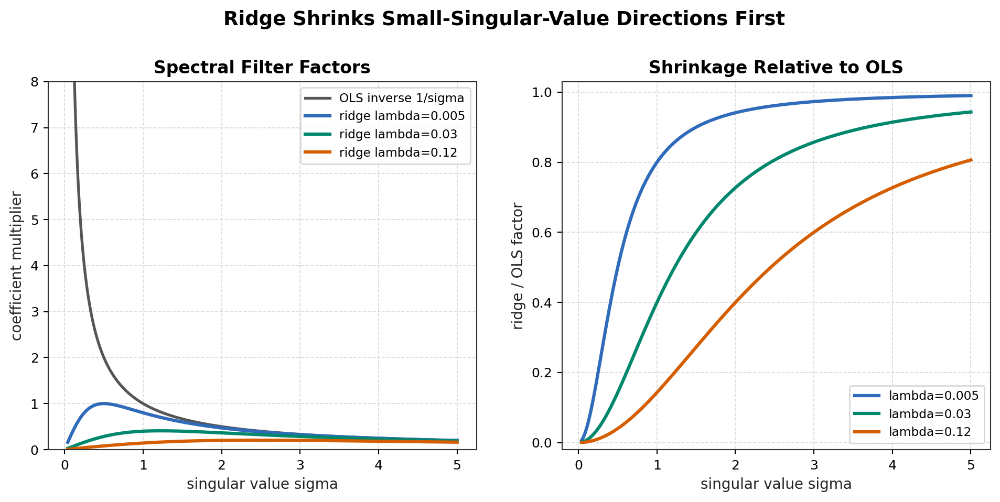
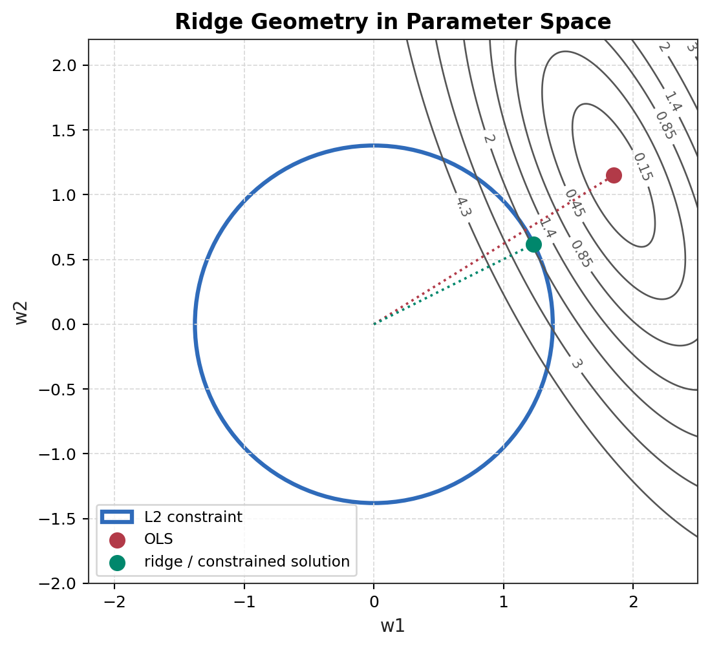

# Module 02: Regularized Least Squares

返回 [MIT 9.520 / 6.860 supplement index](../README.md)。

## Source Metadata / 来源元数据

主课程来源：

MIT / CBMM Learning Hub, 9.520 / 6.860, *Statistical Learning Theory and Applications*。

当前选用：

* Class 03: Regularized Least Squares。
* Class 03 slides: `Class03_RLS.pdf`。
* L. Rosasco, T. Poggio, *Machine Learning: a Regularization Approach*, Chapter 4: Regularization Networks / Regularized Least Squares。

CS229 cross-link：[Lecture 2 linear regression note](../../../lecture-notes/lecture-02-linear-regression/note.md) 和 [normal equation derivation](../../../math-derivations/lecture-02-linear-regression/01-linear-regression-mle-map.md)。

## Detailed Notes / 深入笔记

| File | 内容 |
| --- | --- |
| [derivations/01-ols-ridge-normal-equations.md](derivations/01-ols-ridge-normal-equations.md) | OLS 与 ridge objective 的矩阵求导、normal equations、closed-form solution |
| [derivations/02-ridge-spectral-regularization.md](derivations/02-ridge-spectral-regularization.md) | SVD 下 OLS inverse amplification 与 ridge spectral shrinkage |
| [derivations/03-ridge-bias-and-constraint.md](derivations/03-ridge-bias-and-constraint.md) | fixed-design ridge bias、penalized / constrained viewpoints、为什么 $\lambda$ 不是 $1/c$ |
| [derivations/04-pseudoinverse-and-minimal-norm.md](derivations/04-pseudoinverse-and-minimal-norm.md) | Class 03 的 overdetermined / underdetermined systems、pseudoinverse、minimal-norm interpolating solution、ridge-to-pseudoinverse limit |

## 1. 模块定位

CS229 Lecture 2 已经推导 ordinary least squares 和 normal equation。本模块不重复完整 CS229 derivation，而是从 MIT 9.520 的 regularization viewpoint 重新解释：

```text
OLS
-> empirical-risk minimization
-> inverse problem
-> instability under ill-conditioning
-> ridge / Tikhonov regularization
-> spectral shrinkage
-> intentional bias for stability
```

Regularized least squares 是 MIT supplement 的第一块核心增量：它把 linear regression 从“可解的 closed-form exercise”提升为“有限样本逆问题中的稳定化方法”。

## 2. OLS in Matrix Form

设有 $n$ 个 training samples、$d$ 个 features。Design matrix 与 target vector 为：

```math
X\in\mathbb R^{n\times d},
\quad
y\in\mathbb R^n.
```

第 $i$ 行 $x_i^T$ 是第 $i$ 个样本的 feature vector。Linear predictor 为：

```math
f_w(x)=w^Tx,
\quad
w\in\mathbb R^d.
```

OLS objective 写成 empirical square risk：

```math
\underset{w\in\mathbb R^d}{\mathrm{minimize}}
\quad
\frac{1}{n}
\left\|y-Xw\right\|_2^2.
```

系数 $1/n$ 不改变 minimizer，但它把 objective 写成 average empirical loss，和 statistical-learning notation 对齐。

对 objective 求导：

```math
\nabla_w
\left[
\frac{1}{n}
\left\|y-Xw\right\|_2^2
\right]
=
\frac{2}{n}
X^T(Xw-y).
```

令 gradient 为 $0$：

```math
X^T(Xw-y)=0.
```

整理得到 normal equations：

```math
X^TXw
=
X^Ty.
```

若 $X^TX$ invertible：

```math
\hat w_{\mathrm{OLS}}
=
(X^TX)^{-1}X^Ty.
```

MIT 视角下，这个 closed-form solution 的意义是：OLS 是在线性 hypothesis space 中、使用 squared loss 的 empirical-risk minimizer。

## 3. Why OLS Can Be Unstable

Normal equation 暴露了一个 inverse problem：

```math
\hat w_{\mathrm{OLS}}
=
(X^TX)^{-1}X^Ty.
```

如果 $X^TX$ ill-conditioned，求逆会放大数据中的小扰动。设 target 有扰动：

```math
y
\to
y+\delta y.
```

则 OLS 解的变化为：

```math
\delta \hat w
=
(X^TX)^{-1}X^T\delta y.
```

当 $(X^TX)^{-1}X^T$ 的某些方向很大时，微小 noise 也会造成参数大幅变化。

用 SVD 看得更清楚。令：

```math
X
=
U\Sigma V^T.
```

若 $X$ full column rank，singular values 为 $\sigma_1,\ldots,\sigma_d>0$，则：

```math
\hat w_{\mathrm{OLS}}
=
V\Sigma^{-1}U^Ty.
```

也就是在 left-singular-vector direction 上的 response component 会被乘以 $1/\sigma_j$。如果某个 $\sigma_j$ 很小，则 $1/\sigma_j$ 很大。小 singular value direction 对应 data 中约束很弱的方向；OLS 却会在该方向上强烈放大 target noise。

这就是 MIT regularization viewpoint 的关键：

```text
least squares is not only an optimization problem;
it is also an unstable inverse problem when the design is ill-conditioned.
```

## 4. Ridge / Tikhonov Regularization

Ridge regression 又称 Tikhonov regularization。使用本模块的 average-loss convention：

```math
\hat w_{\lambda}
=
\underset{w\in\mathbb R^d}{\mathrm{argmin}}
\left[
\frac{1}{n}
\left\|y-Xw\right\|_2^2
+
\lambda
\left\|w\right\|_2^2
\right],
\quad
\lambda\geq0.
```

第一项是 data fit，第二项是对 parameter norm 的结构偏好。$\lambda$ 控制二者 trade-off。

完整求导：

```math
\nabla_w
\left[
\frac{1}{n}
\left\|y-Xw\right\|_2^2
+
\lambda
\left\|w\right\|_2^2
\right]
=
\frac{2}{n}
X^T(Xw-y)
+
2\lambda w.
```

令 gradient 为 $0$：

```math
\frac{2}{n}
X^T(Xw-y)
+
2\lambda w
=
0.
```

两边除以 $2$ 并乘以 $n$：

```math
X^TXw-X^Ty+n\lambda w
=
0.
```

整理：

```math
(X^TX+n\lambda I)w
=
X^Ty.
```

因此：

```math
\hat w_{\lambda}
=
(X^TX+n\lambda I)^{-1}X^Ty.
```

当 $\lambda>0$ 时，$X^TX+n\lambda I$ 的 eigenvalues 至少增加 $n\lambda$。即使 $X^TX$ singular，加入 $n\lambda I$ 后通常也能得到 well-defined linear system。

## 5. Spectral Interpretation of Ridge

令：

```math
X
=
U\Sigma V^T.
```

则：

```math
X^TX
=
V\Sigma^T\Sigma V^T.
```

Full-rank OLS 为：

```math
\hat w_{\mathrm{OLS}}
=
V\Sigma^{-1}U^Ty.
```

Ridge 解为：

```math
\hat w_{\lambda}
=
V
\mathrm{diag}
\left(
\frac{\sigma_j}{\sigma_j^2+n\lambda}
\right)
U^Ty.
```

比较两个方向的 multiplier：

```math
\mathrm{OLS:}
\quad
\frac{1}{\sigma_j}.
```

```math
\mathrm{Ridge:}
\quad
\frac{\sigma_j}{\sigma_j^2+n\lambda}.
```

Ridge 相对 OLS 的 shrinkage factor 是：

```math
\frac{
\frac{\sigma_j}{\sigma_j^2+n\lambda}
}{
\frac{1}{\sigma_j}
}
=
\frac{\sigma_j^2}{\sigma_j^2+n\lambda}.
```

当 $\sigma_j^2\gg n\lambda$ 时，该 factor 接近 $1$，大 singular value directions 基本保留。当 $\sigma_j^2\ll n\lambda$ 时，该 factor 接近 $0$，小 singular value directions 被强烈压缩。



这解释了 ridge 为什么能 stabilize inverse problem：它不是均匀缩小所有参数，而是优先压制 data 几乎无法可靠约束的方向。

结果是：

* small-singular-value directions receive much stronger shrinkage；
* estimator sensitivity / variance 降低；
* 但参数估计被系统性推向较小 norm，从而引入 bias。

## 6. Bias Introduced by Regularization

不要只说 ridge reduces overfitting。它之所以叫 regularization bias，是因为 estimator 的 expectation 通常不等于 true parameter。

考虑 fixed-design linear model：

```math
y
=
Xw^*
+
\varepsilon,
```

其中 $w^*$ 是真实参数，noise 满足：

```math
\mathbb E[\varepsilon]
=
0.
```

Ridge estimator：

```math
\hat w_{\lambda}
=
(X^TX+n\lambda I)^{-1}X^Ty.
```

代入 $y=Xw^*+\varepsilon$：

```math
\hat w_{\lambda}
=
(X^TX+n\lambda I)^{-1}X^T(Xw^*+\varepsilon).
```

展开：

```math
\hat w_{\lambda}
=
(X^TX+n\lambda I)^{-1}X^TXw^*
+
(X^TX+n\lambda I)^{-1}X^T\varepsilon.
```

对 noise 取 expectation：

```math
\mathbb E[\hat w_{\lambda}]
=
(X^TX+n\lambda I)^{-1}X^TXw^*
+
(X^TX+n\lambda I)^{-1}X^T\mathbb E[\varepsilon].
```

因为 $\mathbb E[\varepsilon]=0$：

```math
\mathbb E[\hat w_{\lambda}]
=
(X^TX+n\lambda I)^{-1}X^TXw^*.
```

一般情况下：

```math
(X^TX+n\lambda I)^{-1}X^TXw^*
\neq
w^*.
```

所以：

```math
\mathbb E[\hat w_{\lambda}]
\neq
w^*.
```

Ridge estimator biased。这个 bias 是 intentional bias：它用系统性 shrinkage 换取 lower variance / greater stability。完整 bias-variance decomposition 留到 CS229 L8 附近。

## 7. Penalized and Constrained Viewpoints

Ridge 可以写成 penalized form：

```math
\underset{w}{\mathrm{minimize}}
\quad
\widehat R(w)
+
\lambda
\left\|w\right\|_2^2.
```

也可以写成 constrained form：

```math
\underset{w}{\mathrm{minimize}}
\quad
\widehat R(w)
\quad
\mathrm{s.t.}
\quad
\left\|w\right\|_2^2
\leq
c.
```

在适当 convexity / regularity 条件下，二者可以通过 Lagrange multiplier 建立对应：某些 $\lambda$ 会对应某个 constraint radius $c$，某些 active constraint 会对应某个 penalty strength。

但不能简单写：

```text
lambda = 1 / c
```

一般不是。$\lambda$ 与 $c$ 的关系取决于数据矩阵、loss geometry 和 optimum 是否落在 constraint boundary 上。

Class 03 也从 regularization theory 角度把类似思想连接到不同稳定化形式：penalize solution norm、control residual size、或者直接限制 solution set。当前模块只保留和 ridge / OLS 直接相关的 penalized-constrained equivalence。

## 8. Geometry of Ridge



图中 elliptical contours 表示 least-squares data-fit objective。红点是 unconstrained OLS solution；蓝色圆表示 L2 constraint；绿色点是 constrained view 下的 ridge-like solution。

几何解释：

* OLS 选择 empirical risk 最小的参数；
* L2 ball 限制参数 norm；
* constrained solution 是在允许区域内能达到最低 data-fit contour 的点；
* penalized form 则把离原点更远的参数持续加罚。

这张图的价值在于说明 regularization 不是在 loss 后面随便加一项，而是在 parameter space 中改变 admissible / preferred solution geometry。

## 9. Relationship to CS229 Lecture 2

CS229 Lecture 2 已经给出：

```text
linear hypothesis
-> squared loss
-> gradient
-> normal equation
-> Gaussian MLE interpretation
```

MIT Class 03 在这里补足：

```text
normal equation
-> matrix inversion can be unstable
-> small singular values amplify noise
-> ridge modifies the inverse
-> regularization stabilizes by spectral shrinkage
-> estimator becomes biased
```

所以本模块不是重复 linear regression，而是解释为什么 regularization 是 statistical-learning structure 的核心工具。

## 10. Current Boundary

当前不展开：

```text
kernels
early stopping
sparsity
model selection
full bias-variance decomposition
generalization bounds
```

这些属于 CS229 L6-L8 或之后节点。本模块只把 regularized least squares 作为 CS229 L1-L5 的理论补充。
