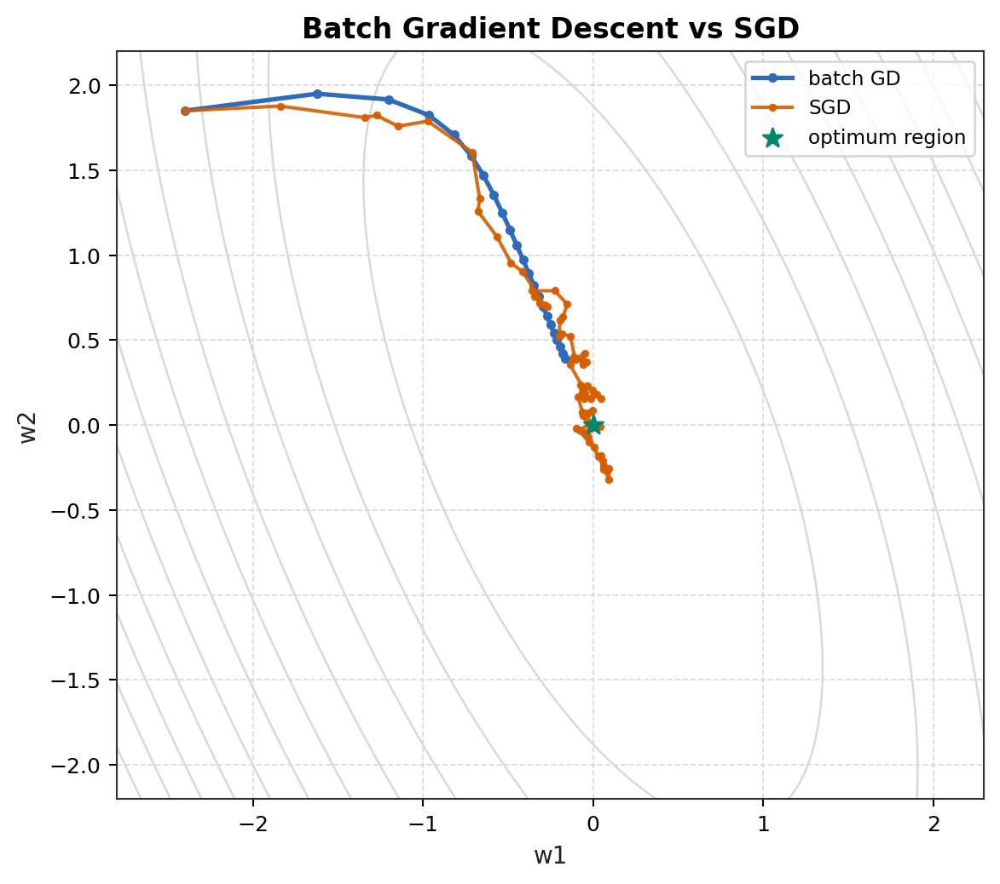

# Module 04: Stochastic Gradient Learning

返回 [MIT 9.520 / 6.860 supplement overview](../overview.md)。

## Source Metadata / 来源元数据

主课程来源：

MIT / CBMM Learning Hub, 9.520 / 6.860, *Statistical Learning Theory and Applications*。

当前选用：

* Class 06: Stochastic Gradient Descent。
* Class 06 slides: `Class06_SGD.pdf`。
* L. Rosasco, T. Poggio, *Machine Learning: a Regularization Approach*, convex optimization appendix。

CS229 cross-link：[Lecture 2 batch vs stochastic gradient descent](../../../lecture-notes/lecture-02-linear-regression/note.md#6-batch-gradient-descent-vs-stochastic-gradient-descent)、[Lecture 3 logistic gradient](../../../math-derivations/lecture-03-locally-weighted-logistic-regression/02-logistic-regression-gradient-newton.md)。

## Detailed Notes / 深入笔记

| File | 内容 |
| --- | --- |
| [derivations/01-batch-gd-and-sgd-unbiasedness.md](derivations/01-batch-gd-and-sgd-unbiasedness.md) | finite-sum objective、batch gradient、one-sample / mini-batch SGD、unbiased gradient estimator 证明 |
| [derivations/02-computational-and-error-perspective.md](derivations/02-computational-and-error-perspective.md) | Class 06 的 computational motivation、online least squares、basic convex GD baseline、optimization error vs statistical error |

## 1. 模块定位

Stochastic Gradient Descent 不是新的 prediction model。它是求解 empirical-risk problems 的 optimization method。

当前 CS229 已经出现的目标都可以写成：

```text
choose objective
compute or estimate gradient
update parameters
```

MIT Class 06 的补充点是：

```text
batch gradient
-> exact but expensive update
-> stochastic gradient
-> noisy but cheap update
-> optimization error vs statistical error
```

这里不展开 early stopping 或 implicit regularization；只为后续 regularization / model selection 节点建立理论基础。

## 2. Empirical Objective

设 objective 是 finite-sum form：

```math
F(w)
=
\frac{1}{n}
\sum_{i=1}^{n}
f_i(w).
```

其中：

| Symbol | 含义 |
| --- | --- |
| $w$ | parameter vector |
| $f_i(w)$ | 第 $i$ 个样本贡献的 loss 或 regularized objective component |
| $F(w)$ | empirical objective |
| $n$ | training samples 数量 |

例如 linear regression 中：

```math
f_i(w)
=
(y_i-w^Tx_i)^2.
```

Logistic regression 中：

```math
f_i(w)
=
\log(1+e^{-y_iw^Tx_i}).
```

若有 L2 regularization，也可以把 penalty 单独加在 $F(w)$ 后面，或者按 convention 分摊到每个 $f_i(w)$ 中。实现时必须固定 convention，否则 gradient scale 会错。

## 3. Batch Gradient Descent

Full gradient 是：

```math
\nabla F(w)
=
\frac{1}{n}
\sum_{i=1}^{n}
\nabla f_i(w).
```

Batch gradient descent update：

```math
w_{t+1}
=
w_t
-
\gamma_t
\nabla F(w_t).
```

其中 $\gamma_t>0$ 是 step size / learning rate。

Batch GD 的每一步使用所有 $n$ 个训练样本。优点是方向确定、noise 小；缺点是每次 update 都要扫描全数据。

## 4. Stochastic Gradient Descent

SGD 每一步抽取一个 sample index：

```math
i_t
\in
\{1,\ldots,n\}.
```

然后只用对应的 sample gradient：

```math
w_{t+1}
=
w_t
-
\gamma_t
\nabla f_{i_t}(w_t).
```

Mini-batch SGD 用一个 index set $B_t$：

```math
w_{t+1}
=
w_t
-
\gamma_t
\frac{1}{|B_t|}
\sum_{i\in B_t}
\nabla f_i(w_t).
```

当前只需要掌握 one-sample SGD 的理论结构；mini-batch 是方差和并行计算之间的折中。

## 5. Unbiased Gradient Estimator

若 $i_t$ 在 $\{1,\ldots,n\}$ 上 uniform random sampling，且在给定当前 $w$ 时抽样，则：

```math
P(i_t=i)
=
\frac{1}{n}.
```

考虑 stochastic gradient：

```math
g_t(w)
=
\nabla f_{i_t}(w).
```

条件期望为：

```math
\mathbb E[g_t(w)\mid w]
=
\sum_{i=1}^{n}
P(i_t=i)
\nabla f_i(w).
```

代入 uniform probability：

```math
\mathbb E[g_t(w)\mid w]
=
\sum_{i=1}^{n}
\frac{1}{n}
\nabla f_i(w).
```

因此：

```math
\mathbb E[g_t(w)\mid w]
=
\nabla F(w).
```

所以 stochastic gradient 是 full gradient 的 unbiased estimator。

必须同时记住：

```text
unbiased gradient estimator
!=
zero-variance estimator
!=
every update goes downhill
```

无偏只说明平均方向等于 full gradient。某一次随机 update 仍可能因为 sampling noise 让 objective 上升。

## 6. Why SGD Exists

SGD 不只是“大数据更快”的口号。它的根本动机是 computational cost。

Full gradient 每一步需要：

```text
scan all n examples
compute n per-sample gradients
average them
perform one update
```

当 $n$ 很大时，等待完整 full gradient 可能比先做许多 noisy updates 更慢。

SGD 每一步只使用 one / mini-batch observations：

```text
cheaper but noisier updates
```

换取：

```text
exact but expensive updates
```

如果单个 update 的成本低很多，即使每步方向有 noise，整体 wall-clock progress 也可能更好。这是 optimization efficiency 的判断，不是新的 statistical model。

## 7. Objective Descent Is Not Monotone



图中 batch GD 使用 full gradient，路径较平滑。SGD 使用 noisy per-sample gradient，路径有摆动，某些 update 不一定降低 objective，但总体围绕 optimum region 前进。

这张图强调：

* full gradient 是 deterministic direction；
* stochastic gradient 是 random direction；
* unbiased direction 不等于每一步都下降；
* step-size schedule 会影响收敛和最终波动；
* convex objective 下仍然需要控制 learning rate。

## 8. Optimization Error vs Statistical Error

MIT 视角要求明确区分两类 error。

令 empirical objective minimizer 为：

```math
\hat w
\in
\underset{w}{\mathrm{argmin}}
\,
F(w).
```

当前 SGD iterate 是 $w_t$。Optimization error 可以写成：

```math
F(w_t)-F(\hat w).
```

它回答的是：当前参数距离 empirical-objective optimum 还有多远。

Statistical / generalization error 关心 population-level target。若 population risk 为：

```math
R(w)
=
\mathbb E_{(X,Y)\sim\rho}
\left[
\ell(f_w(X),Y)
\right],
```

则一个常见比较是：

```math
R(\hat w)-R(w^*),
```

其中 $w^*$ 是对应 population benchmark。

两者不同：

| Error | 关注对象 | 典型来源 |
| --- | --- | --- |
| optimization error | empirical objective 有没有优化到位 | step size、iteration count、conditioning、stochastic noise |
| statistical / generalization error | learned predictor 是否在 population 上好 | finite sample、hypothesis space、regularization、distribution mismatch |

不要把“训练 objective 没优化完”和“模型泛化不好”混为一谈。一个模型可能 optimization error 很小但 generalization 很差；也可能 optimization 尚未完全收敛，却已经达到足够好的 population performance。后者是 future early stopping / implicit regularization 的入口，但当前不展开。

## 9. Connection to Current CS229 Models

### Linear Regression

For square loss：

```math
f_i(w)
=
(w^Tx_i-y_i)^2.
```

Per-sample gradient：

```math
\nabla f_i(w)
=
2(w^Tx_i-y_i)x_i.
```

SGD update：

```math
w_{t+1}
=
w_t
-
2\gamma_t
(w_t^Tx_{i_t}-y_{i_t})x_{i_t}.
```

这和 CS229 Lecture 2 的 LMS update 是同一结构，差别只在 loss scaling convention。

### Logistic Regression

For $y_i\in\{-1,+1\}$ logistic loss：

```math
f_i(w)
=
\log(1+e^{-y_iw^Tx_i}).
```

Per-sample gradient：

```math
\nabla f_i(w)
=
-
\frac{
y_i x_i
}{
1+e^{y_iw^Tx_i}
}.
```

SGD update：

```math
w_{t+1}
=
w_t
+
\gamma_t
\frac{
y_{i_t}x_{i_t}
}{
1+e^{y_{i_t}w_t^Tx_{i_t}}
}.
```

这不是新的 classifier；只是用随机样本近似 full logistic gradient。

## 10. Current Boundary

当前模块只覆盖：

* finite-sum empirical objective；
* batch gradient descent；
* one-sample SGD；
* unbiased gradient estimator proof；
* computational cost trade-off；
* non-monotone stochastic updates；
* optimization error vs statistical error。

明确 deferred：

```text
early stopping
implicit regularization
stability
generalization bounds for SGD
deep learning theory
```

这些留到 CS229 到达 regularization / model selection / later theory 节点后再学。
