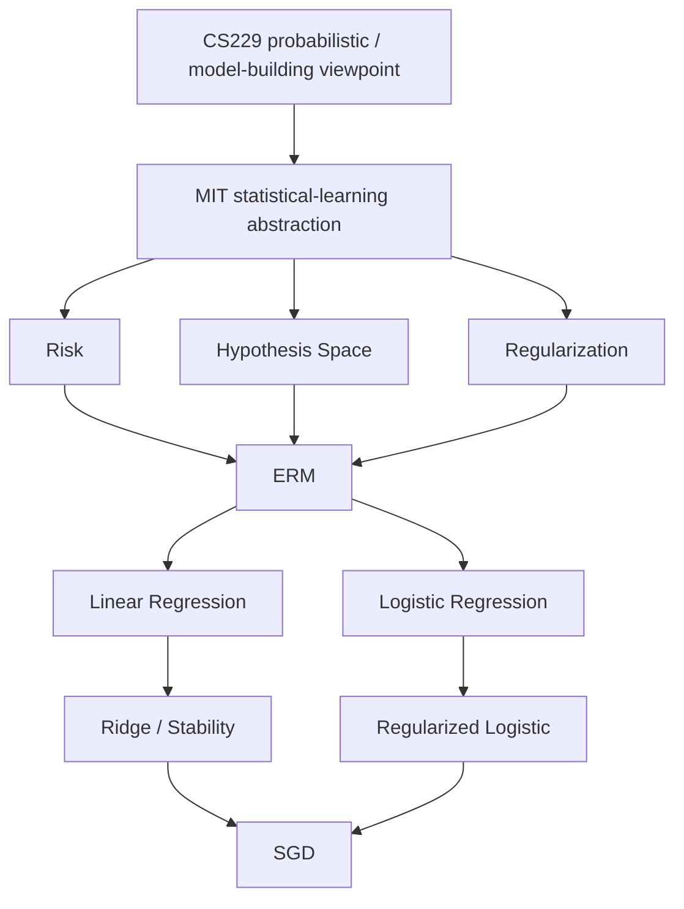

# MIT 9.520 / 6.860 Selected Theory Supplements

返回 [Course Supplements](../README.md)。

Primary source: MIT / CBMM Learning Hub, 9.520 / 6.860, *Statistical Learning Theory and Applications*。

## Role / 定位

MIT 9.520 / 6.860 is not a second ML mainline.

它在本仓库中的角色是有选择地补充 Stanford CS229，把已经熟悉的 supervised learning 模型重新放入：

* statistical learning theory；
* empirical / expected risk；
* regularization；
* optimization；
* hypothesis-space control；
* later generalization theory。

当前只覆盖与 Stanford CS229 Autumn 2018 Lecture 5 及之前内容直接相关的部分。CS229 仍然是主线；CMU 10-601 是实践、实现、MLE / MAP、实验方法和 selected homework 的补充；MIT 9.520 / 6.860 是 statistical-learning、regularization、risk minimization、optimization、generalization foundations 和 theoretical structure 的补充。

## Navigation Weight / 导航权重

| Layer | Role | 当前权重 |
| --- | --- | --- |
| Stanford CS229 Autumn 2018 | 主课程 mainline | lecture-notes、math-derivations、assignments 的主骨架 |
| CMU 10-601 Spring 2023 | practical / implementation supplement | 主题式补充 MLE / MAP、Naive Bayes、实验和代码视角 |
| MIT 9.520 / 6.860 | theory / regularization supplement | 主题式补充 risk、hypothesis space、regularization、optimization 和后续 generalization foundations |

MIT supplement 不进入 `lecture-notes/`，也不进入全局 `math-derivations/`。它和 CMU supplement 并列放在 `course-supplements/`，每个模块只服务于对应 CS229 节点。

## Official Public Sources / 官方公开来源

| Source | 本层使用方式 |
| --- | --- |
| MIT / CBMM Learning Hub syllabus: <https://cbmm.mit.edu/lh-9-520/syllabus> | 课程结构、Class 02/03/05/06 与 deferred classes 的边界 |
| Class 02: Statistical Learning Setting: <https://cbmm.mit.edu/lh-9-520/class-02> | statistical learning setting、expected risk、empirical risk、ERM、excess risk、consistency、regularization 的当前主源 |
| Class 02 slides: <https://cbmm.mit.edu/sites/default/files/documents/class02_SLT.pdf> | loss、target function、risk、empirical risk minimization、excess risk、consistency、regularization 公式核查 |
| Class 03: Regularized Least Squares: <https://cbmm.mit.edu/lh-9-520/class-03> | OLS 到 ridge / Tikhonov regularization、ill-conditioning、bias 和 constrained / penalized views |
| Class 03 slides: <https://cbmm.mit.edu/sites/default/files/documents/Class03_RLS.pdf> | normal equation、regularized least squares、spectral filtering 和 bias 公式核查 |
| Class 05: Logistic Regression and Support Vector Machines: <https://cbmm.mit.edu/lh-9-520/class-05> | 当前只使用 logistic regression、regularized risk 和 convex optimization 子集；SVM 子集 deferred |
| Class 05 slides: <https://cbmm.mit.edu/sites/default/files/documents/Class05_LogisticsSVM.pdf> | logistic / SVM 边界核查；当前不展开 hinge loss、margin 和 SVM |
| Class 06: Stochastic Gradient Descent: <https://cbmm.mit.edu/lh-9-520/class-06> | batch gradient、SGD、stochastic gradient expectation、optimization perspective |
| Class 06 slides: <https://cbmm.mit.edu/sites/default/files/documents/Class06_SGD.pdf> | SGD update、full-gradient cost、sample gradient expectation 和 computational trade-off |
| L. Rosasco, T. Poggio, *Machine Learning: a Regularization Approach*, MIT 9.520 Lecture Notes: <https://cbmm.mit.edu/sites/default/files/documents/MLNotes_0.pdf> | Chapter 1 用于 statistical learning setting；Chapter 4 用于 regularized least squares；Appendix 用于 convex optimization 术语。该材料按 Learning Hub syllabus / class references 的官方课程配套笔记处理。 |

来源边界：这些文件是本仓库自己的中文综合笔记和独立推导，不是 MIT slides 或 notes 的复制。这里的 supplement 指“从属于 CS229 主线的选段层”，不是浅层摘要；每个当前模块都应能作为独立笔记阅读，并把官方材料中与 CS229 L5 之前直接相关的定义、推导和理论重点讲完整。MIT OCW older 9.520 materials 只可用于 historical clarification / supplementary derivation；当前未把它们作为本层主源。

## Current Selected Modules / 当前选段模块

| Module | CS229 连接 | MIT source | Status |
| --- | --- | --- | --- |
| [01-statistical-learning-setting](01-statistical-learning-setting/README.md) | CS229 L1-L2 supervised learning / regression；L3-L5 已学模型统一视角 | Class 02；notes Chapter 1 | current |
| [02-regularized-least-squares](02-regularized-least-squares/README.md) | CS229 L1-L2 linear regression；normal equation | Class 03；notes Chapter 4 | current |
| [03-logistic-regression-as-regularized-risk](03-logistic-regression-as-regularized-risk/README.md) | CS229 L2-L4 logistic regression / GLM；L5 GDA-logistic 对照 | Class 05 logistic subset；convex optimization appendix | current |
| [04-stochastic-gradient-learning](04-stochastic-gradient-learning/README.md) | CS229 L1-L4 gradient-based learning；future implementation | Class 06；convex optimization appendix | current |

这些模块按 CS229-linked topics 建立，不按 MIT Class01、Class02、Class03 的整门课顺序重建平行课程。

## Independent Module Notes / 独立模块笔记

| Module | 独立笔记 |
| --- | --- |
| Module 01 | [statistical-risk-framework](01-statistical-learning-setting/derivations/01-statistical-risk-framework.md)、[excess-risk-and-consistency](01-statistical-learning-setting/derivations/02-excess-risk-and-consistency.md)、[target-functions-and-losses](01-statistical-learning-setting/derivations/03-target-functions-and-losses.md) |
| Module 02 | [ols-ridge-normal-equations](02-regularized-least-squares/derivations/01-ols-ridge-normal-equations.md)、[ridge-spectral-regularization](02-regularized-least-squares/derivations/02-ridge-spectral-regularization.md)、[ridge-bias-and-constraint](02-regularized-least-squares/derivations/03-ridge-bias-and-constraint.md)、[pseudoinverse-and-minimal-norm](02-regularized-least-squares/derivations/04-pseudoinverse-and-minimal-norm.md) |
| Module 03 | [logistic-likelihood-and-risk](03-logistic-regression-as-regularized-risk/derivations/01-logistic-likelihood-and-risk.md)、[logistic-convexity-gradient-and-separability](03-logistic-regression-as-regularized-risk/derivations/02-logistic-convexity-gradient-and-separability.md) |
| Module 04 | [batch-gd-and-sgd-unbiasedness](04-stochastic-gradient-learning/derivations/01-batch-gd-and-sgd-unbiasedness.md)、[computational-and-error-perspective](04-stochastic-gradient-learning/derivations/02-computational-and-error-perspective.md) |

## Current CS229 Mapping / 当前 CS229 映射

| CS229 已学内容 | MIT selected material | 当前状态 | 作用 |
| --- | --- | --- | --- |
| L1-L2 supervised learning / regression | Class 02 | current | 从 statistical learning problem 重构监督学习 |
| L1-L2 linear regression | Class 03 | current | OLS -> ridge -> regularization |
| L2-L4 logistic / GLM | Class 05 logistic subset | current | loss / risk / regularization 视角 |
| L1-L4 gradient-based learning | Class 06 | current | SGD / optimization perspective |
| L6-L7 SVM / kernels | Class 04 + Class 05 SVM subset | deferred | CS229 到达后再学 |
| L8 regularization / model selection | Class 07 / 09 + later theory | deferred | 后续 |
| generalization theory | Class 13+ | deferred | CS229 L8 附近 |

Deferred rows 不是当前 required reading，只记录未来连接点。

## Deferred After CS229 L5 / 当前故意推迟

| MIT material | 对应 CS229 节点 | 当前处理 |
| --- | --- | --- |
| Class 04 — Features and Kernels | CS229 kernels | deferred until CS229 reaches kernels |
| Class 05 — SVM portion | CS229 L6-L7 | deferred；当前不讲 hinge loss、margin、dual 或 support vectors |
| Class 07 — Early Stopping | CS229 L8 / regularization | deferred；当前只区分 optimization error 与 statistical error |
| Class 09 — Sparsity Based Regularization | regularization / feature selection stage | deferred；当前不讲 sparsity |
| Class 13+ statistical learning theory | CS229 generalization / model-selection stage | deferred；当前不讲 uniform convergence、Rademacher complexity 或 stability |

同样推迟：deep learning theory。MIT 后续 generalization 工具只在 CS229 到达相应节点后进入。

## Cross-Course Concept Map / 跨课程概念图



文本版：

```text
CS229 probabilistic / model-building viewpoint
                |
                v
MIT statistical-learning abstraction
                |
        +-------+---------+
        v       v         v
      Risk   Hypothesis  Regularization
        |      Space       |
        +--------+---------+
                 v
               ERM
                 |
       +---------+---------+
       v                   v
Linear Regression      Logistic Regression
       |                   |
       v                   v
Ridge / Stability     Regularized Logistic
                 \     /
                  v   v
                    SGD
```

## Relationship to CMU Supplement / 与 CMU 补充层的关系

| 问题 | CS229 | CMU 10-601 | MIT 9.520 / 6.860 |
| --- | --- | --- | --- |
| 为什么 logistic 是 sigmoid | exponential family / GLM | implementation / optimization | logistic risk |
| 怎么估计参数 | likelihood / MLE | MLE / MAP | ERM / regularized ERM |
| 为什么要 regularize | 后续课程 | practical regularization | inverse problem / stability / hypothesis control |
| 怎样优化 | GD / Newton 等 | coding / SGD | stochastic optimization theory |
| 怎么理解泛化 | 后续 | experiment design | expected vs empirical risk |

CMU supplement 当前重点是从估计、实现和实验角度补 CS229；MIT supplement 当前重点是把同一批算法提升到 statistical-learning structure。二者都从属于 CS229，不互相替代。

## Figures / 图

所有图由本层脚本生成，不下载网络图片。

| Figure | File | 用途 |
| --- | --- | --- |
| Expected risk vs empirical risk | [figures/mit9520-risk-empirical-schematic.png](figures/mit9520-risk-empirical-schematic.png) | 区分 population quantity 与 empirical proxy |
| Ill-posed finite-sample learning | [figures/mit9520-ill-posed-functions.png](figures/mit9520-ill-posed-functions.png) | 显示 finite samples 不能唯一决定函数 |
| OLS vs ridge geometry | [figures/mit9520-ridge-geometry.png](figures/mit9520-ridge-geometry.png) | 显示 data-fit contours 与 L2 constraint 的几何关系 |
| Ridge spectral shrinkage | [figures/mit9520-ridge-spectral-shrinkage.png](figures/mit9520-ridge-spectral-shrinkage.png) | 显示 small-singular-value directions 被更强 shrinkage |
| Batch GD vs SGD path | [figures/mit9520-batch-vs-sgd-path.png](figures/mit9520-batch-vs-sgd-path.png) | 显示 SGD updates 不必单调下降 |

Figure generation script:

* [scripts/generate_figures.py](scripts/generate_figures.py)

## Progress State / 当前状态

| Item | Status |
| --- | --- |
| CS229 Lecture 5 | complete |
| CMU Supplement 01: MLE / MAP / Naive Bayes | active |
| MIT Supplement: CS229 L1-L5 theoretical complement | active |
| CS229 Lecture 6 | not started |
