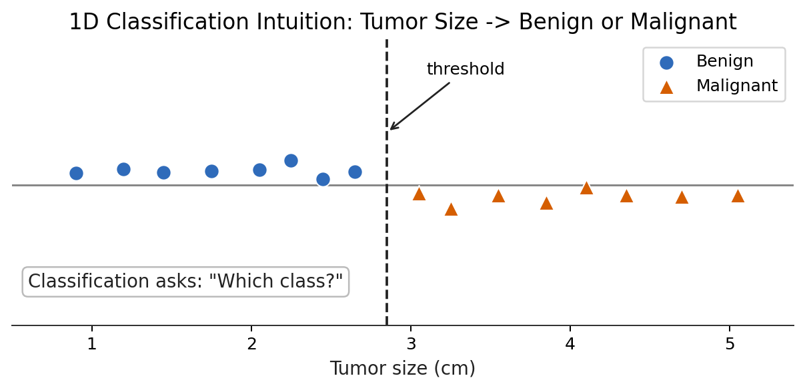
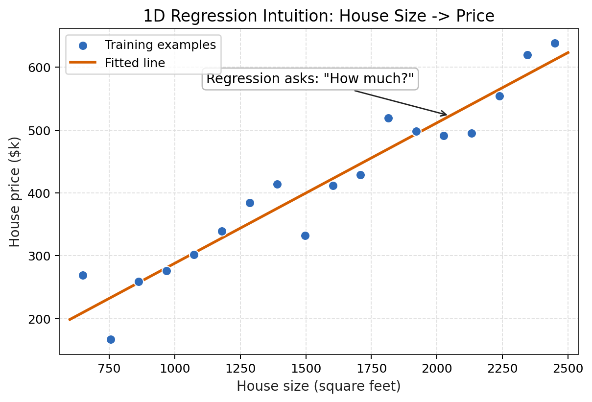
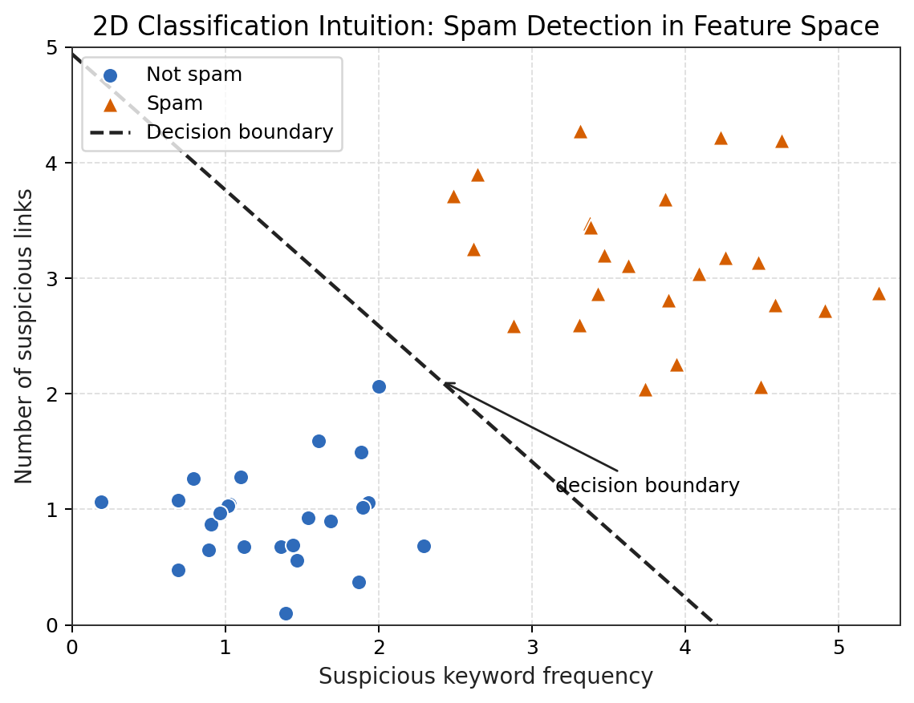
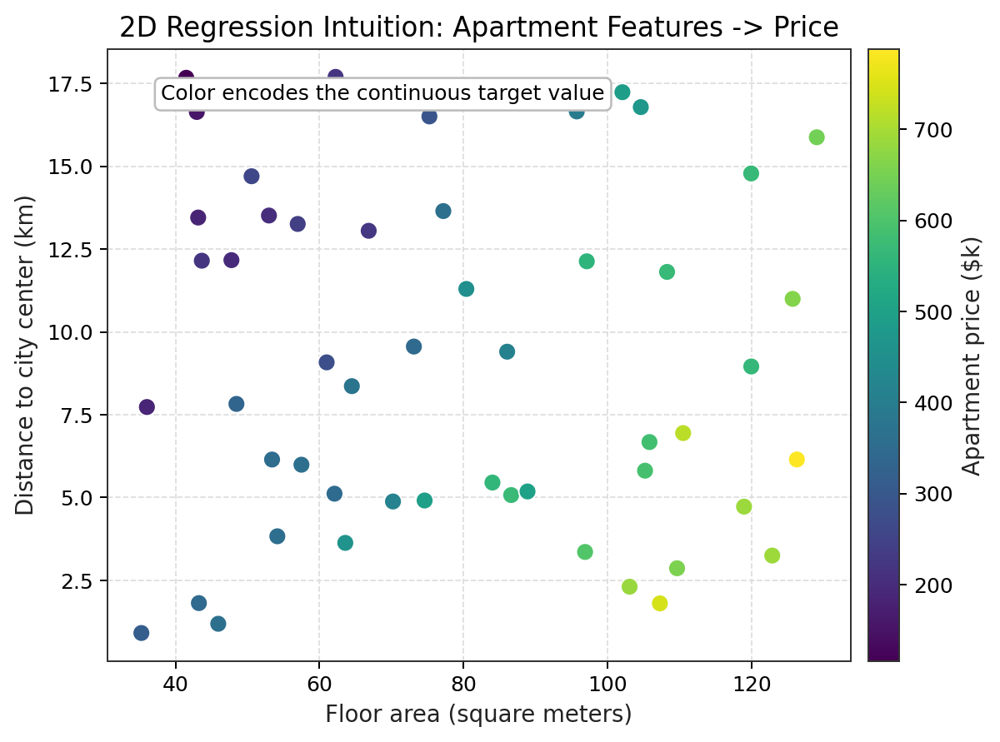
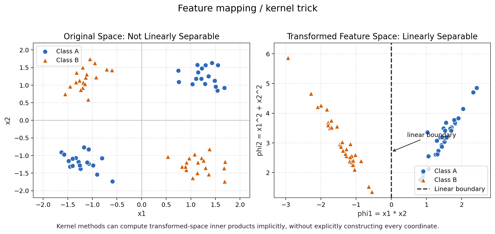

# Lecture 1: Introduction

## 1. Core Question

CS229 的开场并不只是问“有哪些 machine learning algorithms”。更核心的问题是：

> Given data, assumptions, objectives, and computational constraints, how can we learn a model that performs well on unseen data?

Machine learning 的基本思想是从 data 中学习规律，但学习的目标不是简单地把 training data 拟合到最低误差。一个模型如果只记住训练样本，却不能在 unseen data 上保持稳定表现，那么它并没有真正完成学习任务。CS229 从第一讲开始就把重点放在 generalization：模型能否把从有限样本中学到的结构迁移到未来样本、不同样本、甚至轻微变化的环境中。

因此，Lecture 1 可以被理解为整门课的问题框架：

```text
Task -> Data -> Representation -> Hypothesis -> Objective -> Optimization -> Evaluation -> Generalization
```

这个 pipeline 也是后续 Trustworthy ML、Reliable AI Systems、LLM evaluation、Representation Analysis、Causal Reliability 和 AI for Science 的基础。可信与可靠不是在模型训练完成后额外添加的装饰，而是从 task definition、data assumption、objective design 和 evaluation protocol 一开始就被决定。

## 2. What Lecture 1 Introduces

Lecture 1 的作用是给出 machine learning 领域的地图，而不是在第一讲就展开所有技术细节。它把 CS229 将要覆盖的主题放到同一个学习框架中：

1. **Supervised Learning**：给定输入 `x` 和标签 `y`，学习从输入到输出的 mapping。它是 CS229 的主线起点，包括 regression 和 classification。
2. **Machine Learning Theory / Systematic Model Selection and Evaluation**：研究模型为什么能 generalize、如何选择模型、如何设计 evaluation，以及怎样避免把 training performance 误认为真实能力。
3. **Deep Learning**：把 hypothesis class 扩展为更复杂的 neural networks，使模型能够学习高度非线性的 representation 和 function approximation。
4. **Unsupervised Learning**：在没有显式 label 的情况下发现 data structure，例如 clustering、dimensionality reduction 和 latent representation。
5. **Reinforcement Learning**：研究 agent 在 sequential decision-making 中如何根据 reward 学习 policy，而不是只对固定输入做一次性 prediction。

这些方向看似不同，但都围绕同一个核心：如何在有限数据、有限计算和不完全假设下学习可泛化的结构。

## 3. Key Concepts

### 3.1 Supervised Learning

Supervised learning 的基本数据形式是：

$$D = \{(x^{(i)}, y^{(i)})\}_{i=1}^n$$

其中，`x` 是 input feature，可以是房屋面积、邮件文本特征、医学影像指标或传感器观测；`y` 是 label / target，可以是连续数值、离散类别或结构化输出。学习算法的目标是从 training set `D` 中学习一个 hypothesis：

$$h(x) \approx y$$

典型例子包括：

* Housing price prediction：输入房屋面积、位置、卧室数等特征，输出价格，是 regression。
* Spam classification：输入邮件特征，输出 spam / not spam，是 classification。
* Medical diagnosis：输入检查指标或影像 representation，输出疾病类别或风险评分，可能是 classification，也可能是 regression。

Supervised learning 的关键不只是“有标签”，而是要明确标签代表什么、数据来自哪里、未来输入是否与训练输入同分布，以及错误预测的实际代价是什么。

### 3.2 Training Set

Training set 不是 reality itself，而只是现实世界的一个 sample。这个区别非常重要：模型只能直接看到样本，却常常被要求对真实世界或未来数据做 prediction。

训练集可能存在以下问题：

* **Sample bias**：采样过程没有覆盖目标人群或目标场景。例如只收集城市医院的数据，却希望模型适用于乡村诊所。
* **Label noise**：标签可能来自人工标注、仪器测量或历史记录，其中可能包含错误、主观偏差或延迟反馈。
* **Distribution mismatch**：training distribution 与 deployment distribution 不一致，例如训练数据来自过去几年，而部署环境出现新的行为模式。

这些问题直接影响 generalization 和 reliable ML。一个模型可能在给定 training set 上表现很好，但它学到的可能是采样偏差、标注习惯或环境噪声，而不是真正稳定的预测结构。

### 3.3 Hypothesis

Hypothesis 是 learned function 或 candidate model。它表示模型认为输入与输出之间可能存在的关系。

在线性回归中，hypothesis 可以写作：

$$h_\theta(x) = \theta^T x$$

在 logistic regression 中，hypothesis 通常写作：

$$h_\theta(x) = \sigma(\theta^T x)$$

其中 $\sigma(\cdot)$ 是 sigmoid function，用来把线性分数映射到概率区间。Neural network 则可以被看作更 expressive 的 function class，通过多层非线性变换学习复杂映射。

Hypothesis class 不只是技术选择，它编码了 inductive bias：

> The hypothesis class encodes what kind of structure we believe the world may have.

选择 linear model 意味着相信某种近似线性结构；选择 kernel method 意味着相信数据在某种 similarity geometry 下更容易分离；选择 deep neural network 意味着允许更复杂的 hierarchical representation。Inductive bias 既是模型能够从有限数据中学习的原因，也是模型可能系统性失败的来源。

### 3.4 Loss

Loss 衡量 prediction error，也定义模型把什么视为“好”。不同 loss 会驱动模型学习不同的行为。

Regression 中常见 squared loss：

$$L(h_\theta(x), y) = (h_\theta(x) - y)^2$$

Classification 中常见 logistic loss / cross-entropy，它惩罚模型给正确类别分配过低概率。Loss 的选择不是纯数学形式，而是 objective design：如果 loss 与 real-world objective 不一致，模型可能在训练指标上表现良好，却在真实任务中产生 failure modes。

例如，医疗诊断中 false negative 和 false positive 的代价可能并不对称。如果训练时只优化普通 accuracy 或对称 loss，模型可能忽略高风险少数群体。Reliable ML 必须追问：loss function 是否真的反映 deployment objective？

### 3.5 Generalization

Generalization 指模型在 unseen data 上的表现。低 training error 不足以证明模型学到了可靠规律，因为训练误差只说明模型能解释已经看到的样本。

一个学生如果只是背下 answer key，并不能说明他真正掌握了知识；同样，一个模型如果只是 memorizing training data，也不能说明它真正 learned。Machine learning 的核心张力在于：我们只有有限样本，却希望模型在未来样本上保持有效。CS229 后续的 regularization、bias-variance、learning theory、model selection 和 evaluation 都是在处理这一张力。

## 4. Regression vs Classification

Regression 问的是：“How much?” Classification 问的是：“Which class?” 二者的区别不只是输出类型不同，还会影响 loss design、evaluation metrics、decision boundary 和 error interpretation。

| Aspect | Regression | Classification |
| ------ | ---------- | -------------- |
| Target type | Continuous value | Discrete class label |
| Output type | Real-valued prediction, e.g. price or temperature | Class label or class probability |
| Examples | Housing price, rainfall amount, demand forecasting | Spam detection, disease category, image class |
| Model examples | Linear regression, ridge regression, regression trees, neural regression models | Logistic regression, SVM, Naive Bayes, neural classifiers |
| Evaluation metrics | MSE, RMSE, MAE, $R^2$ | Accuracy, precision, recall, F1, ROC-AUC, PR-AUC, calibration |
| Core question | How close is the predicted quantity to the true value? | Is the predicted class correct, and how reliable is the decision? |

Regression error 通常可以解释为数值偏差大小，例如预测价格偏高多少。Classification error 则常常涉及 decision boundary：模型把 feature space 划分成不同类别区域，错误可能发生在边界附近，也可能来自类别重叠、标签噪声或表示不足。

## 5. Geometric Intuition

Geometric intuition 的作用不是把 machine learning 简化成画图，而是帮助我们看清楚：data representation 如何决定模型能看到什么结构，loss 和 hypothesis 如何在 feature space 中形成预测规则，以及 generalization failure 往往会出现在边界、外推或分布变化的位置。

### 5.1 One-dimensional classification intuition

如果只有一个 feature，例如 tumor size，每个样本都可以放在一条 number line 上。Classification 的目标不是预测一个连续数值，而是回答 “Which class?”。在这个例子中，模型可以学习一个 threshold：阈值左侧更可能是 benign，右侧更可能是 malignant。

这张图的重要性在于：即使 input 只有一维，classification 也已经包含了 supervised learning 的核心结构，包括 labeled examples、decision rule、错误边界和 generalization。靠近 threshold 的样本通常更不确定，也更容易暴露 label noise 或 feature insufficiency。



### 5.2 One-dimensional regression intuition

Regression 的问题形式不同。对于 house size -> price，模型需要预测连续 target，而不是离散类别。图中的 fitted line 表示一个简单 hypothesis：房屋面积越大，价格倾向于越高。每个点到拟合线的垂直距离可以理解为 prediction error 的直观版本。

这张图说明了 regression 的核心问题：模型不是寻找 class boundary，而是在学习一个 functional relationship。后续 Lecture 2 的 least squares、gradient descent 和 normal equation 都可以从这个最简单的几何图像开始理解。



### 5.3 Two-dimensional classification intuition

当 input 有两个 features 时，每个样本成为 feature space 中的一个点。Spam detection 可以用 suspicious keyword frequency 和 number of suspicious links 作为两个坐标。Classification 在这里变成 boundary finding：模型要在平面中找到一条 decision boundary，把 spam 和 not spam 尽量分开。

这张图强调 representation 的作用。如果两个 features 已经把类别结构暴露得很清楚，linear decision boundary 可能就足够。如果点云高度重叠，问题可能不是 optimizer 不好，而是 feature representation 不足、labels 有噪声，或任务本身存在不可分性。



### 5.4 Two-dimensional regression intuition

Regression 在二维 input space 中更难画，因为输入已经是平面，而 target 是第三个量。Apartment price prediction 可以使用 floor area 和 distance to city center 作为输入，用点的颜色表示 price。颜色变化提供了 response surface 的一个 surrogate view。

这张图说明：高维 regression 不只是“画一条线”。模型需要学习从多维 feature vector 到连续 target 的映射。不同区域的数据密度、噪声水平和外推范围都会影响预测可靠性。对于 AI for Science 和 spatiotemporal forecasting，这一点尤其重要，因为 target 往往随多个空间、时间和环境变量共同变化。



### 5.5 Higher-dimensional intuition and kernels

Linear models 在二维中对应 lines，在三维中对应 planes，在更高维中对应 hyperplanes。SVM 的几何思想是寻找 separating hyperplane，并尽可能扩大 margin，使分类规则不仅能分开训练样本，也对小扰动更稳定。

但很多数据在原始 feature space 中不是 linearly separable。Kernel intuition 的关键是：我们可以把原始 features 映射到新的 transformed feature space，使原来非线性的结构在新空间中变得更接近线性可分。图中的 XOR-like pattern 在原始二维空间中无法用一条直线分开，但在包含 `x1 * x2` 等 transformed features 的空间中，可以用线性边界分开。

严格地说，kernel trick 不是说 SVM “直接在无限维中预测”。更准确的表述是：

> Kernel methods allow the model to implicitly perform linear separation in a transformed feature space, without explicitly constructing the high-dimensional feature vectors.

因此，kernel 的本质是 representation 和 similarity 的选择。Kernel function 定义了哪些样本被认为相似，也定义了模型更容易学习哪种几何结构。



## 6. Conceptual Structure


* **Task Objective**：明确要解决的问题、预测目标和实际错误代价。
* **Data**：定义样本来源、采样机制、标签质量和训练/测试分布。
* **Feature Representation**：把原始对象转换成模型可使用的 input features 或 learned representations。
* **Hypothesis Class**：规定可学习函数的范围，并引入 inductive bias。
* **Loss / Objective**：把学习目标转化为可优化的数学形式。
* **Optimization**：用算法寻找使 objective 较优的参数或模型。
* **Prediction**：用学到的 hypothesis 对新输入产生输出。
* **Evaluation**：用合适 metrics 和 protocol 检查模型是否解决了原任务。
* **Generalization**：判断模型是否在 unseen data、未来数据或轻微变化环境中仍然有效。

Any weak link in the pipeline can lead to model failure。数据偏差、表示错误、hypothesis class 不合适、loss 失配、optimization 不稳定、evaluation 泄漏或泛化声明过度，都会让最终模型不可靠。

## 7. Why Lecture 1 Matters for Later CS229

Lecture 1 的价值在于建立后续模块的共同语言：

* **Linear Regression**：从 supervised learning setup 进入 objective 和 optimization，理解 least squares 为什么是一个可计算的学习问题。
* **Logistic Regression**：把 classification 写成 probabilistic prediction，并连接 loss、decision boundary 和 evaluation。
* **Generative Models**：不只学习 `p(y | x)`，还建模 data generation 的概率结构。
* **SVM**：用 geometry、margin 和 kernel methods 理解 classification。
* **Regularization**：控制 hypothesis complexity，缓解 overfitting，提高 generalization。
* **Learning Theory**：用更形式化的方式解释为什么有限样本学习可能成功，以及何时会失败。
* **Unsupervised Learning**：在没有 labels 的情况下寻找 clustering、latent factors 和 lower-dimensional structure。
* **Reinforcement Learning**：把一次性 prediction 扩展到 sequential decision-making、reward 和 policy learning。

因此，Lecture 1 不是孤立的介绍课，而是整门 CS229 的 conceptual root。

## 8. Common Misunderstandings

| Misunderstanding | Correction |
| ---------------- | ---------- |
| Machine learning is just fitting curves. | Fitting 是中间步骤；完整问题还包括 data assumptions、objective、optimization、evaluation 和 generalization。 |
| More complex models are always better. | 更复杂的 hypothesis class 可能降低 training error，也可能增加 overfitting、解释困难和部署风险。 |
| High benchmark accuracy means the model is reliable. | Benchmark 只覆盖特定数据和指标；可靠性还需要检查 distribution shift、subgroup performance、calibration 和 failure modes。 |
| Labels are always trustworthy. | Labels 可能有噪声、偏见、延迟或定义不一致；监督学习依赖标签，但不能盲目信任标签。 |
| Evaluation is only the final step. | Evaluation protocol 会反过来定义模型优化和选择的方向，必须在 task definition 阶段就设计清楚。 |

## 9. Connection to Research

### 9.1 Trustworthy ML

Trustworthiness 从检查 data assumptions、label reliability、loss-objective alignment 和 generalization 开始。如果训练集不代表未来场景，或者 loss 没有表达真实代价，那么再高的训练表现也不足以支持可信声明。

### 9.2 Reliable AI Systems

Model reliability 只是 system reliability 的一部分。一个 AI system 还包括数据采集、预处理、监控、反馈、交互界面和部署环境。Lecture 1 的 pipeline 说明：系统失败往往不是单个模型参数的问题，而是整个 learning and deployment pipeline 中某个环节失效。

### 9.3 LLM Evaluation / Reasoning

虽然 CS229 的开场是 classical ML，但同样结构适用于 LLMs：data 决定模型见过什么，objective 决定模型被奖励什么，evaluation 决定我们声称模型会什么，generalization 决定模型能否处理未见过的 instructions、domains 和 reasoning patterns。LLM benchmark 也必须警惕 leakage、metric mismatch 和 distribution shift。

### 9.4 Representation Analysis

Learning 强烈依赖 data 如何被 represented。手工 features、kernel-induced features、neural representations 都会改变模型可学习的结构。Representation Analysis 进一步追问：模型内部到底学到了哪些 directions、clusters、features 或 latent variables？这些结构是否稳定、可解释、可迁移？

### 9.5 Causal Reliability

Supervised learning 通常学习 correlation，而不是 causal mechanisms。一个模型可能发现某个 feature 与 label 高度相关，但这种相关性可能来自 confounding、selection bias 或历史制度偏差。Causal Reliability 的起点就是承认 predictive success 不等于 causal understanding。

### 9.6 AI for Science / Spatiotemporal Forecasting

科学预测和 spatiotemporal forecasting 中常见 noisy data、missing data、sensor drift、temporal shift 和 spatial heterogeneity。Lecture 1 的框架提醒我们：可靠预测不只看平均误差，还要检查 evaluation horizon、空间区域划分、极端事件、缺失模式和部署分布。

## 10. Critical Reflection

1. If the training data is biased, does the model learn real structure or sampling bias?
2. If the loss function is misaligned with the deployment objective, can the model be systematically wrong even with good training results?
3. Supervised learning assumes labels are reliable. What happens if labels are noisy or biased?
4. Why can a model perform well on a benchmark but fail in the real world?
5. Which part of the ML pipeline is most likely to be ignored but most likely to cause failure: data, representation, hypothesis, optimization, or evaluation?
6. When a model generalizes poorly, how can we distinguish representation failure from optimization failure?
7. What evaluation protocol would be needed before calling a simple classifier reliable in a high-stakes domain?
8. How should CS229-style classical learning theory be adapted when modern models are trained on massive, weakly curated datasets?

## 11. My Takeaways

Lecture 1 不是为了背诵 ML categories，而是把 machine learning 建立为一个完整的 learning and decision-making framework。真正的学习过程从定义 task 开始，然后理解 data、选择 representation、设定 hypothesis class、定义 objective、进行 optimization、设计 evaluation，并最终追问 generalization 和 reliability。

对这个仓库而言，Lecture 1 给出了后续工作的基本标准：每个算法都不应只停留在“会推公式”或“能跑代码”，而要说明它依赖什么假设、优化什么目标、适合什么数据、如何评估、可能怎样失败。下一步进入 Lecture 2 的 Linear Regression 时，重点应放在从 supervised learning setup 推导 least squares、gradient descent 和 normal equation，而不是急着写复杂实验。
