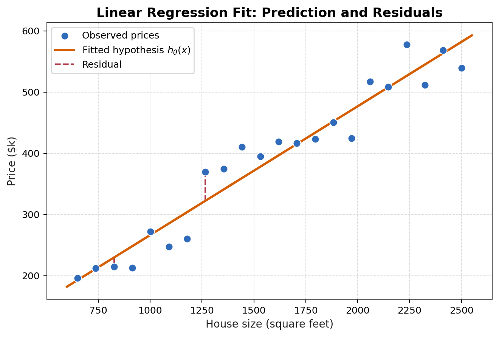
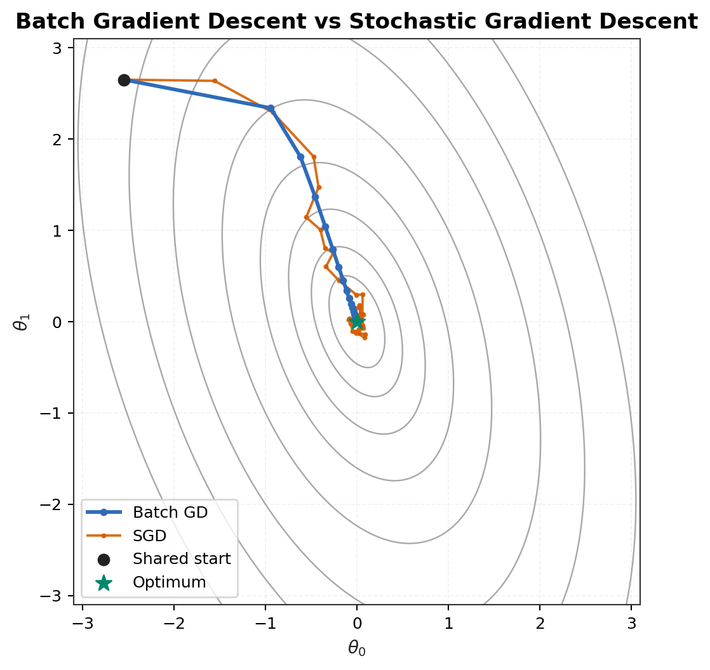
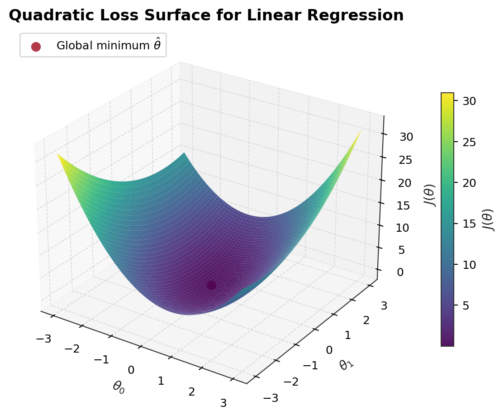
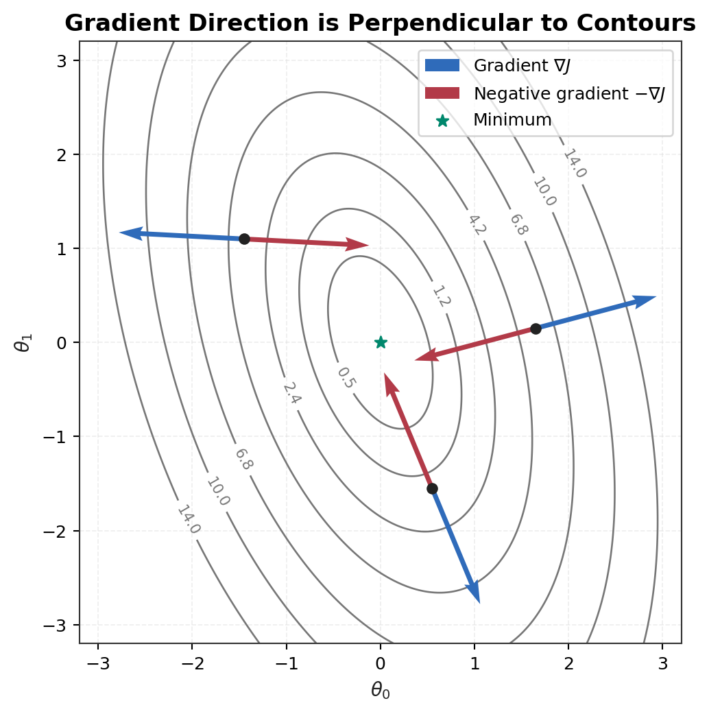
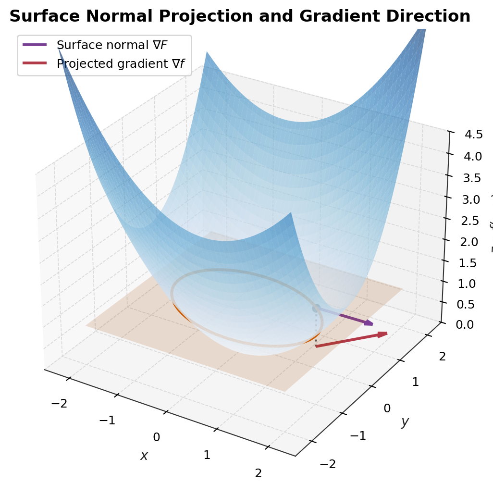
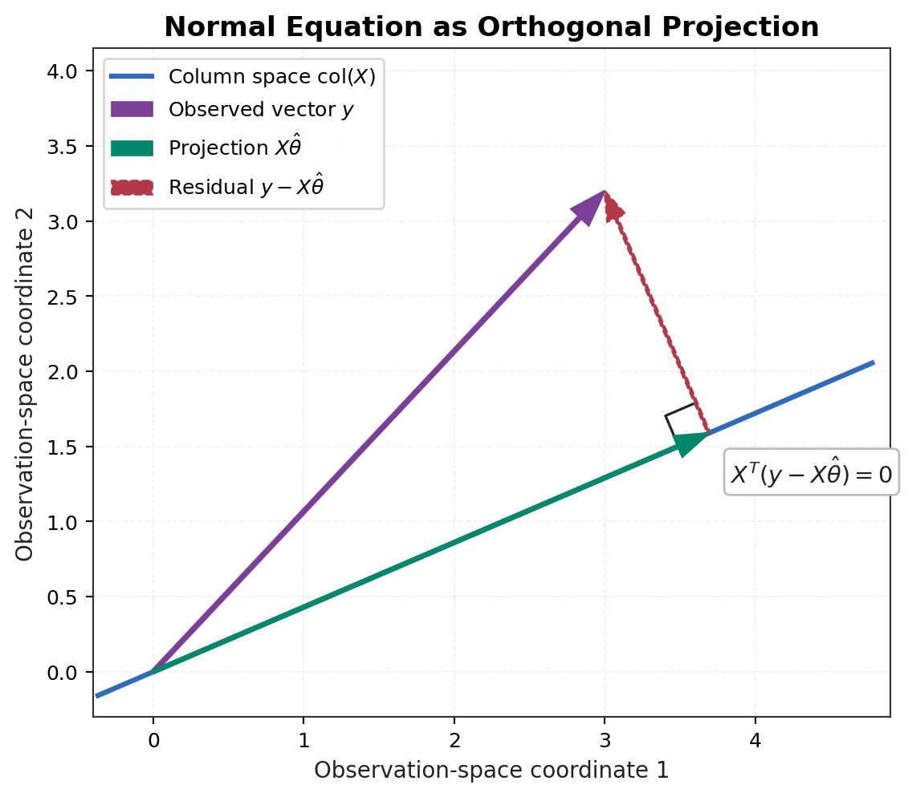

# Lecture 2: Supervised Learning Setup and Linear Regression

## 1. Core Question

Lecture 2 不只是介绍一个名为 linear regression 的算法。它第一次把 supervised learning 写成一条可以推导、计算、实现和检验的完整链路：

```text
Data -> Hypothesis -> Loss -> Optimization -> Parameters -> Prediction -> Evaluation
```

这条链路也是第一个 research / engineering paradigm：先提出可检验的 hypothesis，理解数据及其生成条件，构造可优化的 loss，再用数值或解析方法学习 parameters，最后在未见数据和失效场景中评价模型。

Linear regression 是这个范式的最小完整实例，因为：

* hypothesis function 可以显式写出；
* objective function 可以显式写出；
* gradient-based numerical optimization 在这里首次出现；
* ordinary least squares 的 normal equation 可以严格推导；
* Gaussian noise assumption 可以从概率上解释 squared loss；
* 理论公式可以直接映射到矩阵运算和未来的 NumPy 实现。

对 ordinary least squares，

$$J(\theta)=\frac{1}{2}\lVert X\theta-y\rVert_2^2$$

是关于参数 $\theta$ 的 convex quadratic function。任何 stationary point 都是 global minimizer；若 $X$ 具有 full column rank，则 $X^TX$ positive definite，global minimizer 唯一。这里不能把一般非凸优化中的“局部极小值”直觉机械地搬到 ordinary least squares。

## 2. Supervised Learning Setup

一个 **training example** 是一对 $(x^{(i)},y^{(i)})$：

* $x^{(i)}$：第 $i$ 个样本的 feature vector；
* $y^{(i)}$：对应的 label / target；
* training set：所有已观测输入输出对的集合；
* hypothesis $h_\theta$：由输入产生预测的参数化函数；
* parameter $\theta$：要从数据中学习的系数；
* design matrix $X$：把所有样本按行堆叠后的矩阵。

训练集记为

$$\mathcal{D}=\{(x^{(i)},y^{(i)})\}_{i=1}^{m}.$$

本笔记采用以下维度约定：

* $m$：training examples 数量；
* $n$：原始 features 数量；
* 加入 intercept feature $x_0=1$ 后，每个 $x^{(i)}$ 有 $n+1$ 个分量；
* $X\in\mathbb{R}^{m\times(n+1)}$；
* $\theta\in\mathbb{R}^{(n+1)\times1}$；
* $y\in\mathbb{R}^{m\times1}$；
* $X\theta\in\mathbb{R}^{m\times1}$；
* $X^TX\in\mathbb{R}^{(n+1)\times(n+1)}$；
* $X^Ty\in\mathbb{R}^{(n+1)\times1}$。

第 $i$ 行是 $(x^{(i)})^T$，因此

$$X= \begin{bmatrix} (x^{(1)})^T\\ (x^{(2)})^T\\ \vdots\\ (x^{(m)})^T \end{bmatrix}.$$

令 $x_0=1$ 的作用，是把原本单独书写的 intercept $\theta_0$ 吸收到向量内：

$$h_\theta(x)=\theta_0+\sum_{j=1}^{n}\theta_jx_j =\sum_{j=0}^{n}\theta_jx_j =\theta^Tx.$$

它没有从根本上改变 model family，只是统一了符号、矩阵计算和求导规则。

## 3. Linear Hypothesis

Linear regression 的 hypothesis 为

$$h_\theta(x)=\theta^Tx.$$

“Linear”首先指模型对 parameters $\theta$ 是线性的，而不要求对 raw input 必须呈直线关系。若构造 feature map

$$\phi(x)=[1,x,x^2,\log x]^T,$$

则

$$h_\theta(x)=\theta^T\phi(x)$$

对原始 $x$ 是 nonlinear function，但对 $\theta$ 仍是 linear model，因此仍属于 linear regression。

这一区分连接了三个重要概念：

1. **Feature engineering**：通过选择 $\phi(x)$ 暴露适合线性组合的结构。
2. **Polynomial regression**：用 $1,x,x^2,\ldots$ 扩展输入，但参数仍线性进入模型。
3. **Kernel intuition**：未来可以在高维 feature space 中使用线性模型，而不必把“线性”误解为 raw input space 中的一条直线。

下图以 house size $\rightarrow$ price 为例。散点是 observations，直线是 fitted hypothesis，竖直线段是若干样本的 residual。图像直观展示了模型、预测和误差如何进入同一个学习问题。



## 4. Least Squares Objective

本笔记使用 residual convention

$$r=X\theta-y,$$

即第 $i$ 个 scalar residual 为

$$r^{(i)}=h_\theta(x^{(i)})-y^{(i)}.$$

也可以定义 residual 为 $y-h_\theta(x)$。两种定义互为相反数，因此平方后 objective 和 optimum 相同；但一阶 residual 的符号不同，会改变中间 gradient 与 update 的书写方式。推导时必须固定 convention。

Least squares objective 定义为

$$J(\theta) =\frac12\sum_{i=1}^{m} \left(h_\theta(x^{(i)})-y^{(i)}\right)^2.$$

Squared error 可以理解为 prediction error 的一种“energy representation”：

* 每一项非负，只有 prediction 等于 target 时为零；
* 正负误差不会互相抵消；
* 较大偏差受到二次增长的惩罚；
* objective 光滑且可微，便于 gradient-based optimization；
* 对 linear hypothesis，它形成 convex quadratic objective；
* 在 independent Gaussian noise assumption 下，它自然对应 maximum likelihood estimation。

系数 $1/2$ 不改变 minimizer，因为它只是正的常数缩放。它的作用是抵消平方求导产生的 $2$：

$$\frac{d}{du}\frac12u^2=u.$$

但 squared loss 并非在所有数据条件下都可靠。它可能受到以下问题影响：

* **Outliers**：平方项会让极端 residual 支配 objective；
* **Heavy-tailed noise**：Gaussian-like 的轻尾假设不再合适；
* **Heteroscedastic noise**：不同输入区域的噪声方差不同；
* **Label noise**：错误 target 会被模型当作强监督信号；
* **Distribution shift**：训练 residual 结构不能代表部署环境；
* **Objective mismatch**：MSE 较低不必然等于真实决策成本较低。

## 5. Gradient Descent and LMS

Gradient descent 是 numerical optimization method。它不直接给出 optimum 的闭式表达，而是从当前参数出发迭代：

$$\theta\leftarrow\theta-\alpha\nabla_\theta J(\theta),$$

其中 $\alpha>0$ 是 learning rate。

为什么使用 negative gradient？对小扰动 $\Delta$，first-order Taylor approximation 给出

$$J(\theta+\Delta) \approx J(\theta)+\nabla J(\theta)^T\Delta.$$

By Cauchy--Schwarz,

$$\nabla J(\theta)^T\Delta\geq-\left\|\nabla J(\theta)\right\|_2\left\|\Delta\right\|_2.$$

If $\|\Delta\|_2=\varepsilon$, then

$$\nabla J(\theta)^T\Delta\geq-\varepsilon\left\|\nabla J(\theta)\right\|_2.$$

The bound is attained when

$$\Delta=-\varepsilon\frac{\nabla J(\theta)}{\left\|\nabla J(\theta)\right\|_2}.$$

Therefore, the negative gradient direction is the steepest local descent direction under the Euclidean norm. 换用不同 norm 或 geometry，steepest direction 也会改变。

### 5.1 One-example LMS derivation

对单个样本定义

$$J_i(\theta) =\frac12\left(h_\theta(x^{(i)})-y^{(i)}\right)^2.$$

令

$$e_i=h_\theta(x^{(i)})-y^{(i)} =\sum_{k=0}^{n}\theta_kx_k^{(i)}-y^{(i)}.$$

对 $\theta_j$ 使用 chain rule：

$$\frac{\partial J_i}{\partial\theta_j} =\frac{\partial (\frac12e_i^2)}{\partial e_i} \cdot \frac{\partial e_i}{\partial\theta_j}.$$

第一项为

$$\frac{\partial (\frac12e_i^2)}{\partial e_i}=e_i,$$

第二项为

$$\frac{\partial e_i}{\partial\theta_j} =\frac{\partial}{\partial\theta_j} \left(\sum_{k=0}^{n}\theta_kx_k^{(i)}-y^{(i)}\right) =x_j^{(i)}.$$

所以

$$\frac{\partial J_i}{\partial\theta_j} =\left(h_\theta(x^{(i)})-y^{(i)}\right)x_j^{(i)}.$$

代入 gradient descent：

$$\theta_j \leftarrow\theta_j-\alpha \left(h_\theta(x^{(i)})-y^{(i)}\right)x_j^{(i)},$$

等价地，

$$\boxed{ \theta_j \leftarrow\theta_j+\alpha \left(y^{(i)}-h_\theta(x^{(i)})\right)x_j^{(i)} }.$$

这个 Least Mean Squares (LMS) update 的直觉是：

* prediction error 越大，parameter update 通常越大；
* feature value $x_j^{(i)}$ 决定该样本对 $\theta_j$ 的影响尺度；
* 若某个 feature 数值很大且 prediction 错误，它会对参数调整产生强影响；
* 这也说明 feature scaling 会直接改变 optimization geometry。

## 6. Batch Gradient Descent vs Stochastic Gradient Descent

对全部数据，

$$\nabla_\theta J(\theta)=X^T(X\theta-y).$$

**Batch Gradient Descent** 每次用全部 $m$ 个样本计算 update：

$$\theta\leftarrow \theta-\alpha X^T(X\theta-y).$$

它的 gradient estimate 稳定且确定，但每一步需要扫描全部数据，在大数据集上成本较高。

**Stochastic Gradient Descent (SGD)** 每次使用一个样本，或在 mini-batch 版本中使用少量样本：

$$\theta\leftarrow \theta-\alpha \left(h_\theta(x^{(i)})-y^{(i)}\right)x^{(i)}.$$

它的单步成本较低，能更快开始移动，但 update direction 含有 sampling noise。对于 ordinary linear regression，objective 是 convex 的，不需要依赖 noise “逃离局部极小值”；在一般 nonconvex optimization 中，噪声有时能帮助离开 shallow poor regions 或 saddle neighborhoods。

下图在同一 quadratic objective 上比较两类路径。Batch GD 路径更平滑；SGD 因样本级 gradient 波动而摆动，但仍总体趋向 optimum。



Learning rate $\alpha$ 不能脱离 objective geometry 来理解：

* 太小会导致 convergence 很慢；
* 太大可能 overshoot、oscillate，甚至 diverge；
* ill-conditioned elliptical contours 会导致沿高曲率方向反复 zig-zag；
* feature scaling 改变 Hessian eigenvalues，从而改变稳定步长范围；
* SGD noise 会使固定 learning rate 在 optimum 附近持续波动。

下图显示了 two-parameter least-squares objective 的 bowl shape。不同方向曲率不同意味着同一 learning rate 在各方向产生不同的有效移动尺度。



## 7. Geometric Proof: Gradient is Perpendicular to Contours

### 7.1 Contour-line proof

对 differentiable function $z=f(x,y)$，equal-height contour 定义为

$$f(x,y)=c.$$

用户的几何直觉是：沿等高线移动时高度不变，因此“高度增长最快的方向”不应包含沿等高线的切向分量。下面把这个直觉写成严格的 curve-based proof。

令 contour 上的一条 differentiable curve 为

$$r(t) = \begin{bmatrix} x(t) \\ y(t) \end{bmatrix}.$$

Since $r(t)$ stays on the contour, the function value is constant:

$$f(x(t),y(t))=c.$$

Differentiating both sides with respect to $t$:

$$\frac{d}{dt}f(x(t),y(t))=f_x(x(t),y(t))x'(t)+f_y(x(t),y(t))y'(t).$$

Using vector notation:

$$\frac{d}{dt}f(x(t),y(t))=\nabla f(x(t),y(t))^T\begin{bmatrix}x'(t)\\y'(t)\end{bmatrix}=0.$$

Therefore,

$$\nabla f(x(t),y(t))^Tr'(t)=0.$$

So,

$$\nabla f(x(t),y(t))\perp r'(t).$$

严格地说，该结论在 regular point $\nabla f\neq0$ 处给出明确法向方向；若 gradient 为零，则不能由零向量定义唯一方向。

图中蓝色箭头是 gradient，红色箭头是 negative gradient。它们穿过 contour，而不是沿 contour 移动。



### 7.2 Surface-normal projection proof

考虑 surface

$$z=f(x,y).$$

把它改写为 implicit surface：

$$F(x,y,z)=f(x,y)-z=0.$$

Implicit surface 的 normal vector 为

$$\nabla F=(f_x,f_y,-1).$$

把该 normal vector 投影到 $xy$-plane，得到

$$(f_x,f_y)=\nabla f.$$

Contour $f(x,y)=c$ 可以看作 surface 与 horizontal plane $z=c$ 的交线，再投影到 $xy$-plane。交线的 tangent vector 同时位于 surface tangent plane 和 horizontal plane 中；其 $xy$ 投影与 $(f_x,f_y)$ 正交。因此，二维 gradient 正是三维 surface normal 在输入平面中的投影方向。



这个证明保留了“surface normal 投影为 gradient”的几何想法，同时说明了 contour 来自 horizontal slice。详细证明见 [Matrix Transpose Identity and Gradient-Contour Geometry](../../math-derivations/matrix-transpose-and-gradient-geometry.md)。

## 8. Matrix View of Linear Regression

把所有样本同时写入 design matrix 后，

$$h_\theta(X)=X\theta,$$

$$r=X\theta-y,$$

$$J(\theta) =\frac12(X\theta-y)^T(X\theta-y) =\frac12\lVert X\theta-y\rVert_2^2.$$

Matrix notation 的价值不只是“写得短”：

* **Compactness**：一个式子同时表达全部样本；
* **Dimension checking**：shape 不一致会立刻暴露推导错误；
* **Implementation**：直接对应 NumPy matrix-vector operations；
* **Normal equation**：便于展开 quadratic form 并求 stationary point；
* **Projection geometry**：把 fitted values 看作 column space 中的向量。

## 9. Matrix Multiplication and Transpose Identity

后续展开 objective 会使用

$$(AB)^T=B^TA^T.$$

Matrix multiplication 有三个互补视角：

1. Entry-wise： $(AB)_{ij}$ 是 $A$ 的第 $i$ 行与 $B$ 的第 $j$ 列的 inner product。
2. Column-space view： $AB$ 的第 $j$ 列是 $A$ 各列的 linear combination，coefficients 来自 $B$ 的第 $j$ 列。
3. Row-space view： $AB$ 的第 $i$ 行是 $B$ 各行的 linear combination，coefficients 来自 $A$ 的第 $i$ 行。

Transpose 会交换 rows 与 columns。原 composition 的最后一步在转置后的表示中必须先被处理，所以乘法顺序反转。详细的 entry-wise proof、column/row interpretation 和 linear-map explanation 见 [Matrix Transpose Identity and Gradient-Contour Geometry](../../math-derivations/matrix-transpose-and-gradient-geometry.md)。

## 10. Normal Equation: Full Derivation

从 matrix objective 开始：

$$J(\theta) =\frac12(X\theta-y)^T(X\theta-y).$$

### Step 1: transpose the residual

利用 $(AB)^T=B^TA^T$，

$$(X\theta-y)^T =(X\theta)^T-y^T =\theta^TX^T-y^T.$$

Dimension check：

* $X\theta-y\in\mathbb{R}^{m\times1}$；
* $(X\theta-y)^T\in\mathbb{R}^{1\times m}$；
* 因而 $J(\theta)\in\mathbb{R}$。

### Step 2: expand the product

$$J(\theta)=\frac12(\theta^TX^T-y^T)(X\theta-y)$$

$$J(\theta)=\frac12\left( \theta^TX^TX\theta -\theta^TX^Ty -y^TX\theta +y^Ty \right).$$

各项 shape 为：

* $\theta^TX^TX\theta$： $(1\times(n+1))((n+1)\times(n+1))((n+1)\times1)$，结果是 scalar；
* $\theta^TX^Ty$： $(1\times(n+1))((n+1)\times1)$，结果是 scalar；
* $y^TX\theta$： $(1\times m)(m\times(n+1))((n+1)\times1)$，结果是 scalar；
* $y^Ty$： $(1\times m)(m\times1)$，结果是 scalar。

### Step 3: combine the cross terms

$\theta^TX^Ty$ 是 scalar，因此等于自身的 transpose：

$$\theta^TX^Ty =(\theta^TX^Ty)^T =y^TX\theta.$$

所以

$$J(\theta) =\frac12\left( \theta^TX^TX\theta -2y^TX\theta +y^Ty \right).$$

### Step 4: differentiate

使用 matrix derivative facts：

$$\nabla_\theta(a^T\theta)=a,$$

$$\nabla_\theta(\theta^TA\theta)=(A+A^T)\theta.$$

若 $A$ symmetric，

$$\nabla_\theta(\theta^TA\theta)=2A\theta.$$

因为

$$(X^TX)^T=X^T(X^T)^T=X^TX,$$

$X^TX$ symmetric。并且 $y^Ty$ 与 $\theta$ 无关，其 gradient 为零。因此

$$\nabla_\theta J(\theta)=\frac12\left(2X^TX\theta-2X^Ty+0\right)$$

$$\nabla_\theta J(\theta)=X^TX\theta-X^Ty$$

$$\nabla_\theta J(\theta)=X^T(X\theta-y).$$

Dimension check：

* $X^TX\theta\in\mathbb{R}^{(n+1)\times1}$；
* $X^Ty\in\mathbb{R}^{(n+1)\times1}$；
* $\nabla_\theta J(\theta)$ 与 $\theta$ shape 相同。

### Step 5: solve the stationary condition

令 gradient 为零：

$$X^TX\hat{\theta}-X^Ty=0,$$

因此

$$\boxed{X^TX\hat{\theta}=X^Ty}.$$

这就是 normal equation。若 $X^TX$ invertible，

$$\boxed{\hat{\theta}=(X^TX)^{-1}X^Ty}.$$

解析公式不意味着实现时应该显式计算 inverse。实际数值计算通常更适合使用 linear solver、QR decomposition、SVD 或 pseudo-inverse，因为显式 inverse 可能放大 conditioning 问题。

### Step 6: understand non-invertibility

$X^TX$ 可能不 invertible，原因包括：

* redundant features；
* exact or near multicollinearity；
* $m<n+1$，参数维数超过样本提供的独立约束；
* design matrix rank deficiency。

可能的处理方式包括：

* Moore--Penrose pseudo-inverse；
* ridge regression；
* feature selection 或移除冗余变量；
* 获取更多具有独立信息的数据；
* 使用稳定 numerical solvers 而不是显式 inverse。

### Step 7: projection geometry

Here, $\mathrm{Col}(X)$ denotes the column space of $X$.

The fitted vector is

$$\hat{y}=X\hat{\theta}.$$

Because $\hat{y}$ is a linear combination of the columns of $X$, it lies in the column space:

$$\hat{y}\in \mathrm{Col}(X).$$

The normal equation can be rewritten as

$$X^T(y-X\hat{\theta})=0.$$

This means the residual vector is orthogonal to the column space:

$$y-X\hat{\theta}\perp \mathrm{Col}(X).$$

Therefore, $\hat{y}$ is the orthogonal projection of $y$ onto $\mathrm{Col}(X)$.



图中 subspace line 表示 $\mathrm{Col}(X)$， $\hat{y}=X\hat{\theta}$ 位于该 subspace 上，residual 从 projection point 垂直指向 $y$。这条正交关系与 normal equation 完全等价。

## 11. Probabilistic Interpretation and MLE

Least squares 可以从一个 data-generating assumption 推出。假设

$$y^{(i)}=\theta^Tx^{(i)}+\epsilon^{(i)},$$

且 noise independent and identically distributed：

$$\epsilon^{(i)}\sim\mathcal{N}(0,\sigma^2).$$

于是 conditional distribution 为

$$y^{(i)}\mid x^{(i)};\theta \sim \mathcal{N}(\theta^Tx^{(i)},\sigma^2).$$

其 density 是

$$p(y^{(i)}\mid x^{(i)};\theta) =\frac{1}{\sqrt{2\pi\sigma^2}} \exp\left( -\frac{(y^{(i)}-\theta^Tx^{(i)})^2}{2\sigma^2} \right).$$

在 conditional independence assumption 下，likelihood 为

$$L(\theta) =\prod_{i=1}^{m} p(y^{(i)}\mid x^{(i)};\theta).$$

Probability 与 likelihood 使用同一 density，但关注对象不同：

* probability view：固定 $\theta$，把尚未观测的 $y$ 看作 random variable；
* likelihood view：观测到的 $y$ 已固定，把 $\theta$ 看作要比较和优化的变量。

取 log：

$$\ell(\theta)=\log L(\theta)$$

$$\ell(\theta)=\sum_{i=1}^{m} \log p(y^{(i)}\mid x^{(i)};\theta)$$

$$\ell(\theta)=\sum_{i=1}^{m} \left[ -\frac12\log(2\pi\sigma^2) -\frac{(y^{(i)}-\theta^Tx^{(i)})^2}{2\sigma^2} \right]$$

$$\ell(\theta)=-\frac{m}{2}\log(2\pi\sigma^2) -\frac{1}{2\sigma^2} \sum_{i=1}^{m} (y^{(i)}-\theta^Tx^{(i)})^2.$$

Log is strictly increasing, so maximizing $L(\theta)$ is equivalent to maximizing $\ell(\theta)$. The first term is independent of $\theta$, and $-1/(2\sigma^2)$ is a negative constant.

Therefore, maximizing the Gaussian log likelihood is equivalent to minimizing the squared-error objective:

$$\underset{\theta}{\mathrm{argmax}}\ \ell(\theta)=\underset{\theta}{\mathrm{argmin}}\sum_{i=1}^{m}\left(y^{(i)}-\theta^Tx^{(i)}\right)^2.$$

So Gaussian noise MLE and ordinary least squares produce the same parameter estimate.

使用 log likelihood 的计算优势在于：

* products 变成 sums；
* exponential density 的指数项变成 quadratic residual；
* 避免大量小概率相乘导致的 numerical underflow；
* monotonicity 保证 optimum 不变。

Gaussian assumption 为 squared loss 提供了清晰统计解释，但 squared loss 并非只有在 noise 严格 Gaussian 时才能使用。它也可作为 smooth convex surrogate objective；只是当 noise 严重偏离 Gaussian、存在 outliers 或 variance 随输入变化时，MLE interpretation 和 estimator reliability 都需要重新检查。

## 12. Failure Modes and Reliability View

Linear regression 对 reliable ML 有特殊价值：

* assumptions transparent；
* residuals 可直接检查；
* optimization 与 geometry 清晰；
* failure modes 容易构造和复现；
* 它是复杂模型之前必须比较的 strong baseline。

典型 failure modes 包括：

* nonlinear data 但 features 不足；
* outliers 支配 squared objective；
* heavy-tailed noise 产生不稳定 estimates；
* heteroscedasticity 使 uncertainty 与效率分析失真；
* multicollinearity 使 parameters 对小扰动敏感；
* rank deficiency 导致 minimizer 不唯一；
* distribution shift 破坏训练关系；
* label noise 污染监督信号；
* objective mismatch 使较低 MSE 仍对应较差 deployment outcome。

从 STGCN + uncertainty quantification + robustness 回到 linear regression，不是退回简单问题，而是在更透明的实验室中重新检查：

* noise assumptions 如何进入 objective；
* residual analysis 如何揭示结构性误差；
* loss-objective alignment 如何影响工程目标；
* robust stress tests 应怎样设计；
* projection geometry 如何解释 fitted signal 与 unexplained component；
* 简单模型如何暴露复杂模型可能隐藏的 failure modes。

## 13. Implementation Preparation

本阶段不实现 `LinearRegressionGD`。下一阶段的 from-scratch design 应包括：

* `LinearRegressionGD`；
* closed-form normal equation solution；
* deterministic synthetic data generator；
* loss curve visualization；
* analytic gradient 与 finite-difference gradient check；
* clean Gaussian noise recovery test；
* outlier stress test；
* heavy-tailed noise stress test；
* collinearity / rank-deficiency test；
* train/test distribution shift test。

实现时需要特别检查：

1. intercept 是否通过 feature augmentation 一致处理；
2. scalar、vector 和 matrix shapes 是否明确；
3. residual convention 是否在 loss 与 gradient 中一致；
4. batch loss 是否采用 sum 或 mean，以及 learning rate 是否随之调整；
5. normal equation 是否使用稳定 solver，而不是无条件显式求逆；
6. gradient descent 与 closed-form solution 在 well-conditioned clean data 上是否一致。

## 14. My Takeaways

Lecture 2 是第一个完整的 supervised learning template。Linear regression 虽然简单，却同时连接 data、hypothesis、loss、optimization、probability、geometry、implementation 与 reliability。

Gradient descent 提供 numerical route，normal equation 提供 analytic route；Gaussian noise 解释 squared loss 的统计来源；projection geometry 解释 optimum 的空间意义；convexity 则保证 stationary point 的全局性质。它不是一个只用于入门的算法，而是理解 machine learning 全链路的 minimal complete laboratory。
