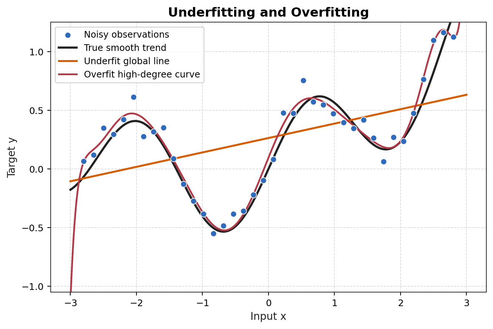
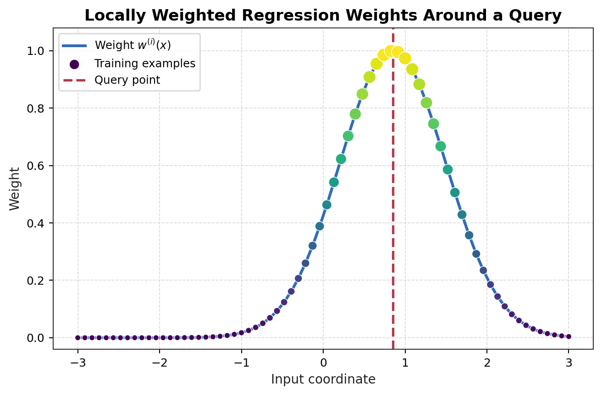
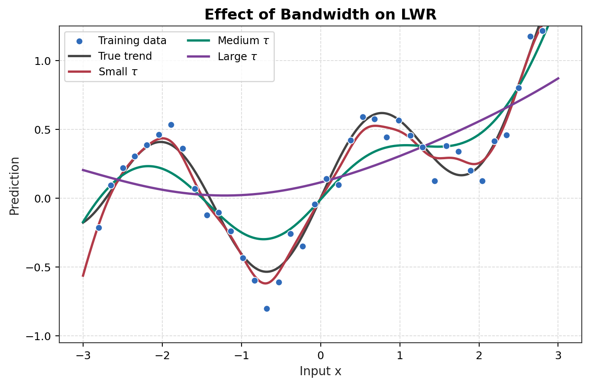
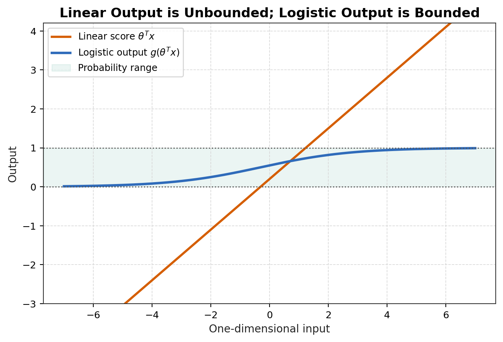
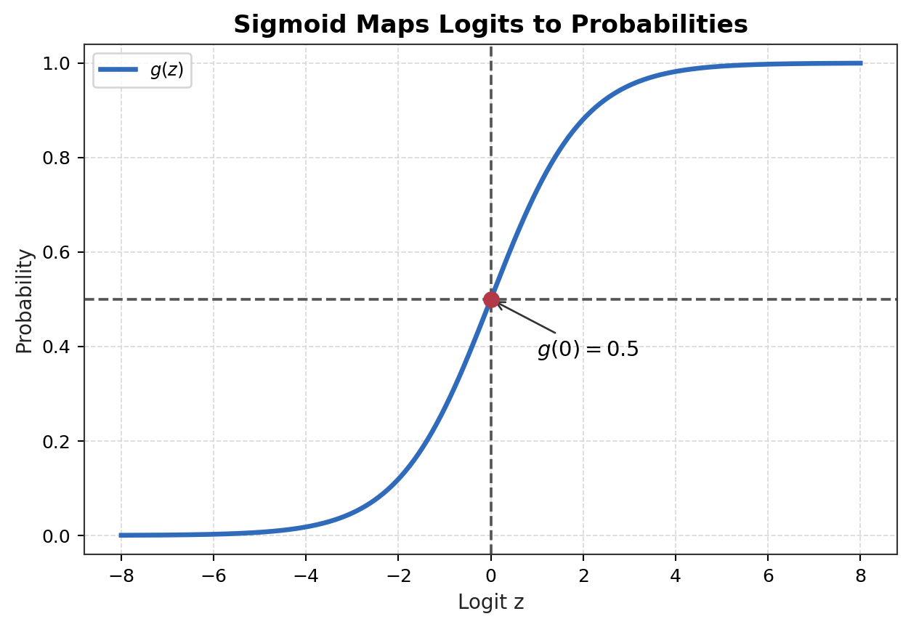
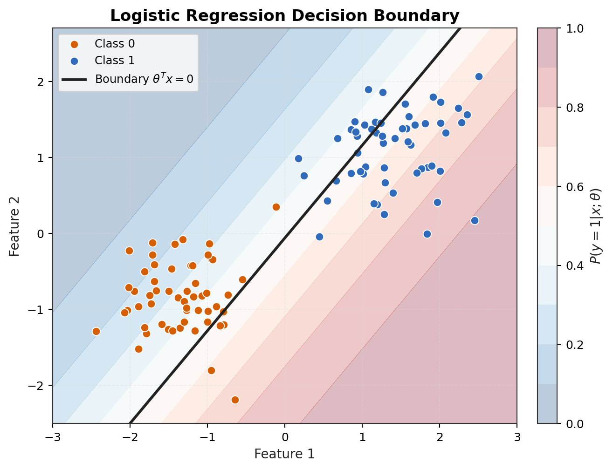
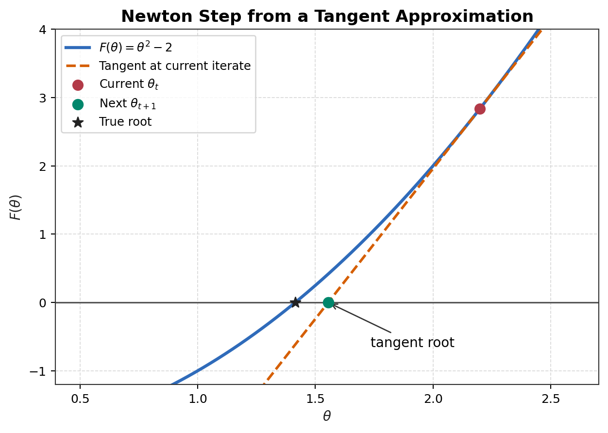
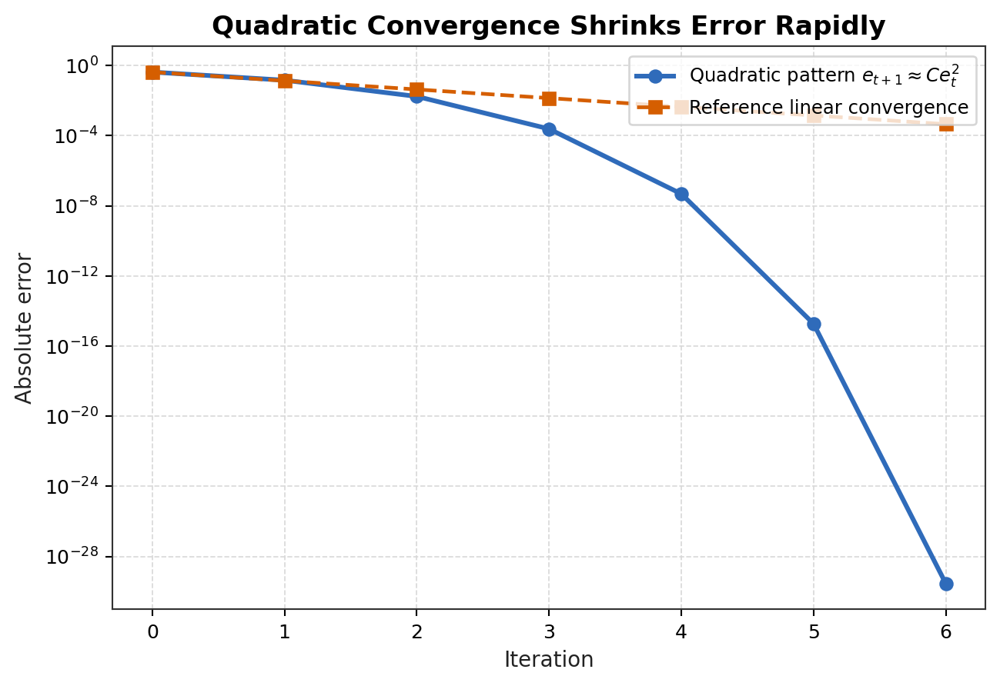

# Lecture 3: Locally Weighted and Logistic Regression

## 1. Core Question

Lecture 3 不是简单地往工具箱里再放两个算法。它真正连接的是一条更深的建模链路：当 global linear fit 不够用时，模型如何变成 local；当输出从 real value 变成 class label 时，loss、hypothesis、probabilistic model 和 optimization 又必须如何一起改变。

核心 pipeline 可以概括为：

Global Linear Regression -> Local Linear Approximation -> Probability vs Likelihood -> Bernoulli Classification Model -> Logistic Regression -> Newton Method

这条线索说明了一件事：machine learning 不是固定套用某个 objective，而是根据 data geometry、output space、noise assumption 和 computation constraint 来重新设计模型。

# Two Perspectives: Machine Learning View vs Probabilistic View

## 1. Why Two Perspectives Matter

同一个模型可以从两个角度阅读。官方 Lecture 3 的主线把 locally weighted regression、logistic regression 和 Newton method 连在一起；要真正理解这条线，不能只看公式长什么样，还要看这些公式到底是在表达 empirical objective，还是在表达 probabilistic modeling assumption。

Machine learning view 关心的是：

* 应该使用什么 hypothesis class？
* 用什么 loss 衡量 prediction error？
* 要最小化什么 empirical objective？
* 模型如何 generalize 到 unseen data？

Probabilistic view 关心的是：

* 假设怎样的 data-generating distribution？
* 哪些量是 random variables？
* observed data 诱导出什么 likelihood？
* 哪个 parameter 让 observed data 最 plausible？

这两种说法不是互相竞争的解释，而是对同一个 training objective 的两种阅读方式。Machine learning view 强调预测、泛化和优化；probabilistic view 强调模型假设、似然和参数估计。CS229 早期几节课会不断在这两种语言之间切换。

## 2. Machine Learning / Empirical Risk View

设 training data 为：

$$D=\{(x^{(i)},y^{(i)})\}_{i=1}^{m}.$$

选择一个 hypothesis：

$$h_{\theta}:\mathcal{X}\to\mathcal{Y}.$$

选择一个 loss：

$$\ell(h_{\theta}(x),y).$$

最小化 empirical risk：

$$J_{\mathrm{ERM}}(\theta)=\frac{1}{m}\sum_{i=1}^{m}\ell(h_{\theta}(x^{(i)}),y^{(i)}).$$

因此：

$$\hat{\theta}_{\mathrm{ERM}}=\underset{\theta}{\mathrm{argmin}}\ J_{\mathrm{ERM}}(\theta).$$

从 ML view 看，linear regression 是“选择 linear hypothesis 和 squared loss”。Logistic regression 是“选择 sigmoid probability output 和 cross-entropy loss”。这套语言很适合讨论 optimization、generalization、regularization 和 robustness。

## 3. Probabilistic / Statistical Modeling View

另一种说法从 conditional distribution 开始：

$$p(y|x;\theta).$$

假设 training examples 条件独立：

$$p(y^{(1)},\dots,y^{(m)}|X;\theta)=\prod_{i=1}^{m}p(y^{(i)}|x^{(i)};\theta).$$

定义 likelihood：

$$L(\theta)=\prod_{i=1}^{m}p(y^{(i)}|x^{(i)};\theta).$$

Maximum likelihood estimation 是：

$$\hat{\theta}_{\mathrm{MLE}}=\underset{\theta}{\mathrm{argmax}}\ L(\theta).$$

Log likelihood 是：

$$\ell(\theta)=\sum_{i=1}^{m}\log p(y^{(i)}|x^{(i)};\theta).$$

Negative log likelihood 是：

$$J_{\mathrm{NLL}}(\theta)=-\ell(\theta).$$

所以也可以写成 minimization：

$$\hat{\theta}_{\mathrm{MLE}}=\underset{\theta}{\mathrm{argmin}}\ J_{\mathrm{NLL}}(\theta).$$

从 probabilistic view 看，loss 不是任意选的。它来自我们对 conditional distribution 的假设：Gaussian conditional model 导出 squared loss，Bernoulli conditional model 导出 cross-entropy。

## 4. Linear Regression: Two Views Meet

Machine learning view 写成：

$$h_{\theta}(x)=\theta^Tx.$$

$$J(\theta)=\frac{1}{2}\sum_{i=1}^{m}\left(y^{(i)}-\theta^Tx^{(i)}\right)^2.$$

Probabilistic view 假设：

$$y^{(i)}=\theta^Tx^{(i)}+\epsilon^{(i)}.$$

$$\epsilon^{(i)}\sim\mathcal{N}(0,\sigma^2).$$

于是：

$$p(y^{(i)}|x^{(i)};\theta)=\frac{1}{\sqrt{2\pi}\sigma}\exp\left(-\frac{\left(y^{(i)}-\theta^Tx^{(i)}\right)^2}{2\sigma^2}\right).$$

Negative log likelihood 与 squared error 只差 constant 和 positive scaling，所以：

$$\hat{\theta}_{\mathrm{MLE}}=\underset{\theta}{\mathrm{argmin}}\sum_{i=1}^{m}\left(y^{(i)}-\theta^Tx^{(i)}\right)^2.$$

这解释了为什么 least squares 可以同时被读作 empirical error minimization 和 Gaussian maximum likelihood estimation。前者强调预测误差，后者说明 squared loss 隐含了 independent homoscedastic Gaussian noise assumption。

## 5. Logistic Regression: Two Views Meet

Machine learning view 先选择 bounded probabilistic output：

$$h_{\theta}(x)=\frac{1}{1+e^{-\theta^Tx}}.$$

然后使用 cross-entropy loss：

$$J(\theta)=-\sum_{i=1}^{m}\left[y^{(i)}\log h_{\theta}(x^{(i)})+\left(1-y^{(i)}\right)\log\left(1-h_{\theta}(x^{(i)})\right)\right].$$

Probabilistic view 假设 Bernoulli conditional model：

$$p(y|x;\theta)=h_{\theta}(x)^y\left(1-h_{\theta}(x)\right)^{1-y}.$$

它的 negative log likelihood 正好就是 binary cross-entropy objective。

这说明 logistic regression 不是 linear regression 加一个 threshold。它是一个 Bernoulli conditional model，而它的 MLE objective 自然变成 cross-entropy。

## 6. Why This Is Mostly Frequentist in Early CS229

在早期 CS229 的 MLE 推导中，$\theta$ 被当作 fixed but unknown parameter。随机性来自 data，而不是来自 $\theta$ 本身。

这就是 frequentist interpretation：

$$\theta\ \text{is fixed but unknown.}$$

$$D\ \text{is random because it is sampled from the data-generating process.}$$

$$\hat{\theta}(D)\ \text{is random because it depends on the sampled dataset.}$$

因此 estimator 是 random 的，因为换一批样本会得到不同的 $\hat{\theta}$；但 true parameter 在这个解释中不是 random variable。

## 7. Bayesian Contrast

Bayesian modeling 的出发点不同：$\theta$ 被建模为 random variable。

先指定 prior：

$$p(\theta).$$

观察到 data $D$ 后，用 Bayes rule 更新到 posterior：

$$p(\theta|D)=\frac{p(D|\theta)p(\theta)}{p(D)}.$$

其中 evidence 是：

$$p(D)=\int p(D|\theta)p(\theta)d\theta.$$

MAP estimate 是：

$$\hat{\theta}_{\mathrm{MAP}}=\underset{\theta}{\mathrm{argmax}}\ p(D|\theta)p(\theta).$$

MLE 只最大化 likelihood；MAP 最大化 likelihood times prior。Full Bayesian prediction 不只使用一个 point estimate，而是对 posterior parameter uncertainty 做平均：

$$p(y_*|x_*,D)=\int p(y_*|x_*;\theta)p(\theta|D)d\theta.$$

## 8. Frequentist vs Bayesian Summary Table

| Aspect | Frequentist / MLE View | Bayesian View |
| ------ | ---------------------- | ------------- |
| Parameter $\theta$ | Fixed but unknown | Random variable |
| Data $D$ | Random sample | Observed evidence |
| Main object | Estimator $\hat{\theta}(D)$ | Posterior $p(\theta\mid D)$ |
| Prior | Not used in MLE | Required |
| Objective | Maximize likelihood | Infer posterior / MAP / posterior predictive |
| Uncertainty | Sampling distribution / confidence intervals | Posterior uncertainty |
| CS229 early notes | Mostly this view | Later appears in regularization / Bayesian section |

## 9. Research-Level Interpretation

ML view 对 algorithm design 和 optimization 很有用：它让我们讨论 hypothesis class、loss landscape、gradient, generalization error 和 robustness。Probabilistic view 对解释 loss function 是否合适很关键：它让我们检查 assumed noise model、output distribution、independence assumption 和 calibration 是否可信。

Reliable ML 需要两个角度同时成立：

* ML view 检查 empirical performance、generalization、optimization 和 robustness；
* probabilistic view 检查 assumed noise model、output distribution、independence assumption 和 calibration 是否 plausible。

一个模型可能很好地 minimize empirical loss，但 probability calibration 很差。反过来，一个 probabilistic model 也可能数学上优雅但和真实数据机制 misspecified。可靠建模必须同时测试这两件事。

## 2. From Global Linear Regression to Local Models

Ordinary linear regression 学习一个全局参数向量 $\theta$。训练结束后，预测只需要保存 $\theta$，训练数据本身可以丢弃。它的强假设是：同一个 linear relationship 对整个 input space 都足够好。

Locally weighted regression 的想法不同。它不试图找到一个对所有点都同样适用的全局直线，而是在每个 query point $x$ 附近拟合一个 local linear model。给定 query point $x$，局部 objective 是：

$$J_x(\theta)=\frac{1}{2}\sum_{i=1}^{m}w^{(i)}(x)\left(y^{(i)}-\theta^Tx^{(i)}\right)^2.$$

下标 $x$ 很重要：它表示这个 objective 本身依赖当前要预测的 query point。换一个 query point，权重 $w^{(i)}(x)$ 会改变，优化问题也会改变。因此 LWR 学到的不是一个固定的 $\theta$，而是每次预测时临时求出的 local parameter $\theta(x)$。

下图用同一组非线性数据展示了 global underfit、较合理的 smooth fit 和过度贴合噪声的 overfit 之间的差异。LWR 的动机正来自这种现象：一个 global linear model 可能太僵硬，但无限制的局部拟合也可能太不稳定。

## 3. Parametric vs Non-parametric Learning

Parametric learning 不是简单地说“模型有参数”。更准确地说，它的有效模型复杂度由一个固定维度的有限参数向量控制，通常不会随着训练样本数 $m$ 自动增长。

Non-parametric learning 也不是说“模型没有参数”。它通常意味着模型复杂度或记忆量会随数据量增长，预测时可能直接依赖保留下来的 training examples。

| Aspect | Parametric Learning | Non-parametric Learning |
| ------ | ------------------- | ----------------------- |
| Parameter size | 通常固定，例如 $\theta\in\mathbb{R}^d$ | 复杂度或存储常随 $m$ 增长 |
| Dependence on training data | 训练后主要保存 parameters | 预测时常需要访问 training data |
| Prediction-time cost | 通常较低 | 可能较高，因为要比较或加权许多样本 |
| Assumptions | 结构假设强，例如 global linear boundary | 结构假设较弱，更依赖 local evidence |
| Flexibility | 受固定 hypothesis class 限制 | 更灵活，能适应局部变化 |
| High-dimensional behavior | 依赖 feature design 和 regularization | 容易受 curse of dimensionality 影响 |
| Examples | linear regression, logistic regression, perceptron, fixed-architecture neural networks | locally weighted regression, kNN, Gaussian-kernel SVM 等 kernel methods |

这个区分对 reliable ML 很重要。Parametric model 的风险常来自 misspecification；non-parametric model 的风险常来自 locality、sample density、distance metric 和 prediction-time cost。

## 4. Locally Weighted Regression

LWR 常用 Gaussian-kernel-like weight：

$$w^{(i)}(x)=\exp\left(-\frac{\left|x^{(i)}-x\right|_2^2}{2\tau^2}\right).$$

这个公式表示一个以 query point $x$ 为中心的 locality weighting kernel。它不是在说整个数据分布服从 Gaussian distribution，也不是在对 $x$ 的 global density 作建模。它只是定义：离当前 query point 越近的 training example，在当前局部拟合中的权重越大。

图中的 query point 决定了权重中心。附近点得到较大 weights，远处点得到较小 weights。每来一个新的 query point，就会产生一组新的 weights，也就产生一个新的 weighted least-squares objective。预测时，LWR 先求出 local $\theta(x)$，再输出 $\theta(x)^Tx$。

## 5. The Role of $\tau$

$\tau$ 是 bandwidth，也可以理解为 locality parameter。它控制一个 training example 离 query point 多远之后还会产生明显影响。

| $\tau$ | Effective neighborhood | Behavior | Risk |
| ------ | ---------------------- | -------- | ---- |
| Small | 很窄，只看非常近的点 | 高度 local，曲线很灵活 | variance 高，容易 overfitting，不平滑，数值不稳定 |
| Medium | 适中邻域 | 在 locality 和 stability 之间平衡 | 依赖数据密度和噪声水平 |
| Large | 很宽，许多点权重相近 | 接近 global linear regression | bias 高，容易 underfitting |

从 bias-variance tradeoff 看，小 $\tau$ 降低 bias 但提高 variance；大 $\tau$ 降低 variance 但提高 bias。合适的 $\tau$ 不是数学装饰，而是 LWR 是否可靠的核心超参数。

## 6. Why LWR Struggles in High Dimensions

LWR 在低维图像中很直观，因为“附近”通常既有足够样本，也真的代表相似输入。但这个直觉依赖两个条件：

* query point $x$ 附近的 local neighborhood 含有足够多 informative samples；
* distance metric 足够 meaningful，使 nearby points 和 faraway points 得到明显不同的 weights。

High-dimensional space 会同时破坏这两个条件：local neighborhoods 变得稀疏，distances 又会 concentrate。

### Local Neighborhood Sparsity

假设 data points 近似均匀分布在 unit hypercube $[0,1]^d$ 中，并且 query point $x$ 离边界足够远。先考虑 $L_{\infty}$ 半径为 $r$ 的 local neighborhood，它是一个边长为 $2r$ 的 hypercube。

$$\mathrm{Vol}_{\infty}(r)=(2r)^d.$$

如果训练集中有 $m$ 个样本，那么这个 local neighborhood 中的样本数 $N_r$ 的期望是：

$$\mathbb{E}[N_r]=m(2r)^d.$$

为了平均至少保留 $k$ 个 local samples，需要：

$$m(2r)^d\geq k.$$

因此：

$$m\geq \frac{k}{(2r)^d}.$$

对固定的 local radius $r<1/2$，分母中的 $(2r)^d$ 会随 dimension $d$ 指数衰减，所以所需 sample size 必须随 $d$ 指数增长。

例如 $r=0.1$ 时，$(2r)^d=0.2^d$。即使只想平均保留 $k=10$ 个 local samples，也需要：

$$m\geq 10\cdot 5^d.$$

这就是“local neighborhoods become sparse”的数学含义。

还有一个更几何的直觉。由于数据近似均匀，volume ratio 就是 probability ratio。把半径从 $r$ 稍微扩大到 $(1+\epsilon)r$ 时，新增 boundary shell 相对于原 neighborhood 的体积比例为：

$$\frac{\mathrm{Vol}_{\infty}((1+\epsilon)r)-\mathrm{Vol}_{\infty}(r)}{\mathrm{Vol}_{\infty}(r)}=(1+\epsilon)^d-1.$$

如果只保留去掉边缘后的 inner core，也就是半径从 $r$ 缩到 $(1-\epsilon)r$，core 相对于原 neighborhood 的体积比例为：

$$\frac{\mathrm{Vol}_{\infty}((1-\epsilon)r)}{\mathrm{Vol}_{\infty}(r)}=(1-\epsilon)^d.$$

当 $d$ 增大时，固定的相对边缘变化会被 exponent $d$ 放大：outer shell 的概率质量相对于原主体快速增加，而 inner core 的概率质量快速趋近于 $0$。因此在高维中，local neighborhood 的概率质量对半径和边界非常敏感，所谓“主体区域”并不会像低维直觉那样稳定占据主要质量。

Euclidean ball 版本也有同样的问题。对半径为 $r$ 的 $L_2$ ball，忽略边界效应：

$$\mathrm{Vol}_{2}(r)=V_d r^d.$$

其中：

$$V_d=\frac{\pi^{d/2}}{\Gamma(d/2+1)}.$$

因此：

$$\mathbb{E}[N_r]=mV_dr^d.$$

为了让 $\mathbb{E}[N_r]\geq k$，需要：

$$m\geq \frac{k}{V_dr^d}.$$

关键因子仍然是 $r^d$。即使暂时不讨论 $V_d$ 本身如何随 $d$ 变化，只要 $r<1$，local volume 就会随着 dimension 增加而快速 collapse。

LWR 假设每个 query point $x$ 周围有足够样本来稳定拟合 local model $\theta(x)$。在高维中，除非 $m$ 指数增长，否则这个统计前提通常不成立。

### Distance Concentration

令 $X,Y\in[0,1]^d$ 是两个 independent random points，且各坐标 independent。定义 squared Euclidean distance：

$$D^2=\left|X-Y\right|_2^2=\sum_{j=1}^{d}(X_j-Y_j)^2.$$

令：

$$Z_j=(X_j-Y_j)^2.$$

于是：

$$D^2=\sum_{j=1}^{d}Z_j.$$

若 $X_j,Y_j\sim\mathrm{Uniform}(0,1)$ 且相互独立，则：

$$\mathbb{E}[Z_j]=\mathbb{E}[(X_j-Y_j)^2]=\frac{1}{6}.$$

同时：

$$\mathbb{E}[Z_j^2]=\mathbb{E}[(X_j-Y_j)^4]=\frac{1}{15}.$$

所以：

$$\mathrm{Var}(Z_j)=\frac{1}{15}-\left(\frac{1}{6}\right)^2=\frac{7}{180}.$$

由于 coordinates independent：

$$\mathbb{E}[D^2]=\sum_{j=1}^{d}\mathbb{E}[Z_j]=\frac{d}{6}.$$

$$\mathrm{Var}(D^2)=\sum_{j=1}^{d}\mathrm{Var}(Z_j)=\frac{7d}{180}.$$

因此 $D^2$ 的 coefficient of variation 是：

$$\frac{\sqrt{\mathrm{Var}(D^2)}}{\mathbb{E}[D^2]}=\frac{\sqrt{7d/180}}{d/6}=\sqrt{\frac{7}{5d}}.$$

这说明 distance 的 absolute scale 会随着 $d$ 增长，但 relative fluctuation 会按 $1/\sqrt{d}$ 缩小。因此 distances 会越来越集中在均值附近。

如果从一个 query point 到 $m$ 个 training points 分别计算距离，每个 squared distance 都是 $d$ 个 coordinate-level random terms 的和。单个 squared distance 的 typical fluctuation 是 $O(\sqrt{d})$，而 mean 是 $O(d)$。

对 fixed 或 subexponential $m$，许多 sampled distances 之间的 spread 增长得远慢于 mean。非严格但有用的直觉是：

$$\frac{D_{\max}^2-D_{\min}^2}{\mathbb{E}[D^2]}=O\left(\sqrt{\frac{\log m}{d}}\right).$$

当 $d$ 很大且 $\log m\ll d$ 时，nearest distance 和 farthest distance 的 relative difference 会变小。

这并不是说所有 distances 完全相等，而是说 Euclidean distance 提供的 ranking signal 相对于 distance scale 本身变弱了。

## Consequence for Gaussian Kernel Weights

LWR 常用的 Gaussian kernel weight 是：

$$w^{(i)}(x)=\exp\left(-\frac{\left|x^{(i)}-x\right|_2^2}{2\tau^2}\right).$$

如果 $\tau$ 固定，而 typical squared distance 像 $d/6$ 一样增长，那么 typical weight 近似为：

$$w^{(i)}(x)\approx \exp\left(-\frac{d}{12\tau^2}\right).$$

因此随着 $d$ 增大，weights 可能变得极小，effective neighbors 很少。

如果让 $\tau^2$ 随 $d$ 一起放大，weights 不会全部 vanish；但由于 distance differences 的相对幅度变小，weights 又会变得接近 uniform。

这形成了一个 high-dimensional dilemma：

* small $\tau$：几乎没有 effective neighbors；
* large $\tau$：所有点看起来权重相近，LWR 退化为接近 global fitting；
* intermediate $\tau$：经常不稳定，并且高度依赖具体数据分布。

这就是 LWR 在 low-dimensional visual examples 中很有力量、但在 high-dimensional feature spaces 中很脆弱的更深原因。LWR 假设 locality 同时是 statistically populated 和 geometrically meaningful；高维同时破坏这两个条件：local neighborhoods 除非数据指数增长否则接近空，而 distance-based weighting 又因为 distances concentrate 变得不够 informative。

对 reliable ML 来说，locality-based methods 必须报告或监控：

* effective sample size around each query；
* bandwidth sensitivity；
* local condition number of weighted design matrix；
* distance concentration diagnostics；
* feature scaling and metric validity；
* whether learned local behavior is stable under perturbations。

## 7. Probability vs Likelihood

Probability 和 likelihood 使用同一个 density 或 mass function，但关注对象不同。

Probability 中，$p(y|x;\theta)$ 把 $\theta$ 当作固定的模型参数，把 $y$ 当作 random variable。它问的是：在这个模型和参数下，我们可能观察到什么数据？

Likelihood 中，$L(\theta)=p(y|X;\theta)$ 把 observed data 固定下来，把 $\theta$ 当作要比较和优化的变量。它问的是：已经看到了这些数据，哪个 parameter 让它们最 plausible？

直观地说：

Probability asks: under this model, what data might we observe?

Likelihood asks: given the observed data, which parameter makes it most plausible?

这个区分是从 linear regression 的 Gaussian noise 到 logistic regression 的 Bernoulli model 的桥。

## 8. Gaussian Noise, MLE, and Squared Loss

Linear regression 的 probabilistic interpretation 从一个 noise model 开始：

$$y^{(i)}=\theta^Tx^{(i)}+\epsilon^{(i)}.$$

$$\epsilon^{(i)}\sim\mathcal{N}(0,\sigma^2).$$

因此：

$$y^{(i)}|x^{(i)};\theta\sim\mathcal{N}(\theta^Tx^{(i)},\sigma^2).$$

在 conditional independence assumption 下：

$$L(\theta)=\prod_{i=1}^{m}p(y^{(i)}|x^{(i)};\theta).$$

取 log 后：

$$\ell(\theta)=-\frac{m}{2}\log(2\pi\sigma^2)-\frac{1}{2\sigma^2}\sum_{i=1}^{m}\left(y^{(i)}-\theta^Tx^{(i)}\right)^2.$$

第一项与 $\theta$ 无关，而 $-\frac{1}{2\sigma^2}$ 是负常数，所以 maximizing Gaussian log likelihood 等价于 minimizing squared error：

$$\underset{\theta}{\mathrm{argmax}}\ \ell(\theta)=\underset{\theta}{\mathrm{argmin}}\sum_{i=1}^{m}\left(y^{(i)}-\theta^Tx^{(i)}\right)^2.$$

这给 squared loss 一个统计解释，但不证明 squared loss 在所有真实数据上都可靠。若 noise heavy-tailed、有 outliers、heteroscedastic 或存在 distribution shift，Gaussian MLE 的解释就需要重新检查。

## 9. Why Gaussian Noise Can Be Reasonable: CLT View

Gaussian noise assumption 的一个常见理由来自 Central Limit Theorem。设总误差是许多小扰动的和：

$$\epsilon=\sum_{k=1}^{K}u_k.$$

如果 $u_k$ 近似 independent、有 finite variance，并且没有单个 component 支配总和，那么标准化后的 sum 会趋向 Gaussian：

$$\frac{\sum_{k=1}^{K}u_k-\sum_{k=1}^{K}\mathbb{E}[u_k]}{\sqrt{\sum_{k=1}^{K}\mathrm{Var}(u_k)}}\Rightarrow\mathcal{N}(0,1).$$

这个 argument 是 rationale，不是 guarantee。CLT 不意味着所有真实噪声都 Gaussian，也不意味着 squared loss 总是最合适。

典型 failure cases 包括：

* heavy-tailed noise；
* outliers；
* correlated noise；
* heteroscedastic noise；
* distribution shift。

## 10. Why Linear Regression Is Not Suitable for Classification

如果 $y\in\{0,1\}$，直接使用 $\theta^Tx$ 做 classification 会有几个问题：

* output unbounded，可能小于 $0$ 或大于 $1$；
* squared loss 不是从 Bernoulli labels 自然推出的 likelihood loss；
* outliers 可能强烈扭曲 decision boundary；
* classification 需要 probability 或 decision，而不是任意 real-valued output；
* 预测值的数值大小没有自然的 probability interpretation。

因此从 regression 到 classification 不是简单替换 label，而是要改变 hypothesis、probabilistic model 和 loss。

## 11. Logistic Regression Hypothesis

Sigmoid function 定义为：

$$g(z)=\frac{1}{1+e^{-z}}.$$

Logistic regression 的 hypothesis 是：

$$h_{\theta}(x)=g(\theta^Tx)=\frac{1}{1+e^{-\theta^Tx}}.$$

Sigmoid 把任意 real number 映射到 $(0,1)$，所以 $h_{\theta}(x)$ 可以解释为 $P(y=1|x;\theta)$。这解决了 linear regression output range 不适合 classification 的问题。

这里的 linear part $\theta^Tx$ 仍然重要，但它不再直接作为预测值，而是作为 logit 进入 sigmoid。

## 12. Bernoulli Model and Likelihood

对于 binary label：

$$P(y=1|x;\theta)=h_{\theta}(x).$$

$$P(y=0|x;\theta)=1-h_{\theta}(x).$$

两种情况可以写成统一的 Bernoulli form：

$$P(y|x;\theta)=h_{\theta}(x)^y\left(1-h_{\theta}(x)\right)^{1-y}.$$

这个 exponent trick 很关键。当 $y=1$ 时，表达式变成：

$$h_{\theta}(x)^1\left(1-h_{\theta}(x)\right)^0=h_{\theta}(x).$$

当 $y=0$ 时，表达式变成：

$$h_{\theta}(x)^0\left(1-h_{\theta}(x)\right)^1=1-h_{\theta}(x).$$

所以它不是技巧性装饰，而是把 Bernoulli distribution 的两个 cases 用一个公式统一起来。

## 13. Logistic Regression Loss from MLE

在 independent samples 下，log likelihood 是：

$$\ell(\theta)=\sum_{i=1}^{m}\left[y^{(i)}\log h_{\theta}(x^{(i)})+\left(1-y^{(i)}\right)\log\left(1-h_{\theta}(x^{(i)})\right)\right].$$

Negative log likelihood 定义为：

$$J(\theta)=-\ell(\theta).$$

这就是 binary cross-entropy loss。它不是任意选出的 classification loss，而是 Bernoulli likelihood 的直接结果。

Cross-entropy 的含义也很强：如果真实 $y=1$，模型却给 $h_{\theta}(x)$ 很接近 $0$，那么 $-\log h_{\theta}(x)$ 会非常大；如果真实 $y=0$，模型却给 $h_{\theta}(x)$ 很接近 $1$，那么 $-\log(1-h_{\theta}(x))$ 会非常大。它会重罚 confidently wrong predictions。

## 14. Logistic Regression Gradient

利用 $g'(z)=g(z)(1-g(z))$，logistic regression negative log likelihood 的 gradient 是：

$$\nabla_{\theta}J(\theta)=\sum_{i=1}^{m}\left(h_{\theta}(x^{(i)})-y^{(i)}\right)x^{(i)}.$$

它看起来像 linear regression gradient，因为二者都有 “prediction error times feature vector” 的形式。

但这种相似不能被误读成两个模型相同。Linear regression 的 prediction 是 $\theta^Tx$，来自 Gaussian noise 和 squared loss；logistic regression 的 prediction 是 $g(\theta^Tx)$，来自 Bernoulli likelihood 和 cross-entropy。相同的 gradient shape 只是说明 supervised learning 中 residual signal 常常乘以 feature direction。

## 15. Decision Boundary

Logistic regression 的常见 decision rule 是：

$$\hat{y}=1\quad\mathrm{if}\quad h_{\theta}(x)\geq0.5.$$

因为 sigmoid 是 monotonic，并且 $g(0)=0.5$：

$$h_{\theta}(x)=0.5\Longleftrightarrow\theta^Tx=0.$$

因此 decision boundary 在 feature space 中是 linear boundary：

$$\theta^Tx=0.$$

注意：probability surface 是 sigmoid-shaped，但 $0.5$ threshold 对应的 boundary 是一个 hyperplane。若想得到 nonlinear boundary，需要改变 features，例如使用 $\phi(x)$。

## 16. Logistic Regression vs Perceptron

| Aspect | Logistic Regression | Perceptron |
| ------ | ------------------- | ---------- |
| Output | $P(y=1|x;\theta)$ in $(0,1)$ | hard class label or signed score |
| Activation | sigmoid $g(\theta^Tx)$ | step function or sign function |
| Objective | Bernoulli negative log likelihood | mistake-driven update, often no smooth global loss in basic form |
| Update rule | gradient descent or Newton method on cross-entropy | update only on mistakes |
| Probability interpretation | Yes, conditional Bernoulli model | No calibrated probability by default |
| Convergence assumptions | Convex objective, but data separation can cause coefficient divergence | finite convergence under linear separability |
| Robustness | Can use regularization and probabilistic diagnostics | Sensitive to order, margin, and noisy non-separable data |

两者都可能产生 linear decision boundary，但 logistic regression 是 probabilistic and likelihood-based；perceptron 是 mistake-driven，并且对 linear separability 的依赖更强。

## 17. Why Logistic Regression Has No Normal Equation

Linear regression 的 objective 是 quadratic，gradient 是 linear equation，因此 stationary condition 可以写成 normal equation。

Logistic regression 包含 sigmoid：

$$h_{\theta}(x)=g(\theta^Tx).$$

它的 gradient equation 是 nonlinear：

$$\sum_{i=1}^{m}\left(g(\theta^Tx^{(i)})-y^{(i)}\right)x^{(i)}=0.$$

这个方程一般不能整理成 $A\theta=b$。因此 logistic regression 通常需要 iterative optimization，例如 gradient descent、Newton method 或 quasi-Newton methods。

## 18. Newton Method

一维 Newton method 可以从 second-order Taylor approximation 推出：

$$f(\theta)\approx f(\theta_t)+f'(\theta_t)(\theta-\theta_t)+\frac{1}{2}f''(\theta_t)(\theta-\theta_t)^2.$$

对右侧关于 $\theta$ 求导并令其为 $0$，得到：

$$0=f'(\theta_t)+f''(\theta_t)(\theta-\theta_t).$$

因此：

$$\theta_{t+1}=\theta_t-\frac{f'(\theta_t)}{f''(\theta_t)}.$$

Multivariate form 是：

$$\theta_{t+1}=\theta_t-H^{-1}\nabla f(\theta_t).$$

Gradient descent 只使用 slope，Newton method 同时使用 slope 和 curvature。几何上，它是在当前点用 quadratic surrogate 替代原函数，然后跳到这个 surrogate 的 minimizer。

## 19. Quadratic Convergence of Newton Method

把 Newton method 写成 root finding。令 $F(\theta)=f'(\theta)$，目标是找到 $F(\theta^\star)=0$。Newton update 是：

$$\theta_{t+1}=\theta_t-\frac{F(\theta_t)}{F'(\theta_t)}.$$

在 smoothness 和 local regularity 条件下，可以得到：

$$|\theta_{t+1}-\theta^\star|\leq C|\theta_t-\theta^\star|^2.$$

简要证明如下。令误差 $e_t=\theta_t-\theta^\star$。对 $F$ 在 $\theta_t$ 附近展开到 $\theta^\star$：

$$0=F(\theta^\star)=F(\theta_t)+F'(\theta_t)(\theta^\star-\theta_t)+\frac{1}{2}F''(\xi_t)(\theta^\star-\theta_t)^2.$$

整理得到：

$$F(\theta_t)=F'(\theta_t)e_t-\frac{1}{2}F''(\xi_t)e_t^2.$$

代入 Newton update：

$$e_{t+1}=\theta_{t+1}-\theta^\star=e_t-\frac{F(\theta_t)}{F'(\theta_t)}.$$

因此：

$$e_{t+1}=\frac{F''(\xi_t)}{2F'(\theta_t)}e_t^2.$$

若在局部邻域中 $|F''(\xi_t)|$ 有界，且 $|F'(\theta_t)|$ 远离 $0$，就存在常数 $C$ 使：

$$|e_{t+1}|\leq C|e_t|^2.$$

需要的条件包括：initial point 足够接近 optimum，$F'(\theta^\star)\neq0$，second derivative bounded，multivariate 情况下 Hessian well-conditioned。

## 20. Reliability View

LWR 的 failure modes：

* sparse local data；
* bandwidth sensitivity；
* high-dimensional failure；
* noisy local neighborhoods；
* expensive prediction。

Logistic regression 的 failure modes：

* miscalibration；
* class imbalance；
* wrong threshold；
* linear boundary assumption；
* label noise；
* distribution shift；
* complete separation。

Perceptron 的 failure modes：

* non-separable data；
* no probability output；
* unstable updates under noise。

这三个模型都很基础，但 reliability questions 完全不同。LWR 要问 local evidence 是否足够；logistic regression 要问 probability model、calibration 和 threshold 是否可靠；perceptron 要问 separability 和 noisy updates 是否可接受。

## 21. My Takeaways

Lecture 3 shows that a change in data geometry or output type forces a change in model design. LWR changes how training data is used; logistic regression changes the output model and likelihood; Newton method changes the optimization strategy. This lecture is the first serious transition from fitting to modeling.
