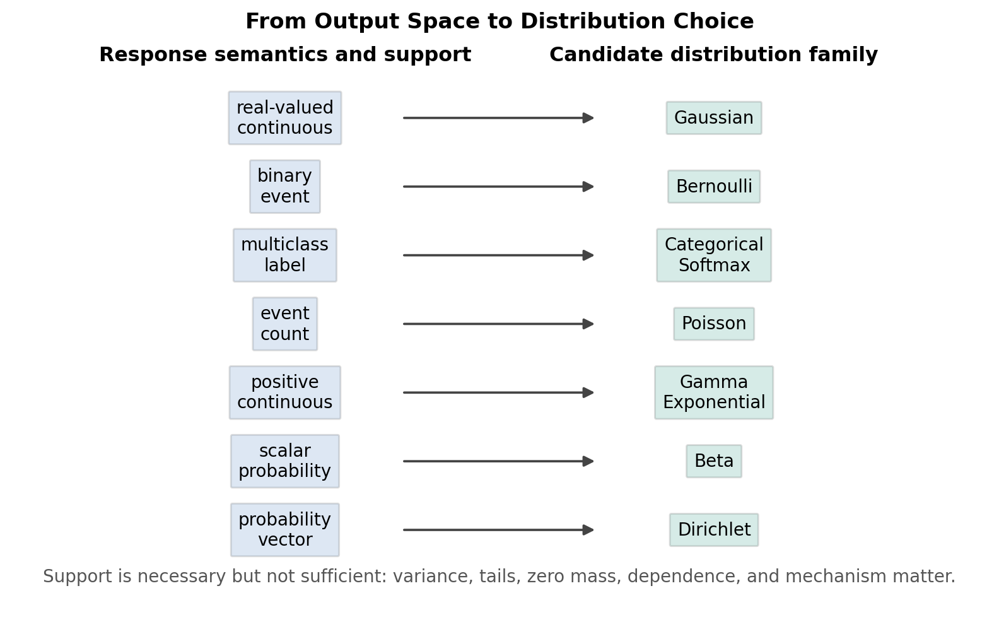

# Lecture 4: Perceptron, Exponential Family, and Generalized Linear Models

Canonical reference: [Stanford CS229 supervised learning notes](https://cs229.stanford.edu/notes_archive/cs229-notes1.pdf), especially the sections on Perceptron, exponential family, generalized linear models, and softmax regression.

| Navigation | Focus |
| ---------- | ----- |
| [1. Core Question](#1-core-question) | 从 response semantics 到 parameter learning 的完整建模链条 |
| [2. Perceptron](#2-perceptron-as-a-non-probabilistic-linear-classifier) | 非概率 linear classifier 和 mistake-driven update |
| [3. Perceptron Before GLM](#3-why-perceptron-is-discussed-before-glm) | 与 logistic regression 的同分数、不同语义对比 |
| [4. Newton Bridge](#4-newton-method-as-an-optimization-bridge) | 从 Lecture 3 的优化工具过渡到 GLM likelihood |
| [5. Exponential Family Motivation](#5-why-exponential-family-is-introduced) | 为什么需要统一概率族 |
| [6. Exponential Family Anatomy](#6-anatomy-of-the-exponential-family) | natural parameter, sufficient statistic, log partition, base measure |
| [Interlude A](#conceptual-interlude-a-from-output-space-to-distribution-and-response-function) | output semantics, distribution choice, response function |
| [7. Log Partition](#7-log-partition-function-as-the-mathematical-engine) | mean, covariance, convexity identities |
| [Interlude B](#mathematical-interlude-b-why-exponential-family-mle-is-convex-friendly) | MLE concavity and NLL convexity |
| [8. GLM Components](#8-glm-three-components-and-official-assumptions) | GLM 三个组件和 link/response convention |
| [9. GLM Workflow](#9-the-complete-glm-modeling-workflow) | 从任务语义到 likelihood 的完整 recipe |
| [10. Hypothesis Function](#10-deep-meaning-of-the-hypothesis-function) | $h_\theta(x)$ 作为 conditional mean |
| [11. Gaussian GLM](#11-gaussian-glm) | fixed-variance Gaussian 到 squared loss |
| [12. Bernoulli GLM](#12-bernoulli-glm) | Bernoulli 到 sigmoid |
| [13. Poisson GLM](#13-poisson-glm) | count data 到 exponential response |
| [14. Multinomial Form](#14-multinomial-exponential-family-form) | reference class 和 one-hot sufficient statistic |
| [15. Softmax Response](#15-softmax-response-function) | coupled multiclass probabilities |
| [16. Softmax Cross-Entropy](#16-softmax-likelihood-and-cross-entropy) | likelihood, NLL, gradient |
| [17. Reliability View](#17-reliability-view) | GLM 假设诊断和失效模式 |
| [18. Connection to PS1](#18-connection-to-ps1) | PS1 gate 的概念前置 |
| [19. Takeaways](#19-takeaways) | 从算法集合到模型构造系统 |

## 1. Core Question

Lecture 4 的核心问题不是“再学几个模型”，而是：给定一个 supervised learning 任务，怎样从输出变量的语义出发，构造一个合法、可解释、可优化、可诊断的 conditional model？

完整 pipeline 是：

```text
response semantics
-> conditional distribution
-> exponential-family representation
-> natural parameter
-> linear predictor
-> response function
-> likelihood
-> parameter learning
```

也就是说，先问 $y$ 是什么：real-valued measurement、binary event、multiclass label、count、positive duration、probability，还是 probability vector。然后选择一个支持集、mean-variance behavior、tail behavior 和数据生成机制都合理的 conditional distribution。若这个分布属于 exponential family，就可以通过 natural parameter $\eta$ 和 log-partition function $a(\eta)$ 得到统一的 response function 和 likelihood geometry。

两个容易混淆的点必须先分清：

* Multiclass classification 对应 categorical/multinomial distribution，不是 Poisson。
* Poisson 用于 count data，例如单位时间内事件次数、缺陷数、访问次数或事故数。

Newton method 是 Lecture 3 到 Lecture 4 的桥：它解释 logistic regression 和 GLM likelihood 如何用 curvature 加速优化。但 Lecture 4 的主线不是 Newton；主线是 Perceptron、exponential family、GLM，以及 multinomial/softmax model 的构造逻辑。

## 2. Perceptron as a Non-probabilistic Linear Classifier

Perceptron 使用 signed labels：

```math
y\in\{-1,+1\}
```

模型用一个 linear score 判断类别：

```math
\hat y=\mathrm{sign}(\theta^Tx)
```

这里 $\theta$ 是 decision boundary 的 normal vector。边界是所有满足 $\theta^Tx=0$ 的点；$\theta$ 的方向指向 score 为正的一侧，$\theta$ 的长度影响 score scale，但不改变边界方向。

对单个样本 $(x,y)$，如果它被正确分类，就应有 $y\theta^Tx>0$。Misclassification condition 是：

```math
y\theta^Tx\leq0
```

Perceptron 在犯错时更新：

```math
\theta_{\mathrm{new}}=\theta+\alpha yx
```

这个 update 的核心性质是：它必然提高当前样本的 signed score。证明如下：

```math
y\theta_{\mathrm{new}}^Tx
=
y(\theta+\alpha yx)^Tx
```

```math
=
y\theta^Tx+\alpha y^2x^Tx
```

```math
=
y\theta^Tx+\alpha\|x\|_2^2
```

因为 $y^2=1$ 且 $\alpha>0$，当前样本的 signed score 增加了 $\alpha\|x\|_2^2$。

这个公式给出几何解释：

* 若 $y=+1$ 且当前被错分，update 把 $\theta$ 往 $x$ 的方向拉，使正类样本更可能落在 positive side。
* 若 $y=-1$ 且当前被错分，update 把 $\theta$ 往 $-x$ 的方向拉，使负类样本更可能落在 negative side。
* 在二维中，$\theta$ 的旋转会带动 boundary $\theta^Tx=0$ 旋转，因为 boundary 总是垂直于 $\theta$。
* Perceptron 是 mistake-driven，不是 likelihood-driven；它没有默认的 calibrated probability interpretation。


## 3. Why Perceptron Is Discussed Before GLM

Perceptron 和 logistic regression 可以共享同一个 linear score $\theta^Tx$，也可以产生同一个 linear decision boundary $\theta^Tx=0$。但它们代表两种完全不同的建模哲学：Perceptron 直接修正 classification mistakes；logistic regression 先建模 $P(y=1\mid x;\theta)$，再通过 Bernoulli likelihood 学习参数。

| Aspect | Perceptron | Logistic regression |
| ------ | ---------- | ------------------- |
| Label convention | 常用 $y\in\{-1,+1\}$ | 常用 $y\in\{0,1\}$ |
| Linear score | $\theta^Tx$ | $\theta^Tx$ |
| Response function | hard sign or step | sigmoid probability |
| Prediction | $\hat y=\mathrm{sign}(\theta^Tx)$ | $P(y=1\mid x;\theta)=g(\theta^Tx)$ |
| Loss or criterion | mistake-driven update | Bernoulli NLL / cross-entropy |
| Update behavior | 只在错分时更新 | 每个样本按 probability residual 贡献 gradient |
| Probability interpretation | 默认没有 | 有 conditional probability interpretation |
| Calibration | 不保证 calibrated | 可做 calibration diagnostics |
| Convergence assumption | separable data 下有限犯错界 | convex objective；separation 时 MLE 可能发散 |
| Noise behavior | label noise 下可能持续震荡 | 可加 regularization 并分析 likelihood |

因此，Perceptron 放在 GLM 之前的价值是：它先展示 linear score 与 decision boundary geometry，再让 logistic regression 和 Bernoulli GLM 说明“同一个 score 怎样被概率化”。


## 4. Newton Method as an Optimization Bridge

Newton method 的 multivariate optimization update 是：

```math
\theta_{t+1}
=
\theta_t-H(\theta_t)^{-1}\nabla J(\theta_t)
```

把优化问题写成 root finding，会更清楚。最优点满足 first-order condition：

```math
\nabla J(\theta)=0
```

令 $F(\theta)=\nabla J(\theta)$，Newton method 就是在当前点用一阶线性近似解 $F(\theta)=0$。因为 $F$ 的 Jacobian 是 Hessian，所以得到上面的 update。

对 quadratic objective：

```math
J(\theta)=\frac12\theta^TA\theta-b^T\theta+c
```

若 $A=A^T$ 且 $A$ nonsingular，则：

```math
\nabla J(\theta)=A\theta-b
```

```math
H(\theta)=A
```

Newton update 为：

```math
\theta_{t+1}
=
\theta_t-A^{-1}(A\theta_t-b)
```

```math
=
\theta_t-\theta_t+A^{-1}b
```

```math
=
A^{-1}b
```

最优解满足 $A\theta^\star=b$，所以 $\theta_{t+1}=\theta^\star$。因此，对 exact quadratic 且 Hessian 可逆的问题，Newton method one-step convergence。

Least squares 是这个结论的直接例子。令：

```math
J(\theta)=\frac12\|X\theta-y\|_2^2
```

则：

```math
\nabla J(\theta)=X^T(X\theta-y)
```

```math
H=X^TX
```

如果 $X^TX$ invertible，Newton update 一步到达：

```math
\theta^\star=(X^TX)^{-1}X^Ty
```

这解释了 normal equation 与 Newton method 的关系：least squares 的 curvature 是 constant，所以 Newton 不需要迭代来更新 curvature。

实践中要谨慎：

* Singular Hessian：例如 feature rank deficient，$H^{-1}$ 不存在，需要 regularization、pseudoinverse 或重新设计 features。
* Ill-conditioned Hessian：数值误差会放大，直接求逆不稳定，应解线性系统并考虑 damping。
* Indefinite Hessian：对 minimization，Newton step 可能朝非下降方向走，需要 modified Newton 或 trust-region。
* Initialization：Newton 是局部二阶方法，离 optimum 太远时 quadratic approximation 可能误导。
* Computation：每步构造和分解 Hessian 成本高，large-scale GLM 常用 gradient、stochastic 或 quasi-Newton。
* Separation：logistic/softmax 在 separable data 上可能没有 finite MLE，Newton 可能追逐越来越大的参数。
* Damping and line search：实际 update 常写成 $\theta_{t+1}=\theta_t-\gamma_tH^{-1}\nabla J$，其中 $0<\gamma_t\leq1$。


## 5. Why Exponential Family Is Introduced

Exponential family 的 canonical form 是：

```math
p(y;\eta)=b(y)\exp\left(\eta^TT(y)-a(\eta)\right)
```

它不是单纯为了“形式漂亮”，而是同时统一了五件事：

* probability representation：Gaussian、Bernoulli、Poisson、multinomial 等可以用同一种代数结构表示；
* sufficient statistics：数据通过 $T(y)$ 进入 likelihood；
* moment identities：$a(\eta)$ 的导数直接给出 mean 和 covariance；
* convex likelihood geometry：log-likelihood 对 natural parameter 通常是 concave；
* GLM construction：把 $\eta$ 设成 linear predictor，就得到 distribution-derived response function。

因此，exponential family 是从“单个算法公式”到“系统建模 recipe”的关键桥梁。

## 6. Anatomy of the Exponential Family

| Component | Symbol | Meaning | Modeling role |
| --------- | ------ | ------- | ------------- |
| Natural parameter | $\eta$ | 控制分布形状的 canonical parameter | GLM 中通常由 linear predictor 给出 |
| Sufficient statistic | $T(y)$ | 数据进入 likelihood 的统计量 | 决定被模型直接匹配的 empirical summary |
| Log-partition function | $a(\eta)$ | normalization 的对数 | 生成 moments 并决定 convex geometry |
| Base measure | $b(y)$ | 与 $\eta$ 无关的部分 | 保留 support 和 reference weighting |
| Dispersion parameter | optional | 控制 scale 或 variance | 有些 GLM 推广会显式加入 |

$T(y)$ 不总是 $y$。它是分布族需要从 observation 中提取的 sufficient statistic，而不是“标签本身”的同义词。

| Distribution setting | Common sufficient statistic | Why |
| -------------------- | --------------------------- | --- |
| Bernoulli | $T(y)=y$ | 单个 binary outcome 的成功次数就是信息 |
| Fixed-variance Gaussian | $T(y)=y$ | 已知方差时只需估计 mean |
| Unknown-variance Gaussian | $T(y)=(y,y^2)$ | mean 和 second moment 都携带参数信息 |
| Multinomial / categorical | indicator vector | 每一类的 one-hot count 是信息 |

对 iid observations，factorization 使全部样本通过 sufficient statistic 的和进入 natural-parameter-dependent likelihood：

```math
\sum_{i=1}^{m}T(y^{(i)})
```

这就是为什么 exponential family 会自然连接到 MLE：重复观测把 sample evidence 聚合成一个 statistic，而不是保留每个 $y^{(i)}$ 的全部细节。


---

## Conceptual Interlude A: From Output Space to Distribution and Response Function

---

## A. Output Semantics Before Algorithm Choice

先定义两个常用支持集：

```math
\mathbb R_{>0}=(0,\infty)
```

```math
\mathbb R_{\geq0}=[0,\infty)
```

Output semantics 先于算法选择。下面的表不是机械配对，而是建模起点：

| Response type | Support | Candidate distribution | Typical response meaning | Key caveat |
| ------------- | ------- | ---------------------- | ------------------------ | ---------- |
| Real-valued continuous | $\mathbb R$ | Gaussian | 测量值、残差近似对称的连续量 | heavy tails 或 heteroscedasticity 会破坏 squared-loss 解释 |
| Binary | $\{0,1\}$ | Bernoulli | event happens or not | calibration 和 class imbalance 需要诊断 |
| Multiclass | $\{1,\ldots,K\}$ | categorical / multinomial | 单个样本属于一个类别 | 不是 Poisson；类别概率必须 jointly normalized |
| Counts | $\{0,1,2,\ldots\}$ | Poisson | 固定 exposure 下的事件次数 | Poisson implies mean equals variance；overdispersion 常见 |
| Positive continuous | $\mathbb R_{>0}$ | Gamma / Exponential | waiting time、duration、amount | skewness 和 tail behavior 很重要 |
| Scalar probability | $(0,1)$ | Beta | rate、proportion、uncertain probability | boundary mass at $0$ or $1$ 需单独处理 |
| Probability vector | simplex | Dirichlet | category probability vector | components dependent because sum to one |

Multiclass 不对应 Poisson。Poisson 的随机变量是非负整数 count，类别标签虽然也可编码成整数，但整数编码没有自然的 count mechanism。把 class label 2 理解成 class label 1 的“两倍”没有意义；把 event count 2 理解成两个事件才有意义。

Support alone 不能唯一决定 distribution。选择分布还要看：

* variance structure：variance 是否随 mean 变化；
* skewness：分布是否明显偏斜；
* tails：极端值是否比 Gaussian 更常见；
* zero mass：是否有大量零值或 structural zero；
* dependence：样本是否 iid，类别是否互斥；
* mechanism：数据是否来自 arrival process、duration process、measurement noise 或 compositional normalization。

## B. Distribution Definitions

Gaussian distribution 适合 real-valued continuous response：

```math
p(y;\mu,\sigma^2)
=
\frac{1}{\sqrt{2\pi\sigma^2}}
\exp\left(
-\frac{(y-\mu)^2}{2\sigma^2}
\right)
```

Bernoulli distribution 适合 binary event：

```math
p(y;\phi)=\phi^y(1-\phi)^{1-y},
\quad y\in\{0,1\}
```

Categorical distribution 适合单个 multiclass outcome：

```math
P(Y=k;\phi)=\phi_k,
\quad
\sum_{k=1}^{K}\phi_k=1
```

Multinomial distribution 适合 $n$ 次 categorical trials 的 count vector：

```math
p(c_1,\ldots,c_K;\phi)
=
\frac{n!}{\prod_{k=1}^{K}c_k!}
\prod_{k=1}^{K}\phi_k^{c_k}
```

Poisson distribution 适合 count response：

```math
p(y;\lambda)=\frac{\lambda^ye^{-\lambda}}{y!},
\quad y\in\{0,1,2,\ldots\}
```

Exponential distribution 是 positive waiting time 的简单模型：

```math
p(y;\lambda)=\lambda e^{-\lambda y},
\quad y>0
```

Gamma distribution 是更灵活的 positive continuous model：

```math
p(y;\alpha,\beta)
=
\frac{\beta^\alpha}{\Gamma(\alpha)}
y^{\alpha-1}e^{-\beta y},
\quad y>0
```

Beta distribution 建模 scalar probability 或 proportion：

```math
p(y;\alpha,\beta)
=
\frac{\Gamma(\alpha+\beta)}
{\Gamma(\alpha)\Gamma(\beta)}
y^{\alpha-1}(1-y)^{\beta-1},
\quad 0<y<1
```

Dirichlet distribution 建模 probability vector：

```math
p(p_1,\ldots,p_K;\alpha)
=
\frac{\Gamma\left(\sum_{k=1}^{K}\alpha_k\right)}
{\prod_{k=1}^{K}\Gamma(\alpha_k)}
\prod_{k=1}^{K}p_k^{\alpha_k-1}
```

Official Lecture 4 notes explicitly derive Bernoulli, Gaussian, Poisson, and multinomial/softmax in exponential-family/GLM form. Exponential、Gamma、Beta、Dirichlet 也是重要 exponential-family members 或相关 modeling examples，但这里主要用于说明 response semantics，并不把它们全部展开为完整 GLM derivation。



## 7. Log-Partition Function as the Mathematical Engine

先定义 unnormalized normalizer：

```math
Z(\eta)=\int b(y)e^{\eta^TT(y)}dy
```

离散情形把 integral 换成 sum。Log-partition function 定义为：

```math
a(\eta)=\log Z(\eta)
```

因为：

```math
\int b(y)\exp\left(\eta^TT(y)-a(\eta)\right)dy
=
e^{-a(\eta)}Z(\eta)
=
1
```

$a(\eta)$ 正是让 distribution normalized 的那一项。

在可交换 differentiation and integration 的 regularity conditions 下：

```math
\nabla Z(\eta)
=
\int b(y)e^{\eta^TT(y)}T(y)dy
```

因此：

```math
\nabla a(\eta)
=
\frac{1}{Z(\eta)}\nabla Z(\eta)
```

```math
=
\int T(y)
\frac{b(y)e^{\eta^TT(y)}}{Z(\eta)}
dy
```

```math
=
\mathbb E_{\eta}[T(Y)]
```

再对 mean 求导。令 $\mu_T(\eta)=\mathbb E_\eta[T(Y)]$，则：

```math
\nabla^2a(\eta)
=
\nabla \mu_T(\eta)
```

更直接地，用二阶导数展开：

```math
\nabla^2a(\eta)
=
\frac{1}{Z(\eta)}
\nabla^2Z(\eta)
-
\frac{1}{Z(\eta)^2}
\nabla Z(\eta)\nabla Z(\eta)^T
```

其中：

```math
\nabla^2Z(\eta)
=
\int b(y)e^{\eta^TT(y)}T(y)T(y)^Tdy
```

代回去得到：

```math
\nabla^2a(\eta)
=
\mathbb E_\eta[T(Y)T(Y)^T]
-
\mathbb E_\eta[T(Y)]\mathbb E_\eta[T(Y)]^T
```

也就是：

```math
\nabla^2a(\eta)=\mathrm{Cov}_{\eta}(T(Y))
```

Scalar case 中：

```math
a''(\eta)=\mathrm{Var}_{\eta}(T(Y))
```

任意向量 $v$ 满足：

```math
v^T\nabla^2a(\eta)v
=
v^T\mathrm{Cov}_{\eta}(T(Y))v
=
\mathrm{Var}_{\eta}(v^TT(Y))
\geq0
```

所以：

```math
\nabla^2a(\eta)\succeq0
```

因此 $a(\eta)$ 是 convex function。这个 convexity 不是额外假设，而是 normalizing a probability distribution 的代数后果。


---

## Mathematical Interlude B: Why Exponential-Family MLE Is Convex-Friendly

---

对 iid data $y^{(1)},\ldots,y^{(m)}$，log-likelihood 为：

```math
\ell(\eta)
=
\sum_{i=1}^{m}
\log b(y^{(i)})
+
\eta^T\sum_{i=1}^{m}T(y^{(i)})
-
ma(\eta)
```

等价写成：

```math
\ell(\eta)
=
\eta^T\sum_{i=1}^{m}T(y^{(i)})
-ma(\eta)
+\sum_{i=1}^{m}\log b(y^{(i)})
```

因为 sample statistic 对 $\eta$ 是 linear，而 $\log b(y^{(i)})$ 与 $\eta$ 无关，二阶导数只来自 $-ma(\eta)$：

```math
\nabla^2\ell(\eta)
=
-m\nabla^2a(\eta)
```

由上一节 $\nabla^2a(\eta)=\mathrm{Cov}(T(Y))$：

```math
\nabla^2\ell(\eta)
=
-m\,\mathrm{Cov}(T(Y))
\preceq0
```

结论：

* log-likelihood is concave in the natural parameter；
* negative log likelihood is convex；
* MLE estimate itself 不是“concave”的对象，concavity 描述的是 objective；
* strict convexity、finite MLE 和 unique optimum 还需要 rank、identifiability、support 和 existence 条件。

在 scalar natural parameter GLM 中，设：

```math
\eta_i=\theta^Tx^{(i)}
```

单样本 NLL 忽略常数后为：

```math
J_i(\theta)=a(\eta_i)-\eta_iT(y^{(i)})
```

其 gradient 为：

```math
\nabla_\theta J_i
=
\left(a'(\eta_i)-T(y^{(i)})\right)x^{(i)}
```

其 Hessian 为：

```math
\nabla_\theta^2J_i
=
a''(\eta_i)x^{(i)}x^{(i)T}
```

利用 $a''(\eta_i)=\mathrm{Var}(T(Y^{(i)})\mid x^{(i)})$：

```math
\nabla_{\theta}^{2}J_{\mathrm{NLL}}
=
\sum_{i=1}^{m}
\mathrm{Var}\left(T(Y^{(i)})\mid x^{(i)}\right)
x^{(i)}x^{(i)T}
```

所以 GLM Hessian 可以读成 variance-weighted feature geometry：features 决定方向，conditional variance 决定每个样本对 curvature 的权重。

## 8. GLM Three Components and Official Assumptions

| Modern GLM term | CS229 assumption/design | Role |
| --------------- | ----------------------- | ---- |
| Random component | $Y$ given $x;\theta$ belongs to exponential family | conditional response distribution |
| Prediction target | $h_\theta(x)=\mathbb E[T(Y)\mid x;\theta]$ | response mean |
| Systematic component | $\eta=\theta^Tx$ | linear predictor |
| Link function | $g(\mu)=\eta$ | maps mean to linear predictor |
| Response function | $\mu=g^{-1}(\eta)$ | maps predictor to mean |

Terminology convention 很重要。许多 statistics texts 使用 $g$ 表示 link function，即 $g(\mu)=\eta$；response function 是 $g^{-1}$。CS229 notes 在一些位置把 $g$ 用作 response function，例如 logistic regression 中 $g(z)=1/(1+e^{-z})$。因此读 Lecture 4 时要看上下文：如果 $g$ 输入 linear score 并输出 mean/probability，它是 response function；如果 $g$ 输入 mean 并输出 natural parameter，它是 link function。

## 9. The Complete GLM Modeling Workflow

完整 GLM workflow：

1. Identify response semantics and support：先判断 $y$ 是 real value、binary、multiclass、count 还是 positive continuous。
2. Choose a plausible exponential-family conditional distribution：分布要匹配 support、variance behavior、tail、zero mass 和 mechanism。
3. Identify $T(y)$, $\eta$, $a(\eta)$, and $b(y)$：写出 canonical form，确认 normalized。
4. Choose a link；use canonical link when appropriate：canonical link 让 natural parameter 等于 linear predictor，通常带来简单 gradient 和 convex geometry。
5. Define the linear predictor：例如 scalar case 设 $\eta=\theta^Tx$，multiclass case 设每类 score 为 $\theta_k^Tx$。
6. Derive the response mean：用 $h_\theta(x)=\mathbb E[T(Y)\mid x;\theta]=\nabla a(\eta)$。
7. Write likelihood and NLL：把 conditional distributions 乘起来并取负对数。
8. Estimate shared parameters from all samples：所有样本共同估计同一个 $\theta$ 或 $\Theta$。
9. Predict using conditional means or probabilities：regression 输出 mean，classification 输出 probability 或 thresholded label。
10. Diagnose misspecification and reliability：检查 support mismatch、calibration、overdispersion、dependence、separation 和 shift。

Frequentist MLE 的含义也要清楚：

* $\theta$ 是 fixed but unknown parameter；
* data 是 random，因为它来自 sampling/data-generating process；
* $\hat\theta(D)$ 是 estimator，它随 dataset $D$ 改变；
* training 选择让 observed sample 最 plausible 的 parameter，而不是把 $\theta$ 当作随机变量求 posterior。


## 10. Deep Meaning of the Hypothesis Function

在 GLM 中，hypothesis function 不是随手选的 nonlinear curve，而是 conditional mean：

```math
h_\theta(x)
=
\mathbb E[T(Y)\mid x;\theta]
```

因为 exponential family 有 moment identity：

```math
\mathbb E[T(Y)\mid x;\theta]
=
\nabla a(\eta)
```

在 canonical GLM 中 $\eta=\theta^Tx$，所以：

```math
h_\theta(x)
=
\mathbb E[T(Y)\mid x;\theta]
=
\nabla a(\eta)
=
\nabla a(\theta^Tx)
```

这说明：

* $h_\theta(x)$ 不是 parameter estimate；parameter estimate 是 $\hat\theta$。
* $h_\theta(x)$ 是当前 parameter 定义的 conditional distribution 下的 mean。
* $\theta$ 通过 likelihood 被估计，而不是直接等于 prediction。
* response function 把 linear natural parameter 映射回合法 output space，例如 $(0,1)$、$\mathbb R_{\geq0}$ 或 simplex。

它和 neural-network activation functions 有表面相似性：都是 nonlinear map。但 GLM response function 来自 distributional structure 和 link function；neural-network activation 不一定是 probabilistic inverse-link，也不一定定义 normalized likelihood。

## 11. Gaussian GLM

采用 official fixed-variance derivation，令 variance 为 $1$。Gaussian density：

```math
p(y;\mu)
=
\frac{1}{\sqrt{2\pi}}
\exp\left(-\frac12(y-\mu)^2\right)
```

展开：

```math
p(y;\mu)
=
\frac{1}{\sqrt{2\pi}}
\exp\left(-\frac12y^2+\mu y-\frac12\mu^2\right)
```

写成 exponential-family form：

```math
p(y;\eta)=b(y)\exp\left(\eta T(y)-a(\eta)\right)
```

其中：

```math
\eta=\mu
```

```math
T(y)=y
```

```math
a(\eta)=\frac{\eta^2}{2}
```

```math
b(y)=\frac{1}{\sqrt{2\pi}}\exp\left(-\frac{y^2}{2}\right)
```

Moment identity 给出：

```math
h_\theta(x)
=
\mathbb E[Y\mid x;\theta]
=
a'(\eta)
=
\eta
```

canonical link 设 $\eta=\theta^Tx$，所以：

```math
h_\theta(x)=\theta^Tx
```

Gaussian log likelihood 忽略与 $\theta$ 无关的常数后等价于：

```math
-\frac12\sum_{i=1}^{m}
\left(y^{(i)}-\theta^Tx^{(i)}\right)^2
```

因此 maximizing Gaussian likelihood 等价于 minimizing squared loss。Squared loss 不是任意选择；它是 fixed-variance Gaussian conditional model 的 NLL。

## 12. Bernoulli GLM

Bernoulli distribution：

```math
p(y;\phi)=\phi^y(1-\phi)^{1-y},
\quad y\in\{0,1\}
```

先取 log 并整理 exponent：

```math
p(y;\phi)
=
\exp\left(y\log\phi+(1-y)\log(1-\phi)\right)
```

```math
=
\exp\left(
y\log\frac{\phi}{1-\phi}
+
\log(1-\phi)
\right)
```

与 exponential-family form 对比：

```math
p(y;\eta)=b(y)\exp\left(\eta T(y)-a(\eta)\right)
```

得到：

```math
T(y)=y
```

```math
\eta=\log\frac{\phi}{1-\phi}
```

```math
b(y)=1
```

为了得到 $a(\eta)$，先解出 $\phi$。从：

```math
\eta=\log\frac{\phi}{1-\phi}
```

指数化：

```math
e^\eta=\frac{\phi}{1-\phi}
```

整理：

```math
e^\eta(1-\phi)=\phi
```

```math
e^\eta=\phi(1+e^\eta)
```

所以：

```math
\phi=\frac{e^\eta}{1+e^\eta}
=
\frac{1}{1+e^{-\eta}}
```

同时：

```math
1-\phi=\frac{1}{1+e^\eta}
```

因为 exponential-family form 中 $\log(1-\phi)=-a(\eta)$，所以：

```math
a(\eta)=\log(1+e^\eta)
```

Moment identity 给出：

```math
h_\theta(x)
=
\mathbb E[Y\mid x;\theta]
=
a'(\eta)
=
\frac{e^\eta}{1+e^\eta}
```

canonical link 设 $\eta=\theta^Tx$，得到：

```math
h_\theta(x)=\frac{1}{1+e^{-\theta^Tx}}
```

所以 sigmoid 不是随意画出的 S-curve，而是 Bernoulli exponential-family representation 加 canonical linear predictor 的必然结果。

## 13. Poisson GLM

Poisson distribution：

```math
p(y;\lambda)=\frac{\lambda^ye^{-\lambda}}{y!}
```

其中 $y\in\{0,1,2,\ldots\}$，$\lambda>0$ 是 rate 或 mean count。整理为：

```math
p(y;\lambda)
=
\frac{1}{y!}
\exp\left(y\log\lambda-\lambda\right)
```

设：

```math
\eta=\log\lambda
```

则 $\lambda=e^\eta$，所以：

```math
p(y;\eta)
=
\frac{1}{y!}
\exp\left(y\eta-e^\eta\right)
```

因此：

```math
T(y)=y
```

```math
a(\eta)=e^\eta
```

```math
b(y)=\frac{1}{y!}
```

Moment identity：

```math
h_\theta(x)
=
\mathbb E[Y\mid x;\theta]
=
a'(\eta)
=
e^\eta
```

canonical link 设 $\eta=\theta^Tx$，于是：

```math
h_\theta(x)=\mathbb E[Y\mid x;\theta]=e^{\theta^Tx}
```

这保证 prediction 是 positive count-rate。注意 prediction 是 expected count/rate，不是必须输出整数；实际 observed $Y$ 仍是非负整数随机变量。


## 14. Multinomial Exponential-Family Form

对 $K$ 类 categorical outcome，使用 $K-1$ 个 independent probability parameters，并把第 $K$ 类作为 reference class。令：

```math
\phi_K=1-\sum_{k=1}^{K-1}\phi_k
```

定义 sufficient statistic：

```math
(T(y))_k=\mathbf1\{y=k\},
\quad k=1,\ldots,K-1
```

它的 expectation 是 class probability：

```math
\mathbb E[(T(Y))_k]=P(Y=k)=\phi_k
```

Categorical PMF 可以写成：

```math
p(y;\phi)
=
\prod_{k=1}^{K}\phi_k^{\mathbf1\{y=k\}}
```

把 reference class 拆出来：

```math
p(y;\phi)
=
\phi_K
\prod_{k=1}^{K-1}
\left(\frac{\phi_k}{\phi_K}\right)^{\mathbf1\{y=k\}}
```

取 exponential form：

```math
p(y;\phi)
=
\exp\left(
\sum_{k=1}^{K-1}\mathbf1\{y=k\}
\log\frac{\phi_k}{\phi_K}
+
\log\phi_K
\right)
```

因此 natural parameters 是 log odds against the reference class：

```math
\eta_k=\log\frac{\phi_k}{\phi_K},
\quad k=1,\ldots,K-1
```

指数化并归一化：

```math
e^{\eta_k}=\frac{\phi_k}{\phi_K}
```

```math
\phi_k=e^{\eta_k}\phi_K
```

利用 $\sum_{k=1}^{K}\phi_k=1$：

```math
\phi_K
\sum_{k=1}^{K-1}e^{\eta_k}\phi_K
=
1
```

```math
\phi_K
=
\frac{1}{1+\sum_{j=1}^{K-1}e^{\eta_j}}
```

所以：

```math
\phi_k
=
\frac{e^{\eta_k}}
{1+\sum_{j=1}^{K-1}e^{\eta_j}},
\quad k=1,\ldots,K-1
```

这就是 reference-class parameterization 下 softmax 的来源。

## 15. Softmax Response Function

若为每个 class 定义 linear score：

```math
s_k(x)=\theta_k^Tx
```

则 symmetric softmax response 是：

```math
p(y=k\mid x;\Theta)
=
\frac{\exp(\theta_k^Tx)}
{\sum_{j=1}^{K}\exp(\theta_j^Tx)}
```

解释：

* 每个 $\theta_k$ 是 class-specific linear score direction。
* 所有 scores 被 jointly normalized；一个 class 的 probability 上升会挤压其他 class。
* 参数是 relative，不是 absolute；只有 score differences 影响概率。
* 给所有 class parameter 加同一个 vector $v$，即 $\theta_k'=\theta_k+v$，所有 score 同时增加 $v^Tx$，分子分母同乘同一因子，probability 不变。
* Reference-class parameterization 通过固定一个 class 的 parameter，例如 $\theta_K=0$，解决 identifiability。

Binary reduction 也可以直接证明。对 $K=2$：

```math
p(y=1\mid x)
=
\frac{\exp(\theta_1^Tx)}
{\exp(\theta_1^Tx)+\exp(\theta_2^Tx)}
```

分子分母同时除以 $\exp(\theta_1^Tx)$：

```math
p(y=1\mid x)
=
\frac{1}
{1+\exp(\theta_2^Tx-\theta_1^Tx)}
```

整理：

```math
p(y=1\mid x)
=
\frac{1}
{1+\exp\left(-(\theta_1-\theta_2)^Tx\right)}
```

因此 binary softmax 等价于 logistic regression with parameter difference $\theta_1-\theta_2$。

Softmax 不是 independent one-vs-rest logistic regression。One-vs-rest 会训练 $K$ 个 binary probability models，它们的 outputs 一般不保证 sum to one；softmax 是一个 joint multinomial conditional model，概率从定义上互相耦合并归一化。


## 16. Softmax Likelihood and Cross-Entropy

定义 one-hot target：

```math
t_{ik}=\mathbf1\{y^{(i)}=k\}
```

记：

```math
p_{ik}=p(y=k\mid x^{(i)};\Theta)
```

Likelihood 是：

```math
L(\Theta)
=
\prod_{i=1}^{m}
\prod_{k=1}^{K}
p_{ik}^{t_{ik}}
```

Log-likelihood：

```math
\ell(\Theta)
=
\sum_{i=1}^{m}
\sum_{k=1}^{K}
t_{ik}\log p_{ik}
```

Negative log likelihood，也就是 multiclass cross-entropy：

```math
J(\Theta)
=
-\sum_{i=1}^{m}
\sum_{k=1}^{K}
t_{ik}\log p_{ik}
```

为了推导 gradient，先写单样本 loss：

```math
J_i
=
-\sum_{k=1}^{K}t_{ik}\log p_{ik}
```

由于：

```math
\log p_{ik}
=
\theta_k^Tx^{(i)}
-
\log\sum_{j=1}^{K}\exp(\theta_j^Tx^{(i)})
```

所以：

```math
J_i
=
-\sum_{k=1}^{K}t_{ik}\theta_k^Tx^{(i)}
+
\sum_{k=1}^{K}t_{ik}
\log\sum_{j=1}^{K}\exp(\theta_j^Tx^{(i)})
```

one-hot target 满足 $\sum_k t_{ik}=1$，故：

```math
J_i
=
-\sum_{k=1}^{K}t_{ik}\theta_k^Tx^{(i)}
+
\log\sum_{j=1}^{K}\exp(\theta_j^Tx^{(i)})
```

对 $\theta_r$ 求 gradient：

```math
\nabla_{\theta_r}J_i
=
-t_{ir}x^{(i)}
+
\frac{\exp(\theta_r^Tx^{(i)})}
{\sum_{j=1}^{K}\exp(\theta_j^Tx^{(i)})}
x^{(i)}
```

即：

```math
\nabla_{\theta_r}J_i
=
(p_{ir}-t_{ir})x^{(i)}
```

汇总所有 samples：

```math
\nabla_{\theta_k}J
=
\sum_{i=1}^{m}
(p_{ik}-t_{ik})x^{(i)}
```

所有 class parameters 是 jointly trained 的，因为每个 $p_{ik}$ 的 denominator 包含全部 class scores。

## 17. Reliability View

GLM 的可靠性来自两个层面：优化 objective 是否被正确求解，以及 statistical assumptions 是否适合真实数据。后一层往往更难，因为 likelihood 可以被优化得很好，但 model family 仍然 misspecified。

| Assumption | Diagnostic | Likely symptom | Mitigation |
| ---------- | ---------- | -------------- | ---------- |
| Support matches response | 检查 prediction range 和 observed $y$ | negative count、probability outside range、invalid class encoding | 换分布或 link；重定义 response |
| Correct distribution family | residual plots、PIT、posterior predictive style checks | tail errors、skew errors、systematic residual pattern | richer family、robust loss、mixture or nonparametric model |
| Correct mean-variance relation | plot residual variance against fitted mean | Poisson data overdispersed；Gaussian heteroscedastic | quasi-Poisson、negative binomial、variance modeling |
| Correct link | residual pattern vs linear predictor | probability saturation、count underfit at high rates | alternative link、feature transform |
| Sufficient linear predictor | validation error by subgroup、partial residuals | stable bias in regions of feature space | interactions、basis expansion、nonlinear model |
| iid conditional samples | time/group correlation checks | overconfident standard errors、leakage-like validation | clustered SE、mixed model、time split |
| No complete separation | inspect margins and coefficient growth | logistic/softmax coefficients diverge | regularization、Bayesian prior、feature review |
| Balanced enough classes | class-frequency and per-class metrics | rare class ignored、poor recall | class weighting、resampling、threshold policy |
| Calibration | reliability diagram, Brier score, ECE | confident wrong probabilities | calibration set、temperature scaling、regularization |
| Stable distribution | train/test shift diagnostics | likelihood good in train but poor deployment | shift monitoring、domain adaptation、robust evaluation |
| Identifiability | rank checks and invariance checks | multiple parameters yield same probabilities | constraints, reference class, regularization |
| Parameter uncertainty acceptable | standard errors, bootstrap, profile likelihood | unstable signs and wide intervals | more data, simpler model, shrinkage |

## 18. Connection to PS1

Lecture 4 completes the conceptual prerequisites for the first supervised-learning assignment gate. At this point，linear regression、locally weighted regression、logistic regression、Newton method、Perceptron、exponential family、GLM 和 softmax 的核心关系已经具备。

这里不复制 official problem statements，也不提供 official solutions。PS1 gate 接下来应进入 independent derivation attempts、implementation planning、tests 和 mistake log。

## 19. Takeaways

Lecture 4 把 supervised learning 从一组孤立算法转化为 principled model-construction system：

* Perceptron 展示 non-probabilistic linear decision geometry。
* Exponential family 提供 unified probability representation。
* Log-partition function 生成 mean、variance 和 convexity。
* GLM 把 response semantics、distribution、link、linear predictor 和 likelihood 接成一条链。
* Softmax 是 multinomial conditional model，不是多个独立 sigmoid 的拼接。
* Reliability analysis 要同时检查 support、distribution、link、feature geometry、optimization 和 deployment shift。
