# Lecture 4: Perceptron, Exponential Family, and Generalized Linear Models

Canonical reference: [Stanford CS229 supervised learning notes](https://cs229.stanford.edu/notes_archive/cs229-notes1.pdf), especially the sections on Perceptron, exponential family, generalized linear models, and softmax regression.

## Navigation

| Module | Purpose |
|---|---|
| [1. Core Question](#1-core-question) | What Lecture 4 is really trying to unify |
| [2. Perceptron](#2-perceptron-as-a-non-probabilistic-linear-classifier) | Linear classification without probabilistic modeling |
| [3. Perceptron vs GLM](#3-why-perceptron-is-discussed-before-glm) | Why linear score alone does not define a model |
| [4. Newton Bridge](#4-newton-method-as-an-optimization-bridge) | Why nonlinear likelihood models need iterative optimization |
| [5. Exponential Family Motivation](#5-why-exponential-family-is-introduced) | Why this family is introduced |
| [6. Exponential Family Anatomy](#6-anatomy-of-the-exponential-family) | What $`\eta`$, $`T(y)`$, $`a(\eta)`$, and $`b(y)`$ mean |
| [Conceptual Interlude A](#conceptual-interlude-a-from-response-space-to-probability-distribution) | How output space guides distribution choice |
| [Conceptual Interlude B](#conceptual-interlude-b-why-exponential-family-and-glm-exist) | Why the exponential-family form and GLM construction are mathematically natural |
| [7. Log-Partition Function](#7-log-partition-function-as-the-mathematical-engine) | Why $`a(\eta)`$ controls mean, variance, and convexity |
| [Mathematical Interlude B](#mathematical-interlude-b-why-exponential-family-mle-is-convex-friendly) | Why MLE/NLL has favorable geometry |
| [Conceptual Interlude C](#conceptual-interlude-c-from-random-samples-to-statistical-inference) | GLM-side statistical inference: sampling, sufficiency, parameters, and residuals |
| [8. GLM Components](#8-glm-components) | Random component, parameter scales, systematic component, link, response |
| [9. GLM Workflow](#9-the-complete-glm-modeling-workflow) | Forward conditional sampling, inverse learning, and residual interpretation |
| [10. Hypothesis Function](#10-deep-meaning-of-the-hypothesis-function) | Why $`h_\theta(x)`$ is a conditional mean |
| [11. Gaussian GLM](#11-gaussian-glm) | Real-valued regression |
| [12. Bernoulli GLM](#12-bernoulli-glm) | Binary classification |
| [13. Poisson GLM](#13-poisson-glm) | Count regression |
| [14. Multinomial Form](#14-multinomial-exponential-family-form) | Multiclass sufficient statistic |
| [15. Softmax Response](#15-softmax-response-function) | Multiclass probability model |
| [16. Softmax Cross-Entropy](#16-softmax-likelihood-and-cross-entropy) | Multiclass NLL and gradient |
| [17. Reliability View](#17-reliability-view) | Mean, variance/noise, distributional failure modes, and diagnostics |
| [18. PS1 Connection](#18-connection-to-ps1) | Assignment-gate connection |
| [19. Takeaways](#19-takeaways) | Final synthesis |
| [Fast Review Checklist](#fast-review-checklist) | Self-check questions for the lecture |
| [Concept Map Summary](#concept-map-summary) | One-page modeling map |

## 1. Core Question

Lecture 4 的核心问题不是“再学几个模型”，而是：给定一个 supervised learning 任务，怎样从输出变量的语义出发，构造一个合法、可解释、可优化、可诊断的 conditional model？

课程展开的主线是：

```text
Perceptron
-> why deterministic linear classification is limited
-> response semantics
-> conditional distribution family
-> exponential-family form
-> sufficient statistic and natural parameter
-> log-partition function
-> GLM components
-> link / inverse link
-> Bernoulli, Poisson, Gaussian, and softmax models
-> likelihood, prediction, and diagnostics
```

也就是说，Lecture 4 先从 Perceptron 说明 deterministic linear classifier 的局限，再转向 probabilistic conditional modeling。进入 GLM 后，才把随机机制、conditional distribution、sampling、likelihood、MLE、sufficient statistic、moment matching、global parameter、residual 和 uncertainty 串成一条统计推断证据链，用来解释 GLM 为什么这样建模、训练和诊断。

建模时仍然要先问 $`y`$ 是什么：real-valued measurement、binary event、multiclass label、count、positive duration、probability，还是 probability vector。然后选择一个支持集、mean-variance behavior、tail behavior 和数据生成机制都合理的 conditional distribution。若这个分布属于 exponential family，就可以通过 natural parameter $`\eta`$ 和 log-partition function $`a(\eta)`$ 得到统一的 response function 和 likelihood geometry。

两个容易混淆的点必须先分清：

* Multiclass classification 对应 categorical/multinomial distribution，不是 Poisson。
* Poisson 用于 count data，例如单位时间内事件次数、缺陷数、访问次数或事故数。

Newton method 是 Lecture 3 到 Lecture 4 的桥：它解释 logistic regression 和 GLM likelihood 如何用 curvature 加速优化。但 Lecture 4 的主线不是 Newton；主线是 Perceptron、exponential family、GLM，以及 multinomial/softmax model 的构造逻辑。

## 2. Perceptron as a Non-probabilistic Linear Classifier

Perceptron 使用 signed labels：

```math
y\in\{-1,+1\}
```

模型用一个 linear score 判断类别：

```math
\hat y=\mathrm{sign}(\theta^Tx)
```

这里 $`\theta`$ 是 decision boundary 的 normal vector。边界是所有满足 $`\theta^Tx=0`$ 的点；$`\theta`$ 的方向指向 score 为正的一侧，$`\theta`$ 的长度影响 score scale，但不改变边界方向。

对单个样本 $`(x,y)`$，如果它被正确分类，就应有 $`y\theta^Tx>0`$。Misclassification condition 是：

```math
y\theta^Tx\leq0
```

Perceptron 在犯错时更新：

```math
\theta_{\mathrm{new}}=\theta+\alpha yx
```

这个 update 的核心性质是：它必然提高当前样本的 signed score。证明如下：

```math
y\theta_{\mathrm{new}}^Tx
=
y(\theta+\alpha yx)^Tx
```

```math
=
y\theta^Tx+\alpha y^2x^Tx
```

```math
=
y\theta^Tx+\alpha\|x\|_2^2
```

因为 $`y^2=1`$ 且 $`\alpha>0`$，当前样本的 signed score 增加了 $`\alpha\|x\|_2^2`$。

这个公式给出几何解释：

* 若 $`y=+1`$ 且当前被错分，update 把 $`\theta`$ 往 $`x`$ 的方向拉，使正类样本更可能落在 positive side。
* 若 $`y=-1`$ 且当前被错分，update 把 $`\theta`$ 往 $`-x`$ 的方向拉，使负类样本更可能落在 negative side。
* 在二维中，$`\theta`$ 的旋转会带动 boundary $`\theta^Tx=0`$ 旋转，因为 boundary 总是垂直于 $`\theta`$。
* Perceptron 是 mistake-driven，不是 likelihood-driven；它没有默认的 calibrated probability interpretation。

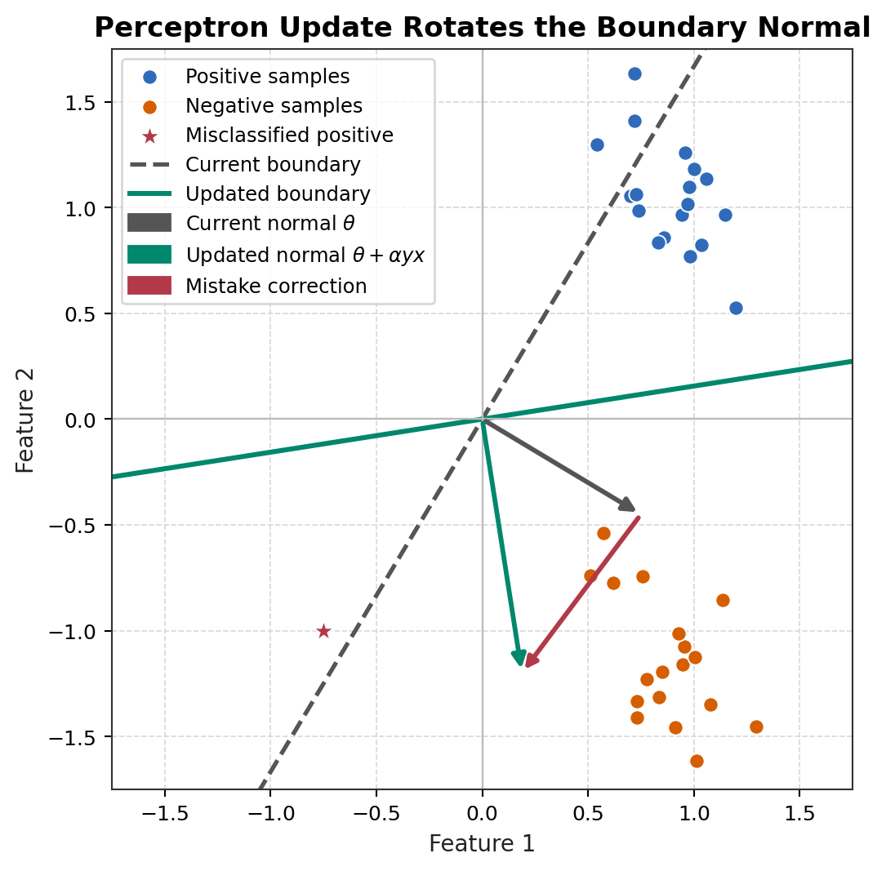

## 3. Why Perceptron Is Discussed Before GLM

Perceptron 和 logistic regression 可以共享同一个 linear score $`\theta^Tx`$，也可以产生同一个 linear decision boundary $`\theta^Tx=0`$。但它们代表两种完全不同的建模哲学：Perceptron 直接修正 classification mistakes；logistic regression 先建模 $`P(y=1\mid x;\theta)`$，再通过 Bernoulli likelihood 学习参数。

| Aspect | Perceptron | Logistic regression |
| ------ | ---------- | ------------------- |
| Label convention | 常用 $`y\in\{-1,+1\}`$ | 常用 $`y\in\{0,1\}`$ |
| Linear score | $`\theta^Tx`$ | $`\theta^Tx`$ |
| Response function | hard sign or step | sigmoid probability |
| Prediction | $`\hat y=\mathrm{sign}(\theta^Tx)`$ | $`P(y=1\mid x;\theta)=g(\theta^Tx)`$ |
| Loss or criterion | mistake-driven update | Bernoulli NLL / cross-entropy |
| Update behavior | 只在错分时更新 | 每个样本按 probability residual 贡献 gradient |
| Probability interpretation | 默认没有 | 有 conditional probability interpretation |
| Calibration | 不保证 calibrated | 可做 calibration diagnostics |
| Convergence assumption | separable data 下有限犯错界 | convex objective；separation 时 MLE 可能发散 |
| Noise behavior | label noise 下可能持续震荡 | 可加 regularization 并分析 likelihood |

因此，Perceptron 放在 GLM 之前的价值是：它先展示 linear score 与 decision boundary geometry，再让 logistic regression 和 Bernoulli GLM 说明“同一个 score 怎样被概率化”。

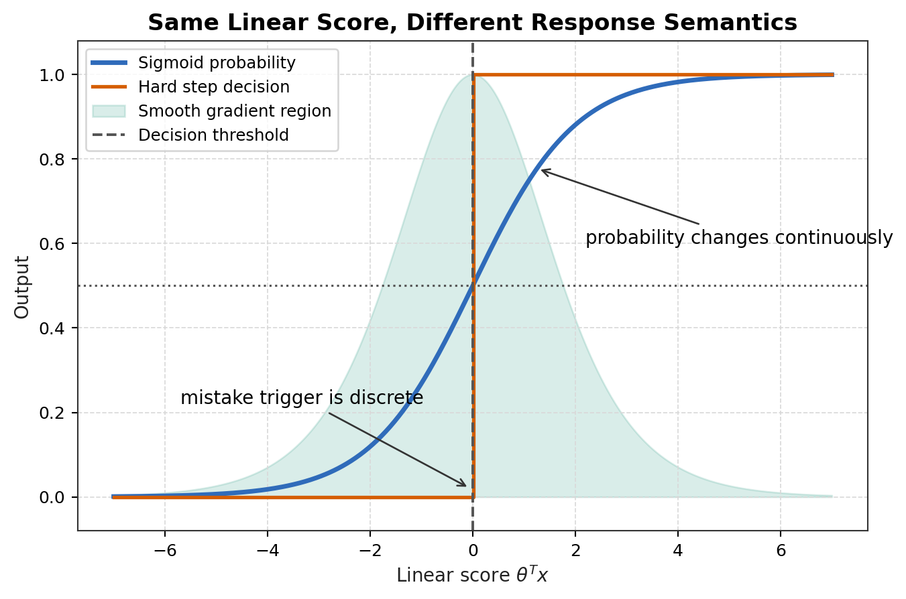

## 4. Newton Method as an Optimization Bridge

Newton method 的 multivariate optimization update 是：

```math
\theta_{t+1}
=
\theta_t-H(\theta_t)^{-1}\nabla J(\theta_t)
```

把优化问题写成 root finding，会更清楚。最优点满足 first-order condition：

```math
\nabla J(\theta)=0
```

令 $`F(\theta)=\nabla J(\theta)`$，Newton method 就是在当前点用一阶线性近似解 $`F(\theta)=0`$。因为 $`F`$ 的 Jacobian 是 Hessian，所以得到上面的 update。

对 quadratic objective：

```math
J(\theta)=\frac12\theta^TA\theta-b^T\theta+c
```

若 $`A=A^T`$ 且 $`A`$ nonsingular，则：

```math
\nabla J(\theta)=A\theta-b
```

```math
H(\theta)=A
```

Newton update 为：

```math
\theta_{t+1}
=
\theta_t-A^{-1}(A\theta_t-b)
```

```math
=
\theta_t-\theta_t+A^{-1}b
```

```math
=
A^{-1}b
```

最优解满足 $`A\theta^\star=b`$，所以 $`\theta_{t+1}=\theta^\star`$。因此，对 exact quadratic 且 Hessian 可逆的问题，Newton method one-step convergence。

Least squares 是这个结论的直接例子。令：

```math
J(\theta)=\frac12\|X\theta-y\|_2^2
```

则：

```math
\nabla J(\theta)=X^T(X\theta-y)
```

```math
H=X^TX
```

如果 $`X^TX`$ invertible，Newton update 一步到达：

```math
\theta^\star=(X^TX)^{-1}X^Ty
```

这解释了 normal equation 与 Newton method 的关系：least squares 的 curvature 是 constant，所以 Newton 不需要迭代来更新 curvature。

实践中要谨慎：

* Singular Hessian：例如 feature rank deficient，$`H^{-1}`$ 不存在，需要 regularization、pseudoinverse 或重新设计 features。
* Ill-conditioned Hessian：数值误差会放大，直接求逆不稳定，应解线性系统并考虑 damping。
* Indefinite Hessian：对 minimization，Newton step 可能朝非下降方向走，需要 modified Newton 或 trust-region。
* Initialization：Newton 是局部二阶方法，离 optimum 太远时 quadratic approximation 可能误导。
* Computation：每步构造和分解 Hessian 成本高，large-scale GLM 常用 gradient、stochastic 或 quasi-Newton。
* Separation：logistic/softmax 在 separable data 上可能没有 finite MLE，Newton 可能追逐越来越大的参数。
* Damping and line search：实际 update 常写成 $`\theta_{t+1}=\theta_t-\gamma_tH^{-1}\nabla J`$，其中 $`0<\gamma_t\leq1`$。

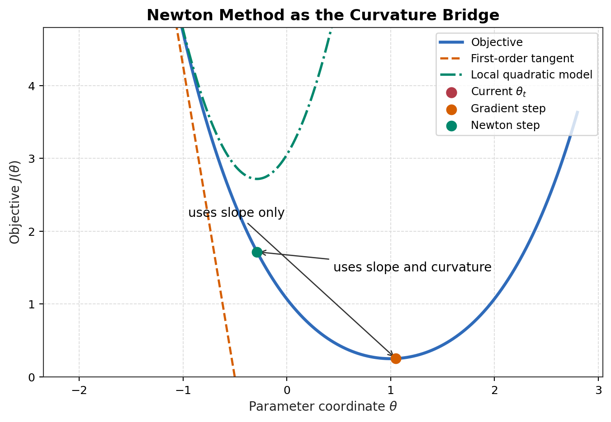

## 5. Why Exponential Family Is Introduced

Exponential family 的 canonical form 是：

```math
p(y;\eta)=b(y)\exp\left(\eta^TT(y)-a(\eta)\right)
```

它不是单纯为了“形式漂亮”，而是同时统一了五件事：

* probability representation：Gaussian、Bernoulli、Poisson、multinomial 等可以用同一种代数结构表示；
* sufficient statistics：数据通过 $`T(y)`$ 进入 likelihood；
* moment identities：$`a(\eta)`$ 的导数直接给出 mean 和 covariance；
* convex likelihood geometry：log-likelihood 对 natural parameter 通常是 concave；
* GLM construction：把 $`\eta`$ 设成 linear predictor，就得到 distribution-derived response function。

因此，exponential family 是从“单个算法公式”到“系统建模 recipe”的关键桥梁。

## 6. Anatomy of the Exponential Family

### 6.1 Intuition: what each component is doing

```math
p(y;\eta)=b(y)\exp\left(\eta^TT(y)-a(\eta)\right)
```

可以把 exponential family 先读成一个 scoring model：分布不是直接给每个 $`y`$ 随便指定概率，而是先从 $`y`$ 读出统计特征，再由参数决定这些统计特征应该被奖励还是惩罚。

| Component | Formal role | Intuitive role | What happens if it changes |
| --------- | ----------- | -------------- | -------------------------- |
| $`y`$ | observed response value | the outcome being explained | different outcomes receive different probability |
| $`T(y)`$ | sufficient statistic | the information readout extracted from $`y`$ | changes what the model can "see" in $`y`$ |
| $`\eta`$ | natural parameter | coordinate / control knob for the distribution | changes which readout patterns are rewarded |
| $`\eta^TT(y)`$ | linear coupling | compatibility score between parameter and observation | higher score means higher unnormalized probability |
| $`b(y)`$ | base measure | background geometry or counting/volume rule of outcome space | changes baseline preference over $`y`$ |
| $`a(\eta)`$ | log-partition function | normalization and moment-generating engine | keeps probabilities valid and determines mean/variance |

在 normalization 之前，每个可能的 outcome $`y`$ 先得到一个 unnormalized log-score：

```math
s_\eta(y)=\eta^TT(y)+\log b(y)
```

normalized log-probability 则是：

```math
\log p(y;\eta)=s_\eta(y)-a(\eta)
```

$`T(y)`$ 把 raw outcome $`y`$ 映射到模型关心的坐标；$`\eta`$ 给这些 statistic dimensions 赋予权重或坐标；二者的 dot product 衡量当前参数和这个 observation readout 的匹配程度。$`a(\eta)`$ 再减去所有 unnormalized mass 的 log-total，使概率能够 sum 或 integrate to one。

关键句是：$`T(y)`$ decides what the model reads from $`y`$; $`\eta`$ decides how the distribution values those readings.

### 6.2 What does "sufficient statistic" mean here?

#### A. Single-observation level

在 single-observation level，$`T(y)`$ 是 $`y`$ 进入 log probability 之前的 transformed representation。它回答的问题是：这个分布族需要从一个 observation 里读出什么信息，才能判断这个 observation 在当前参数下有多合理？

Bernoulli distribution:

```math
T(y)=y
```

模型只需要知道 event 是否发生；$`y=1`$ 和 $`y=0`$ 已经包含了单次 Bernoulli observation 对 success probability 的全部信息。

Multiclass categorical distribution:

```math
T(y)=\begin{bmatrix}\mathbf1\{y=1\}\\ \cdots\\ \mathbf1\{y=K-1\}\end{bmatrix}
```

模型通过 indicator coordinates 读取 class identity。每个 coordinate 表示某个 reference class 之外的类别是否被观察到。

Gaussian with unknown mean and variance:

```math
T(y)=\begin{bmatrix}y\\ y^2\end{bmatrix}
```

如果 mean 和 variance 都未知，模型必须同时读取 location information 和 spread information；只看 $`y`$ 本身不够，$`y^2`$ 也携带参数信息。

这就是为什么 $`T(y)`$ 不总是等于 $`y`$。它取决于这个 distribution family 的参数化需要 observation 的哪些方面。

### What does a probability model say about a random variable?

先区分 random variable 和 observed value。$`Y`$ 是观察之前的随机变量；$`y`$ 是 $`Y`$ 的一个可能取值，或者已经观察到的一次 realization。写下一个 probability model 不是在改变已经给定的 $`y`$，而是在说明：在参数 $`\mu`$ 和 $`\sigma^2`$ 下，不同可能的 $`y`$ 值有多 plausible。

```math
Y\sim\mathcal N(\mu,\sigma^2)
```

```math
p(y;\mu,\sigma^2)=\frac{1}{\sqrt{2\pi}\sigma}\exp\left(-\frac{(y-\mu)^2}{2\sigma^2}\right)
```

对 continuous variable，$`p(y;\mu,\sigma^2)`$ 是 density，不是 $`Y=y`$ 这个 exact event 的 probability。真正的 probability 来自对区间上的 density 积分：

```math
P(a\leq Y\leq b)=\int_a^b p(y;\mu,\sigma^2)dy
```

所以 Gaussian density 的意思是：如果随机变量 $`Y`$ 的分布中心是 $`\mu`$，方差是 $`\sigma^2`$，那么每个候选值 $`y`$ 会得到一个 density score。$`\mu`$ 控制 distribution centered 在哪里；$`\sigma^2`$ 控制离中心越远时 plausibility 下降得多快。

核心 exponential term 是：

```math
\exp\left(-\frac{(y-\mu)^2}{2\sigma^2}\right)
```

这项直接表达了 observation 和 center 的距离惩罚：

* 如果 $`y`$ 接近 $`\mu`$，平方距离小，density 高；
* 如果 $`y`$ 远离 $`\mu`$，平方距离大，density 低；
* 较大的 $`\sigma^2`$ 会让离 $`\mu`$ 的距离被较轻地惩罚，因此分布更宽；
* 较小的 $`\sigma^2`$ 会让离 $`\mu`$ 的距离被较重地惩罚，因此分布更集中。

### From unconditional probability to supervised conditional modeling

在 supervised learning 里，我们通常不是只建模一个 unconditional $`Y`$，而是建模给定 input 后的 conditional random variable：

```math
Y|x;\theta
```

Gaussian regression 的条件模型是：

```math
Y|x;\theta\sim\mathcal N(\theta^Tx,\sigma^2)
```

于是 observed response $`y`$ 的 conditional density 是：

```math
p(y|x;\theta)=\frac{1}{\sqrt{2\pi}\sigma}\exp\left(-\frac{(y-\theta^Tx)^2}{2\sigma^2}\right)
```

这里的 $`\theta^Tx`$ 不是说 $`Y`$ 必须等于 $`\theta^Tx`$。它说的是：在给定 $`x`$ 后，$`Y`$ 的 conditional distribution 以 $`\theta^Tx`$ 为中心。实际观察到的 $`y`$ 会根据它在这个 conditional distribution 下有多 plausible 来被评价。这就是 regression 的 probabilistic meaning：预测不是消除随机性，而是预测 conditional mean，并用 noise model 描述围绕这个 mean 的不确定性。

### What does it mean to choose a distribution and then infer parameters?

选择 distribution family 是 modeling assumption。这个选择来自 response type、problem semantics 和 noise mechanism：real-valued measurement 可能适合 Gaussian，binary event 可能适合 Bernoulli，count 可能适合 Poisson。family 选定之后，data 被用来估计这个 family 里的 parameters。

```math
D=\{(x^{(i)},y^{(i)})\}_{i=1}^{m}
```

```math
L(\theta)=\prod_{i=1}^{m}p(y^{(i)}|x^{(i)};\theta)
```

```math
\hat\theta=\underset{\theta}{\text{arg max}}\ L(\theta)
```

这不是说一个 sample 直接决定 $`\theta`$，而是说整个 dataset 选择那个让所有 observed outcomes 联合起来最 plausible 的 parameter。

Parameter estimation is inverse reasoning relative to a chosen forward conditional stochastic model.

Forward direction:

```text
Given $\theta$, the model predicts a distribution over possible $Y$ values.
```

Inverse direction:

```text
Given observed data, learning finds the $\theta$ whose predicted distributions make those observations most plausible.
```

在 linear regression 的 Gaussian version 里：

```math
Y|x;\theta\sim\mathcal N(\theta^Tx,\sigma^2)
```

likelihood 是：

```math
L(\theta)=\prod_{i=1}^{m}\frac{1}{\sqrt{2\pi}\sigma}\exp\left(-\frac{(y^{(i)}-\theta^Tx^{(i)})^2}{2\sigma^2}\right)
```

log likelihood 是：

```math
\log L(\theta)=\sum_{i=1}^{m}\left[-\log(\sqrt{2\pi}\sigma)-\frac{(y^{(i)}-\theta^Tx^{(i)})^2}{2\sigma^2}\right]
```

因为 $`\sigma^2`$ 固定时，第一项和 denominator 都不改变最优 $`\theta`$，所以：

```math
\underset{\theta}{\text{arg max}}\ \log L(\theta)
=
\underset{\theta}{\text{arg min}}\ \sum_{i=1}^{m}(y^{(i)}-\theta^Tx^{(i)})^2
```

这就是为什么 Gaussian noise plus MLE produces least squares。Squared loss 不是先验任意指定的 penalty；它是 fixed-variance Gaussian conditional model 的 maximum likelihood consequence。

Gaussian log density 展开后出现 $`y`$ 和 $`y^2`$ 并不是任意的：

```math
\log p(y;\mu,\sigma^2)
=
-\log(\sqrt{2\pi}\sigma)
-\frac{y^2}{2\sigma^2}
+\frac{\mu}{\sigma^2}y
-\frac{\mu^2}{2\sigma^2}
```

这里 $`y`$ 携带 location information，$`y^2`$ 携带 second-moment 或 spread information。如果 variance 已知，$`y^2`$ 不和 unknown mean parameter 耦合；如果 variance 未知，$`y^2`$ 会和 unknown variance parameter 耦合。因此 sufficient statistics 取决于哪些 parameters 是 unknown。

#### B. Dataset level

对 iid samples：

```math
p(y^{(1)},\dots,y^{(m)};\eta)
=
\left(\prod_{i=1}^{m}b(y^{(i)})\right)
\exp\left(\eta^T\sum_{i=1}^{m}T(y^{(i)})-ma(\eta)\right)
```

dataset 中所有和参数有关的信息都通过下面这个量进入 likelihood：

```math
\sum_{i=1}^{m}T(y^{(i)})
```

这就是 statistic 被称为 "sufficient" 的意思：一旦知道 $`\sum_i T(y^{(i)})`$，likelihood 如何依赖 $`\eta`$ 就完全确定了。raw sample 当然还可能包含其他细节，但在这个 model family 内，那些细节不会再改变 likelihood as a function of $`\eta`$。

| Model | $`T(y)`$ | Dataset sufficient statistic | What information it preserves |
| ----- | ------ | ---------------------------- | ----------------------------- |
| Bernoulli | $`y`$ | $`\sum_i y^{(i)}`$ | number of successes |
| Gaussian, known variance | $`y`$ | $`\sum_i y^{(i)}`$ | mean/location information |
| Gaussian, unknown variance | $`(y,y^2)`$ | $`(\sum_i y^{(i)},\sum_i (y^{(i)})^2)`$ | location and spread |
| Categorical | one-hot vector | class-count vector | category frequencies |

因此 Bernoulli iid data 的 sufficient statistic 是 success count；known-variance Gaussian 的 sufficient statistic 是 sum 或 sample mean；unknown-variance Gaussian 需要 sum 和 sum of squares；categorical data 则被压缩成 class counts。

### 6.3 What does it mean that $`\eta`$ is the natural coordinate?

natural parameter 被称为 "natural"，因为在这个 coordinate system 里，log density 对 statistic $`T(y)`$ 是线性的：

```math
\log p(y;\eta)=\eta^TT(y)-a(\eta)+\log b(y)
```

在这个坐标下，改变 $`\eta_j`$ 会直接改变 distribution 对 statistic component $`T_j(y)`$ 的偏好。

先看 log probability 对 $`\eta`$ 的 gradient：

```math
\nabla_\eta\log p(y;\eta)=T(y)-\nabla a(\eta)
```

而 log-partition function 的 moment identity 给出：

```math
\nabla a(\eta)=\mathbb E_\eta[T(Y)]
```

所以小幅改变 $`\Delta\eta`$ 时：

```math
\Delta\log p(y;\eta)\approx \Delta\eta^T\left(T(y)-\mathbb E_\eta[T(Y)]\right)
```

直觉上，如果 $`T_j(y)`$ 比当前 expected value 更大，增加 $`\eta_j`$ 会提高这个 outcome 的 log probability；如果 $`T_j(y)`$ 比 expected value 更小，增加 $`\eta_j`$ 会降低它的 relative probability。因此 $`\eta_j`$ 是一个 knob，会把 probability mass 往 $`T_j(y)`$ 更大的 outcomes 倾斜。

这就是把 $`\eta`$ 说成 distribution 的 coordinate/controller 的严格含义：它不是任意名字，而是在 sufficient-statistic coordinates 上调节 probability mass 的参数。

### 6.4 From distribution coordinates to supervised learning

在 unconditional distribution 里，$`\eta`$ 只是一个固定的 distribution coordinate。GLM 把这件事变成 supervised learning：先由 input $`x`$ 得到 feature-side linear predictor，再在 canonical construction 中把它作为 natural parameter。

```math
s_\theta(x)=\theta^Tx
```

```math
\eta(x)=s_\theta(x)
```

如果 natural parameter 是 vector-valued，则可以写成：

```math
\eta_k(x)=s_k(x)=\theta_k^Tx
```

因此 feature vector $`x`$ 不是直接预测 raw $`y`$。它预测的是 conditional distribution of $`Y\mid x`$ 的 natural coordinate。

```math
p(y|x;\theta)=b(y)\exp\left(\eta(x)^TT(y)-a(\eta(x))\right)
```

prediction mean 由同一个 log-partition function 决定：

```math
h_\theta(x)=\mathbb E[T(Y)|x;\theta]=\nabla a(\eta(x))
```

这就是从 statistics 到 machine learning 的桥：features 决定 distribution coordinate $`\eta(x)`$；distribution 再决定 prediction 应该是什么意思。

* Bernoulli: $`T(y)=y`$，$`\eta(x)=s_\theta(x)`$ controls log-odds，$`h_\theta(x)`$ 是 success probability。
* Poisson: $`T(y)=y`$，$`\eta(x)=s_\theta(x)`$ controls log-rate，$`h_\theta(x)`$ 是 expected count。
* Softmax: $`T(y)`$ 是 one-hot vector，$`\eta_k(x)=\theta_k^Tx`$ controls class log-odds，$`h_\theta(x)`$ 是 class-probability vector。

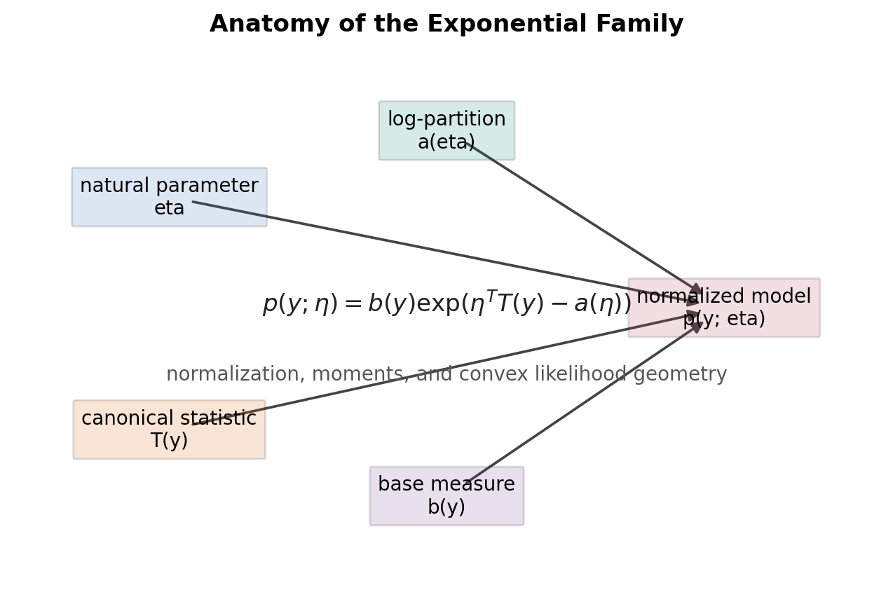

---

# Conceptual Interlude A: From Response Space to Probability Distribution

> This interlude is a modeling map. It explains how the semantic type of $`Y`$ constrains the probability distribution and therefore the GLM response function.

---

## A. The modeling question comes before the algorithm

Before choosing a loss, optimizer, or activation-looking function, define what the response variable means. The first modeling questions are:

* What kind of object is $`Y`$?
* What values can $`Y`$ legally take?
* Is $`Y`$ continuous, binary, categorical, count-valued, positive, or probability-valued?
* What uncertainty structure is plausible?
* Is variance constant, mean-dependent, heavy-tailed, bounded, or compositional?

The output space does not uniquely determine the distribution, but it rules out many invalid distributions. For example, a count target should not be modeled with unconstrained Gaussian regression when negative predictions are impossible or harmful. A Gaussian model can still be a useful approximation in some large-count regimes, but then the approximation and its failure modes must be explicit.

## B. Response support is necessary but not sufficient

A support set is the set of values a random variable can legally take.

```math
\mathbb R=(-\infty,\infty)
```

```math
\mathbb R_{>0}=(0,\infty)
```

```math
\mathbb R_{\geq0}=[0,\infty)
```

```math
\Delta^{K-1}=\left\{p\in\mathbb R^K:p_k\geq0,\ \sum_{k=1}^{K}p_k=1\right\}
```

Support tells us where predictions or random outcomes are allowed to live. But choosing a distribution also requires thinking about variance, skewness, tails, discreteness, zero-inflation, dependence, and mechanism. Two distributions can share the same support while encoding very different assumptions; Gamma and Exponential are both positive continuous families, but Gamma can express a wider range of positive skew and variance behavior.

## C. Distribution map: support, meaning, and model role

| Response type | Support | Task type | Candidate distribution | Mean | Variance pattern | GLM response | Official CS229 status |
| ------------- | ------- | --------- | ---------------------- | ---- | ---------------- | ------------ | --------------------- |
| Real-valued continuous | $`\mathbb R`$ | regression | Gaussian | $`\mu`$ | constant if variance is fixed | identity | fully derived |
| Binary | $`\{0,1\}`$ | binary classification | Bernoulli | $`\phi`$ | $`\phi(1-\phi)`$ | sigmoid | fully derived |
| Multiclass categorical | $`\{1,\dots,K\}`$ | multiclass classification | categorical / multinomial one-trial | $`\phi_k`$ | coupled categorical covariance | softmax | fully derived |
| Count-valued | $`\mathbb N_0=\{0,1,2,\dots\}`$ | count regression | Poisson | $`\lambda`$ | variance equals mean | exponential | mentioned / problem-set related / useful GLM example |
| Positive continuous | $`\mathbb R_{>0}`$ | waiting time, duration, survival-like positive response | Exponential / Gamma | positive mean | right-skewed, often mean-dependent | usually inverse or log-linked depending parameterization | mentioned as exponential-family members |
| Scalar probability | $`(0,1)`$ | rate/proportion as target | Beta | $`\alpha/(\alpha+\beta)`$ | bounded, shape-dependent | mean in $`(0,1)`$, link chosen separately | mentioned as distribution over probabilities |
| Probability vector | $`\Delta^{K-1}`$ | composition/proportion vector | Dirichlet | simplex-valued mean | negative covariance across components | simplex-valued mean | mentioned as distribution over probabilities |

The important distinction is that multiclass is not Poisson. Poisson is for count data generated by a rate mechanism. A category ID such as $`3`$ is not three events; it is a label for one mutually exclusive class.

## D. Distribution-by-distribution explanations

#### Gaussian: real-valued continuous response

**When to use.** Use Gaussian modeling when $`Y`$ is a real-valued measurement and additive, roughly symmetric noise is plausible. Examples include temperature residuals, height after controlling for features, or a continuous sensor measurement.

**Random variable.** $`Y\in\mathbb R`$ with location parameter $`\mu`$ and variance parameter $`\sigma^2>0`$.

**Density.**

```math
p(y;\mu,\sigma^2)=\frac{1}{\sqrt{2\pi\sigma^2}}\exp\left(-\frac{(y-\mu)^2}{2\sigma^2}\right)
```

**Mean and variance.**

```math
\mathbb E[Y]=\mu,\qquad \mathrm{Var}(Y)=\sigma^2
```

**GLM meaning.** In the fixed-variance canonical Gaussian GLM, the response mean is identity: $`h_\theta(x)=\theta^Tx`$. Squared loss appears because it is the Gaussian negative log likelihood up to constants.

**Failure modes.** Heavy tails, asymmetric residuals, bounded outcomes, nonconstant variance, or harmful negative predictions can make a Gaussian conditional model misleading.

#### Bernoulli: binary response

**When to use.** Use Bernoulli modeling when each observation is a yes/no event: default or no default, click or no click, disease present or absent.

**Random variable.** $`Y\in\{0,1\}`$ with success probability $`\phi\in(0,1)`$.

**PMF.**

```math
p(y;\phi)=\phi^y(1-\phi)^{1-y},\qquad y\in\{0,1\}
```

**Mean and variance.**

```math
\mathbb E[Y]=\phi,\qquad \mathrm{Var}(Y)=\phi(1-\phi)
```

**GLM meaning.** The natural parameter is log-odds. Setting log-odds equal to $`\theta^Tx`$ gives the sigmoid response and binary cross-entropy NLL.

**Failure modes.** Class imbalance, complete separation, label noise, uncalibrated probabilities, and time-varying base rates can break the practical interpretation even when the support is correct.

#### Categorical / Multinomial one-trial: multiclass response

**When to use.** Use categorical modeling when each sample belongs to exactly one of $`K`$ mutually exclusive classes, such as digit identity, species class, or topic label.

**Random variable.** $`Y\in\{1,\dots,K\}`$ with class probabilities $`\phi_1,\dots,\phi_K`$ satisfying $`\phi_k\geq0`$ and $`\sum_k\phi_k=1`$.

**PMF.**

```math
p(y=k;\phi)=\phi_k,\qquad \sum_{k=1}^{K}\phi_k=1
```

For one-hot vector $`T(Y)`$:

```math
\mathbb E[T_k(Y)]=\phi_k
```

**Covariance.**

```math
\mathrm{Cov}(T_i(Y),T_j(Y))=
\begin{cases}
\phi_i(1-\phi_i), & i=j\\
-\phi_i\phi_j, & i\neq j
\end{cases}
```

**GLM meaning.** Softmax is the response function because all class probabilities must be jointly normalized. Raising one class probability lowers available probability mass for others.

**Failure modes.** Treating class IDs as ordered numbers, using Poisson on labels, or fitting independent one-vs-rest probabilities without normalization can produce invalid multiclass probability semantics.

#### Poisson: count-valued response

**When to use.** Use Poisson modeling for nonnegative integer counts under a rate/exposure mechanism, such as arrivals per hour, defects per batch, or calls per minute.

**Random variable.** $`Y\in\mathbb N_0=\{0,1,2,\dots\}`$ with rate $`\lambda>0`$.

**PMF.**

```math
p(y;\lambda)=\frac{\lambda^y e^{-\lambda}}{y!},\qquad y\in\mathbb N_0
```

**Mean and variance.**

```math
\mathbb E[Y]=\lambda,\qquad \mathrm{Var}(Y)=\lambda
```

**GLM meaning.** The natural parameter is $`\eta=\log\lambda`$. Setting $`\eta=\theta^Tx`$ gives $`h_\theta(x)=e^{\theta^Tx}`$, a nonnegative conditional mean.

**Failure modes.** Overdispersion, underdispersion, excess zeros, varying exposure, dependence between events, and bursty arrival processes often require offsets, quasi-Poisson, negative binomial, or richer count models.

#### Exponential: positive waiting-time response

**When to use.** Use Exponential modeling for positive waiting times when a memoryless mechanism is plausible, such as the time until the next event in a simple constant-rate process.

**Random variable.** $`Y\in\mathbb R_{>0}`$ with rate $`\lambda>0`$.

**Density.**

```math
p(y;\lambda)=\lambda e^{-\lambda y},\qquad y>0
```

**Mean and variance.**

```math
\mathbb E[Y]=\frac{1}{\lambda},\qquad \mathrm{Var}(Y)=\frac{1}{\lambda^2}
```

**GLM meaning.** It shows how a positive continuous response can be tied to a rate or mean parameter. It is useful conceptually in Lecture 4 as an exponential-family member, even though the note does not develop a full Exponential GLM workflow.

**Failure modes.** Non-memoryless hazards, delayed effects, censoring, heavy tails, or a point mass near zero make a plain Exponential model too restrictive.

#### Gamma: positive continuous response

**When to use.** Use Gamma modeling for positive continuous outcomes with right skew, such as costs, durations, rainfall amounts, or biological concentrations.

**Random variable.** $`Y\in\mathbb R_{>0}`$ with shape $`\alpha>0`$ and rate $`\beta>0`$.

**Density.**

```math
p(y;\alpha,\beta)=\frac{\beta^\alpha}{\Gamma(\alpha)}y^{\alpha-1}e^{-\beta y},\qquad y>0
```

**Mean and variance.**

```math
\mathbb E[Y]=\frac{\alpha}{\beta},\qquad \mathrm{Var}(Y)=\frac{\alpha}{\beta^2}
```

**GLM meaning.** Gamma GLMs are common for positive responses where variance grows with the mean. Link choice is separate from support; log and inverse links are both used depending on parameterization and modeling goals.

**Failure modes.** Exact zeros, extreme heavy tails, multimodality, censoring, or mixtures of mechanisms can violate a single Gamma conditional model.

#### Beta: scalar probability response

**When to use.** Use Beta modeling when the response itself is a scalar probability or proportion in $`(0,1)`$, such as a conversion rate measured over a unit interval or a fractional occupancy target.

**Random variable.** $`Y\in(0,1)`$ with shape parameters $`\alpha>0`$ and $`\beta>0`$.

**Density.**

```math
p(y;\alpha,\beta)=\frac{\Gamma(\alpha+\beta)}{\Gamma(\alpha)\Gamma(\beta)}y^{\alpha-1}(1-y)^{\beta-1},\qquad 0<y<1
```

**Mean.**

```math
\mathbb E[Y]=\frac{\alpha}{\alpha+\beta}
```

**Variance.**

```math
\mathrm{Var}(Y)=\frac{\alpha\beta}{(\alpha+\beta)^2(\alpha+\beta+1)}
```

**GLM meaning.** Beta is not the usual distribution for a binary label; Bernoulli is. Beta is for random variables whose observed values are probabilities or proportions.

**Failure modes.** Exact $`0`$ or $`1`$ values, denominators with different reliability, and aggregated binomial counts can require boundary handling or a binomial model with exposure instead.

#### Dirichlet: probability-vector response

**When to use.** Use Dirichlet modeling when the response itself is a composition or probability vector, such as topic proportions, mixture weights, or normalized budget shares.

**Random variable.** $`p\in\Delta^{K-1}`$ with concentration vector $`\alpha_k>0`$.

**Density.**

```math
p(p;\alpha)=\frac{\Gamma(\sum_{k=1}^{K}\alpha_k)}{\prod_{k=1}^{K}\Gamma(\alpha_k)}\prod_{k=1}^{K}p_k^{\alpha_k-1}
```

with:

```math
p\in\Delta^{K-1}
```

**Mean.**

```math
\mathbb E[p_k]=\frac{\alpha_k}{\sum_{j=1}^{K}\alpha_j}
```

**Covariance.**

```math
\mathrm{Cov}(p_i,p_j)=
\begin{cases}
\frac{\alpha_i(\alpha_0-\alpha_i)}{\alpha_0^2(\alpha_0+1)}, & i=j\\
-\frac{\alpha_i\alpha_j}{\alpha_0^2(\alpha_0+1)}, & i\neq j
\end{cases}
```

where:

```math
\alpha_0=\sum_{k=1}^{K}\alpha_k
```

**GLM meaning.** Dirichlet models a probability vector as the response or as a distribution over probability parameters. Basic softmax classification instead models a class label whose conditional mean is a probability vector.

**Failure modes.** Structural zeros, stronger correlations than Dirichlet allows, multimodal compositions, or subcomposition effects can require logistic-normal or other compositional models.

## E. What this distribution controls inside a GLM

The chosen distribution controls:

1. legal output support;
2. conditional mean form;
3. mean-variance relationship;
4. likelihood;
5. loss function;
6. Hessian/curvature;
7. calibration interpretation;
8. failure diagnostics.

For Gaussian regression, choosing a fixed-variance Gaussian makes $`\theta^Tx`$ the conditional mean and turns MLE into squared-loss minimization. For Bernoulli classification, choosing Bernoulli makes the prediction a calibrated event probability when the model is correct and turns NLL into binary cross-entropy. For Poisson regression, choosing the distribution enforces a nonnegative mean prediction through $`e^{\theta^Tx}`$ and ties variance to the mean. For softmax classification, choosing categorical/multinomial modeling makes probabilities coupled through one normalization denominator and turns NLL into multiclass cross-entropy.

## F. Official CS229 core vs extension layer

| Distribution | Lecture 4 role |
| ------------ | -------------- |
| Gaussian | Official core derivation |
| Bernoulli | Official core derivation |
| Multinomial / Softmax | Official core derivation |
| Poisson | Mentioned and natural GLM extension / problem-set-level |
| Gamma / Exponential | Mentioned as exponential-family examples |
| Beta / Dirichlet | Mentioned as distributions over probabilities |
| Others | Outside this lecture |

The official Lecture 4 core is the derivation pattern: write a distribution in exponential-family form, identify the natural parameter, set that parameter to a linear predictor, and derive the response mean. The extension layer broadens modeling intuition without claiming that every listed family is fully developed in the lecture.

## G. Common misunderstandings

1. Multiclass is not Poisson. Multiclass labels are mutually exclusive categories; Poisson variables are nonnegative event counts.
2. Softmax is not independent one-vs-rest logistic regression. Softmax probabilities are coupled and sum to one by construction.
3. Support does not uniquely determine a distribution. Positive continuous data could be Exponential, Gamma, log-normal, Weibull, or another family depending on mechanism and tails.
4. $`h_\theta(x)`$ is not the likelihood-maximizing parameter; it is the conditional mean under the learned model.
5. The response function is not merely an arbitrary activation function. In a GLM it comes from a distributional assumption plus a link function.
6. Beta and Dirichlet are not the usual starting point for basic classification; they model probability-valued random variables or priors over probability parameters.

## H. Applying the map to real modeling problems

Use the same reasoning pattern every time: define $`Y`$, write its legal support, name the data-generating mechanism, choose a first candidate distribution, then state what would falsify that choice.

| Problem | First modeling read | Candidate start | What to check next |
| ------- | ------------------- | --------------- | ------------------ |
| Loan default | one binary event per applicant | Bernoulli / logistic GLM | calibration, separation, class imbalance, subgroup shift |
| Arrivals per hour | nonnegative event count under exposure | Poisson GLM with possible exposure offset | overdispersion, excess zeros, time dependence |
| Medical cost | positive continuous, right-skewed amount | Gamma GLM or log-normal model | exact zeros, heavy tails, mixture of patient groups |
| Time until repair | positive duration | Exponential as simple baseline, Gamma or survival model if richer | censoring, nonconstant hazard, delayed effects |
| Image class label | one mutually exclusive class | categorical / softmax GLM | rare classes, label ambiguity, calibration |
| Click-through rate as an observed proportion | probability-valued or aggregated binomial outcome | Beta if direct proportion, binomial if successes/trials known | boundary values, denominator size, heterogeneity |
| Topic mixture vector | probability vector response | Dirichlet or compositional model | structural zeros, component dependence, multimodality |

A strong answer does not say only “the label is numeric, so use regression.” It says what the number means. If the number is a class ID, use categorical/softmax; if it is a count, use a count model; if it is a positive amount, use a positive continuous model; if it is a probability, use a model whose random variable lives in $`(0,1)`$ or on the simplex.
---

Return to main Lecture 4 flow: [7. Log-Partition Function](#7-log-partition-function-as-the-mathematical-engine).

---

# Conceptual Interlude B: Why Exponential Family and GLM Exist

> This interlude answers a deeper question: not merely how to use exponential family once it is given, but why this form is mathematically natural for statistical modeling, likelihood estimation, and generalized linear modeling.

---

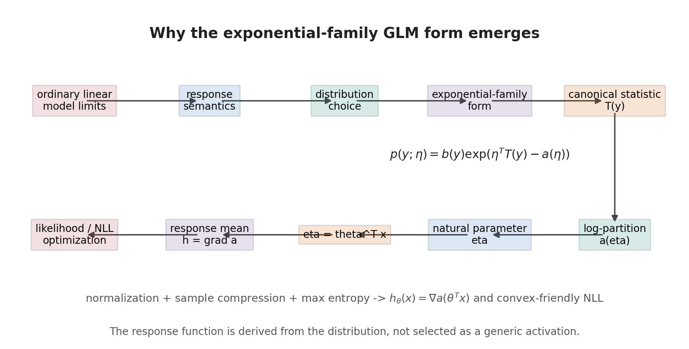

For a longer derivation, see [Why Exponential Family and GLM Exist](../../math-derivations/why-exponential-family-and-glm.md).

## A. The original problem: linear models were too narrow

Ordinary linear regression is powerful because it keeps effects interpretable and makes parameter estimation computationally tractable. The model says that the conditional mean changes linearly with features, and fixed-variance Gaussian noise turns maximum likelihood into least squares.

That success also reveals the limitation. Ordinary linear regression is built for real-valued responses with roughly Gaussian, additive, constant-variance noise. It becomes mathematically awkward or semantically wrong when the response is binary, a count, a multiclass label, positive-only, a probability vector, or heteroscedastic. A line can output negative predicted counts, probabilities outside $`[0,1]`$, or class scores that do not sum to one. The failure is not only numerical; it is a mismatch between the response space and the probability model.

## B. The GLM design compromise

GLMs keep the part of linear regression that is worth preserving: a low-dimensional linear predictor with interpretable feature effects and optimization-friendly structure. They stop forcing $`Y`$ itself to be linear. Instead, the modeler chooses a response distribution whose support and uncertainty assumptions match the task, then puts linearity on a distribution coordinate.

```math
s_\theta(x)=\theta^Tx
```

In the canonical construction:

```math
\eta(x)=s_\theta(x)
```

Prediction is then derived from the chosen distribution:

```math
h_\theta(x)=\mathbb E[T(Y)|x;\theta]
```

The compromise is therefore: keep linear structure where the probability model is algebraically linear, let the distribution determine the response function, and let likelihood determine the loss.

## C. Why sufficient statistics suggest exponential form

The exponential-family form is built to make the parameter-relevant evidence in a sample explicit:

```math
p(y;\eta)=b(y)\exp(\eta^TT(y)-a(\eta))
```

For iid data:

```math
p(y^{(1)},\dots,y^{(m)};\eta)
=
\left(\prod_{i=1}^{m}b(y^{(i)})\right)
\exp\left(\eta^T\sum_{i=1}^{m}T(y^{(i)})-ma(\eta)\right)
```

All parameter-relevant sample information enters through:

```math
\sum_{i=1}^{m}T(y^{(i)})
```

This is the likelihood-compression reason exponential family is natural. Under regularity assumptions such as fixed support and iid sampling, the Pitman-Koopman-Darmois theorem says that families with fixed-dimensional sufficient statistics for all sample sizes are essentially exponential families. The theorem should not be overstated: distributions with parameter-dependent support, such as Uniform $`(0,\theta)`$, are important exceptions.

## D. Why maximum entropy also leads to exponential form

There is also an information-theoretic route. Suppose only some expected statistics are specified, and otherwise the model should be as noncommittal as possible. In the simplest continuous case, maximize entropy:

```math
\underset{p}{\mathrm{maximize}}\ -\int p(y)\log p(y)dy
```

subject to normalization:

```math
\int p(y)dy=1
```

and moment constraints:

```math
\int p(y)T(y)dy=\mu
```

The Lagrange multiplier stationarity condition has the form:

```math
-\log p(y)-1+\lambda_0+\eta^TT(y)=0
```

Therefore:

```math
p(y)\propto \exp(\eta^TT(y))
```

With a base measure or reference weighting included, this becomes:

```math
p(y)\propto b(y)\exp(\eta^TT(y))
```

After normalization:

```math
p(y;\eta)=b(y)\exp(\eta^TT(y)-a(\eta))
```

So the same form appears both from sufficiency and from maximum entropy: if the chosen statistics are the only constraints we want to encode, the least-extra-assumption distribution is exponential-family shaped.

## E. Why the log-partition function creates the “magical” properties

The log-partition function is not an arbitrary correction term. It is the log normalizer:

```math
a(\eta)=\log\int b(y)e^{\eta^TT(y)}dy
```

Because normalization forces the total probability to equal one, derivatives of this same object generate moments:

```math
\nabla a(\eta)=\mathbb E_\eta[T(Y)]
```

and curvature:

```math
\nabla^2a(\eta)=\mathrm{Cov}_\eta(T(Y))
```

The same object that normalizes the distribution also produces the mean, variance, Fisher information, and convexity structure. This is why exponential-family likelihoods often have clean gradients and convex negative log likelihoods in natural parameters. The properties are tied together because they all come from differentiating the normalization identity, not because separate tricks happen to align.

## F. Why GLM models the natural parameter

In exponential family, the natural parameter appears linearly in the log density:

```math
\log p(y;\eta)=\eta^TT(y)-a(\eta)+\log b(y)
```

Putting linearity directly on the raw response scale would recreate ordinary linear regression; the object GLM linearizes is the natural parameter scale. First define $`s_\theta(x)=\theta^Tx`$; the canonical GLM then sets:

```math
\eta(x)=s_\theta(x)
```

Then the response is derived rather than chosen by hand:

```math
h_\theta(x)=\nabla a(\eta(x))=\nabla a(\theta^Tx)
```

This is why identity, sigmoid, exponential, and softmax response functions appear naturally. They are not generic activation functions pasted onto a linear score; they are mean maps induced by the chosen response distribution.

## G. Why this solves semantic modeling problems

Binary support leads to Bernoulli modeling and a sigmoid mean. Count support leads to Poisson modeling and an exponential nonnegative mean. Multiclass support leads to categorical or multinomial modeling and softmax probabilities. Positive continuous support suggests Gamma or Exponential-type models. Probability-vector support suggests Dirichlet-type models when the observed response itself is a random composition.

Exponential family does not magically select the correct distribution. It gives a disciplined template once the modeler chooses a plausible response distribution. The modeling burden is still semantic: define what $`Y`$ means, what values it can legally take, and what variance or tail behavior is plausible.

## H. What this does not solve

Support alone does not determine the right distribution. Iid assumptions may fail. The chosen family can be misspecified. A canonical link may be mathematically convenient but empirically wrong. A linear predictor may be too weak. MLE may not exist, as in complete separation for logistic or softmax models. Real systems may need hierarchical, Bayesian, robust, or nonparametric models.

The reliability lesson is direct: a GLM is reliable only when its assumptions are diagnosed, not merely because it is mathematically elegant. Exponential-family structure gives a powerful modeling grammar; it does not remove the need to validate support, calibration, residual patterns, identifiability, and deployment shift.

---

Return to main Lecture 4 flow: now that the origin of exponential-family form is clear, the next section proves why the log-partition function controls mean, variance, and convexity.

---

## 7. Log-Partition Function as the Mathematical Engine

先定义 unnormalized normalizer：

```math
Z(\eta)=\int b(y)e^{\eta^TT(y)}dy
```

离散情形把 integral 换成 sum。Log-partition function 定义为：

```math
a(\eta)=\log Z(\eta)
```

因为：

```math
\int b(y)\exp\left(\eta^TT(y)-a(\eta)\right)dy
=
e^{-a(\eta)}Z(\eta)
=
1
```

$`a(\eta)`$ 正是让 distribution normalized 的那一项。

在可交换 differentiation and integration 的 regularity conditions 下：

```math
\nabla Z(\eta)
=
\int b(y)e^{\eta^TT(y)}T(y)dy
```

因此：

```math
\nabla a(\eta)
=
\frac{1}{Z(\eta)}\nabla Z(\eta)
```

```math
=
\int T(y)
\frac{b(y)e^{\eta^TT(y)}}{Z(\eta)}
dy
```

```math
=
\mathbb E_{\eta}[T(Y)]
```

再对 mean 求导。令 $`\mu_T(\eta)=\mathbb E_\eta[T(Y)]`$，则：

```math
\nabla^2a(\eta)
=
\nabla \mu_T(\eta)
```

更直接地，用二阶导数展开：

```math
\nabla^2a(\eta)
=
\frac{1}{Z(\eta)}
\nabla^2Z(\eta)
-
\frac{1}{Z(\eta)^2}
\nabla Z(\eta)\nabla Z(\eta)^T
```

其中：

```math
\nabla^2Z(\eta)
=
\int b(y)e^{\eta^TT(y)}T(y)T(y)^Tdy
```

代回去得到：

```math
\nabla^2a(\eta)
=
\mathbb E_\eta[T(Y)T(Y)^T]
-
\mathbb E_\eta[T(Y)]\mathbb E_\eta[T(Y)]^T
```

也就是：

```math
\nabla^2a(\eta)=\mathrm{Cov}_{\eta}(T(Y))
```

Scalar case 中：

```math
a''(\eta)=\mathrm{Var}_{\eta}(T(Y))
```

任意向量 $`v`$ 满足：

```math
v^T\nabla^2a(\eta)v
=
v^T\mathrm{Cov}_{\eta}(T(Y))v
=
\mathrm{Var}_{\eta}(v^TT(Y))
\geq0
```

所以：

```math
\nabla^2a(\eta)\succeq0
```

因此 $`a(\eta)`$ 是 convex function。这个 convexity 不是额外假设，而是 normalizing a probability distribution 的代数后果。

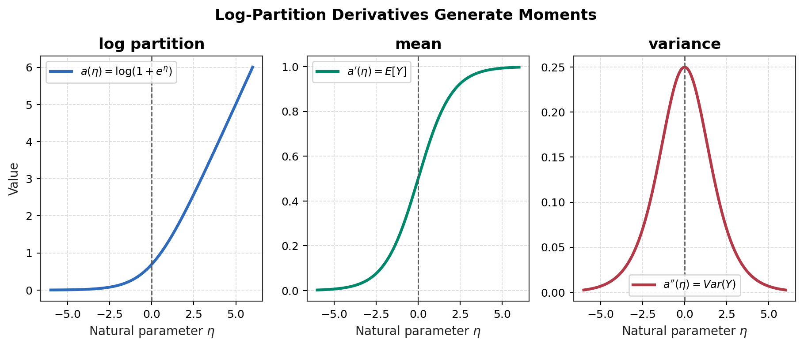

---

# Mathematical Interlude B: Why Exponential-Family MLE Is Convex-Friendly

> This interlude explains why exponential-family likelihoods have favorable optimization geometry through the log-partition function.

---

For iid data $`y^{(1)},\ldots,y^{(m)}`$, the log-likelihood is:

```math
\ell(\eta)
=
\sum_{i=1}^{m}
\log b(y^{(i)})
+
\eta^T\sum_{i=1}^{m}T(y^{(i)})
-
ma(\eta)
```

Equivalently:

```math
\ell(\eta)
=
\eta^T\sum_{i=1}^{m}T(y^{(i)})
-ma(\eta)
+\sum_{i=1}^{m}\log b(y^{(i)})
```

The sample statistic term is linear in $`\eta`$, and $`\log b(y^{(i)})`$ is independent of $`\eta`$. Therefore the second derivative comes only from $`-ma(\eta)`$:

```math
\nabla^2\ell(\eta)
=
-m\nabla^2a(\eta)
```

Using $`\nabla^2a(\eta)=\mathrm{Cov}(T(Y))`$:

```math
\nabla^2\ell(\eta)
=
-m\,\mathrm{Cov}(T(Y))
\preceq0
```

The conclusions are:

* log-likelihood is concave in the natural parameter;
* negative log likelihood is convex in the natural parameter;
* the MLE estimate itself is not a concave object, because concavity describes the objective;
* strict convexity, finite MLE, and unique optimum also need rank, identifiability, support, and existence conditions.

In a scalar natural-parameter GLM, set:

```math
\eta_i=\theta^Tx^{(i)}
```

Ignoring constants, the single-sample NLL is:

```math
J_i(\theta)=a(\eta_i)-\eta_iT(y^{(i)})
```

Its gradient is:

```math
\nabla_\theta J_i
=
\left(a'(\eta_i)-T(y^{(i)})\right)x^{(i)}
```

Its Hessian is:

```math
\nabla_\theta^2J_i
=
a''(\eta_i)x^{(i)}x^{(i)T}
```

Using $`a''(\eta_i)=\mathrm{Var}(T(Y^{(i)})\mid x^{(i)})`$:

```math
\nabla_{\theta}^{2}J_{\mathrm{NLL}}
=
\sum_{i=1}^{m}
\mathrm{Var}\left(T(Y^{(i)})\mid x^{(i)}\right)
x^{(i)}x^{(i)T}
```

So a GLM Hessian can be read as variance-weighted feature geometry: features determine directions, and conditional variance determines how much curvature each sample contributes.

---

Next: Conceptual Interlude C connects random sampling, likelihood, sufficiency, parameter hierarchy, and conditional prediction.

---

# Conceptual Interlude C: From Random Samples to Statistical Inference

> This interlude is the GLM-side statistical-inference explanation. It does not replace the course sequence; it explains how random mechanisms, conditional distributions, sampling, likelihood, MLE, sufficient statistics, moment matching, parameter hierarchy, GLM systematic components, discriminative modeling, residuals, uncertainty, and model misspecification fit together once the lecture has moved from exponential families into GLMs.

---

## A. Random Variable and Realization

The first distinction is between an unobserved random variable and a realized value. For supervised data, $`X`$ denotes the input random variable, $`x_i`$ is the observed input for sample $`i`$, $`Y_i`$ is the response random variable after conditioning on $`x_i`$, and $`y_i`$ is one realized value of $`Y_i`$.

A conditional model is therefore about the distribution of possible responses before observation:

```math
Y_i\mid x_i;\theta
```

It is not a deterministic statement that $`Y_i`$ must equal the fitted prediction. The observation $`y_i`$ is one draw from the conditional distribution selected by $`x_i`$ and the model parameter.

## B. Forward Probability Model

Start with a real but unknown stochastic mechanism. For one sample, the forward direction is:

```math
\theta^\star
\longrightarrow
\eta_i^\star
\longrightarrow
\psi_i^\star
\longrightarrow
p(Y_i\mid x_i)
\longrightarrow
y_i
```

Read the objects in that order:

* $`\theta^\star`$ is the global but unknown mechanism parameter shared across samples.
* $`x_i`$ and $`\theta^\star`$ jointly determine the local conditional-distribution parameter.
* $`\eta_i^\star`$ is the natural coordinate of sample $`i`$'s conditional distribution.
* $`\psi_i^\star`$ is the ordinary parameter of that same local distribution, such as a probability, rate, or mean.
* $`Y_i`$ is the response random variable before sampling.
* $`y_i`$ is the realized observation after sampling.

The learning direction goes the other way only statistically:

```math
\{(x_i,y_i)\}_{i=1}^n
\longrightarrow
L(\theta)
\longrightarrow
\hat\theta
```

Parameter estimation is not an algebraic inverse of random sampling. A finite sample cannot uniquely recover $`\theta^\star`$. Inference is model-relative: after choosing a distribution family and feature map, MLE searches inside that family for the parameter whose induced conditional distributions make the observed data most plausible. The chosen family is a falsifiable modeling assumption, not a theorem forced by the data.

## C. Probability Versus Likelihood

The same expression has two roles:

```math
p(y_i\mid x_i;\theta)
```

Probability or density view:

* fix $`x_i`$ and $`\theta`$;
* let the possible response value $`y`$ vary;
* describe how plausible different outcomes are before observation;
* for a discrete response, probabilities sum to one:

```math
\sum_y p(y\mid x_i;\theta)=1
```

* for a continuous response, the density integrates to one:

```math
\int p(y\mid x_i;\theta)dy=1
```

Likelihood view:

* fix the actually observed pair $`(x_i,y_i)`$;
* let candidate parameters $`\theta`$ vary;
* compare how well different parameters explain the already observed data;
* no normalization over $`\theta`$ is required;
* it is not $`P(\theta\mid\mathcal D)`$.

For a training set $`\mathcal D=\{(x_i,y_i)\}_{i=1}^n`$, conditional independence gives:

```math
L(\theta;\mathcal D)
=
\prod_{i=1}^n
p(y_i\mid x_i;\theta)
```

and:

```math
\ell(\theta)
=
\sum_{i=1}^n
\log p(y_i\mid x_i;\theta)
```

## D. Maximum Likelihood Estimation

The maximum-likelihood estimate is:

```math
\hat\theta
=
\underset{\theta}{\text{arg max}}
\,
L(\theta;\mathcal D)
```

MLE chooses the parameter that gives the observed dataset the largest likelihood inside the specified model family. It is not the probability that the parameter itself is true. It also does not prove that the family is correct. The MLE may fail to exist, fail to be unique, or lie on a boundary. Logistic perfect separation is the standard Lecture 4 example: if a linear score separates all binary labels, the unregularized logistic likelihood can increase along an unbounded coefficient direction without a finite maximizer.

## E. Why Observations Must Connect to Unknown Parameters

The parameter is unknown, and the sample is the only object we observe. To infer parameters, we must identify which features of the observed response can change likelihood comparisons between candidate parameters. Exponential families make that interface explicit.

For one observation:

```math
\log p(y;\eta)
=
\log b(y)
+
\eta^TT(y)
-
a(\eta)
```

Compare two candidate natural parameters:

```math
\log p(y;\eta_1)
-
\log p(y;\eta_2)
=
(\eta_1-\eta_2)^TT(y)
-
a(\eta_1)
+
a(\eta_2)
```

The $`\log b(y)`$ term cancels because it does not depend on the parameter. Thus the observation changes the relative likelihood of $`\eta_1`$ versus $`\eta_2`$ only through $`T(y)`$. This is why $`T(y)`$ exists: it is the parameter-relevant representation of the observed response. The natural parameter $`\eta`$ is the parameter-side weight on those statistical directions, and $`\eta^TT(y)`$ is the compatibility score between what the distribution favors and what the observation displays.

The important warning is:

```text
T(y) is not an estimator.
T(y) is the parameter-relevant representation used by an estimator.
```

## F. Canonical Statistic and Sample Sufficient Statistic

The single-observation canonical statistic is:

```math
T(Y_i)
```

After observation, the sample contributes:

```math
T(y_i)
```

For an iid sample, the random sample statistic is:

```math
S(\mathbf Y)
=
\sum_{i=1}^nT(Y_i)
```

and its realized value is:

```math
S(\mathbf y)
=
\sum_{i=1}^nT(y_i)
```

Do not collapse these objects. $`T(Y_i)`$ is a statistic of one random observation; $`T(y_i)`$ is the realized readout from one sample; $`S(\mathbf Y)`$ is the whole-sample sufficient statistic before observation; $`S(\mathbf y)`$ is the realized aggregate evidence.

### What Does "Sufficient" Actually Mean?

The intuitive question is: after a statistic has summarized the sample, is there any remaining detail in the raw sample that can still change how we compare candidate parameters? If the answer is no, the statistic is sufficient for that parameter in that model.

A statistic $`S`$ is sufficient for $`\theta`$ if the conditional distribution of the full sample given the statistic does not depend on $`\theta`$:

```math
p_\theta(\mathbf Y=\mathbf y\mid S(\mathbf Y)=s)
```

is independent of $`\theta`$. Before observing $`S`$, the sample contains parameter information. After fixing $`S=s`$, the remaining details of the raw sample no longer add information for this target parameter under this model family. Those remaining details can still contain arrangement, individual deviations, residual shape, or information about other modeling questions. "Independent of $`\theta`$" does not mean "scientifically useless"; it means no additional likelihood information for the current parameter.

Fisher-Neyman factorization gives an operational test. If:

```math
p_\theta(\mathbf y)
=
h(\mathbf y)
g_\theta^{\mathrm{fac}}(S(\mathbf y))
```

where $`h(\mathbf y)`$ may depend on the whole dataset but not on $`\theta`$, and all parameter dependence flows through $`g_\theta^{\mathrm{fac}}(S(\mathbf y))`$, then $`S`$ is sufficient. The superscript marks this as a factorization term, not the GLM link function.

For a discrete sample space:

```math
P_\theta(\mathbf Y=\mathbf y\mid S=s)
=
\frac{
h(\mathbf y)g_\theta^{\mathrm{fac}}(s)
}{
\sum_{\mathbf y':S(\mathbf y')=s}
h(\mathbf y')g_\theta^{\mathrm{fac}}(s)
}
```

The parameter factor cancels:

```math
P_\theta(\mathbf Y=\mathbf y\mid S=s)
=
\frac{
h(\mathbf y)
}{
\sum_{\mathbf y':S(\mathbf y')=s}
h(\mathbf y')
}
```

so the conditional distribution no longer contains $`\theta`$. For continuous samples, the same idea uses conditional densities rather than assigning positive probability to exact full-sample events.

Bernoulli example. If:

```math
Y_i\sim\mathrm{Bernoulli}(p)
```

then the likelihood is:

```math
L(p)
=
p^{\sum_i y_i}
(1-p)^{n-\sum_i y_i}
```

Define:

```math
S=\sum_iY_i
```

The parameter $`p`$ controls the distribution of the total number of successes. Given $`S=k`$, it does not control how those successes are arranged. Every sequence with $`k`$ ones has conditional probability:

```math
P(\mathbf Y=\mathbf y\mid S=k)
=
\frac{1}{\binom{n}{k}}
```

This expression contains no $`p`$. For example:

```text
(1,0,1,0,1)
(0,1,1,1,0)
```

both contain three successes in five trials, so they carry exactly the same likelihood information about $`p`$.

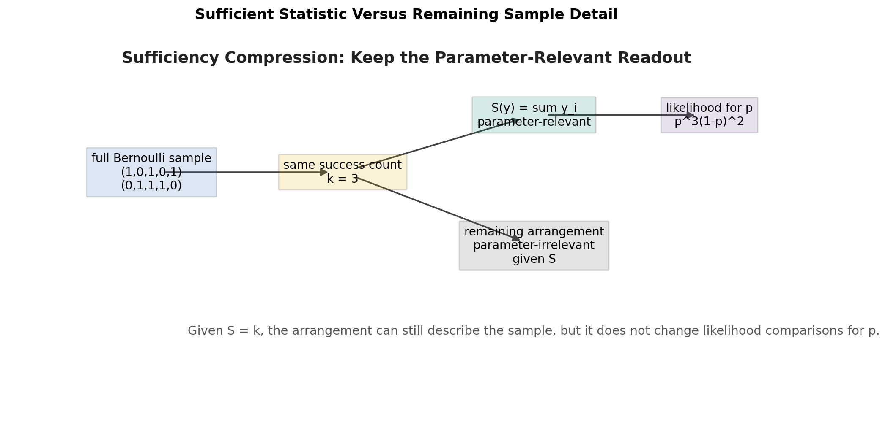

Gaussian examples. If $`Y_i\sim\mathcal N(\mu,\sigma^2)`$ iid and $`\sigma^2`$ is known, the likelihood depends on $`\mu`$ only through:

```math
\sum_i y_i
```

Thus the per-observation statistic is $`T(y)=y`$, and the sample sufficient statistic is $`\sum_i y_i`$, equivalently the sample mean. Given the sample mean, the residual arrangement around that mean no longer carries additional information about $`\mu`$ in this known-variance model. It may still matter for variance, outlier, or model-checking questions.

If both $`\mu`$ and $`\sigma^2`$ are unknown, the statistic must include first- and second-order information:

```math
T(y)
=
\begin{bmatrix}
y\\
y^2
\end{bmatrix}
```

and:

```math
S(\mathbf y)
=
\begin{bmatrix}
\sum_i y_i\\
\sum_i y_i^2
\end{bmatrix}
```

The first raw moment supplies location information. The raw second moment supplies magnitude information. The central second moment, or variance, is recovered from both:

```math
\mathrm{Var}(Y)
=
\mathbb E[Y^2]
-
\mathbb E[Y]^2
```

The $`y^2`$ term appears not merely because "variance uses squares," but because its likelihood coefficient depends on the unknown $`\sigma^2`$, so it changes the relative likelihood of candidate parameters. Raw second moment, central second moment, and regression residual square are related but distinct objects.

## G. Moment Matching

For iid observations from an exponential family:

```math
p(y;\eta)
=
b(y)
\exp\left(
\eta^TT(y)-a(\eta)
\right)
```

The log-likelihood is:

```math
\ell(\eta)
=
\eta^T\sum_iT(y_i)
-
na(\eta)
+
\sum_i\log b(y_i)
```

Therefore:

```math
\nabla_\eta\ell(\eta)
=
\sum_iT(y_i)
-
n\nabla a(\eta)
```

Using:

```math
\nabla a(\eta)
=
\mathbb E_\eta[T(Y)]
```

any finite interior MLE satisfies:

```math
\frac1n\sum_iT(y_i)
=
\mathbb E_{\hat\eta}[T(Y)]
```

The left side is the empirical statistic mean, and the right side is the model-expected statistic. MLE adjusts $`\eta`$ until the model's expected statistical structure matches the sample's observed statistical structure, when such a match is attainable. This resembles method of moments, but it is specifically the exponential-family likelihood score equation; not every MLE should be casually called GMM.

This notation distinguishes two means. The response mean is:

```math
\mu
=
\mathbb E[Y]
```

The sufficient-statistic expectation parameter is:

```math
m(\eta)
=
\mathbb E_\eta[T(Y)]
=
\nabla a(\eta)
```

Only when $`T(Y)=Y`$ do we have:

```math
m(\eta)=\mu
```

If:

```math
T(Y)
=
\begin{bmatrix}
Y\\
Y^2
\end{bmatrix}
```

then:

```math
m(\eta)
=
\begin{bmatrix}
\mathbb E[Y]\\
\mathbb E[Y^2]
\end{bmatrix}
```

so $`m(\eta)`$ is not a scalar response mean.

A shared-mean iid model and a GLM also match moments differently. In a simple iid model, all samples share one $`\eta`$, so the global empirical average $`n^{-1}\sum_iT(y_i)`$ is matched to one model expectation. In a GLM:

```math
\eta_i=x_i^T\theta
```

and each input induces its own conditional mean. The canonical scalar GLM score is:

```math
\nabla_\theta\ell(\theta)
=
\sum_i
x_i
\left(
T(y_i)
-
\mathbb E[T(Y_i)\mid x_i;\theta]
\right)
```

At an interior MLE:

```math
\sum_i x_iT(y_i)
=
\sum_i x_i\mathbb E[T(Y_i)\mid x_i;\hat\theta]
```

Thus a GLM does not use the global label mean to estimate every $`\mu_i`$. It uses all $`(x_i,y_i)`$ pairs to learn one shared $`\theta`$ so that empirical and model-expected statistics match along each feature direction.

## H. Parameter Hierarchy

For a GLM sample, the hierarchy is:

```text
global parameter theta
    +
local input x_i
    ↓
linear predictor xi_i
    ↓
natural parameter eta_i
    ↓
ordinary distribution parameter psi_i
    ↓
conditional distribution p(Y_i | x_i; theta)
    ↓
observed y_i
```

The global parameter $`\theta`$ parameterizes the map from input to distribution coordinate. The local natural parameter $`\eta_i`$ is the coordinate of sample $`i`$'s conditional distribution. The ordinary parameter $`\psi_i`$ is the probability, rate, or mean used to name that local distribution. Each sample has its own $`\eta_i`$, but all samples share one $`\theta`$.

The layers are distinct:

```math
\theta\neq\eta_i
```

In the scalar canonical construction:

```math
\eta_i=x_i^T\theta
```

For the whole dataset:

```math
\boldsymbol{\eta}=X\theta
```

Examples:

| Family | Ordinary parameter $`\psi_i`$ | Natural parameter $`\eta_i`$ | Conditional mean $`\mu_i`$ |
|---|---|---|---|
| Gaussian fixed variance | mean $`\mu_i`$ | mean coordinate | $`\mu_i`$ |
| Bernoulli | probability $`p_i`$ | log-odds | $`p_i`$ |
| Poisson | rate $`\lambda_i`$ | log-rate | $`\lambda_i`$ |

## I. Systematic Component and Link

The systematic component is the linear predictor:

```math
\xi_i=x_i^T\theta
```

A general GLM makes a transformed conditional mean linear:

```math
g(\mu_i)=\xi_i=x_i^T\theta
```

The inverse link gives the response-scale mean:

```math
\mu_i=g^{-1}(\xi_i)
```

The exponential-family natural parameter is connected to the mean by the distribution's mean-to-natural map:

```math
\eta_i=q(\mu_i)
```

Only under the canonical link:

```math
g=q
```

is the systematic component also the natural parameter:

```math
\xi_i=\eta_i=x_i^T\theta
```

The linear assumption is not placed directly on the observed label $`Y_i`$. It is placed on a chosen coordinate scale of the conditional distribution. The constraint $`\boldsymbol{\eta}=X\theta`$ means all local natural parameters must lie in the column space of $`X`$. This gives shared statistical strength and generalization to new inputs, but it can also cause structural underfitting if the true conditional mechanism does not live near that low-dimensional feature geometry.

## J. Conditional Versus Joint Modeling

A joint model factors as:

```math
p(x,y)
=
p(y\mid x)p(x)
```

Supervised learning usually asks for the distribution of $`Y`$ after $`x`$ is given. A conditional GLM models $`p(Y\mid X)`$ directly and does not model $`p(X)`$. This is sufficient for many prediction objectives, but it does not mean joint modeling is unnecessary for missing covariates, latent variables, sample selection, causal mechanisms, or full data simulation.

If a joint model separates into independent parameter blocks:

```math
\ell(\theta,\alpha)
=
\sum_i\log p_\theta(y_i\mid x_i)
+
\sum_i\log p_\alpha(x_i)
```

then the $`p(x)`$ term does not affect the optimizer for the conditional parameter $`\theta`$.

## K. Discriminative Versus Generative Models

A classical class-conditional generative model often factors the joint distribution as:

```math
p(x,y)
=
p(y)p(x\mid y)
```

It models how labels are drawn and how inputs are generated within each label. Gaussian Discriminant Analysis and Naive Bayes are representative generative models.

A probabilistic discriminative model directly models:

```math
p(y\mid x;\theta)
```

Logistic regression and conditional GLMs are representative probabilistic discriminative models. They optimize:

```math
L(\theta)
=
\prod_{i=1}^n
p(y_i\mid x_i;\theta)
```

The GLM likelihood does not model $`p(x)`$. Given $`x`$, it can sample $`Y`$ from $`p(Y\mid x)`$, but this only makes it a conditional stochastic model. It does not make it a classical generative model of complete $`(X,Y)`$ pairs.

| Model | Target | Models $`p(x)`$? | Representative examples |
|---|---|---|---|
| Generative | $`p(x,y)`$ or $`p(y)p(x\mid y)`$ | yes | GDA, Naive Bayes |
| Discriminative | $`p(y\mid x;\theta)`$ | no | logistic regression, conditional GLM |

## L. Conditional Sampling and Residuals

The conditional mean decomposition is always available:

```math
\mu(X)
=
\mathbb E[Y\mid X]
```

```math
\epsilon
=
Y-\mu(X)
```

so:

```math
Y
=
\mu(X)+\epsilon
```

and:

```math
\mathbb E[\epsilon\mid X]
=
0
```

This is a consequence of conditional expectation. It does not automatically imply Gaussian noise, independent noise, constant variance, or conditional independence across samples.

For Gaussian identity-link regression:

```math
Y\mid X=x
\sim
\mathcal N(\theta^Tx,\sigma^2)
```

is equivalent to:

```math
Y
=
\theta^TX+\epsilon
```

with:

```math
\epsilon\mid X=x
\sim
\mathcal N(0,\sigma^2)
```

For Bernoulli and Poisson GLMs, the safe residual statement is:

```math
Y
=
\mu(X)+\epsilon
```

not:

```math
Y
=
\eta(X)+\epsilon
```

unless the response mapping is identity. Residuals are centered on the conditional mean, while distribution-specific uncertainty determines variance, support, tails, and calibration.

---

Return to main Lecture 4 flow: GLM Components.

## 8. GLM Components

CS229's GLM construction can be read as a layered conditional-distribution model. The key is to keep ordinary distribution parameters, natural parameters, the systematic component, and the global trainable parameter separate.

The problem GLM solves is simple: ordinary linear regression can set a real-valued conditional mean equal to a linear score, but many response means do not live on the whole real line. A Bernoulli mean must be a probability in $`(0,1)`$; a Poisson mean must be a positive rate. The GLM idea is to keep additive feature effects on an appropriate distribution scale, then map back to a valid conditional mean.

This note uses $`g`$ for the link from response mean to systematic component and $`g^{-1}`$ for the inverse link / response mapping back to the mean scale.

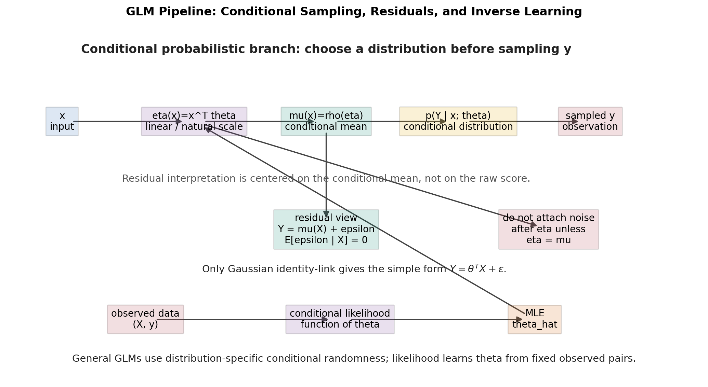

### 8.1 Random component

The random component chooses the conditional response family:

```math
Y_i\mid x_i;\theta
\sim
\text{an exponential-family conditional distribution}
```

This determines support, probability or density structure, and mean-variance behavior. Gaussian, Bernoulli, and Poisson models are different because their random components define different outcome spaces and different uncertainty assumptions.

### 8.2 Ordinary distribution parameter

The ordinary parameter $`\psi_i`$ is the familiar local parameter of the chosen distribution. Examples include a Bernoulli success probability $`p_i`$, a Poisson rate $`\lambda_i`$, or a Gaussian mean $`\mu_i`$ under fixed variance. It belongs to sample $`i`$'s conditional distribution, not to the whole dataset as a free parameter per sample.

### 8.3 Natural parameter

The natural parameter $`\eta_i`$ is the canonical coordinate of the same local distribution. Ordinary and natural coordinates are related by:

```math
\eta_i=q(\psi_i)
```

```math
\psi_i=q^{-1}(\eta_i)
```

The global parameter and the natural parameter are distinct:

```math
\eta_i\neq\theta
```

For Bernoulli, $`\eta_i`$ is log-odds. For Poisson, it is log-rate. For the CS229 fixed-variance-one Gaussian simplification, it equals the mean. Natural coordinates are useful because the exponential-family log density is linear in $`\eta_i`$ against $`T(y_i)`$.

### 8.4 Systematic component

The systematic component is the feature-side predictor:

```math
\xi_i
=
s_\theta(x_i)
=
x_i^T\theta
```

Here $`x_i\in\mathbb R^p`$, $`X\in\mathbb R^{n\times p}`$, and $`\theta\in\mathbb R^p`$ is the global trainable parameter. The scalar $`\xi_i`$ is local to sample $`i`$; the same $`\theta`$ is shared across all samples.

### 8.5 General link

A general GLM makes a transformed conditional mean linear:

```math
g(\mu_i)=\xi_i
```

where, for scalar response GLMs in this note:

```math
\mu_i=\mathbb E[Y_i\mid x_i;\theta]
```

When the canonical statistic is not identical to the response, keep the statistic expectation separate:

```math
m_i=\mathbb E[T(Y_i)\mid x_i;\theta]
```

The natural parameter is separately determined by the distribution's mean-to-natural map:

```math
\eta_i=q(\mu_i)
```

For a noncanonical link, the systematic component and natural parameter are connected indirectly through $`\mu_i`$; they are not generally equal.

### 8.6 Canonical link

The canonical link is the special case where the link equals the distribution's mean-to-natural map:

```math
g=q
```

Only then do we get:

```math
\xi_i=\eta_i=x_i^T\theta
```

Thus the equality between systematic component and natural parameter is not a general theorem. It is a canonical-link condition. Under a noncanonical link, $`\xi_i`$ lives on the chosen link scale while $`\eta_i`$ remains the natural coordinate of the local distribution.

### 8.7 Scale distinctions in a GLM

A GLM has several scales that should not be merged:

* natural-parameter scale: the distribution coordinate such as log-odds, log-rate, or Gaussian mean coordinate;
* mean / response scale: the conditional mean $`\mu(x)=\mathbb E[Y\mid X=x]`$;
* observation scale: the random response $`Y`$ before realization and the observed value $`y`$ after realization.

The complete conceptual chain is:

```text
x
-> linear predictor
-> natural parameter
-> conditional mean
-> conditional distribution
-> random observation
```

In the scalar canonical construction, this is often written as:

```math
x
\longrightarrow
\eta(x)=x^T\theta
\longrightarrow
\mu(x)=g^{-1}(\eta(x))
\longrightarrow
p(Y\mid x;\theta)
\longrightarrow
y
```

Gaussian identity-link regression is special because the linear predictor, natural parameter, and conditional mean coincide. Bernoulli and Poisson GLMs do not have this coincidence: log-odds and log-rate are not themselves probabilities or expected counts. This special Gaussian collapse is what makes the misleading slogan "a GLM is just a linear predictor plus zero-mean noise" feel natural. The safer statement is: a GLM puts linear structure on a chosen distribution scale, maps to the conditional mean, and then specifies distribution-specific conditional randomness on the observation scale.

### 8.8 Global parameter sharing

The model learns one shared $`\theta`$ rather than an unrestricted $`\eta_i`$ for each sample. For scalar response GLMs, the prediction or hypothesis is the conditional response mean:

```math
h_\theta(x_i)=\mu_i=\mathbb E[Y_i\mid x_i;\theta]
```

For canonical scalar families with $`T(Y_i)=Y_i`$, this becomes:

```math
h_\theta(x_i)=\nabla a(x_i^T\theta)
```

For vector-valued statistics such as multiclass one-hot encodings, $`\nabla a(\eta_i)`$ is the statistic expectation $`m_i=\mathbb E[T(Y_i)\mid x_i;\theta]`$, which is the probability vector used for prediction.

Global sharing is what makes the model learnable from finite data and usable for new inputs. It also imposes structure: if the true conditional distribution cannot be represented through the chosen feature map, family, and link, the model will underfit.

Linearity is a design choice, not a theorem about nature. The CS229 version uses $`x_i^T\theta`$ because it is interpretable, sample-efficient, and often convex-friendly under canonical links. Richer models can replace $`x_i`$ by engineered features $`\phi(x_i)`$ or a learned representation, but the observation model still has to map a distribution coordinate to $`p(Y_i\mid x_i)`$.

### The geometric and statistical meaning of the systematic component

In the canonical scalar case:

```math
\boldsymbol\eta=X\theta
```

This means the $`n`$ sample-specific natural parameters are not free. They must lie in the column space of $`X`$. When $`p\ll n`$, this is a strong low-dimensional constraint: many possible vectors of natural parameters are not representable by any $`\theta`$.

Statistically, the constraint makes all samples share strength through one global parameter. A change in $`\theta_j`$ changes every $`\eta_i`$ in proportion to feature value $`x_{ij}`$. That shared structure enables generalization to a new $`x`$, because the fitted model can compute $`x_{\mathrm{new}}^T\hat\theta`$ without having seen that exact sample before. The cost is bias if the true conditional mechanism is outside the column-space restriction.

The equation is not:

```math
Y=X\theta
```

It is:

```math
\text{natural coordinate of }p(Y_i\mid x_i)
=
x_i^T\theta
```

The response remains random. The linear predictor chooses a coordinate of the conditional distribution before sampling; it is not an assertion that the realized response equals the score.

## 9. The Complete GLM Modeling Workflow

A GLM should be read in three directions: the forward probability model, the inverse learning problem, and the post-training prediction problem. Keeping those directions separate prevents $`\theta`$, $`\eta_i`$, $`\psi_i`$, $`Y_i`$, and $`y_i`$ from collapsing into one vague object.

Conditional probabilistic branch for a general GLM:

```text
x_i
-> xi_i = x_i^T theta
-> mu_i = g^{-1}(xi_i)
-> eta_i = q(mu_i)
-> conditional distribution p(Y_i | x_i; theta)
-> random Y_i
-> observed y_i
```

This is the probability direction. Given $`x_i`$ and $`\theta`$, the model first forms the feature-side score $`\xi_i`$. The link determines the conditional mean $`\mu_i`$, the exponential-family parameterization determines the local natural parameter $`\eta_i`$, and the resulting conditional distribution produces the random variable $`Y_i`$ before one realization $`y_i`$ is observed. The ordinary parameter $`\psi_i`$ is the distribution-specific parameterization of the same local distribution, such as $`p_i`$, $`\lambda_i`$, or $`\mu_i`$.

In the canonical-link subcase emphasized in CS229, this simplifies to $`\xi_i=\eta_i=x_i^T\theta`$. In the Gaussian identity-link subcase, the conditional mean also coincides with that score. Those coincidences are special cases, not the general GLM rule.

Residual interpretation branch:

```text
Y = mu(X) + epsilon
E[epsilon | X] = 0
```

This branch is an interpretation of the conditional mean, not an extra noise layer inserted after the linear predictor or natural parameter. Only Gaussian identity-link regression gives the simple form $`Y=\theta^TX+\epsilon`$. General GLMs use distribution-specific conditional randomness, so do not place noise directly after $`\eta(x)`$ unless $`\eta(x)=\mu(x)`$.

Inverse learning:

```text
observed (X, y)
-> likelihood as a function of theta
-> maximum likelihood optimization
-> theta_hat
```

This is the likelihood direction. The observed responses are fixed. Training changes the candidate global parameter $`\theta`$ and compares how plausible the whole observed dataset is under the conditional distributions induced by that parameter.

Prediction after fitting:

```text
x_new
-> xi_hat = x_new^T theta_hat
-> mu_hat = g^{-1}(xi_hat)
-> conditional distribution
-> mean / probability / predictive uncertainty
```

This is the deployment direction. The fitted model does not merely return a raw score. It returns a conditional distribution or a summary of it, such as a Gaussian fitted mean, a Bernoulli probability, a Poisson expected count, or a predictive interval when the distributional assumptions support one.

A practical workflow follows:

1. Define the response random variable $`Y_i`$ and the realized value $`y_i`$ precisely.
2. Choose a conditional family for $`Y_i\mid x_i`$ based on support, semantics, variance behavior, and mechanism.
3. Identify the ordinary parameter $`\psi_i`$, natural parameter $`\eta_i`$, and conditional mean $`\mu_i`$ of that local distribution.
4. Identify the sufficient statistic $`T(Y_i)`$ whose expectation enters the likelihood score, and keep it distinct from the response mean when needed.
5. Choose a link and keep the scales separate. In the canonical case, set $`\eta_i=x_i^T\theta`$ and map to $`\mu_i`$; otherwise set $`g(\mu_i)=x_i^T\theta`$ and map through $`\mu_i`$ to $`\eta_i`$.
6. Write the conditional likelihood over the observed training set.
7. Optimize $`\theta`$ by MLE or a regularized variant.
8. Use $`\hat\theta`$ to produce a conditional distribution and prediction for new inputs.
9. Diagnose support violations, calibration, residual structure, overdispersion, separation, identifiability, and shift.

Bernoulli mini-example:

```text
Binary outcome: loan default yes/no.
Y_i in {0,1}.
Choose Bernoulli.
ordinary parameter psi_i is p_i.
natural parameter eta_i is log-odds.
canonical systematic component sets eta_i = x_i^T theta.
response mean is sigmoid(x_i^T theta).
likelihood is Bernoulli likelihood.
NLL is binary cross-entropy.
```

Poisson mini-example:

```text
Count outcome: number of arrivals per hour.
Y_i in N0.
Choose Poisson.
ordinary parameter psi_i is lambda_i.
natural parameter eta_i is log lambda_i.
canonical systematic component sets eta_i = x_i^T theta.
response mean is exp(x_i^T theta).
NLL is Poisson negative log likelihood.
```

## 10. Deep Meaning of the Hypothesis Function

In a GLM, the hypothesis function is not the parameter that maximizes probability. It is the model prediction after parameters have been learned.

### A. Separate parameter learning from prediction

Training estimates parameters from the dataset:

```math
\hat\theta=\underset{\theta}{\text{arg max}}\ p(\mathcal D\mid\theta)
```

Prediction uses the learned parameter inside the conditional mean:

```math
h_{\hat\theta}(x)=\mathbb E[Y\mid x;\hat\theta]
```

When the model predicts a statistic such as a one-hot class vector, write that statistic mean separately as $`m_{\hat\theta}(x)=\mathbb E[T(Y)\mid x;\hat\theta]`$. The hypothesis function is therefore not “the parameter that maximizes the probability.” The learned parameter is $`\hat\theta`$; the prediction is the conditional mean or statistic expectation implied by the fitted model.

### B. Link, canonical link, and response mapping

This note uses $`g`$ for the link and $`g^{-1}`$ for the inverse link / response mapping back to the mean scale:

```math
g(\mu)=\xi
```

```math
\mu=g^{-1}(\xi)
```

For canonical scalar exponential-family GLMs with $`T(Y)=Y`$ and $`\xi=\eta`$:

```math
g^{-1}(\eta)=\nabla a(\eta)
```

The canonical link is the inverse mean map:

```math
g_{\mathrm{can}}(\mu)=(\nabla a)^{-1}(\mu)
```

In the scalar canonical construction:

```math
\eta(x)=s_\theta(x)=\theta^Tx
```

so the prediction is:

```math
h_\theta(x)
=
\mu(x)
=
g^{-1}(\theta^Tx)
=
\nabla a(\theta^Tx)
```

| Distribution | Natural scale | Response mapping |
| ------------ | ------------- | ---------------- |
| Gaussian | $`\eta=s_\theta(x)`$ | identity: $`h_\theta(x)=\theta^Tx`$ |
| Bernoulli | log-odds $`\eta=s_\theta(x)`$ | sigmoid: $`h_\theta(x)=1/(1+e^{-\theta^Tx})`$ |
| Poisson | log-rate $`\eta=s_\theta(x)`$ | exponential: $`h_\theta(x)=e^{\theta^Tx}`$ |
| Multinomial | class scores $`\eta_k=s_k(x)`$ | softmax probabilities |

### C. Why general GLMs are not simple additive-noise models

The linear predictor:

```math
\eta(x)
=
\theta^Tx
```

is usually not the conditional mean. In a general GLM, the conditional mean is the response-scale quantity:

```math
\mu(x)
=
\mathbb E[Y\mid X=x]
=
g^{-1}(\eta(x))
```

Therefore the residual decomposition is always centered on $`\mu(X)`$:

```math
Y
=
\mu(X)+\epsilon
```

but one usually cannot write:

```math
Y
=
\eta(X)+\epsilon
```

unless the response mapping is identity, as in the Gaussian identity-link case.

Bernoulli example. If:

```math
Y\mid X=x
\sim
\mathrm{Bernoulli}(p(x))
```

then:

```math
\epsilon
=
Y-p(x)
```

```math
\mathbb E[\epsilon\mid X=x]
=
0
```

```math
\mathrm{Var}(\epsilon\mid X=x)
=
p(x)(1-p(x))
```

The residual support is:

```math
\{-p(x),1-p(x)\}
```

so the residual distribution changes with $`x`$. It is not fixed independent Gaussian noise.

Poisson example. If:

```math
Y\mid X=x
\sim
\mathrm{Poisson}(\lambda(x))
```

then:

```math
\epsilon
=
Y-\lambda(x)
```

```math
\mathbb E[\epsilon\mid X=x]
=
0
```

```math
\mathrm{Var}(\epsilon\mid X=x)
=
\lambda(x)
```

The random fluctuation is coupled to the conditional mean. Higher expected counts naturally carry larger conditional variance under the Poisson model.

### D. Activation-function comparison

It is legitimate to notice that sigmoid, exponential, and softmax are nonlinear maps from scores to outputs. But GLM response functions are not chosen only for computational convenience. They are derived from distributional assumptions and link functions, so they carry a likelihood, a mean-variance relationship, a calibration interpretation, and model-specific diagnostics.

## 11. Gaussian GLM

采用 official fixed-variance derivation，令 variance 为 $`1`$。Gaussian density：

```math
p(y;\mu)
=
\frac{1}{\sqrt{2\pi}}
\exp\left(-\frac12(y-\mu)^2\right)
```

展开：

```math
p(y;\mu)
=
\frac{1}{\sqrt{2\pi}}
\exp\left(-\frac12y^2+\mu y-\frac12\mu^2\right)
```

写成 exponential-family form：

```math
p(y;\eta)=b(y)\exp\left(\eta T(y)-a(\eta)\right)
```

其中：

```math
\eta=\mu
```

```math
T(y)=y
```

```math
a(\eta)=\frac{\eta^2}{2}
```

```math
b(y)=\frac{1}{\sqrt{2\pi}}\exp\left(-\frac{y^2}{2}\right)
```

Moment identity 给出：

```math
h_\theta(x)
=
\mathbb E[Y\mid x;\theta]
=
a'(\eta)
=
\eta
```

canonical link 设 $`\eta=\theta^Tx`$，所以：

```math
h_\theta(x)=\theta^Tx
```

如果把 CS229 的 variance-one 简化写回一般 fixed variance $`\sigma^2`$，Gaussian conditional model 是：

```math
Y\mid X=x;\theta
\sim
\mathcal N(\theta^Tx,\sigma^2)
```

这与下面的 additive representation 等价：

```math
Y
=
\theta^TX+\epsilon
```

```math
\epsilon\mid X=x
\sim
\mathcal N(0,\sigma^2)
```

也就是说，给定 $`X=x`$ 后，$`\theta^Tx`$ 是 conditional mean，$`\epsilon`$ 是围绕这个 mean 的 conditional Gaussian residual。反过来，如果 $`Y=\theta^TX+\epsilon`$ 且 $`\epsilon\mid X=x\sim\mathcal N(0,\sigma^2)`$，则立刻得到 $`Y\mid X=x;\theta\sim\mathcal N(\theta^Tx,\sigma^2)`$。

这里有几个层级不要合并成一句“加随机噪声”：

1. $`\mathbb E[\epsilon\mid X]=0`$：只说明 $`\theta^TX`$ 是 conditional mean。
2. Gaussian conditional noise：说明 residual 的 conditional shape 是 normal。
3. Homoscedastic variance：说明 $`\mathrm{Var}(\epsilon\mid X=x)=\sigma^2`$ 不随 $`x`$ 改变。
4. Independence from $`X`$：说明 residual distribution 不随 $`x`$ 改变；它强于 conditional mean zero。
5. Conditional independence across samples：说明给定 covariates 后，不同样本的随机波动可以相乘成 product likelihood。

Gaussian log likelihood 忽略与 $`\theta`$ 无关的常数后等价于：

```math
-\frac12\sum_{i=1}^{m}
\left(y^{(i)}-\theta^Tx^{(i)}\right)^2
```

因此 maximizing Gaussian likelihood 等价于 minimizing squared loss。Squared loss 不是任意选择；它是 fixed-variance Gaussian conditional model 的 NLL。

## 12. Bernoulli GLM

Bernoulli distribution：

```math
p(y;\phi)=\phi^y(1-\phi)^{1-y},
\quad y\in\{0,1\}
```

先取 log 并整理 exponent：

```math
p(y;\phi)
=
\exp\left(y\log\phi+(1-y)\log(1-\phi)\right)
```

```math
=
\exp\left(
y\log\frac{\phi}{1-\phi}
+
\log(1-\phi)
\right)
```

与 exponential-family form 对比：

```math
p(y;\eta)=b(y)\exp\left(\eta T(y)-a(\eta)\right)
```

得到：

```math
T(y)=y
```

```math
\eta=\log\frac{\phi}{1-\phi}
```

```math
b(y)=1
```

为了得到 $`a(\eta)`$，先解出 $`\phi`$。从：

```math
\eta=\log\frac{\phi}{1-\phi}
```

指数化：

```math
e^\eta=\frac{\phi}{1-\phi}
```

整理：

```math
e^\eta(1-\phi)=\phi
```

```math
e^\eta=\phi(1+e^\eta)
```

所以：

```math
\phi=\frac{e^\eta}{1+e^\eta}
=
\frac{1}{1+e^{-\eta}}
```

同时：

```math
1-\phi=\frac{1}{1+e^\eta}
```

因为 exponential-family form 中 $`\log(1-\phi)=-a(\eta)`$，所以：

```math
a(\eta)=\log(1+e^\eta)
```

Moment identity 给出：

```math
h_\theta(x)
=
\mathbb E[Y\mid x;\theta]
=
a'(\eta)
=
\frac{e^\eta}{1+e^\eta}
```

canonical link 设 $`\eta=\theta^Tx`$，得到：

```math
h_\theta(x)=\frac{1}{1+e^{-\theta^Tx}}
```

Equivalently, define the conditional probability explicitly as:

```math
\eta(x)=\theta^Tx
```

```math
p(x;\theta)
=
P(Y=1\mid x;\theta)
=
\sigma(\eta(x))
```

Here $`p(x;\theta)`$ is not a free parameter per sample; it is the conditional event probability computed from $`x`$ and the shared parameter $`\theta`$.

For input sensitivity, differentiating the probability with respect to feature coordinate $`x_j`$ gives:

```math
\frac{\partial p}{\partial x_j}
=
\theta_jp(1-p)
```

The coefficient $`\theta_j`$ is the fixed local effect on log-odds. The factor $`p(1-p)`$ is the local conversion sensitivity from log-odds scale to probability scale. Near the decision boundary, $`p\approx0.5`$, the same feature perturbation creates the largest probability change. In the tails, where $`p`$ is near $`0`$ or $`1`$, small input changes create smaller probability changes. Thus boundary-near points are most sensitive in predicted probability and hard-label thresholding.

Training sensitivity is different. For one cross-entropy loss term $`\mathcal L_i`$:

```math
\nabla_\theta\mathcal L_i
=
(p_i-y_i)x_i
```

Probability sensitivity is controlled by $`p_i(1-p_i)`$, while the training gradient is controlled by the prediction error $`p_i-y_i`$. Boundary samples often have moderate gradients. Confident and correct tail samples have small gradients. Confident but wrong tail samples have the largest gradients. Therefore, "the sigmoid is steepest in the middle" should not be confused with "middle samples always dominate training."

所以 sigmoid 不是随意画出的 S-curve，而是 Bernoulli exponential-family representation 加 canonical linear predictor 的必然结果。

## 13. Poisson GLM

Poisson distribution：

```math
p(y;\lambda)=\frac{\lambda^ye^{-\lambda}}{y!}
```

其中 $`y\in\{0,1,2,\ldots\}`$，$`\lambda>0`$ 是 rate 或 mean count。整理为：

```math
p(y;\lambda)
=
\frac{1}{y!}
\exp\left(y\log\lambda-\lambda\right)
```

设：

```math
\eta=\log\lambda
```

则 $`\lambda=e^\eta`$，所以：

```math
p(y;\eta)
=
\frac{1}{y!}
\exp\left(y\eta-e^\eta\right)
```

因此：

```math
T(y)=y
```

```math
a(\eta)=e^\eta
```

```math
b(y)=\frac{1}{y!}
```

Moment identity：

```math
h_\theta(x)
=
\mathbb E[Y\mid x;\theta]
=
a'(\eta)
=
e^\eta
```

canonical link 设 $`\eta=\theta^Tx`$，于是：

```math
h_\theta(x)=\mathbb E[Y\mid x;\theta]=e^{\theta^Tx}
```

这保证 prediction 是 positive count-rate。注意 prediction 是 expected count/rate，不是必须输出整数；实际 observed $`Y`$ 仍是非负整数随机变量。

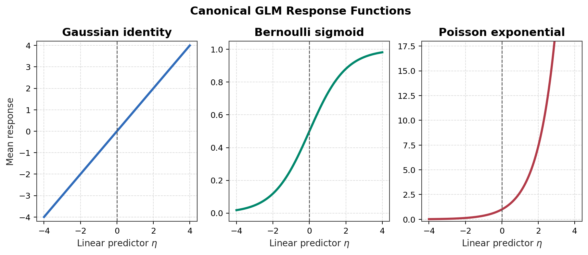

## 14. Multinomial Exponential-Family Form

对 $`K`$ 类 categorical outcome，使用 $`K-1`$ 个 independent probability parameters，并把第 $`K`$ 类作为 reference class。令：

```math
\phi_K=1-\sum_{k=1}^{K-1}\phi_k
```

定义 sufficient statistic：

```math
(T(y))_k=\mathbf1\{y=k\},
\quad k=1,\ldots,K-1
```

它的 expectation 是 class probability：

```math
\mathbb E[(T(Y))_k]=P(Y=k)=\phi_k
```

Categorical PMF 可以写成：

```math
p(y;\phi)
=
\prod_{k=1}^{K}\phi_k^{\mathbf1\{y=k\}}
```

把 reference class 拆出来：

```math
p(y;\phi)
=
\phi_K
\prod_{k=1}^{K-1}
\left(\frac{\phi_k}{\phi_K}\right)^{\mathbf1\{y=k\}}
```

取 exponential form：

```math
p(y;\phi)
=
\exp\left(
\sum_{k=1}^{K-1}\mathbf1\{y=k\}
\log\frac{\phi_k}{\phi_K}
+
\log\phi_K
\right)
```

因此 natural parameters 是 log odds against the reference class：

```math
\eta_k=\log\frac{\phi_k}{\phi_K},
\quad k=1,\ldots,K-1
```

指数化并归一化：

```math
e^{\eta_k}=\frac{\phi_k}{\phi_K}
```

```math
\phi_k=e^{\eta_k}\phi_K
```

利用 $`\sum_{k=1}^{K}\phi_k=1`$：

```math
\phi_K\left(1+\sum_{k=1}^{K-1}e^{\eta_k}\right)
=
1
```

```math
\phi_K
=
\frac{1}{1+\sum_{j=1}^{K-1}e^{\eta_j}}
```

所以：

```math
\phi_k
=
\frac{e^{\eta_k}}
{1+\sum_{j=1}^{K-1}e^{\eta_j}},
\quad k=1,\ldots,K-1
```

这就是 reference-class parameterization 下 softmax 的来源。

## 15. Softmax Response Function

若为每个 class 定义 linear score：

```math
s_k(x)=\theta_k^Tx
```

则 symmetric softmax response 是：

```math
p(y=k\mid x;\Theta)
=
\frac{\exp(\theta_k^Tx)}
{\sum_{j=1}^{K}\exp(\theta_j^Tx)}
```

解释：

* 每个 $`\theta_k`$ 是 class-specific linear score direction。
* 所有 scores 被 jointly normalized；一个 class 的 probability 上升会挤压其他 class。
* 参数是 relative，不是 absolute；只有 score differences 影响概率。
* 给所有 class parameter 加同一个 vector $`v`$，即 $`\theta_k'=\theta_k+v`$，所有 score 同时增加 $`v^Tx`$，分子分母同乘同一因子，probability 不变。
* Reference-class parameterization 通过固定一个 class 的 parameter，例如 $`\theta_K=0`$，解决 identifiability。

Binary reduction 也可以直接证明。对 $`K=2`$：

```math
p(y=1\mid x)
=
\frac{\exp(\theta_1^Tx)}
{\exp(\theta_1^Tx)+\exp(\theta_2^Tx)}
```

分子分母同时除以 $`\exp(\theta_1^Tx)`$：

```math
p(y=1\mid x)
=
\frac{1}
{1+\exp(\theta_2^Tx-\theta_1^Tx)}
```

整理：

```math
p(y=1\mid x)
=
\frac{1}
{1+\exp\left(-(\theta_1-\theta_2)^Tx\right)}
```

因此 binary softmax 等价于 logistic regression with parameter difference $`\theta_1-\theta_2`$。

Softmax 不是 independent one-vs-rest logistic regression。One-vs-rest 会训练 $`K`$ 个 binary probability models，它们的 outputs 一般不保证 sum to one；softmax 是一个 joint multinomial conditional model，概率从定义上互相耦合并归一化。

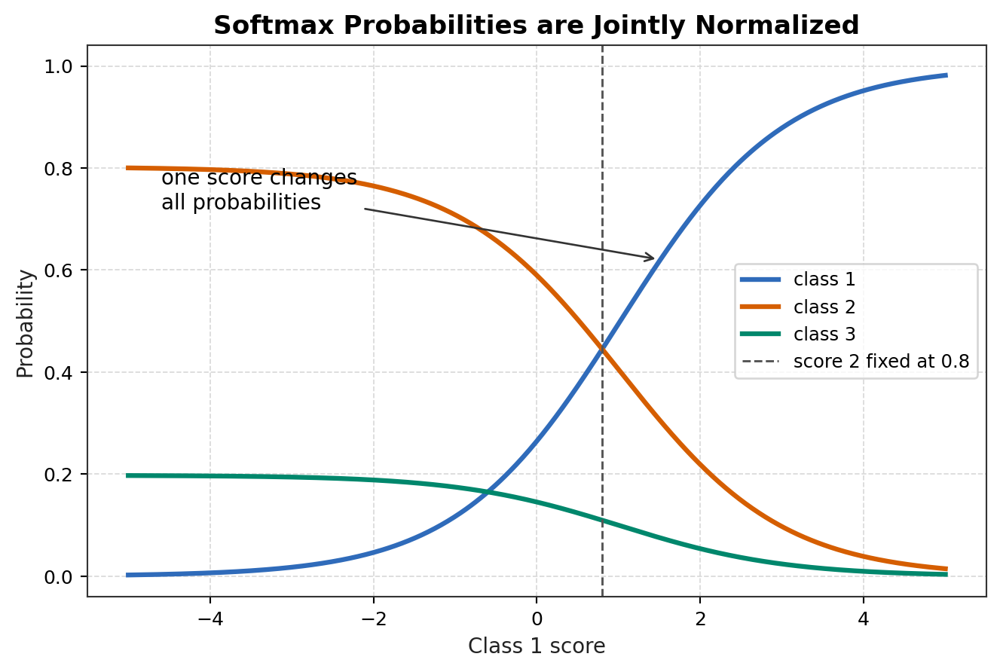

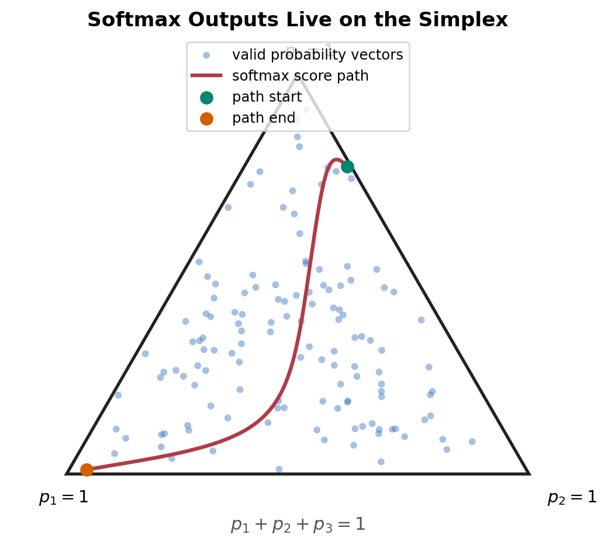

## 16. Softmax Likelihood and Cross-Entropy

定义 one-hot target：

```math
t_{ik}=\mathbf1\{y^{(i)}=k\}
```

记：

```math
p_{ik}=p(y=k\mid x^{(i)};\Theta)
```

Likelihood 是：

```math
L(\Theta)
=
\prod_{i=1}^{m}
\prod_{k=1}^{K}
p_{ik}^{t_{ik}}
```

Log-likelihood：

```math
\ell(\Theta)
=
\sum_{i=1}^{m}
\sum_{k=1}^{K}
t_{ik}\log p_{ik}
```

Negative log likelihood，也就是 multiclass cross-entropy：

```math
J(\Theta)
=
-\sum_{i=1}^{m}
\sum_{k=1}^{K}
t_{ik}\log p_{ik}
```

为了推导 gradient，先写单样本 loss：

```math
J_i
=
-\sum_{k=1}^{K}t_{ik}\log p_{ik}
```

由于：

```math
\log p_{ik}
=
\theta_k^Tx^{(i)}
-
\log\sum_{j=1}^{K}\exp(\theta_j^Tx^{(i)})
```

所以：

```math
J_i
=
-\sum_{k=1}^{K}t_{ik}\theta_k^Tx^{(i)}
+
\sum_{k=1}^{K}t_{ik}
\log\sum_{j=1}^{K}\exp(\theta_j^Tx^{(i)})
```

one-hot target 满足 $`\sum_k t_{ik}=1`$，故：

```math
J_i
=
-\sum_{k=1}^{K}t_{ik}\theta_k^Tx^{(i)}
+
\log\sum_{j=1}^{K}\exp(\theta_j^Tx^{(i)})
```

对 $`\theta_r`$ 求 gradient：

```math
\nabla_{\theta_r}J_i
=
-t_{ir}x^{(i)}
+
\frac{\exp(\theta_r^Tx^{(i)})}
{\sum_{j=1}^{K}\exp(\theta_j^Tx^{(i)})}
x^{(i)}
```

即：

```math
\nabla_{\theta_r}J_i
=
(p_{ir}-t_{ir})x^{(i)}
```

汇总所有 samples：

```math
\nabla_{\theta_k}J
=
\sum_{i=1}^{m}
(p_{ik}-t_{ik})x^{(i)}
```

所有 class parameters 是 jointly trained 的，因为每个 $`p_{ik}`$ 的 denominator 包含全部 class scores。

## 17. Reliability View

GLM 的可靠性来自两个层面：优化 objective 是否被正确求解，以及 statistical assumptions 是否适合真实数据。后一层往往更难，因为 likelihood 可以被优化得很好，但 model family 仍然 misspecified。

Misspecification 至少有三种不同层级：

1. Conditional mean misspecification: $`\mu(x)=\mathbb E[Y\mid X=x]`$ 的函数形式错了。
2. Conditional variance / noise misspecification: mean 大致对，但 residual variance、dependence 或 noise mechanism 错了。
3. Full conditional distribution misspecification: mean 和 variance 可能还可以，但 tails、skewness、zero inflation、calibration 或 discrete/continuous shape 错了。

因此，即使条件均值正确，方差和尾部仍可能错误；point prediction 可以较准，但 likelihood、prediction interval 和 calibration 仍可能失效。Support 匹配不代表分布正确；Bernoulli、Poisson、Gaussian 的 variance structure 都是实质假设。$`\mathbb E[\epsilon\mid X]=0`$ 不足以证明 Gaussian assumption，canonical link 是方便且结构优美的选择，不是现实定律；homoscedastic Gaussian noise 也不适合所有实际动态系统。诊断时要显式检查 overdispersion、zero inflation、heteroscedasticity、nonlinearity、interaction、temporal dependence、spatial dependence、shift 和 calibration。

| Assumption | Diagnostic | Likely symptom | Mitigation |
| ---------- | ---------- | -------------- | ---------- |
| Support matches response | 检查 prediction range 和 observed $`y`$ | negative count、probability outside range、invalid class encoding | 换分布或 link；重定义 response |
| Conditional mean correctly specified | residual pattern vs fitted mean or features | systematic residual structure, subgroup bias | feature transform, interactions, nonlinear model |
| Conditional variance/noise correctly specified | residual variance vs fitted mean, dependence checks | wrong intervals, overconfidence, overdispersion | variance model, robust SE, quasi-likelihood |
| Full conditional distribution correctly specified | PIT、posterior predictive style checks、tail diagnostics | tail errors、skew errors、poor calibration | richer family、robust loss、mixture or nonparametric model |
| Correct link | residual pattern vs linear predictor | probability saturation、count underfit at high rates | alternative link、feature transform |
| Sufficient linear predictor | validation error by subgroup、partial residuals | stable bias in regions of feature space | interactions、basis expansion、nonlinear model |
| iid conditional samples | time/group correlation checks | overconfident standard errors、leakage-like validation | clustered SE、mixed model、time split |
| No complete separation | inspect margins and coefficient growth | logistic/softmax coefficients diverge | regularization、Bayesian prior、feature review |
| Balanced enough classes | class-frequency and per-class metrics | rare class ignored、poor recall | class weighting、resampling、threshold policy |
| Calibration | reliability diagram, Brier score, ECE | confident wrong probabilities | calibration set、temperature scaling、regularization |
| Stable distribution | train/test shift diagnostics | likelihood good in train but poor deployment | shift monitoring、domain adaptation、robust evaluation |
| Identifiability | rank checks and invariance checks | multiple parameters yield same probabilities | constraints, reference class, regularization |
| Parameter uncertainty acceptable | standard errors, bootstrap, profile likelihood | unstable signs and wide intervals | more data, simpler model, shrinkage |

## 18. Connection to PS1

Lecture 4 completes the conceptual prerequisites for the first supervised-learning assignment gate. At this point，linear regression、locally weighted regression、logistic regression、Newton method、Perceptron、exponential family、GLM 和 softmax 的核心关系已经具备。

这里不复制 official problem statements，也不提供 official solutions。PS1 gate 接下来应进入 independent derivation attempts、implementation planning、tests 和 mistake log。

## 19. Takeaways

Lecture 4 把 supervised learning 从一组孤立算法转化为 principled conditional model-construction system：

* Perceptron 展示 non-probabilistic linear decision geometry。
* Exponential family 提供 unified probability representation。
* Log-partition function 生成 mean、variance 和 convexity。
* GLM 把 response semantics、distribution、link、linear predictor、conditional mean 和 likelihood 接成一条链。
* Conditional GLM 是 probabilistic discriminative model：它直接建模 $`p(y\mid x;\theta)`$，不建模 $`p(x)`$。
* Residual decomposition 始终围绕 $`\mu(X)`$；$`Y=\theta^TX+\epsilon`$ 是 Gaussian identity-link 的特殊重合，不是所有 GLM 的通用形式。
* Softmax 是 multinomial conditional model，不是多个独立 sigmoid 的拼接。
* Reliability analysis 要分开检查 conditional mean、variance/noise、full conditional distribution、support、link、feature geometry、optimization 和 deployment shift。

## Fast Review Checklist

- [ ] I can distinguish $`Y_i`$ as a random variable from $`y_i`$ as the observed realization.
- [ ] I can explain why likelihood fixes observed data and varies $`\theta`$.
- [ ] I can explain why MLE is not $`P(\theta\mid\mathcal D)`$.
- [ ] I can distinguish a generative model of $`p(x,y)`$ from a discriminative model of $`p(y\mid x;\theta)`$.
- [ ] I can explain why a GLM can sample $`Y\mid x`$ without modeling complete $`(X,Y)`$ pairs.
- [ ] I can derive iid exponential-family moment matching from the score equation.
- [ ] I can distinguish $`T(Y_i)`$, $`T(y_i)`$, $`S(\mathbf Y)`$, and $`S(\mathbf y)`$.
- [ ] I can explain why Gaussian unknown variance needs second-order information.
- [ ] I can distinguish shared-parameter iid matching from GLM feature-weighted matching through $`\sum_i x_iT(y_i)`$.
- [ ] I can distinguish ordinary parameter $`\psi_i`$, natural parameter $`\eta_i`$, conditional mean $`\mu_i`$, and global parameter $`\theta`$.
- [ ] I can explain why $`\eta_i\neq\theta`$ but $`\eta_i=x_i^T\theta`$ in the scalar canonical construction.
- [ ] I can distinguish natural-parameter scale, mean / response scale, and observation scale.
- [ ] I can explain why residuals are centered on $`\mu(X)`$, not generally on $`\eta(X)`$.
- [ ] I can state the Gaussian equivalence between $`Y\mid X=x`$ and $`Y=\theta^TX+\epsilon`$ with conditional Gaussian noise.
- [ ] I can explain why Bernoulli and Poisson GLM residuals are not fixed independent Gaussian noise.
- [ ] I can explain why systematic component and natural parameter are equal only under a canonical link.
- [ ] I can explain the column-space constraint behind $`\boldsymbol\eta=X\theta`$.
- [ ] I can distinguish conditional modeling from joint modeling without claiming covariate shift disappears.
- [ ] I can explain why multiclass uses categorical/multinomial rather than Poisson.
- [ ] I can derive sigmoid from Bernoulli and exponential response from Poisson.
- [ ] I can list conditional mean, variance/noise, and full conditional distribution misspecification as separate reliability risks.

## Concept Map Summary

Course development map:

```text
Perceptron
-> exponential family
-> log-partition function
-> GLM construction
-> Bernoulli / Poisson / Gaussian GLMs
-> softmax regression
-> reliability checks
```

GLM statistical-inference explanation:

```text
real stochastic mechanism
-> conditional distribution
-> random Y_i and observed y_i
-> T(y_i) and S(y)
-> likelihood
-> maximum likelihood estimation
-> sufficient-statistic / moment matching
-> shared theta
-> xi_i = x_i^T theta
-> link, natural parameter, and conditional mean
-> prediction, residuals, uncertainty, diagnostics
```

Discriminative GLM view:

```text
observed x
-> model p(y | x; theta)
-> conditional likelihood over y values
-> no model for p(x)
```

Generative contrast:

```text
p(x, y) = p(y) p(x | y)
-> can sample y and then x
-> models complete (X, Y) pairs
```

Conditional probabilistic branch:

```text
x_i
-> xi_i = x_i^T theta
-> mu_i = g^{-1}(xi_i)
-> eta_i = q(mu_i)
-> conditional distribution p(Y_i | x_i; theta)
-> random Y_i
-> observed y_i
```

Residual interpretation branch:

```text
epsilon_i = Y_i - mu_i
Y_i = mu_i + epsilon_i
E[epsilon_i | X_i] = 0
```

Inverse learning:

```text
observed (X, y)
-> likelihood as a function of theta
-> maximum likelihood optimization
-> theta_hat
```

Prediction:

```text
x_new
-> xi_hat = x_new^T theta_hat
-> mu_hat = g^{-1}(xi_hat)
-> conditional distribution
-> mean / probability / predictive uncertainty
```

| Modeling question | Mathematical object | Example |
|---|---|---|
| What can $`Y_i`$ be? | support | $`\mathbb R`$, $`\{0,1\}`$, $`\mathbb N_0`$, simplex |
| What uncertainty model? | conditional family for $`Y_i\mid x_i`$ | Gaussian, Bernoulli, Poisson |
| Is this joint or conditional? | model target | $`p(y\mid x;\theta)`$ for GLM |
| Is $`p(x)`$ modeled? | covariate model | no for conditional GLM |
| What statistic matters? | $`T(Y_i)`$ and $`T(y_i)`$ | scalar, one-hot vector, $`(y,y^2)`$ |
| What aggregates iid evidence? | $`S(\mathbf y)=\sum_iT(y_i)`$ | success count, sum, sum of squares |
| What aggregates GLM evidence? | $`\sum_i x_iT(y_i)`$ | feature-weighted statistic sum |
| What is the ordinary local parameter? | $`\psi_i`$ | $`p_i`$, $`\lambda_i`$, $`\mu_i`$ |
| What is the natural local coordinate? | $`\eta_i=q(\psi_i)`$ | log-odds, log-rate, mean coordinate |
| What is globally learned? | $`\theta`$ | shared feature-effect vector |
| What is systematic? | $`\xi_i=s_\theta(x_i)=x_i^T\theta`$ | feature-side score |
| What is the conditional mean? | $`\mu_i=g^{-1}(\xi_i)`$ | fitted mean, event probability, expected count |
| What is the residual view? | $`\epsilon_i=Y_i-\mu_i`$ | $`\mathbb E[\epsilon_i\mid X_i]=0`$ |
| What is optimized? | conditional likelihood / NLL | squared loss, cross-entropy, Poisson NLL |
| What can fail? | mean, variance/noise, distribution | bias, bad intervals, miscalibration |

The long prediction formula is kept outside the table so Markdown renders it reliably:

```math
h_\theta(x_i)
=
\mu_i
=
\mathbb E[Y_i\mid x_i;\theta]
```

Statistic expectation, when different, is:

```math
m_i
=
\mathbb E[T(Y_i)\mid x_i;\theta]
```

Gaussian identity-link is the special case where:

```math
\eta(x)
=
\mu(x)
=
\theta^Tx
```

General GLMs keep these distinct unless the response mapping is identity.