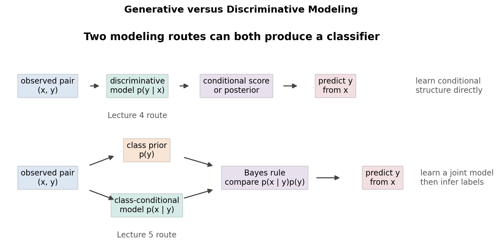
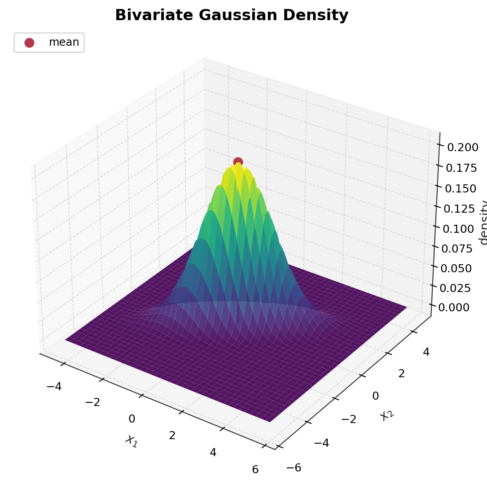
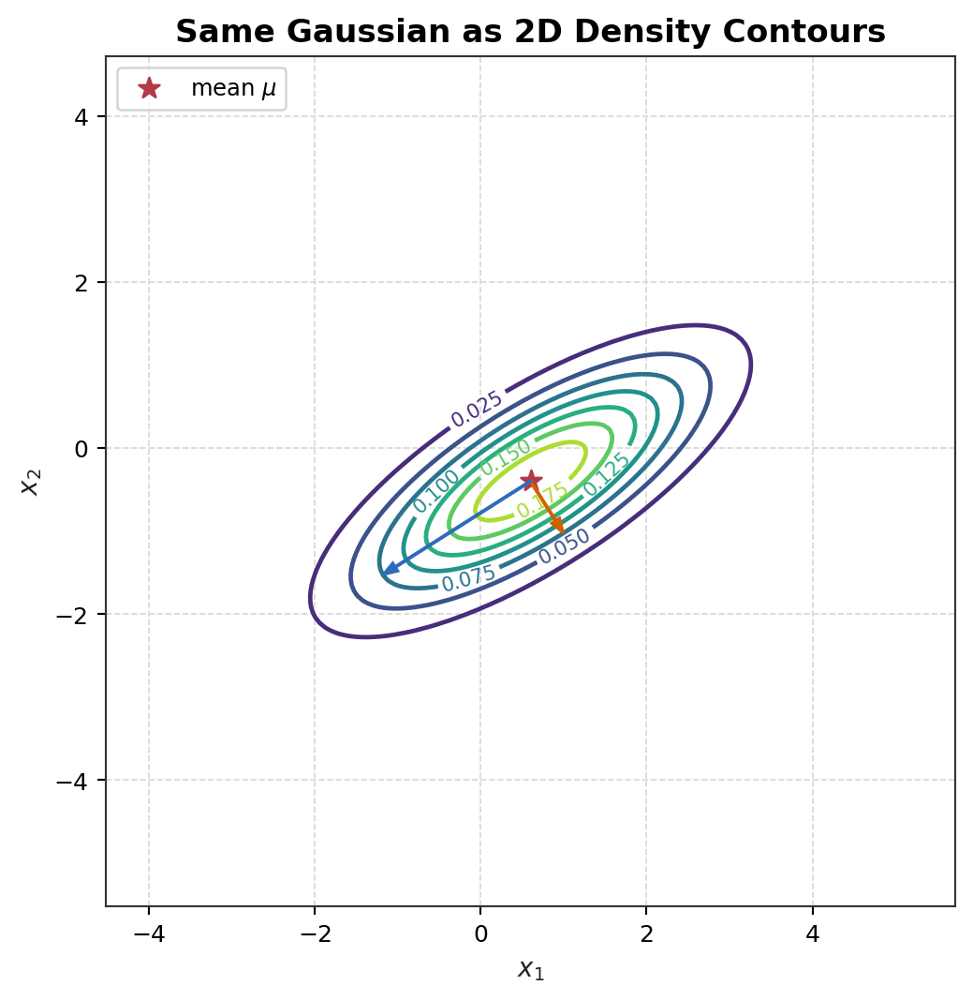
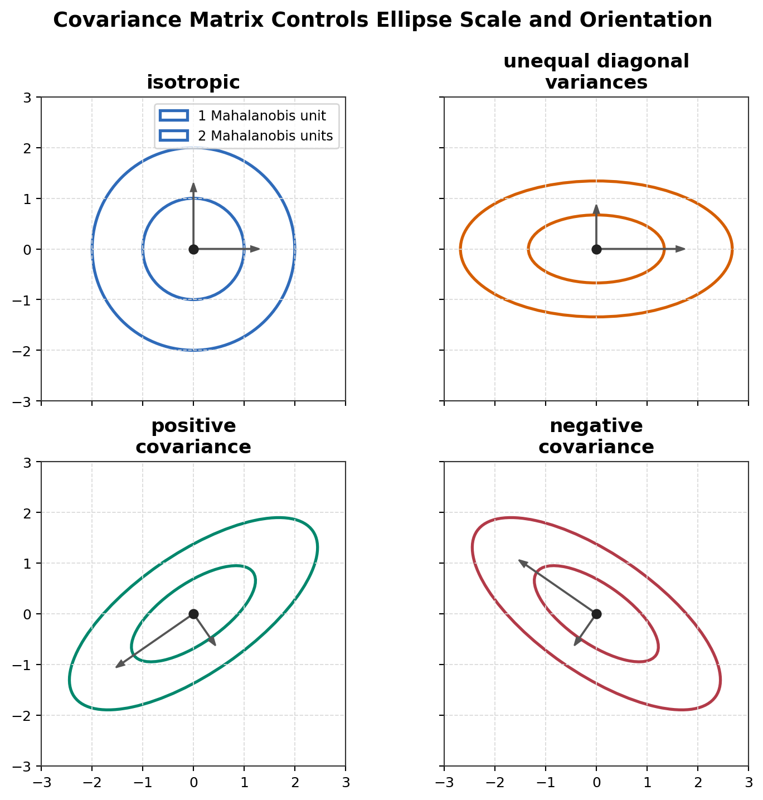
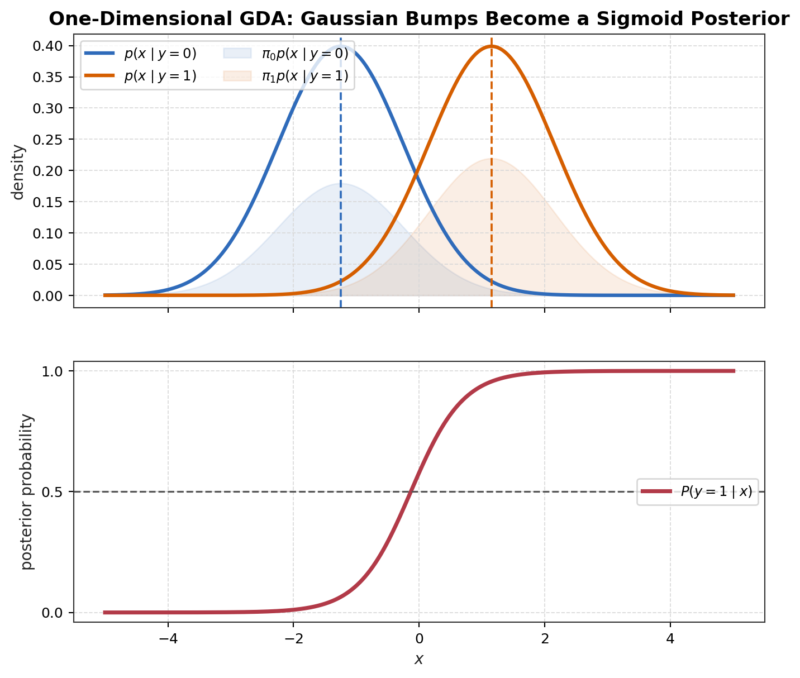
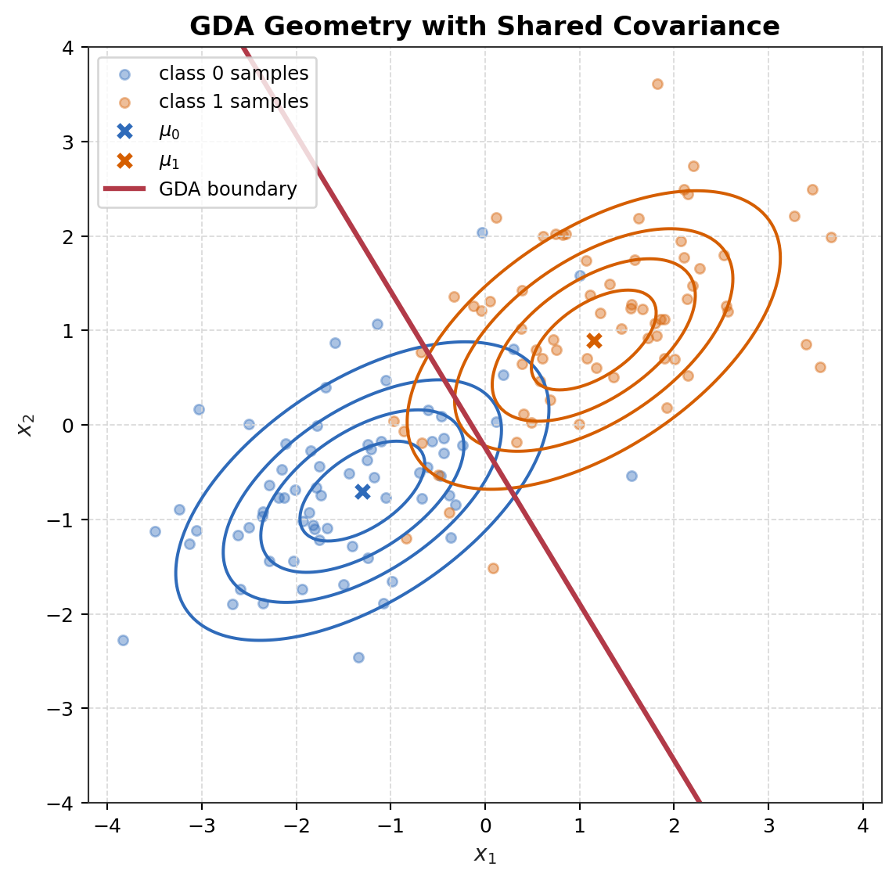
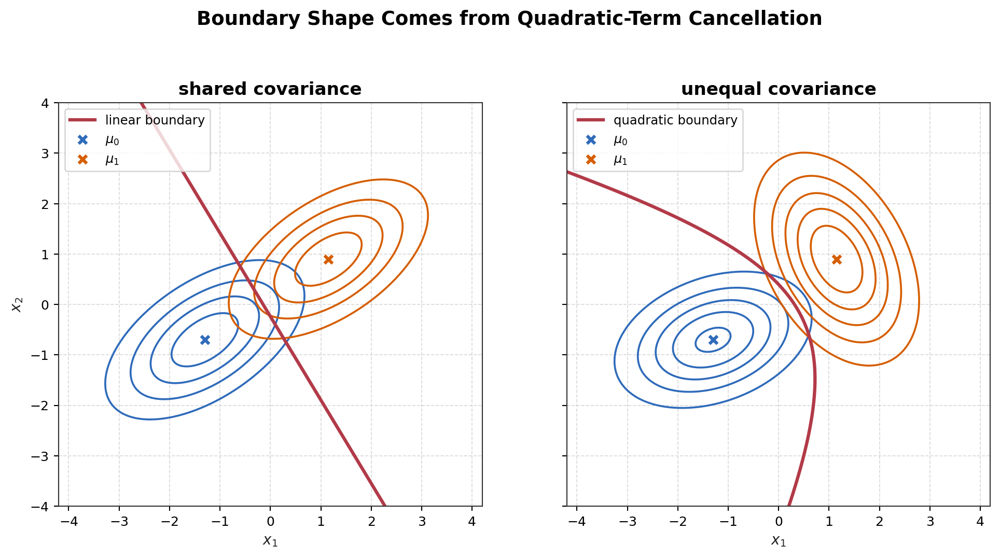
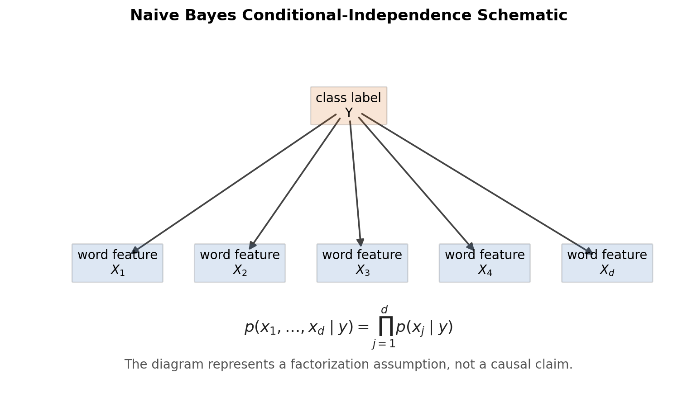

# Lecture 5: Generative Learning Algorithms, GDA, and Naive Bayes

Canonical references: [Stanford CS229 Autumn 2018 syllabus](https://cs229.stanford.edu/syllabus-autumn2018.html), [Stanford Online Lecture 5 video](https://www.youtube.com/watch?v=nt63k3bfXS0), [official CS229 Generative Algorithms notes](https://cs229.stanford.edu/notes_archive/cs229-notes2.pdf), [official multivariate Gaussian section notes](https://cs229.stanford.edu/section/gaussians.pdf), [More on Multivariate Gaussians](https://cs229.stanford.edu/section/more_on_gaussians.pdf), and historical SEE [Lecture 5 transcript](https://see.stanford.edu/materials/aimlcs229/transcripts/MachineLearning-Lecture05.html).

Scope note: Autumn 2018 syllabus 把 Lecture 5 标为 Gaussian Discriminant Analysis 和 Naive Bayes；Lecture 6 才开始 Laplace Smoothing 和 Support Vector Machines。官方 `cs229-notes2.pdf` 的 Generative Algorithms notes 会继续讲 Laplace smoothing 和 text event models，所以本笔记把这些内容作为 notes2 continuation material 处理，不把它们塞进 Lecture 5 主线。旧版 SEE transcript 记录了 Andrew Ng 在同一讲中给出 Poisson、exponential family、small-data tradeoff 和 Naive Bayes 的更口语化解释；本笔记把这些内容标为 historical instructor clarification，而不是声称它们逐字属于 Autumn 2018 Lecture 5 written boundary。

## Navigation

| Module | Purpose |
|---|---|
| [1. Course Position](#1-course-position) | 从 Lecture 4 的 conditional GLM 接到 Lecture 5 的 joint modeling |
| [2. Learning Objectives](#2-learning-objectives) | 明确本笔记已经完成的理解目标 |
| [3. Source Coverage and Boundary](#3-source-coverage-and-boundary) | 区分 official Lecture 5 内容和 notes2 continuation |
| [4. Notation Convention](#4-notation-convention) | 固定 random variable、realization、sample 和 dimension 符号 |
| [5. Generative versus Discriminative Learning](#5-generative-versus-discriminative-learning) | 解释两类学习器到底在学习什么 |
| [6. Multivariate Gaussian Distribution](#6-multivariate-gaussian-distribution) | 定义 density、mean、covariance、PSD 和 PD |
| [7. Mahalanobis Geometry](#7-mahalanobis-geometry) | 推导 covariance-aware quadratic form |
| [8. Gaussian Isocontours and Determinant](#8-gaussian-isocontours-and-determinant) | 连接 covariance、ellipse、PCA directions、density height 和 volume |
| [9. GDA Model and Generative Story](#9-gda-model-and-generative-story) | 定义 GDA assumptions 和 sampling direction |
| [10. GDA Joint Likelihood and MLE](#10-gda-joint-likelihood-and-mle) | 推导参数估计和 pooled covariance 逻辑 |
| [11. GDA Posterior Has Logistic Form](#11-gda-posterior-has-logistic-form) | 用一维直觉和代数推导说明 Gaussian 如何推出 sigmoid posterior |
| [12. Why the GDA Boundary Is Linear](#12-why-the-gda-boundary-is-linear) | 区分 density、isocontour、discriminant function、decision boundary，并解释 shared-covariance boundary |
| [13. QDA: Unequal Covariance and Quadratic Boundary](#13-qda-unequal-covariance-and-quadratic-boundary) | 在 shared-covariance boundary 后说明 unequal covariance 为什么产生 quadratic boundary |
| [14. GDA versus Logistic Regression](#14-gda-versus-logistic-regression) | 比较 assumptions、objective、finite-sample estimator、asymptotic nuance、efficiency 和 robustness |
| [15. Naive Bayes for Discrete Features](#15-naive-bayes-for-discrete-features) | 从 continuous GDA features 转到 binary word features |
| [16. Conditional Independence](#16-conditional-independence) | 从 chain rule 推出 Naive Bayes factorization |
| [17. Naive Bayes Parameters and MLE](#17-naive-bayes-parameters-and-mle) | 推导 Bernoulli feature parameters 和 class prior |
| [18. Naive Bayes Prediction](#18-naive-bayes-prediction) | 得到 posterior score 和 log-space prediction |
| [19. Why Naive Bayes Can Work](#19-why-naive-bayes-can-work) | 解释 naive assumption 虽强但分类仍可能有效 |
| [20. Research-Level Synthesis](#20-research-level-synthesis) | 连接 assumptions、shift、reliability 和 failure modes |
| [21. Official Coverage Audit](#21-official-coverage-audit) | 核对 Lecture 5 官方主题是否覆盖 |
| [22. Fast Review Answers and Checklist](#22-fast-review-answers-and-checklist) | 快速复习答案，不放未完成问题 |
| [23. Lecture Boundary and Completed Status](#23-lecture-boundary-and-completed-status) | 明确 Lecture 5 / Lecture 6 边界和本讲成品状态 |
| [24. Concept Map Summary](#24-concept-map-summary) | 用一页 map 总结本讲逻辑 |

**Related math derivations**

| Topic in this note | Deep-dive |
|---|---|
| Multivariate Gaussian density, covariance, Mahalanobis geometry, isocontours, determinant | [Multivariate Gaussian Geometry](../../math-derivations/lecture-05-generative-learning-gda-naive-bayes/01-multivariate-gaussian-geometry.md) |
| GDA MLE, MAP prediction, pooled covariance, discriminants, QDA boundary geometry, and logistic/exponential-family connections | [GDA MLE and Logistic Connection](../../math-derivations/lecture-05-generative-learning-gda-naive-bayes/02-gda-mle-and-logistic-connection.md) |
| Naive Bayes factorization, Bernoulli feature likelihood, MLE, and log-space prediction | [Naive Bayes Factorization and MLE](../../math-derivations/lecture-05-generative-learning-gda-naive-bayes/03-naive-bayes-factorization-and-mle.md) |
| Lecture 4 bridge: conditional exponential-family modeling | [GLM Construction Recipe](../../math-derivations/lecture-04-perceptron-exponential-family-glm/07-glm-construction-recipe.md) |

**Figures**

| Figure | File |
|---|---|
| Generative versus discriminative modeling schematic | [lecture05-generative-vs-discriminative.png](../../assets/figures/lecture05-generative-vs-discriminative.png) |
| Bivariate Gaussian 3D density | [lecture05-bivariate-gaussian-density-3d.png](../../assets/figures/lecture05-bivariate-gaussian-density-3d.png) |
| Same Gaussian 2D contours | [lecture05-bivariate-gaussian-contours.png](../../assets/figures/lecture05-bivariate-gaussian-contours.png) |
| Covariance geometry variants | [lecture05-covariance-geometry-variants.png](../../assets/figures/lecture05-covariance-geometry-variants.png) |
| One-dimensional Gaussian class-conditionals to sigmoid posterior | [lecture05-gda-1d-gaussian-to-sigmoid.png](../../assets/figures/lecture05-gda-1d-gaussian-to-sigmoid.png) |
| GDA shared-covariance geometry | [lecture05-gda-shared-covariance-boundary.png](../../assets/figures/lecture05-gda-shared-covariance-boundary.png) |
| Shared covariance versus unequal covariance boundary | [lecture05-gda-qda-boundary-comparison.png](../../assets/figures/lecture05-gda-qda-boundary-comparison.png) |
| Naive Bayes conditional-independence schematic | [lecture05-naive-bayes-conditional-independence.png](../../assets/figures/lecture05-naive-bayes-conditional-independence.png) |

## 1. Course Position

Lecture 4 的主线是 conditional probabilistic modeling。GLM 的建模入口是：

```math
p(y\mid x;\theta)
```

也就是先指定给定 input 后 response 的 conditional distribution，再用 conditional likelihood 学习参数。Logistic regression 是最重要的 binary example：

```math
P(Y=1\mid X=x;\theta)=\frac{1}{1+\exp(-\theta^Tx)}.
```

Lecture 5 换了一条建模路线。它不先直接选择 $P(y\mid x)$，而是通过 class prior 和 class-conditional distribution 建模 joint distribution：

```math
p(x,y)=p(x\mid y)P(y).
```

同一个 joint distribution 也可以写成：

```math
p(x,y)=p(x\mid y)P(y)=P(y\mid x)p(x).
```

所以 generative classifier 最终仍然预测 $P(y\mid x)$。区别在于：它先建模 $P(y)$ 和 $p(x\mid y)$，再通过 Bayes rule 反推出 posterior。

Lecture 4 到 Lecture 5 的核心桥梁是：

```text
Lecture 4: choose p(y | x) through exponential-family / GLM structure.
Lecture 5: choose p(x | y) and P(y), then derive P(y | x).
```

这也解释了为什么两条完全不同的建模路线最后都可能得到 logistic-looking posterior：logistic regression 直接假设 posterior 的形式；GDA 假设 shared-covariance Gaussian class-conditionals，然后推出 posterior 具有 logistic form。

## 2. Learning Objectives

本笔记完成以下理解目标：

* 说清 discriminative learner 和 generative learner 分别建模什么；
* 用 Bayes rule 把 generative model 变成 classifier；
* 定义 non-degenerate multivariate Gaussian density，并解释每个符号；
* 区分 covariance matrix 一般只保证 PSD 和普通 density formula 要求 PD；
* 把 Gaussian quadratic form 理解成 squared Mahalanobis distance；
* 从 density level set 推导 Gaussian ellipse / ellipsoid；
* 把 determinant 解释为 uncertainty-volume scaling，而不是 point probability；
* 说明 Gaussian contour 主轴、covariance eigenvectors 和 PCA 主成分方向之间的关系；
* 明确区分 Gaussian density、Gaussian isocontour、discriminant function 和 decision boundary；
* 写出 GDA model、generative story、joint likelihood 和 MLE；
* 推导 GDA posterior log-odds，并说明为什么 shared covariance 会产生 linear boundary；
* 解释 Gaussian contours 是 ellipses 但 GDA decision boundary 是 line / hyperplane 的原因；
* 证明 Gaussian class-conditionals 是 logistic posterior 的 sufficient but not necessary condition；
* 比较 GDA 和 logistic regression 的 assumptions、objective、finite-sample estimator、asymptotic nuance、sample efficiency、misspecification、robustness 和 computation；
* 从 chain rule 加 conditional independence 推出 Naive Bayes factorization；
* 推导 Bernoulli Naive Bayes 的 MLE 和 log-space prediction；
* 把 GDA / NB 的 assumptions 连接到 distribution shift、reliability 和 failure modes。

## 3. Source Coverage and Boundary

本讲的 source hierarchy 是：

```text
Stanford CS229 Autumn 2018 official syllabus and lecture/video boundary
-> official CS229 Generative Algorithms notes
-> official CS229 multivariate Gaussian section notes
-> historical CS229 Lecture 5 transcript when it clarifies instructor intuition
-> rigorous derivations and geometric explanations in this repository
```

Autumn 2018 official syllabus 给出的边界是：

| Date | Lecture | Official topic |
|---|---|---|
| 2018-10-08 | Lecture 5 | Gaussian Discriminant Analysis. Naive Bayes. |
| 2018-10-10 | Lecture 6 | Laplace Smoothing. Support Vector Machines. |

Stanford Online 视频 metadata 标题为 Lecture 5 - GDA and Naive Bayes。可抽取的 YouTube chapter metadata 包含 GDA 相关章节，没有暴露单独的 Laplace smoothing 或 multinomial event model 章节。审计时页面 metadata 中存在 caption track，但 caption endpoint 返回空文本，所以本笔记不声称已经获得 transcript-level evidence。

官方 `cs229-notes2.pdf` 覆盖范围比 Autumn 2018 Lecture 5 更长：它先讲 generative-learning introduction、GDA、GDA versus logistic regression、Naive Bayes，然后继续讲 Laplace smoothing 和 text event models。本笔记按照 Autumn 2018 Lecture 5 边界处理：Laplace smoothing 和 multinomial event model 不纳入 Lecture 5 主线。

Historical transcript 的价值在于保留课堂解释脉络：一维 Gaussian bumps 通过 Bayes rule 生成 sigmoid posterior；Poisson class-conditionals 也生成 logistic posterior；same exponential family with different natural parameters 会给出 logistic posterior in canonical statistics；stronger correct assumptions 在 small data 下可能更 data-efficient，而 weaker assumptions 通常更 robust。Transcript 是 historical instructor clarification，不替代 Autumn 2018 syllabus 的 topic boundary。

2026 source check: official Stanford CS229 [Spring 2026](https://cs229.stanford.edu/index.html-spr26) and [Summer 2026](https://cs229.stanford.edu/) course pages are publicly visible, but both state that course-material links require Stanford email login and are shared only with Stanford University affiliates. A third-party [Summify page](https://summify.io/discover/stanford-cs229-machine-learning-spring-2026-lecture-5-gaussi-zRdE8A) attributed to Stanford Online indicates Spring 2026 Lecture 5 topics including QDA, diffusion models, LLMs, and GANs; that page is used only as topic indication, not as the sole basis for mathematical claims. 本轮只把 QDA 作为 shared-covariance GDA boundary 的自然延拓加入 Section 13；没有加入 generative AI survey。

## 4. Notation Convention

本笔记使用：

| Symbol | Meaning |
|---|---|
| $X$ | random feature vector |
| $x$ | realized feature vector |
| $X_j$ | 第 $j$ 个 feature random variable |
| $x_j$ | realized feature coordinate |
| $Y$ | label random variable |
| $y$ | realized label |
| $x^{(i)}$ | 第 $i$ 个 training example 的 feature vector |
| $y^{(i)}$ | 第 $i$ 个 training example 的 observed label |
| $m$ | number of training examples |
| $d$ | feature dimension |
| $\mathcal D$ | training set |

Training set 写成：

```math
\mathcal D=\{(x^{(i)},y^{(i)})\}_{i=1}^m.
```

部分 official CS229 notes 使用 $n$ 表示 feature 数量。本仓库用 $d$ 表示 feature dimension，用 $m$ 表示 sample size，避免把样本数和维度混在一起。

## 5. Generative versus Discriminative Learning

Discriminative learner 直接学习 conditional distribution 或 direct decision rule：

```math
p(y\mid x;\theta)
```

或者：

```math
h_\theta:\mathcal X\to\mathcal Y.
```

Lecture 3 和 Lecture 4 中的 logistic regression 是 probabilistic discriminative model：

```math
P(Y=1\mid X=x;\theta)=g(\theta^Tx).
```

Generative learner 建模：

```math
P(y)
```

和：

```math
p(x\mid y).
```

因此它建模 joint distribution：

```math
p(x,y)=p(x\mid y)P(y).
```

这里的 generate 不是说模型一定要输出逼真的样本，而是说模型描述了 complete labeled example 的 sampling process：先根据 class prior 抽 $Y$，再根据该 class 的 class-conditional distribution 抽 $X$。

Generative learning does not stop after learning $p(x\mid y)$ and $P(y)$。The final classifier is obtained by converting those learned distributions into a posterior ranking over classes:

```text
learn p(x|y), P(y)
-> obtain p(x,y)
-> Bayes theorem
-> rank candidate y
-> argmax
-> predicted class
```

给定一个已经观察到的 input $X=x$，Bayes classifier 选择 posterior probability 最大的 class：

```math
\hat y(x)
=
\underset{y\in\mathcal Y}{\mathrm{argmax}}
P(Y=y\mid X=x).
```

这里不要默认把 `argmax` 当成一个黑箱。`arg` 是 argument。若：

```math
f:\mathcal Y\rightarrow\mathbb R,
```

则：

```math
\max_y f(y)
```

返回的是 $f$ 的 maximum value，而：

```math
\underset{y}{\mathrm{argmax}}\ f(y)
```

返回的是达到该 maximum 的 $y$ value(s)。例如：

```math
f(0)=0.3,
\qquad
f(1)=0.7.
```

则：

```math
\max_y f(y)=0.7,
```

但：

```math
\underset{y}{\mathrm{argmax}}\ f(y)=1.
```

Classification 需要的是 class label，不只是最大的 probability value。如果存在 tie，数学上的 `argmax` 可以返回一个集合；实际 classifier 还需要一个 tie-breaking rule。

预测时方向反过来，用 Bayes rule：

```math
P(Y=y\mid X=x)
=
\frac{
p(X=x\mid Y=y)P(Y=y)
}{
p(X=x)
}.
```

因为 prediction 时 $X=x$ 已经被观察并固定，$p(X=x)$ 对所有候选 class $y$ 都是相同的正数常量。因此：

```math
\hat y(x)
=
\underset{y\in\mathcal Y}{\mathrm{argmax}}
P(Y=y\mid X=x)
```

```math
=
\underset{y\in\mathcal Y}{\mathrm{argmax}}
\frac{
p(x\mid y)P(y)
}{
p(x)
}
```

```math
=
\underset{y\in\mathcal Y}{\mathrm{argmax}}
p(x\mid y)P(y).
```

这里的 $p(x\mid y)P(y)$ 是 prediction-time unnormalized posterior score。

```text
This removes only the common normalization term.
It does NOT mean p(x) is mathematically absent from Bayes' rule.
```

也就是说：

```text
Bayes posterior calculation:
needs p(x) for normalized probabilities.

Classification argmax:
does not need p(x), because it is constant across candidate y.
```

这条：

```math
\hat y(x)
=
\underset{y}{\mathrm{argmax}}
P(Y=y\mid X=x)
```

称为 maximum a posteriori (MAP) classification。这里的 MAP 是 prediction time 对 class labels 的 posterior argmax；不要和 training time 的 parameter estimation 混淆。GDA training 用 MLE 估计 $\phi,\mu_k,\Sigma$，而 prediction 用 MAP / posterior argmax over $y$。Naive Bayes 也同样先用 MLE 估计 class prior 和 feature likelihood parameters，再用 posterior argmax 做分类。



Figure 1. Discriminative learning 直接建模 $P(y\mid x)$ 或 decision rule；generative learning 建模 $P(y)$ 和 $p(x\mid y)$，再用 Bayes rule 推断 label。

Generative modeling 增加了对 world 的结构假设：不仅要能分 label，还要描述每个 class 内 feature 怎么分布。这个额外结构在 assumption 近似正确时可能带来 sample-efficiency advantage；在 assumption 错误时也会带来 misspecification risk。

### 5.1 训练目标、损失函数和分类器

先把后文常用词固定下来，不默认读者已经知道这些术语。

* 先验概率（prior）：观察 $x$ 之前，类别标签的基础概率，例如 $P(Y=y)$。在邮件分类中，它表示一封随机邮件本来是 spam 的概率。
* 似然（likelihood）：把标签 $y$ 当作已知时，观察到特征 $x$ 的概率或密度，例如 $p(x\mid y)$。在 GDA 中，它表示“如果这类是 $y$，这个 $x$ 像不像该类的 Gaussian”。
* 后验概率（posterior）：观察到 $x$ 之后，对标签概率的更新，例如 $P(Y=y\mid X=x)$。分类器最终比较的通常就是 posterior。
* 联合分布（joint distribution）：同时描述 $X$ 和 $Y$ 的分布，例如 $p(x,y)$。
* 边缘分布（marginal distribution）：只看其中一个变量的分布，例如 $p(x)=\sum_y p(x,y)$。它把 $Y$ 求和或积分掉。
* 条件分布（conditional distribution）：给定一个变量后，另一个变量的分布，例如 $p(y\mid x)$ 或 $p(x\mid y)$。
* 损失函数（loss）：对一次预测或一次概率赋值的惩罚。Loss 越小，模型在这个训练样本上越符合训练准则。
* 目标函数（objective）：训练时对所有样本的 loss 加总或平均后得到的函数，通常记为 $J(\theta)$。训练算法最小化 objective。
* 替代损失（surrogate loss）：代替真正目标的可优化 loss。例如分类真正关心 $0$-$1$ error，但训练常用 cross entropy。
* 严格适当评分规则（proper scoring rule）：一类概率预测 loss；如果模型要报告一个概率分布，它在真实分布处取得总体最优值。Log loss / cross entropy 是最重要的例子。

贝叶斯公式把这几个概率对象连接起来：

```math
P(Y=y\mid X=x)
=
\frac{
p(X=x\mid Y=y)P(Y=y)
}{
p(X=x)
}.
```

用术语说就是：

```text
后验概率 = 似然 * 先验概率 / 边缘证据
```

其中 $p(X=x)$ 也常叫证据（evidence）或归一化项（normalization term），因为它保证所有候选标签的 posterior 加起来等于 $1$。

这里需要区分四个不同对象。给定有标签数据集：

```math
\mathcal D=\{(x^{(i)},y^{(i)})\}_{i=1}^m,
\qquad
y^{(i)}\in\mathcal Y,
```

机器学习算法通常先指定一个带参数的统计模型，再通过目标函数学习参数，最后由学到的参数定义预测规则。也就是：

```text
模型族 q_theta
-> 训练目标 J(theta)
-> 学到的参数 theta_hat
-> 分类器 h_{theta_hat}
```

因此 $h_\theta$ 和 $J(\theta)$ 不是同一个数学对象。$h_\theta$ 是给定参数后的预测规则；$J(\theta)$ 是用训练数据选择参数的准则。一般可以写成：

```math
\hat\theta
=
\underset{\theta}{\mathrm{argmin}}\ J(\theta),
```

其中：

```math
J(\theta)
=
\frac1m
\sum_{i=1}^m
\ell_\theta(x^{(i)},y^{(i)})
+
\lambda\Omega(\theta).
```

这里 $\ell_\theta$ 是损失函数，$\Omega$ 是正则项。Loss 的选择不是任意装饰；它表达了我们选择估计哪一个概率对象。对概率模型，最常见、也最有统计意义的选择是负对数似然：

```math
\ell_\theta(\text{observation})
=
-
\log q_\theta(\text{observation}).
```

区别在于：不同建模路线把什么当作需要用似然解释的观察对象。

判别式模型直接指定条件分布：

```math
q_\theta(y\mid x).
```

因此训练时最大化条件似然，或等价地最小化条件负对数似然：

```math
J_{\mathrm{disc}}(\theta)
=
-
\sum_{i=1}^m
\log q_\theta(y^{(i)}\mid x^{(i)}).
```

训练完后，分类器是：

```math
h_\theta(x)
=
\underset{y\in\mathcal Y}{\mathrm{argmax}}\ q_\theta(y\mid x).
```

如果强行把判别式模型写成联合形式：

```math
q_\theta(x,y)=q_\theta(y\mid x)p_X(x),
```

那么 $p_X(x)$ 不是这个判别式模型要学习的对象。只要 $p_X$ 不含 $\theta$，则：

```math
\sum_{i=1}^m
\log q_\theta(x^{(i)},y^{(i)})
=
\sum_{i=1}^m
\log q_\theta(y^{(i)}\mid x^{(i)})
+
\sum_{i=1}^m
\log p_X(x^{(i)}),
```

最后一项对 $\theta$ 是常数。所以对 $\theta$ 的优化等价于条件似然优化。这就是 logistic regression 直接写 $P_\theta(Y\mid X)$ 的对数似然的原因：它没有承诺去解释特征分布 $p_X(x)$。

生成式模型的路线不同。它指定：

```math
\pi_\theta(y)=P_\theta(Y=y),
\qquad
q_\theta(x\mid y)=p_\theta(X=x\mid Y=y),
```

从而指定联合模型：

```math
q_\theta(x,y)=q_\theta(x\mid y)\pi_\theta(y).
```

所以训练目标是联合负对数似然：

```math
J_{\mathrm{gen}}(\theta)
=
-
\sum_{i=1}^m
\log q_\theta(x^{(i)},y^{(i)})
```

```math
=
-
\sum_{i=1}^m
\left[
\log q_\theta(x^{(i)}\mid y^{(i)})
+
\log \pi_\theta(y^{(i)})
\right].
```

这解释了 GDA 为什么训练联合似然：它要估计的是类别先验、类别均值和协方差，也就是整个类别条件数据生成结构。对 GDA：

```math
\theta=(\phi,\mu_0,\mu_1,\Sigma).
```

预测时，输入 $x$ 已经被观察到。此时分类器不需要重新最大化联合似然，而是从已经学到的联合模型中用贝叶斯公式诱导后验概率：

```math
r_\theta(y\mid x)
=
\frac{
q_\theta(x\mid y)\pi_\theta(y)
}{
\sum_{y'\in\mathcal Y}
q_\theta(x\mid y')\pi_\theta(y')
}.
```

于是：

```math
h_\theta(x)
=
\underset{y\in\mathcal Y}{\mathrm{argmax}}\ r_\theta(y\mid x)
```

```math
=
\underset{y\in\mathcal Y}{\mathrm{argmax}}\ q_\theta(x\mid y)\pi_\theta(y)
```

```math
=
\underset{y\in\mathcal Y}{\mathrm{argmax}}
\left[
\log q_\theta(x\mid y)+\log\pi_\theta(y)
\right].
```

这里没有逻辑不一致。训练目标回答的是：

```text
在选定模型族下，哪个 theta 最能解释已经观察到的有标签样本？
```

预测规则回答的是：

```text
theta 已经固定且 x 已经观察到之后，哪个标签具有最大的 posterior 支持？
```

二者由同一个已经拟合好的概率模型连接，但不是同一个优化问题。更严格地说，$h_\theta$ 是由 $\theta$ 推导出来的预测函数；而 $\hat\theta$ 是通过最小化 $J(\theta)$ 得到的估计量。

这句话要精确理解：

```text
判别式模型的训练对象和预测对象是对齐的：
二者都围绕 P(Y | X)。

生成式模型的训练对象和预测对象是相连但不相同的：
训练拟合 P(X, Y)，预测使用 P(Y | X)。
```

这里的“对齐”不表示训练损失等于最终分类损失。Logistic regression 的 cross entropy 仍然不是 $0$-$1$ loss；它是用来估计条件分布的替代损失，也是概率预测中的严格适当评分规则。严格地说，判别式模型的一致性来自它直接最小化条件负对数似然。令真实数据分布为 $P_*$，判别式模型为 $q_\theta(y\mid x)$，总体条件风险是：

```math
\mathcal R_{\mathrm{cond}}(\theta)
=
\mathbb E_{(X,Y)\sim P_*}
\left[
-
\log q_\theta(Y\mid X)
\right].
```

把它按每个 $x$ 分解：

```math
\mathcal R_{\mathrm{cond}}(\theta)
=
H_{P_*}(Y\mid X)
+
\mathbb E_{X\sim P_{*,X}}
\left[
\mathrm{KL}
\left(
P_*(Y\mid X)
\middle\|
q_\theta(Y\mid X)
\right)
\right].
```

第一项不依赖 $\theta$。因此如果条件模型族足够正确，最优解会满足：

```math
q_{\theta^*}(Y\mid X)
=
P_*(Y\mid X)
\qquad
P_{*,X}\text{-almost surely}.
```

预测时又使用：

```math
h_{\theta}(x)
=
\underset{y}{\mathrm{argmax}}\ q_\theta(y\mid x).
```

所以判别式训练和预测围绕同一个概率对象：$P(Y\mid X)$。

生成式模型的严谨逻辑不同。令生成式模型给出联合密度或联合概率质量：

```math
q_\theta(x,y)
=
q_\theta(x\mid y)\pi_\theta(y).
```

总体联合风险是：

```math
\mathcal R_{\mathrm{joint}}(\theta)
=
\mathbb E_{(X,Y)\sim P_*}
\left[
-
\log q_\theta(X,Y)
\right]
```

```math
=
H_{P_*}(X,Y)
+
\mathrm{KL}
\left(
P_*(X,Y)
\middle\|
q_\theta(X,Y)
\right).
```

如果联合模型族正确，最优解会恢复真实联合分布：

```math
q_{\theta^*}(X,Y)
=
P_*(X,Y).
```

贝叶斯公式这时提供从联合分布到后验概率的确定映射。对任何满足 $P_{*,X}(x)>0$ 的 $x$：

```math
q_{\theta^*}(y\mid x)
=
\frac{
q_{\theta^*}(x,y)
}{
q_{\theta^*}(x)
}
=
\frac{
P_*(x,y)
}{
P_{*,X}(x)
}
=
P_*(y\mid x).
```

这就是“联合分布包含后验概率所需全部信息”的严格含义。不是因为联合似然和条件似然在代数上等价，而是因为一个正确的联合分布通过贝叶斯公式唯一决定后验分布。

这里要特别区分“概率对象之间的映射”和“优化目标之间的等价”。贝叶斯公式保证的是：

```text
给定一个 joint distribution q_theta(x, y)
-> 可以确定它诱导出的 posterior q_theta(y | x)
```

也就是联合分布到后验分布的函数映射。但它不保证：

```text
joint likelihood 增大
-> conditional likelihood 一定增大
```

也不保证：

```text
joint likelihood 的最优 theta
=
conditional likelihood 的最优 theta
```

原因是：

```math
\log q_\theta(y\mid x)
=
\log q_\theta(x,y)
-
\log q_{\theta,X}(x).
```

预测时，$\theta$ 已经固定，$x$ 也已经固定；在比较不同候选 $y$ 时，$q_{\theta,X}(x)$ 是共同分母，所以可以从 $\underset{y}{\mathrm{argmax}}$ 中删去。训练时则不同：优化变量是 $\theta$，而：

```math
q_{\theta,X}(x)
=
\sum_{y\in\mathcal Y}
q_\theta(x,y)
```

本身依赖 $\theta$。因此训练时不能把 $\log q_{\theta,X}(x)$ 当成常数删掉。换句话说，贝叶斯公式让 joint model 能够产生 posterior classifier；但贝叶斯公式不把 joint optimization 变成 conditional optimization。

同时，联合目标和条件目标一般不等价。把 joint KL 展开：

```math
\mathrm{KL}
\left(
P_*(X,Y)
\middle\|
q_\theta(X,Y)
\right)
=
\mathrm{KL}
\left(
P_{*,X}
\middle\|
q_{\theta,X}
\right)
```

```math
+
\mathbb E_{X\sim P_{*,X}}
\left[
\mathrm{KL}
\left(
P_*(Y\mid X)
\middle\|
q_\theta(Y\mid X)
\right)
\right],
```

其中：

```math
q_{\theta,X}(x)
=
\sum_{y\in\mathcal Y}
q_\theta(x,y).
```

这个分解说明：生成式联合拟合同时关心两件事：

```text
1. 模型把边缘特征分布 X 解释得多好
2. 模型诱导出来的 posterior 把给定 X 后的 Y 解释得多好
```

而判别式拟合只保留第二项。预测时 $q_{\theta,X}(x)$ 在 $\underset{y}{\mathrm{argmax}}\,q_\theta(y\mid x)$ 中对候选 $y$ 是共同分母，所以可以删去；但训练时 $q_{\theta,X}$ 依赖 $\theta$，不能把它当成常数忽略。

因此在模型错设下，两种总体目标通常不同：

```math
\theta^*_{\mathrm{joint}}
=
\underset{\theta}{\mathrm{argmin}}
\mathrm{KL}
\left(
P_*(X,Y)
\middle\|
q_\theta(X,Y)
\right),
```

但：

```math
\theta^*_{\mathrm{cond}}
=
\underset{\theta}{\mathrm{argmin}}
\mathbb E_{X\sim P_{*,X}}
\left[
\mathrm{KL}
\left(
P_*(Y\mid X)
\middle\|
q_\theta(Y\mid X)
\right)
\right].
```

这也解释了 GDA 和 logistic regression 即使都能产生形式上像 logistic 的后验概率，训练结果仍可能不同。生成式训练在估计联合分布，因此它会关心类别条件密度的形状、扩散程度、相关性和先验概率。判别式训练只关心条件标签似然，因此它把统计资源集中在后验概率和决策边界上。如果 GDA 假设正确，联合模型的额外结构会提高小样本效率；如果假设错误，联合似然可能把参数拉向更好解释 $x$ 的密度形状，而这个方向不一定最有利于条件分类。

### 5.2 优化理论和现代机器学习视角

现代机器学习中，一个 classifier 的学习问题最好分成三层：

```text
统计目标
-> 经验优化问题
-> 数值算法 / 闭式解求解器
```

统计目标是总体层面的对象，回答“如果有无限数据，应该学什么”。经验优化问题是有限样本上实际最小化的目标函数。数值算法只回答“怎样把这个有限样本目标优化到足够好”。把这三层混在一起，会误以为训练损失、假设函数和最终预测目标必须长得完全一样。

最终分类任务通常关心 $0$-$1$ risk：

```math
\mathcal R_{0/1}(h)
=
P_*
\left(
h(X)\neq Y
\right).
```

Bayes 最优分类器是：

```math
h_*(x)
=
\underset{y\in\mathcal Y}{\mathrm{argmax}}\ P_*(Y=y\mid X=x).
```

因此分类任务的真正信息瓶颈是 posterior $P_*(Y\mid X)$。但是 $0$-$1$ loss 不连续、不可微、难优化；而且它只关心 argmax，不直接惩罚概率校准。因此实际训练常用替代损失。Log loss / cross entropy 是最重要的概率替代损失。

判别式 log loss 是条件概率上的严格适当评分规则。对任意固定 $x$，若真实条件分布是 $p_*(\cdot\mid x)$，模型报告分布 $q(\cdot\mid x)$，则期望 log loss 为：

```math
\mathbb E_{Y\sim p_*(\cdot\mid x)}
\left[
-
\log q(Y\mid x)
\right]
=
H(p_*(\cdot\mid x))
+
\mathrm{KL}
\left(
p_*(\cdot\mid x)
\middle\|
q(\cdot\mid x)
\right).
```

因为 KL divergence 非负，最优报告是：

```math
q(\cdot\mid x)=p_*(\cdot\mid x).
```

这就是判别式 log loss 和最终后验概率预测对齐的严格含义：它不是直接优化 $0$-$1$ loss，但它的总体最小点是真实 posterior；真实 posterior 的 argmax 给出贝叶斯分类器。换句话说，判别式学习把优化目标直接放在后验概率对象上。

生成式 log loss 是联合分布上的 proper scoring rule。对联合分布：

```math
\mathbb E_{(X,Y)\sim P_*}
\left[
-
\log q(X,Y)
\right]
=
H(P_*)
+
\mathrm{KL}
\left(
P_*(X,Y)
\middle\|
q(X,Y)
\right).
```

因此如果模型族包含真实分布，联合 log loss 的总体最小点是真实联合分布。真实联合分布再通过贝叶斯公式给出真实 posterior：

```math
q_*(y\mid x)
=
\frac{q_*(x,y)}{q_{*,X}(x)}
=
P_*(y\mid x),
\qquad
q_{*,X}(x)>0.
```

所以生成式学习的合理性来自：

```text
正确的联合模型
-> 正确的联合分布
-> 贝叶斯公式
-> 正确的 posterior
-> Bayes 最优分类器
```

这是一条一致性链条，不是说联合经验目标和条件经验目标是同一个函数。

从经验风险最小化的角度，有限样本训练的是：

```math
\hat{\mathcal R}_m(\theta)
=
\frac1m
\sum_{i=1}^m
\ell_\theta(x^{(i)},y^{(i)})
+
\lambda\Omega(\theta).
```

训练误差小只说明经验目标被优化得好；泛化还需要控制经验风险和总体风险的差距。现代机器学习通常把误差来源拆成：

```text
近似误差:
模型族是否能表达真实机制或足够好的 posterior

估计 / 泛化误差:
有限样本带来的统计不确定性

优化误差:
算法是否真的找到经验目标的好解

正则化 / 归纳偏置效应:
约束或偏好如何改变 finite-sample solution
```

GDA 和 logistic regression 的差别可以在这四项中精确定位。

GDA 的近似误差取决于真实 $P_*(X\mid Y)$ 是否接近共享协方差高斯模型。假设正确时，参数共享和分布结构会降低估计误差：少量数据就能估计类别中心、共享协方差和先验概率，然后通过贝叶斯公式得到 posterior。假设错误时，联合模型可能把表达能力用在解释错误的特征密度形状上，从而得到不理想的 posterior。

Logistic regression 的近似误差取决于真实 log-odds 是否接近线性：

```math
\log
\frac{
P_*(Y=1\mid X=x)
}{
P_*(Y=0\mid X=x)
}
\approx
\theta^\top x.
```

它不需要真实 $P_*(X\mid Y)$ 是 Gaussian，也不需要 shared covariance。因此它对特征分布的假设更弱。但更弱的结构也意味着：当 GDA assumptions 真的成立时，logistic regression 可能需要更多数据才能学到同样稳定的 boundary。

优化理论还要区分目标函数形状和统计表现。GDA 的 MLE 有闭式的一阶最优解：

```math
\hat\phi,\hat\mu_0,\hat\mu_1,\hat\Sigma.
```

这表示它的有限样本联合似然优化可以解析求解，不表示它的预测风险一定更低。Logistic regression 的未正则化条件负对数似然，对 linear logits 是凸函数：

```math
J_{\mathrm{LR}}(\theta)
=
-
\sum_{i=1}^m
\left[
y^{(i)}\log \sigma(\theta^\top x^{(i)})
+
(1-y^{(i)})\log(1-\sigma(\theta^\top x^{(i)}))
\right],
```

通常需要迭代数值优化，但凸性给出全局最优的优化结构。加入正则化后仍常保持凸性，例如 L2-regularized logistic regression。这里的计算区别是：

```text
GDA:
对联合似然参数有闭式优化公式

Logistic regression:
对条件似然参数做迭代凸优化
```

这不是性能排序。优化是否成功、统计一致性是否成立、测试集分类准确率高不高，是三个不同层面的概念。

在模型错设下，现代机器学习更强调投影目标。生成式训练选择的是最接近真实联合分布的模型成员：

```math
\theta^*_{\mathrm{joint}}
=
\underset{\theta}{\mathrm{argmin}}
\mathrm{KL}
\left(
P_*(X,Y)
\middle\|
q_\theta(X,Y)
\right).
```

判别式训练选择的是诱导 posterior 最接近真实 posterior 的模型成员：

```math
\theta^*_{\mathrm{cond}}
=
\underset{\theta}{\mathrm{argmin}}
\mathbb E_{X\sim P_{*,X}}
\left[
\mathrm{KL}
\left(
P_*(Y\mid X)
\middle\|
q_\theta(Y\mid X)
\right)
\right].
```

这两个投影目标一般不同。只有在模型正确指定，或者两个投影目标恰好诱导同一 posterior 时，二者才会在预测层面一致。

所以从优化理论和现代 ML 理论看，最严谨的总结是：

```text
判别式学习:
优化一个总体目标为 P(Y | X) 的替代损失；
预测也只依赖 P(Y | X)。

生成式学习:
优化一个总体目标为 P(X, Y) 的替代损失；
预测使用这个已学习联合模型诱导出的 posterior。

贝叶斯公式连接了这两个概率对象，
但不会让这两个优化目标变成等价目标。
```

## 6. Multivariate Gaussian Distribution

Detailed companion: [Multivariate Gaussian Geometry](../../math-derivations/lecture-05-generative-learning-gda-naive-bayes/01-multivariate-gaussian-geometry.md).

令：

```math
X\in\mathbb R^d.
```

若：

```math
X\sim\mathcal N(\mu,\Sigma),
```

其中：

```math
\mu\in\mathbb R^d
```

并且：

```math
\Sigma\in\mathbb R^{d\times d}.
```

对 non-degenerate multivariate Gaussian，它的 density 是：

```math
p(x;\mu,\Sigma)=\frac{1}{(2\pi)^{d/2}|\Sigma|^{1/2}}\exp\left(-\frac12(x-\mu)^\top\Sigma^{-1}(x-\mu)\right).
```

符号含义：

* $x$: $\mathbb R^d$ 中的 realized point。
* $\mu$: mean vector，也就是 density 的中心。
* $\Sigma$: covariance matrix，控制 spread 和 correlation。
* $\det(\Sigma)$: determinant of $\Sigma$。在很多教材中也写成 $|\Sigma|$；这里避免在 Markdown table 中使用 vertical bars，因为它们容易被误解析为表格分隔符。
* $\Sigma^{-1}$: inverse covariance matrix，也叫 precision matrix。
* $(x-\mu)^\top\Sigma^{-1}(x-\mu)$: $x$ 到 $\mu$ 的 squared Mahalanobis distance。
* $(2\pi)^{d/2}\det(\Sigma)^{1/2}$: normalization scale，使总 probability mass 等于 $1$。

Mean 是：

```math
\mathbb E[X]=\mu.
```

Covariance matrix 是：

```math
\Sigma=\mathbb E\left[(X-\mu)(X-\mu)^\top\right].
```

展开 matrix entry：

```math
\Sigma_{jk}=\mathrm{Cov}(X_j,X_k).
```

Diagonal entries 是 variances：

```math
\Sigma_{jj}=\mathrm{Var}(X_j).
```

Off-diagonal entries 是 covariances。Positive covariance 表示两个 coordinates 倾向于一起高于或低于各自 mean；negative covariance 表示一个高于 mean 时另一个倾向于低于 mean；zero covariance 表示没有 linear covariance signal，但一般不等于 independence。对 multivariate Gaussian，zero covariance 会推出 independence，这是 Gaussian 的特殊性质，不是 covariance 的一般性质。

### 6.1 PSD versus PD

任意具有有限二阶矩的 random vector，其 covariance matrix 总是 positive semidefinite：

```math
\Sigma\succeq 0.
```

证明：

```math
v^\top\Sigma v=v^\top\mathbb E\left[(X-\mu)(X-\mu)^\top\right]v
```

```math
=\mathbb E\left[v^\top(X-\mu)(X-\mu)^\top v\right]
```

```math
=\mathbb E\left[\left(v^\top(X-\mu)\right)^2\right]\geq 0.
```

这只证明 PSD，不证明 positive definite。如果存在非零 $v$ 使得：

```math
v^\top(X-\mu)=0
```

almost surely，则：

```math
v^\top\Sigma v=0.
```

此时 covariance singular，distribution 退化在一个 lower-dimensional affine subspace 上。

普通 Gaussian density formula 使用：

```math
\Sigma^{-1}
```

和：

```math
|\Sigma|^{-1/2}.
```

所以具有 Lebesgue density 的 non-degenerate multivariate Gaussian 通常要求：

```math
\Sigma\succ 0.
```

正确区分是：

```text
general covariance matrix -> PSD
ordinary full-dimensional Gaussian density -> PD covariance
degenerate Gaussian -> PSD but singular, no ordinary full-dimensional density
```

## 7. Mahalanobis Geometry

Gaussian density 中最核心的几何对象是：

```math
D_M^2(x,\mu)=(x-\mu)^\top\Sigma^{-1}(x-\mu).
```

它不是需要背诵的装饰项，而是 covariance-aware squared distance。使用 eigendecomposition：

```math
\Sigma=Q\Lambda Q^\top
```

其中 $Q$ 是 orthogonal matrix，并且：

```math
\Lambda=\mathrm{diag}(\lambda_1,\ldots,\lambda_d).
```

因为 $\Sigma\succ0$，所以：

```math
\lambda_j>0.
```

于是：

```math
\Sigma^{-1}=Q\Lambda^{-1}Q^\top.
```

令：

```math
z=Q^\top(x-\mu).
```

完整展开：

```math
(x-\mu)^\top\Sigma^{-1}(x-\mu)=(x-\mu)^\top Q\Lambda^{-1}Q^\top(x-\mu)
```

```math
=z^\top\Lambda^{-1}z
```

```math
=\sum_{j=1}^d\frac{z_j^2}{\lambda_j}.
```

含义是：

* eigenvectors 决定 Gaussian 的 principal directions；
* eigenvalues 决定对应方向的 spread；
* 大 variance direction 中相同 Euclidean displacement 被惩罚得更小；
* 小 variance direction 中 displacement 被惩罚得更大；
* Euclidean distance 把所有方向等权处理，Mahalanobis distance 按 covariance geometry 重新缩放距离。

核心区分是：多元高斯的等密度线不是“把 covariance matrix 直接画成椭圆”。真正进入 density exponent 的对象是 precision quadratic form：

```math
(x-\mu)^\top\Sigma^{-1}(x-\mu).
```

$\Sigma$ 仍然决定 geometry，但它是通过 $\Sigma^{-1}$ 出现在 exponent 中，并通过 eigendecomposition 给出主方向和尺度。换句话说，$\Sigma$ 控制 spread 和 correlation；$\Sigma^{-1}$ 直接控制离开 mean 后 density 下降得多快。

二维时令 $\mu=0$ 且：

```math
\Sigma=
\begin{bmatrix}
\sigma_x^2 & \sigma_{xy}\\
\sigma_{xy} & \sigma_y^2
\end{bmatrix}.
```

则：

```math
\Sigma^{-1}
=
\frac{1}{\sigma_x^2\sigma_y^2-\sigma_{xy}^2}
\begin{bmatrix}
\sigma_y^2 & -\sigma_{xy}\\
-\sigma_{xy} & \sigma_x^2
\end{bmatrix},
```

所以：

```math
\begin{bmatrix}x\\y\end{bmatrix}^\top
\Sigma^{-1}
\begin{bmatrix}x\\y\end{bmatrix}
=
\frac{
\sigma_y^2x^2-2\sigma_{xy}xy+\sigma_x^2y^2
}{
\sigma_x^2\sigma_y^2-\sigma_{xy}^2
}.
```

这说明非对角 covariance 在 exponent 里体现为 $xy$ 交叉项。若 $\sigma_{xy}=0$，等密度椭圆不旋转，主轴沿原坐标轴；若 $\sigma_{xy}\neq0$，交叉项改变主方向，椭圆会相对原坐标轴旋转。

在二维等方差特例：

```math
\Sigma=\sigma^2
\begin{bmatrix}
1 & \rho\\
\rho & 1
\end{bmatrix},
```

主方向是：

```math
\frac1{\sqrt2}\begin{bmatrix}1\\1\end{bmatrix}
\qquad
\frac1{\sqrt2}\begin{bmatrix}1\\-1\end{bmatrix},
```

也就是 $x=y$ 和 $x=-y$ 两个 $45^\circ$ 方向。若 $\rho>0$，沿 $x=y$ 拉长、沿 $x=-y$ 压缩；若 $\rho<0$，方向反过来。严格说，$45^\circ$ 是 $\sigma_x^2=\sigma_y^2$ 的对称特例；一般二维 covariance matrix

```math
\Sigma=
\begin{bmatrix}
a & c\\
c & b
\end{bmatrix}
```

的主轴旋转角满足：

```math
\tan(2\theta)=\frac{2c}{a-b}.
```



Figure 2. Bivariate Gaussian density，参数为 $\mu=[0.6,-0.4]^\top$ 和 $\Sigma=\begin{bmatrix}1.70&0.90\\0.90&0.85\end{bmatrix}$。非零 covariance 让 bell shape 相对坐标轴发生倾斜。



Figure 3. 与 Figure 2 完全相同的 Gaussian，用 2D density contours 展示 level-set geometry。3D density surface 和 2D contours 使用同一个 $\mu$ 和 $\Sigma$。

## 8. Gaussian Isocontours and Determinant

Isocontour 固定 density height：

```math
p(x;\mu,\Sigma)=c.
```

代入 density：

```math
\frac{1}{(2\pi)^{d/2}|\Sigma|^{1/2}}\exp\left(-\frac12(x-\mu)^\top\Sigma^{-1}(x-\mu)\right)=c.
```

移项：

```math
\exp\left(-\frac12(x-\mu)^\top\Sigma^{-1}(x-\mu)\right)=c(2\pi)^{d/2}|\Sigma|^{1/2}.
```

取 log：

```math
-\frac12(x-\mu)^\top\Sigma^{-1}(x-\mu)=\log c+\frac d2\log(2\pi)+\frac12\log|\Sigma|.
```

乘以 $-2$：

```math
(x-\mu)^\top\Sigma^{-1}(x-\mu)=C.
```

其中：

```math
C=-2\log c-d\log(2\pi)-\log|\Sigma|.
```

对低于 peak density 的合法 level set，有 $C\geq0$。使用同一个 eigen-coordinate $z=Q^\top(x-\mu)$：

```math
\sum_{j=1}^d\frac{z_j^2}{\lambda_j}=C.
```

当 $C>0$ 时：

```math
\sum_{j=1}^d\frac{z_j^2}{C\lambda_j}=1.
```

这在 $d=2$ 中是 ellipse，在更高维是 ellipsoid。不是 covariance matrix 本身“长得像椭圆”；covariance 是 matrix，ellipse / ellipsoid 是由 $\Sigma^{-1}$ 的 quadratic form 定义出来的 density level set。第 $j$ 个 principal semi-axis length 为：

```math
\sqrt{C\lambda_j}.
```

所以 semi-axis length 与：

```math
\sqrt{\lambda_j}
```

成比例。

这也解释了为什么 covariance matrix 的 eigenvectors 是 Gaussian contour 的 principal axes。若从 mean 出发，沿第 $j$ 个 eigenvector 走：

```math
x-\mu=tq_j,
```

由于：

```math
\Sigma q_j=\lambda_j q_j
```

所以：

```math
\Sigma^{-1}q_j=\frac1{\lambda_j}q_j.
```

代入 contour equation：

```math
(tq_j)^\top\Sigma^{-1}(tq_j)=C
```

得到：

```math
\frac{t^2}{\lambda_j}=C.
```

因此：

```math
t=\pm\sqrt{C\lambda_j}.
```

大 eigenvalue 方向允许更大的 displacement，density 下降更慢，所以对应长轴；小 eigenvalue 方向更快受到 quadratic penalty，所以对应短轴。

这和 PCA 使用的是同一个 covariance geometry。PCA 选择单位方向 $u$，让 centered data 在这个方向上的 projected variance 最大：

```math
\mathrm{Var}\left(u^\top X\right)=u^\top\Sigma u.
```

因此第一主成分解的是：

```math
\max_{\|u\|_2=1}u^\top\Sigma u.
```

Lagrange condition 给出：

```math
\Sigma u=\lambda u.
```

所以 PCA principal directions 也是 $\Sigma$ 的 eigenvectors；最大 eigenvalue 对应第一主成分，也对应 Gaussian ellipsoid 的最长 principal axis。区别是：Gaussian contour 研究 density level sets，PCA 研究 projected variance；PCA 本身不要求 data distribution 是 Gaussian，但当 $X\sim\mathcal N(\mu,\Sigma)$ 时，两者共享同一组 principal directions。

完整理解链条是：

```text
covariance matrix -> quadratic form -> Mahalanobis geometry -> density contour
```

Determinant 控制 volume scale：

```math
|\Sigma|=\prod_{j=1}^d\lambda_j.
```

因此：

```math
|\Sigma|^{1/2}=\prod_{j=1}^d\sqrt{\lambda_j}.
```

这和 Gaussian uncertainty volume / ellipsoid volume scaling 相关。Covariance volume 越大，probability mass 越分散，peak density 必须降低。但这说的是 density height，不是某一点的 probability。连续随机变量满足：

```math
P(X=x)=0
```

对任意单点 $x$ 成立；probability mass 来自对 region 的积分。



Figure 4. 四种 covariance geometry：isotropic、unequal diagonal variances、positive covariance、negative covariance。图像展示 $\Sigma$ 如何决定 ellipse scale 和 orientation。

## 9. GDA Model and Generative Story

Detailed companion: [GDA MLE and Logistic Connection](../../math-derivations/lecture-05-generative-learning-gda-naive-bayes/02-gda-mle-and-logistic-connection.md).

Gaussian Discriminant Analysis 处理 binary labels：

```math
Y\in\{0,1\}.
```

模型定义为：

```math
Y\sim\mathrm{Bernoulli}(\phi),
```

```math
X\mid Y=0\sim\mathcal N(\mu_0,\Sigma),
```

```math
X\mid Y=1\sim\mathcal N(\mu_1,\Sigma).
```

参数含义：

| Parameter | Meaning |
|---|---|
| $\phi$ | class prior $P(Y=1)$ |
| $\mu_0$ | class $0$ 的 mean feature vector |
| $\mu_1$ | class $1$ 的 mean feature vector |
| $\Sigma$ | 两个 classes 共享的 covariance matrix |

这里最重要的 modeling assumption 是：

```math
\Sigma_0=\Sigma_1=\Sigma.
```

这不是 Gaussian distribution 的必然性质。两个 Gaussian classes 完全可以有不同 covariance；Lecture 5 的 GDA 选择 shared covariance，是为了得到特定的 parameter sharing 和 linear posterior boundary。

GDA 不是“已经假设了一切所以没有东西要学”。它 assumes the form：

```math
X\mid Y=k\sim\mathcal N(\mu_k,\Sigma),
```

但未知的：

```math
\phi,\mu_0,\mu_1,\Sigma
```

全部需要从 training data 中学习。更准确的表达是：

```text
prior structure is specified;
parameter values are learned
```

Logistic regression 也同样不是“无假设学习”。它指定 conditional log-odds linearity，再从数据中学习 $\theta$。两者差异在于 GDA 对 joint / class-conditional structure 的假设更强。

GDA 的 generative story 是：

```text
1. draw Y from Bernoulli(phi)
2. condition on the realized class Y
3. draw X from the corresponding Gaussian class-conditional distribution
```

形式化写成：

```math
p(x,y)=p(x\mid y)P(y).
```

预测时用 Bayes rule：

```math
P(y\mid x)=\frac{p(x\mid y)P(y)}{p(x)}.
```

所以生成方向是：

```text
Y -> X
```

而 inference direction 是：

```text
observed X -> infer Y
```

## 10. GDA Joint Likelihood and MLE

GDA 最大化 observed labeled examples 的 joint likelihood：

```math
L(\phi,\mu_0,\mu_1,\Sigma)=\prod_{i=1}^m p(x^{(i)},y^{(i)}).
```

利用 generative factorization：

```math
p(x^{(i)},y^{(i)})=p(x^{(i)}\mid y^{(i)})p(y^{(i)}).
```

得到：

```math
L(\phi,\mu_0,\mu_1,\Sigma)=\prod_{i=1}^m p(x^{(i)}\mid y^{(i)};\mu_0,\mu_1,\Sigma)p(y^{(i)};\phi).
```

这和 logistic regression 的 conditional likelihood 不同：

```math
L_{\mathrm{logistic}}(\theta)=\prod_{i=1}^m p(y^{(i)}\mid x^{(i)};\theta).
```

核心比较是：

```text
GDA: joint likelihood over (x, y)
logistic regression: conditional likelihood over y given x
```

定义 indicator：

```math
\mathbf{1}\{A\}=\begin{cases}1,&\text{if }A\text{ is true}\\0,&\text{otherwise}\end{cases}.
```

定义 class counts：

```math
N_1=\sum_{i=1}^m\mathbf{1}\{y^{(i)}=1\},
```

```math
N_0=m-N_1.
```

完整 log-likelihood 可以写成：

这里 $d$ 是 feature dimension，也就是：

```math
x^{(i)}\in\mathbb R^d.
```

它出现在 log-likelihood 中，是因为每个 $d$-dimensional Gaussian density 都有 normalization constant：

```math
(2\pi)^{-d/2}|\Sigma|^{-1/2}.
```

对单个样本取 log 会贡献：

```math
-\frac d2\log(2\pi)-\frac12\log|\Sigma|.
```

对 $m$ 个样本求和，就得到：

```math
-\frac{md}{2}\log(2\pi)-\frac m2\log|\Sigma|.
```

```math
\ell
=
N_1\log\phi+N_0\log(1-\phi)
-
\frac{md}{2}\log(2\pi)
-
\frac m2\log|\Sigma|
```

```math
-
\frac12
\sum_{i=1}^m
\left[
\mathbf 1\{y^{(i)}=0\}
(x^{(i)}-\mu_0)^\top\Sigma^{-1}(x^{(i)}-\mu_0)
+
\mathbf 1\{y^{(i)}=1\}
(x^{(i)}-\mu_1)^\top\Sigma^{-1}(x^{(i)}-\mu_1)
\right].
```

对 class prior，只看：

```math
\ell_\phi=N_1\log\phi+N_0\log(1-\phi).
```

求导：

```math
\frac{\partial\ell_\phi}{\partial\phi}
=
\frac{N_1}{\phi}
-
\frac{N_0}{1-\phi}.
```

设为 $0$，得到：

```math
N_1(1-\phi)=N_0\phi,
```

因此：

```math
\hat\phi=\frac{N_1}{m}.
```

对 class mean，只保留：

```math
\ell_{\mu_k}
=
-
\frac12
\sum_{i:y^{(i)}=k}
(x^{(i)}-\mu_k)^\top
\Sigma^{-1}
(x^{(i)}-\mu_k).
```

Vector derivative 给出：

```math
\nabla_{\mu_k}\ell_{\mu_k}
=
\sum_{i:y^{(i)}=k}
\Sigma^{-1}(x^{(i)}-\mu_k).
```

设为 $0$。因为 $\Sigma^{-1}$ invertible：

```math
\sum_{i:y^{(i)}=k}(x^{(i)}-\mu_k)=0.
```

所以：

```math
\hat\mu_k
=
\frac1{N_k}
\sum_{i:y^{(i)}=k}x^{(i)}.
```

GDA does not arbitrarily choose the centers. The MLE Gaussian center is exactly the empirical center of the observations assigned to that class.

对 shared covariance，定义：

```math
r_i=x^{(i)}-\mu_{y^{(i)}}.
```

只看 covariance-dependent 部分：

```math
\ell_\Sigma
=
-
\frac m2\log|\Sigma|
-
\frac12\sum_i r_i^\top\Sigma^{-1}r_i.
```

使用 trace identity：

```math
r_i^\top\Sigma^{-1}r_i
=
\mathrm{tr}(\Sigma^{-1}r_ir_i^\top).
```

令：

```math
S=\sum_i r_ir_i^\top.
```

则：

```math
\ell_\Sigma
=
-
\frac m2\log|\Sigma|
-
\frac12\mathrm{tr}(\Sigma^{-1}S).
```

对 precision matrix $\Omega=\Sigma^{-1}$ 求导更清楚：

```math
\ell(\Omega)
=
\frac m2\log|\Omega|
-
\frac12\mathrm{tr}(\Omega S).
```

First-order condition 是：

```math
\frac{\partial\ell}{\partial\Omega}
=
\frac m2\Omega^{-1}
-
\frac12S
=
0.
```

因此：

```math
m\Sigma=S.
```

GDA 的 MLE 是：

```math
\hat\phi=\frac1m\sum_{i=1}^m\mathbf{1}\{y^{(i)}=1\}.
```

```math
\hat\mu_0=\frac{\sum_{i=1}^m\mathbf{1}\{y^{(i)}=0\}x^{(i)}}{\sum_{i=1}^m\mathbf{1}\{y^{(i)}=0\}}.
```

```math
\hat\mu_1=\frac{\sum_{i=1}^m\mathbf{1}\{y^{(i)}=1\}x^{(i)}}{\sum_{i=1}^m\mathbf{1}\{y^{(i)}=1\}}.
```

令 $\hat\mu_{y^{(i)}}$ 表示：当 $y^{(i)}=0$ 时取 $\hat\mu_0$，当 $y^{(i)}=1$ 时取 $\hat\mu_1$。Shared covariance 的 MLE 是：

```math
\hat\Sigma=\frac1m\sum_{i=1}^m\left(x^{(i)}-\hat\mu_{y^{(i)}}\right)\left(x^{(i)}-\hat\mu_{y^{(i)}}\right)^\top.
```

Denominator 是 $m$，因为这是 Gaussian joint likelihood 下 shared covariance 的 maximum likelihood estimator。每个 example 都贡献一个 residual outer product，并且所有 residual 都估计同一个 covariance parameter。它是 pooled covariance，因为模型假设两个 classes 共享一个 $\Sigma$。这不是带 degrees-of-freedom correction 的 unbiased covariance estimator；CS229 这里推导的是 MLE。

完整 derivative calculation 见 [GDA MLE and Logistic Connection](../../math-derivations/lecture-05-generative-learning-gda-naive-bayes/02-gda-mle-and-logistic-connection.md#2-gda-mle-without-skipped-steps)。

## 11. GDA Posterior Has Logistic Form

先看一维 shared-variance intuition：

```math
X\mid Y=0\sim\mathcal N(\mu_0,\sigma^2),
```

```math
X\mid Y=1\sim\mathcal N(\mu_1,\sigma^2).
```

上方两条 curves 是 $p(x\mid Y=0)$ 和 $p(x\mid Y=1)$。Bayes rule 给出：

```math
P(Y=1\mid X=x)
=
\frac{
\pi_1p(x\mid1)
}{
\pi_0p(x\mid0)
+
\pi_1p(x\mid1)
}.
```

随着 $x$ 从 class $0$ 的高密度区域移动到 class $1$ 的高密度区域，posterior 从接近 $0$ 平滑过渡到接近 $1$。这条 posterior curve 是 sigmoid。注意 density y-axis 和 posterior-probability y-axis 是不同量，不能混用。



Figure 5. 一维 shared-variance GDA：上图是两个 class-conditional Gaussian densities；下图是由 Bayes rule 得到的 $P(Y=1\mid X=x)$。Gaussian crossover 和 posterior transition 对应，但它们的 y-axis 含义不同。

GDA 最关键的数学连接是：它能推出 logistic-form posterior。从 posterior odds 开始：

```math
\frac{P(Y=1\mid X=x)}{P(Y=0\mid X=x)}.
```

由 Bayes rule：

```math
\frac{P(Y=1\mid X=x)}{P(Y=0\mid X=x)}=\frac{p(x\mid Y=1)P(Y=1)}{p(x\mid Y=0)P(Y=0)}.
```

取 log：

```math
\log\frac{P(Y=1\mid X=x)}{P(Y=0\mid X=x)}=\log p(x\mid Y=1)-\log p(x\mid Y=0)+\log\frac{\phi}{1-\phi}.
```

两个 class-conditional log density 是：

```math
\log p(x\mid Y=1)=-\frac d2\log(2\pi)-\frac12\log|\Sigma|-\frac12(x-\mu_1)^\top\Sigma^{-1}(x-\mu_1).
```

```math
\log p(x\mid Y=0)=-\frac d2\log(2\pi)-\frac12\log|\Sigma|-\frac12(x-\mu_0)^\top\Sigma^{-1}(x-\mu_0).
```

相减后 common constants 抵消：

```math
\log p(x\mid Y=1)-\log p(x\mid Y=0)=-\frac12(x-\mu_1)^\top\Sigma^{-1}(x-\mu_1)+\frac12(x-\mu_0)^\top\Sigma^{-1}(x-\mu_0).
```

展开第一个 quadratic form：

```math
(x-\mu_1)^\top\Sigma^{-1}(x-\mu_1)=x^\top\Sigma^{-1}x-2\mu_1^\top\Sigma^{-1}x+\mu_1^\top\Sigma^{-1}\mu_1.
```

展开第二个 quadratic form：

```math
(x-\mu_0)^\top\Sigma^{-1}(x-\mu_0)=x^\top\Sigma^{-1}x-2\mu_0^\top\Sigma^{-1}x+\mu_0^\top\Sigma^{-1}\mu_0.
```

代回 posterior log-odds：

```math
\log\frac{P(Y=1\mid X=x)}{P(Y=0\mid X=x)}=-\frac12x^\top\Sigma^{-1}x+\mu_1^\top\Sigma^{-1}x-\frac12\mu_1^\top\Sigma^{-1}\mu_1
```

```math
+\frac12x^\top\Sigma^{-1}x-\mu_0^\top\Sigma^{-1}x+\frac12\mu_0^\top\Sigma^{-1}\mu_0+\log\frac{\phi}{1-\phi}.
```

因为 covariance shared，两个 $x^\top\Sigma^{-1}x$ 项完全抵消。剩下：

```math
\log\frac{P(Y=1\mid X=x)}{P(Y=0\mid X=x)}=(\mu_1-\mu_0)^\top\Sigma^{-1}x-\frac12\mu_1^\top\Sigma^{-1}\mu_1+\frac12\mu_0^\top\Sigma^{-1}\mu_0+\log\frac{\phi}{1-\phi}.
```

利用 $\Sigma^{-1}$ symmetric：

```math
(\mu_1-\mu_0)^\top\Sigma^{-1}x=\left(\Sigma^{-1}(\mu_1-\mu_0)\right)^\top x.
```

定义：

```math
w=\Sigma^{-1}(\mu_1-\mu_0).
```

以及：

```math
b=-\frac12\mu_1^\top\Sigma^{-1}\mu_1+\frac12\mu_0^\top\Sigma^{-1}\mu_0+\log\frac{\phi}{1-\phi}.
```

于是：

```math
\log\frac{P(Y=1\mid X=x)}{P(Y=0\mid X=x)}=w^\top x+b.
```

如果 log-odds 为 $s=w^\top x+b$，则：

```math
\frac{P(Y=1\mid X=x)}{P(Y=0\mid X=x)}=\exp(s).
```

又因为 $P(Y=0\mid X=x)=1-P(Y=1\mid X=x)$：

```math
\frac{P(Y=1\mid X=x)}{1-P(Y=1\mid X=x)}=\exp(s).
```

解得：

```math
P(Y=1\mid X=x)=\frac{1}{1+\exp[-(w^\top x+b)]}.
```

所以 GDA 产生了和 logistic regression 相同形状的 posterior，但它不是直接假设 sigmoid；它是从 $p(x\mid y)$ 和 $P(y)$ 推出来的。

## 12. Why the GDA Boundary Is Linear

先把四个常被混淆的对象分开：

| Object | Mathematical form | What it is |
|---|---|---|
| Gaussian density | $p_k(x)=p(x\mid Y=k)$ | class $k$ 对 feature vector 的 density model |
| Gaussian isocontour | $\{x:p_k(x)=c\}$ | 单个 class density 的 level set |
| discriminant function | $\delta_k(x)$ | 给 class $k$ 打分的函数 |
| decision boundary | $\{x:\delta_1(x)=\delta_0(x)\}$ | 两个 class scores 相等的 point set |

Bayes classifier 是：

```math
\hat y(x)
=
\underset{k}{\mathrm{argmax}}\ P(Y=k\mid X=x).
```

由 Bayes rule：

```math
P(Y=k\mid X=x)
=
\frac{\pi_kp_k(x)}{p(x)},
```

其中：

```math
\pi_k=P(Y=k).
```

由于 $p(x)$ 不依赖 $k$，分类等价于：

```math
\hat y(x)
=
\underset{k}{\mathrm{argmax}}\ \pi_kp_k(x).
```

由于 log monotonic，可以定义 GDA discriminant：

```math
\delta_k(x)
=
\log\pi_k
-
\frac12\log|\Sigma_k|
-
\frac12
(x-\mu_k)^\top
\Sigma_k^{-1}
(x-\mu_k),
```

这里忽略了对所有 classes 相同的 additive constant $-\frac d2\log(2\pi)$。Discriminant function 是用于给每一类打分的函数，不是 boundary 本身。

Decision boundary 是两个 posterior probabilities 或 discriminant scores 相等的位置：

```math
P(Y=1\mid X=x)=P(Y=0\mid X=x).
```

等价于 posterior odds 为 $1$：

```math
\frac{P(Y=1\mid X=x)}{P(Y=0\mid X=x)}=1.
```

取 log：

```math
\log\frac{P(Y=1\mid X=x)}{P(Y=0\mid X=x)}=0.
```

在 shared-covariance GDA 中：

```math
w^\top x+b=0.
```

等价地：

```math
\delta_1(x)-\delta_0(x)=0.
```

完整写出：

```math
-
\frac12
(x-\mu_1)^\top
\Sigma^{-1}
(x-\mu_1)
+
\frac12
(x-\mu_0)^\top
\Sigma^{-1}
(x-\mu_0)
+
\log
\frac{
\pi_1
}{
\pi_0
}
=
0.
```

展开两个 quadratic terms 后，$x^\top\Sigma^{-1}x$ 精确抵消，最终得到：

```math
w^\top x+b=0,
```

其中：

```math
w
=
\Sigma^{-1}
(\mu_1-\mu_0),
```

```math
b
=
-
\frac12
\mu_1^\top\Sigma^{-1}\mu_1
+
\frac12
\mu_0^\top\Sigma^{-1}\mu_0
+
\log
\frac{
\pi_1
}{
\pi_0
}.
```

因此 boundary 是 hyperplane。原因不是 Gaussian 自然产生直线，而是：

```text
shared covariance -> equal quadratic terms -> cancellation -> linear log-likelihood ratio -> linear decision boundary
```

Gaussian contours 是：

```math
D_{\Sigma}(x,\mu_k)^2
=
\text{constant}.
```

GDA decision boundary 是：

```math
D_{\Sigma}(x,\mu_1)^2
-
D_{\Sigma}(x,\mu_0)^2
=
2\log
\frac{
\pi_1
}{
\pi_0
}.
```

所以 decision boundary generally is not an isocontour of either Gaussian。Contour 是“相对同一个 class center 的 equal-density set”；boundary 是“两个 class posterior scores 相等的 set”。

如果：

```math
\pi_0=\pi_1,
```

则 boundary 满足：

```math
D_{\Sigma}(x,\mu_1)
=
D_{\Sigma}(x,\mu_0).
```

这不是某个 Gaussian 的 isocontour，而是两个 class means 的 equal Mahalanobis-distance locus。Prior 会移动 boundary：若 $\pi_1>\pi_0$，class $1$ 在观察 $x$ 前已有更大 prior support，boundary 会向 class $0$ 一侧移动。

Whitening space 提供了最清楚的几何解释。定义：

```math
z=\Sigma^{-1/2}x,
```

```math
m_k=\Sigma^{-1/2}\mu_k.
```

则：

```math
(x-\mu_k)^\top
\Sigma^{-1}
(x-\mu_k)
=
\|z-m_k\|_2^2.
```

Shared-covariance GDA 在 whitened space 中等价于比较 $\|z-m_0\|_2^2$ 和 $\|z-m_1\|_2^2$，再加 prior correction。Equal prior 时，decision boundary 是 whitened means $m_0,m_1$ 的 Euclidean perpendicular bisector；映射回原坐标后就是 $w^\top x+b=0$。这解释了为什么 single-class Gaussian contours 是 ellipses，而 two-class shared-covariance decision boundary 是 linear。



Figure 6. GDA class-conditionals，shared covariance 为 $\Sigma=\begin{bmatrix}1.25&0.55\\0.55&0.80\end{bmatrix}$，means 为 $\mu_0=[-1.3,-0.7]^\top$ 和 $\mu_1=[1.15,0.9]^\top$，class prior 为 $\phi=0.55$，红线是 equal-discriminant / Bayes decision boundary。Contours 是单个 Gaussian 的 level sets；boundary 是两个 discriminants 相等的 point set。

## 13. QDA: Unequal Covariance and Quadratic Boundary

QDA belongs immediately after the shared-covariance GDA boundary because it changes exactly one structural assumption: instead of forcing both classes to share the same covariance geometry, allow each class to have its own covariance matrix.

Assume:

```math
X\mid Y=0
\sim
\mathcal N(\mu_0,\Sigma_0),
```

```math
X\mid Y=1
\sim
\mathcal N(\mu_1,\Sigma_1).
```

Let $\pi_k=P(Y=k)$。For each class, define the Gaussian discriminant:

```math
\delta_k(x)
=
-
\frac12
\log|\Sigma_k|
-
\frac12
(x-\mu_k)^\top
\Sigma_k^{-1}
(x-\mu_k)
+
\log\pi_k.
```

The decision boundary is:

```math
\delta_1(x)-\delta_0(x)=0.
```

Expanding the difference gives:

```math
\delta_1(x)-\delta_0(x)
=
-
\frac12
x^\top
(
\Sigma_1^{-1}
-
\Sigma_0^{-1}
)
x
```

```math
+
\left(
\Sigma_1^{-1}\mu_1
-
\Sigma_0^{-1}\mu_0
\right)^\top
x
+
c,
```

where $c$ collects the terms independent of $x$:

```math
c
=
-
\frac12\log|\Sigma_1|
+
\frac12\log|\Sigma_0|
-
\frac12
\mu_1^\top
\Sigma_1^{-1}
\mu_1
+
\frac12
\mu_0^\top
\Sigma_0^{-1}
\mu_0
+
\log
\frac{\pi_1}{\pi_0}.
```

The important term is:

```math
-
\frac12
x^\top
(
\Sigma_1^{-1}
-
\Sigma_0^{-1}
)
x.
```

因此一般得到：

```math
x^\top A x+b^\top x+c=0.
```

This is the quadratic decision surface. In two dimensions it is a quadratic curve; in higher dimensions it is a quadratic hypersurface.

The connection to shared-covariance GDA is exact:

```text
shared covariance:
\Sigma_0 = \Sigma_1
-> A = 0
-> linear hyperplane

different covariances:
\Sigma_0 \neq \Sigma_1
-> A generally != 0
-> quadratic boundary
```

So the geometry of the boundary is controlled by the structural assumptions on the class-conditional covariance matrices. Gaussianity alone is not what makes the GDA boundary linear; the shared-covariance assumption is what cancels the quadratic term.



Figure 7. Shared covariance 会抵消 quadratic terms，产生 linear boundary；unequal covariance 会保留 quadratic terms，从而产生 curved boundary。

## 14. GDA versus Logistic Regression

GDA 假设 feature distribution inside each class 具有 Gaussian structure：

```math
X\mid Y=k\sim\mathcal N(\mu_k,\Sigma).
```

由这些 assumptions 推出：

```math
P(Y=1\mid X=x)=\frac{1}{1+\exp[-(w^\top x+b)]}.
```

所以：

```text
GDA assumptions imply a logistic-form posterior.
```

但反过来一般不成立：

```text
logistic-form posterior does not imply Gaussian class-conditionals.
```

很多不同的 joint distributions 可以产生同样的 conditional posterior shape；很多 non-Gaussian class-conditionals 也可能对应有用的 logistic-style decision rule。

一个课程中常用的反例是 Poisson class-conditionals。设 scalar count feature：

```math
X\mid Y=0
\sim
\mathrm{Poisson}(\lambda_0),
```

```math
X\mid Y=1
\sim
\mathrm{Poisson}(\lambda_1).
```

PMF 是：

```math
p(x\mid k)
=
\frac{
e^{-\lambda_k}
\lambda_k^x
}{
x!
}.
```

Posterior log odds：

```math
\log
\frac{
P(Y=1\mid x)
}{
P(Y=0\mid x)
}
=
\log
\frac{\pi_1}{\pi_0}
+
\log
\frac{
e^{-\lambda_1}\lambda_1^x/x!
}{
e^{-\lambda_0}\lambda_0^x/x!
}.
```

化简得到：

```math
=
x
\log
\frac{
\lambda_1
}{
\lambda_0
}
-
(\lambda_1-\lambda_0)
+
\log
\frac{
\pi_1
}{
\pi_0
}.
```

令：

```math
w=\log\frac{\lambda_1}{\lambda_0},
```

```math
b=-(\lambda_1-\lambda_0)+\log\frac{\pi_1}{\pi_0}.
```

则：

```math
P(Y=1\mid x)=\sigma(wx+b).
```

Poisson class-conditionals 非 Gaussian，但 posterior 仍然是 sigmoid。因此正确逻辑是：

```text
Gaussian class-conditionals are sufficient, but not necessary, for a logistic posterior.
```

更一般地，如果 binary classes 使用同一个 exponential family：

```math
p(x\mid Y=k)
=
h(x)
\exp
\left[
\eta_k^\top T(x)
-
A(\eta_k)
\right],
```

并且具有 same support、same base measure / base density $h(x)$，class difference 只通过 natural parameter $\eta_k$ 进入，那么：

```math
\log
\frac{
P(Y=1\mid x)
}{
P(Y=0\mid x)
}
=
(\eta_1-\eta_0)^\top T(x)
-
A(\eta_1)
+
A(\eta_0)
+
\log
\frac{\pi_1}{\pi_0}.
```

因此：

```math
P(Y=1\mid x)
=
\sigma
\left(
w^\top T(x)+b
\right),
```

其中：

```math
w=\eta_1-\eta_0,
```

```math
b=
\log
\frac{\pi_1}{\pi_0}
-
A(\eta_1)
+
A(\eta_0).
```

关键限定是：这是 logistic in the canonical statistic $T(x)$。只有当 $T(x)$ 本身是 raw $x$ 的 affine / linear representation，或者相关项约化成这种形式时，才是 ordinary linear logistic regression in raw $x$。

Multiclass 情形同理。若 $Y\in\{1,\ldots,K\}$ 且 class-conditionals 使用同一个 exponential family，则：

```math
P(Y=k\mid x)
=
\frac{
\exp
\left[
\eta_k^\top T(x)
-
A(\eta_k)
+
\log\pi_k
\right]
}{
\sum_{j=1}^K
\exp
\left[
\eta_j^\top T(x)
-
A(\eta_j)
+
\log\pi_j
\right]
}.
```

这就是 softmax over class scores：

```math
s_k(x)=\eta_k^\top T(x)-A(\eta_k)+\log\pi_k.
```

| Aspect | GDA | Logistic regression |
|---|---|---|
| Modeling target | $p(x\mid y)$ and $P(y)$ | $P(y\mid x)$ |
| Likelihood | joint likelihood of $(x,y)$ | conditional likelihood of $y$ given $x$ |
| Assumptions | 对 $X\mid Y$ 有更强 distributional assumptions | 对 $X$ 的 assumptions 更弱 |
| Data efficiency | assumptions 近似正确时可以更有效利用数据 | assumptions 更少，可能需要更多数据来学同样结构 |
| Misspecification | class-conditionals 非 Gaussian 或 covariance 不 shared 时可能失败严重 | 通常对 non-Gaussian $X\mid Y$ 更 robust |
| Output | posterior 由 Bayes rule 推出 | posterior 直接指定 |
| Diagnostics | 检查 class means、covariance、shape、priors | 检查 conditional calibration、residual patterns、boundary fit |

这里比较的是 inductive bias。Stronger assumptions 不自动更好或更坏，而是在 flexibility 和 structure 之间做 tradeoff。真实机制接近 GDA 时，GDA 可能更 data efficient；真实机制偏离 Gaussian/shared covariance 时，logistic regression 通常更稳健。

即使两者最后 conditional family 都可以写成 $\sigma(\theta^\top x)$，训练出来的 estimator 也 generally different。GDA 通过 joint likelihood 学习：

```math
\phi,\mu_0,\mu_1,\Sigma,
```

再诱导：

```math
\theta_{\mathrm{GDA}}=F(\phi,\mu_0,\mu_1,\Sigma).
```

Logistic regression 通过 conditional likelihood 直接学习：

```math
\theta_{\mathrm{LR}}.
```

因此 finite sample 中：

```math
\hat\theta_{\mathrm{GDA}}
\neq
\hat\theta_{\mathrm{LR}}
```

generally。原因是：

```text
different objective
+ different parameterization
+ different statistical constraints
-> different finite-sample estimator
```

但也不要过度声称二者永远得到不同 final boundaries。如果真实 data-generating process 满足 shared-covariance GDA assumptions，那么 true conditional posterior 本来就是 linear logistic。在标准 regularity / consistency 条件下，随着 $m\to\infty$，GDA 会估计正确 joint parameters，logistic regression 会估计正确 conditional parameters，因此两者应趋向同一个 true posterior / Bayes boundary。实际差异主要来自 finite sample、model misspecification 和 efficiency。

Computation 也要和 performance 分开。GDA 有 closed-form MLE，标准 unregularized logistic regression 通常需要 iterative numerical optimization；这是课程层面的 computational contrast。但 GDA 仍涉及 covariance accumulation、matrix storage、linear solve / covariance inversion、determinant evaluation 和 numerical conditioning。实际成本取决于 $m,d$、solver、sparsity、regularization 和 implementation；closed-form convenience 不等于 universally cheaper，更不等于 predictive superiority。

## 15. Naive Bayes for Discrete Features

GDA 适合 continuous real-valued features。Lecture 5 中的 Naive Bayes 进入 high-dimensional discrete features，典型例子是 text classification。

Spam classification 中：

```math
Y\in\{0,1\}.
```

设 vocabulary：

```math
V=\{v_1,\ldots,v_d\}.
```

定义 binary word-presence features：

```math
X_j
=
\mathbf1
\{
v_j
\text{ appears in the email}
\}.
```

Realized coordinate：

```math
x_j=1
```

表示第 $j$ 个 word 出现在 email 中，而：

```math
x_j=0
```

表示没有出现。完整 feature vector 是：

```math
x=(x_1,\ldots,x_d)\in\{0,1\}^d.
```

如果直接建模 $\{0,1\}^d$ 上任意 joint distribution，需要为每个 binary vector 指定 probability，也就是一般要处理：

```math
2^d
```

种 feature configurations。当 $d\approx10^4$ 甚至更大时不可行。Naive Bayes 通过强 conditional-independence assumption 大幅减少参数数量。

## 16. Conditional Independence

先从 chain rule 开始：

```math
p(x_1,\ldots,x_d\mid y)=p(x_1\mid y)p(x_2\mid x_1,y)p(x_3\mid x_1,x_2,y)\cdots p(x_d\mid x_1,\ldots,x_{d-1},y).
```

Naive Bayes assumption 是 conditional independence：

```math
X_1,\ldots,X_d\text{ are conditionally independent given }Y.
```

也就是一旦已知 $Y$，每一项都删去 previous feature conditioning：

```math
p(x_j\mid x_1,\ldots,x_{j-1},y)=p(x_j\mid y).
```

因此：

```math
p(x_1,\ldots,x_d\mid y)=\prod_{j=1}^d p(x_j\mid y).
```

Conditional independence given $Y$ 不等于 unconditional independence。可以同时成立：

```math
X_j\not\!\perp X_k
```

以及模型假设：

```math
X_j\perp X_k\mid Y.
```

在 text 中，两个 words 可能 marginally correlated，因为它们都和 spam 相关；但模型假设在已知 spam / non-spam 后，剩余 dependence 被忽略。



Figure 8. Naive Bayes graphical intuition。$Y$ 是 factorization 中的 shared parent，features 在给定 $Y$ 后被建模为 conditionally independent。这个图只表示 probabilistic factorization assumption，不是完整 causal claim。

## 17. Naive Bayes Parameters and MLE

Detailed companion: [Naive Bayes Factorization and MLE](../../math-derivations/lecture-05-generative-learning-gda-naive-bayes/03-naive-bayes-factorization-and-mle.md).

对 Bernoulli word-presence features，定义：

```math
\phi_{j\mid 1}=P(X_j=1\mid Y=1).
```

```math
\phi_{j\mid 0}=P(X_j=1\mid Y=0).
```

以及 class prior：

```math
\phi_y=P(Y=1).
```

对一个 example：

```math
p(x,y)=P(y)\prod_{j=1}^d p(x_j\mid y).
```

对 $k\in\{0,1\}$：

```math
p(x_j\mid y=k)=\phi_{j\mid k}^{x_j}(1-\phi_{j\mid k})^{1-x_j}.
```

Class prior 的 MLE 是：

```math
\hat\phi_y=\frac1m\sum_{i=1}^m\mathbf{1}\{y^{(i)}=1\}.
```

Word-presence probabilities 的 MLE 是：

```math
\hat\phi_{j\mid 1}=\frac{\sum_{i=1}^m\mathbf{1}\{x_j^{(i)}=1,y^{(i)}=1\}}{\sum_{i=1}^m\mathbf{1}\{y^{(i)}=1\}}.
```

```math
\hat\phi_{j\mid 0}=\frac{\sum_{i=1}^m\mathbf{1}\{x_j^{(i)}=1,y^{(i)}=0\}}{\sum_{i=1}^m\mathbf{1}\{y^{(i)}=0\}}.
```

这些就是 class-conditional empirical frequencies：在 spam examples 中 word $j$ 出现的频率，以及在 non-spam examples 中 word $j$ 出现的频率。

Laplace smoothing 会通过 pseudo-counts 改变这些 estimates。它实践上非常重要，但 Autumn 2018 syllabus 把 Laplace smoothing 放在 Lecture 6，因此本 Lecture 5 主线不展开 smoothing formula。

## 18. Naive Bayes Prediction

使用 Bayes rule：

```math
P(Y=y\mid X=x)\propto P(Y=y)P(X=x\mid Y=y).
```

在 Naive Bayes factorization 下：

```math
P(Y=y\mid X=x)\propto P(Y=y)\prod_{j=1}^d P(X_j=x_j\mid Y=y).
```

Classifier 是：

```math
\hat y=\underset{y\in\{0,1\}}{\mathrm{argmax}}\ P(Y=y)\prod_{j=1}^d P(X_j=x_j\mid Y=y).
```

Practical / numerical note: 实现时通常在 log space 中计算：

```math
s(y)=\log P(Y=y)+\sum_{j=1}^d\log P(X_j=x_j\mid Y=y).
```

然后：

```math
\hat y=\underset{y\in\{0,1\}}{\mathrm{argmax}}\ s(y).
```

Log transform 保持 argmax 不变，因为 log strictly increasing；同时它避免大量小概率相乘造成 numerical underflow。

## 19. Why Naive Bayes Can Work

Naive Bayes 的 independence assumption 非常强。真实 text features 通常相关：words co-occur，phrases 有意义，topic 会让一组 vocabulary 同时出现，document length 也会一起影响很多 features。模型被称为 naive，正是因为它在 conditioning on $Y$ 后忽略这些 dependence。

但 classifier 仍可能工作，因为 classification 不要求 full joint density 的每个细节都正确。很多时候只需要 posterior ranking 正确：

```math
P(Y=1\mid X=x)>P(Y=0\mid X=x).
```

即使模型 overcounts correlated evidence，两个 classes 的 ranking 仍可能有效。真正危险的是 probability overconfidence：高度相关的 words 可能被当作 independent repeated evidence，使 posterior probabilities 过度接近 $0$ 或 $1$。

所以 classification accuracy 和 probability calibration 是不同性质：

```text
a classifier may classify correctly while producing poorly calibrated posterior probabilities
```

这和长期 reliability / calibration 方向有直接联系，但本讲只保留这条连接，不提前展开 calibration 专题。

## 20. Research-Level Synthesis

Generative models 的一个研究价值是 assumptions 更暴露。GDA 暴露的是 class prior、class means、Gaussian class-conditional shape 和 shared covariance。Naive Bayes 暴露的是 class prior、feature likelihood family 和 conditional independence。

Misspecification 指真实 data-generating process 不在所选 model family 中。对 GDA，真实 $p(x\mid y)$ 可能 non-Gaussian、multimodal、heavy-tailed、heteroscedastic，或者 class covariance 不同。对 Naive Bayes，features 可能在 conditioning on class 后仍有强 dependence。

Distribution shift 可以沿 generative factorization 拆开分析。如果：

```math
p_{\mathrm{train}}(x\mid y)\neq p_{\mathrm{test}}(x\mid y),
```

说明 class-conditional shape、covariance 或 word-frequency mechanism 发生变化。如果：

```math
p_{\mathrm{train}}(y)\neq p_{\mathrm{test}}(y),
```

说明 class prior 发生变化。前者改变 evidence model，后者改变 observing evidence 前的 base rate。

对 reliable ML 来说，generative modeling 的价值不只是 prediction，而是把 failure modes 分解成可检查的假设：

* class-conditional shape change；
* covariance change；
* class-prior shift；
* violated conditional independence；
* density model mismatch；
* acceptable accuracy 下的 calibration failure。

这自然连接到 distribution shift、reliability 和 mechanism change，但仍然服务于 Lecture 5 的 official models，而不是扩展成独立 research survey。

GDA 和 Naive Bayes 的统一结构是：

```math
p(x,y)=p(x\mid y)P(y).
```

训练时都要建模 class prior 和 class-conditional feature distribution；预测时都用 Bayes theorem 形成 posterior，再选择 class。区别主要在于如何让 $p(X\mid Y)$ tractable：

```text
GDA -> continuous X, Gaussian class-conditionals, shared covariance
Naive Bayes -> high-dimensional discrete/count-style X, factorized class-conditionals
```

一个 learning algorithm 的知识来源通常有两个：

```text
1. assumptions / inductive bias encoded by the modeller
2. observations in the training data
```

小样本条件下，正确的结构假设可能显著降低 statistical uncertainty；大量数据可以降低对强先验结构的依赖。但这不等于“数据越多，raw feature distribution 越 Gaussian”。Sample size：

```math
m\to\infty
```

意味着观察到更多 iid / sampled observations；它不会改变 underlying distribution $P_X$。如果：

```math
X\sim\mathrm{Poisson}(\lambda),
```

增加更多 observations 后，$X$ 仍然是 Poisson。

Central Limit Theorem 解释的是 normalized sums / aggregates。若：

```math
Z_n
=
\frac{
\sum_{j=1}^n U_j
-
\sum_j\mathbb E[U_j]
}{
\sqrt{
\sum_j\mathrm{Var}(U_j)
}
},
```

在适当 independence / weak dependence / finite variance 等条件下：

```math
Z_n
\Rightarrow
\mathcal N(0,1).
```

这解释了为什么 measurements formed from many additive small effects 经常近似 Gaussian。关键区别是：

```text
more observations of X
!=
X is the sum of more underlying effects
```

Large dataset does not Gaussianize raw data。更多数据甚至可能让 skewness、multimodality、heavy tails 暴露得更清楚，从而更容易发现 Gaussian assumption 不成立。

## 21. Official Coverage Audit

| Official Lecture 5 topic | Status in this note |
|---|---|
| Discriminative versus generative algorithms | Covered in Sections 1 and 5 |
| Bayes classification rule | Covered in Sections 5, 12, and 18 |
| Multivariate Gaussian density | Covered in Section 6 |
| Mean and covariance matrix | Covered in Section 6 |
| PSD covariance versus PD density condition | Covered in Section 6.1 |
| Mahalanobis quadratic form | Covered in Section 7 |
| Gaussian contours and determinant intuition | Covered in Section 8 |
| GDA model | Covered in Section 9 |
| GDA generative story | Covered in Section 9 |
| GDA joint likelihood | Covered in Section 10 |
| GDA MLE formulas | Covered in Section 10 and detailed derivation file |
| GDA prediction | Covered in Sections 11 and 12 |
| GDA discriminant function versus decision boundary | Covered in Section 12 |
| Contour versus boundary and whitening interpretation | Covered in Section 12 |
| GDA posterior logistic form | Covered in Section 11 and detailed derivation file |
| QDA / unequal-covariance quadratic boundary | Covered in Section 13 and detailed derivation file |
| GDA versus logistic regression | Covered in Section 14 |
| Poisson and exponential-family clarification of the converse | Covered in Section 14 and detailed derivation file |
| Naive Bayes discrete-feature setup | Covered in Section 15 |
| Conditional-independence assumption | Covered in Section 16 |
| Naive Bayes likelihood | Covered in Section 17 and detailed derivation file |
| Naive Bayes MLE | Covered in Section 17 and detailed derivation file |
| Naive Bayes prediction | Covered in Section 18 |

Boundary audit:

| Topic | Lecture 5 status |
|---|---|
| Laplace smoothing | Not part of Lecture 5 mainline: Autumn 2018 syllabus assigns it to Lecture 6; it appears later in `cs229-notes2.pdf` as continuation material |
| Multinomial event model for text classification | Not part of Lecture 5 mainline: it appears after Laplace smoothing in `cs229-notes2.pdf`, beyond the audited Lecture 5 scope |
| Poisson / exponential-family explanation for logistic posterior | Historical instructor clarification and logical deepening of GDA vs logistic; included in Section 14 |

## 22. Fast Review Answers and Checklist

* 生成式学习建模 $P(y)$ 和 $p(x\mid y)$，再用贝叶斯公式得到 $P(y\mid x)$。
* 判别式学习直接建模 $P(y\mid x)$ 或从 $x$ 到 $y$ 的决策规则。
* $h_\theta$ 是给定参数后的预测规则；$J(\theta)$ 是用训练数据选择参数的目标函数，二者不是同一个数学对象。
* 生成式目标是联合负对数似然，因为它估计 $p_\theta(x,y)$；判别式目标是条件负对数似然，因为它只估计 $p_\theta(y\mid x)$，而 $p_X(x)$ 对 $\theta$ 是无关项 / 常数项。
* 判别式 log loss 的总体目标是真实 posterior；生成式 log loss 的总体目标是真实联合分布，再由贝叶斯公式诱导 posterior。
* 联合似然和条件似然一般不是同一个优化目标；正确指定的联合模型只是在一致性意义下推出正确 posterior。
* 贝叶斯公式保证 joint distribution 能诱导 posterior，但不保证 joint likelihood 和 conditional likelihood 在训练中同步增长或有相同最优点。
* 优化误差、估计 / 泛化误差、近似误差和正则化效应是不同误差来源，不能混为“训练目标和预测目标是否一致”。
* 分类时可以用 $\underset{y}{\mathrm{argmax}}\ p(x\mid y)P(y)$，因为 $p(x)$ 不依赖于 $y$。
* Non-degenerate multivariate Gaussian density 要求 $\Sigma\succ0$；一般 covariance matrix 只保证 PSD。
* Quadratic form $(x-\mu)^\top\Sigma^{-1}(x-\mu)$ 是 squared Mahalanobis distance。
* 多元高斯 contour 由 $\Sigma^{-1}$ 中的 quadratic form 决定；$\Sigma$ 的非对角 entry 在二维展开中产生 $xy$ 交叉项。
* $\Sigma$ 的 eigenvectors 给 principal directions；eigenvalues 给 spread；semi-axis lengths 按 $\sqrt{\lambda_j}$ 缩放。
* PCA 主成分方向也是 $\Sigma$ 的 eigenvectors；对 Gaussian data，它们就是等密度 ellipsoid 的 principal axes。
* 二维等方差时，相关方向自然分解为 $x+y$ 和 $x-y$，所以主轴是 $x=y$ 与 $x=-y$；一般不等方差时旋转角满足 $\tan(2\theta)=2\sigma_{xy}/(\sigma_x^2-\sigma_y^2)$。
* $|\Sigma|^{1/2}$ 是 volume-scaling term；density height 不是 point probability。
* GDA 假设 $Y\sim\mathrm{Bernoulli}(\phi)$ 且 $X\mid Y=k\sim\mathcal N(\mu_k,\Sigma)$，两个 classes 共享 covariance。
* GDA 指定 model form，但 $\phi,\mu_0,\mu_1,\Sigma$ 都需要从 training data 中学习。
* GDA maximizes joint likelihood；logistic regression maximizes conditional likelihood。
* GDA covariance MLE 的 denominator 是 $m$，因为所有 examples 的 residual vectors 都估计同一个 shared covariance。
* Gaussian density、Gaussian isocontour、discriminant function、decision boundary 是四个不同对象。
* GDA decision boundary 一般不是任一 Gaussian 的 isocontour；equal prior 时它是 equal Mahalanobis-distance locus。
* Prior probability 会移动 boundary，因为它改变 posterior odds 的 intercept。
* Whitening 后 shared-covariance GDA 等价于比较 transformed means 的 Euclidean squared distances 加 prior correction。
* GDA 产生 logistic posterior，是因为 shared covariance 抵消了 quadratic $x^\top\Sigma^{-1}x$ terms。
* GDA decision boundary 是 linear，因为 posterior log-odds 是 $w^\top x+b$。
* Gaussian class-conditionals 是 logistic posterior 的 sufficient but not necessary condition。
* Poisson class-conditionals 也能产生 sigmoid posterior。
* Same exponential-family class-conditionals 给出 logistic in $T(x)$；只有 $T(x)$ 对 raw $x$ 是 affine/linear 时才是 ordinary linear logistic in raw $x$。
* Multiclass same-family generative model 通过 Bayes rule 给出 softmax over class scores。
* Same posterior family 不代表 same estimator；finite sample 下 GDA 和 logistic regression generally 学到不同 boundary。
* 如果真实过程满足 shared-covariance GDA assumptions，大样本下一致性会让两者趋向同一个 true posterior / Bayes boundary。
* Closed-form MLE 是 computational contrast，不等于 GDA universally cheaper，也不等于 predictive superiority。
* 如果 class covariances 不同，quadratic terms 留下，boundary 一般变成 quadratic。
* Large dataset 不会自动 Gaussianize raw data；CLT 解释的是 normalized sums / aggregates。
* Naive Bayes 假设 $X_1,\ldots,X_d$ are conditionally independent given $Y$，不是 unconditionally independent。
* Spam email 的 binary word-presence representation 把 $X$ 放在 $\{0,1\}^d$，unrestricted class-conditional model 面临 $2^d$ configurations。
* Bernoulli Naive Bayes 用 class-conditional empirical frequencies 估计 word-presence probabilities。
* Naive Bayes prediction 使用 $P(Y=y)\prod_jP(X_j=x_j\mid Y=y)$，实际实现通常在 log space 中做。
* Naive Bayes 即使 density misspecified 也可能分类正确，但 correlated evidence 会造成 overconfident probabilities。
* GDA 和 Naive Bayes 共享 $p(x,y)=p(x\mid y)P(y)$；差异主要在如何给 $p(X\mid Y)$ 加 tractable structure。

## 23. Lecture Boundary and Completed Status

Lecture 5 note: complete research-level note for the Autumn 2018 Lecture 5 mainline.

The note keeps Gaussian Discriminant Analysis and Naive Bayes as the main line, and integrates historical instructor clarifications only where they explain the GDA-to-logistic and generative-vs-discriminative logic.

下一讲的 official continuation 是 Lecture 6：Laplace smoothing 和 Support Vector Machines。Lecture 5 only records the zero-frequency motivation for smoothing; the smoothing derivation belongs to Lecture 6.

## 24. Concept Map Summary

Course development map:

```text
Lecture 4 conditional GLMs
-> discriminative p(y | x)
-> Lecture 5 generative P(y), p(x | y)
-> Bayes rule
-> multivariate Gaussian geometry
-> GDA class-conditionals
-> density, isocontour, discriminant, boundary
-> joint likelihood MLE
-> posterior odds
-> logistic-form posterior
-> contour-vs-boundary geometry and whitening
-> linear boundary from shared covariance
-> GDA vs logistic regression
-> Poisson / exponential-family sufficiency-not-necessity
-> discrete feature modeling
-> Naive Bayes conditional independence
-> NB likelihood, MLE, prediction
-> reliability and shift analysis
```

Generative classification map:

```text
choose prior P(y)
-> choose class-conditional model p(x | y)
-> learn parameters by joint likelihood
-> observe x_new
-> compute class scores p(x_new | y)P(y)
-> normalize if probabilities are needed
-> choose class by posterior comparison
```

Geometry map:

```text
Sigma
-> inverse covariance in quadratic form
-> eigendirections, eigenvalues, and possible cross terms
-> Mahalanobis distance
-> Gaussian density contours
-> PCA directions as covariance principal axes
-> GDA discriminant scores
-> equal-discriminant boundary
-> shared covariance cancellation
-> boundary shape
```

Reliability map:

```text
assumption
-> fitted parameter
-> posterior score
-> decision
-> calibration and shift diagnostics
```
