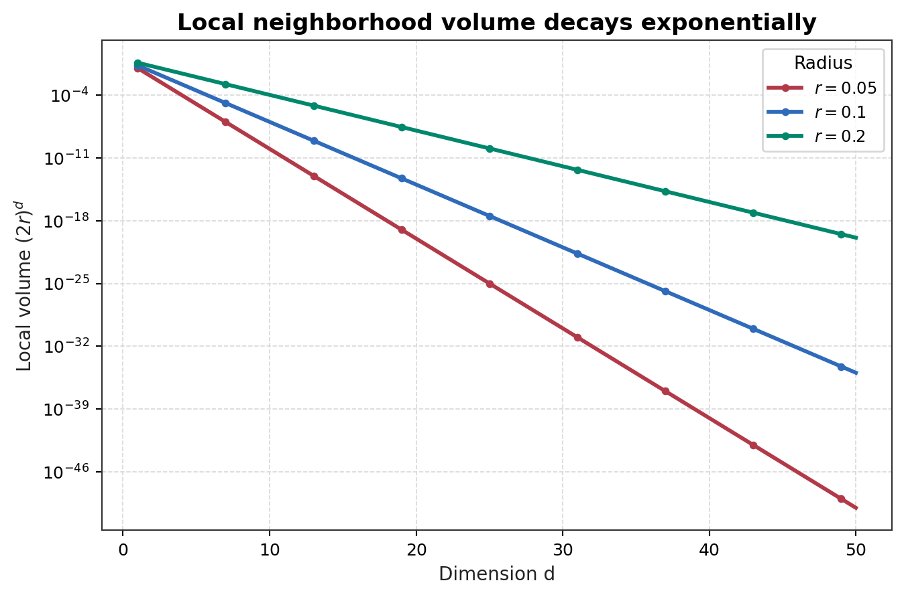
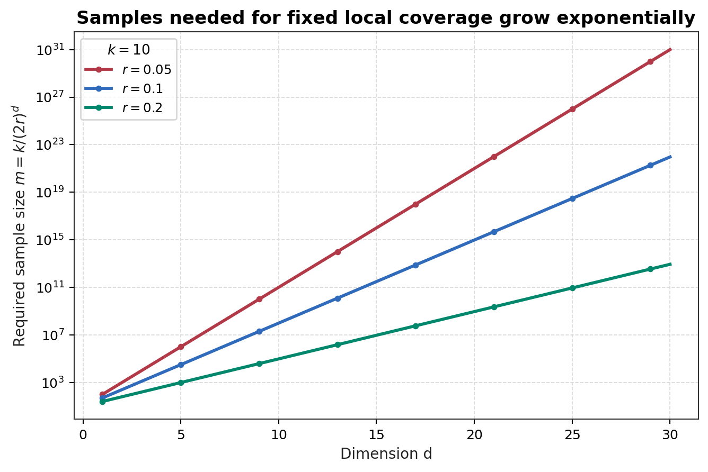
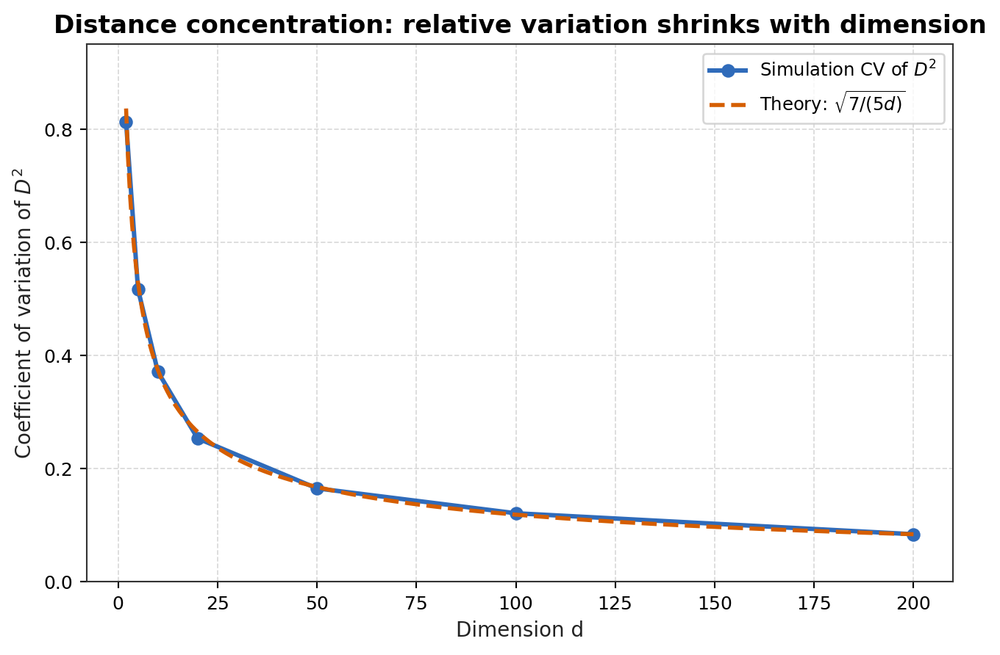
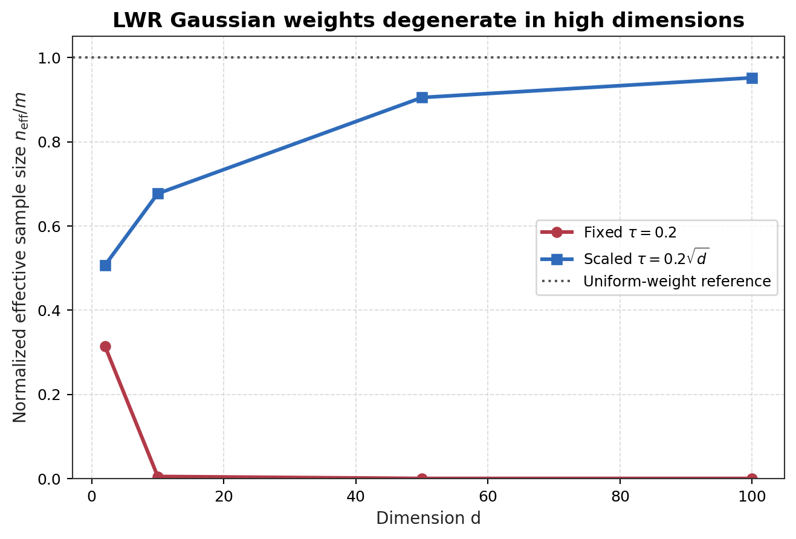

# Locally Weighted Regression

## 1. Motivation: Why Global Linear Regression Can Fail

Ordinary linear regression assumes one parameter vector $\theta$ can describe the whole input space:

$$h_\theta(x)=\theta^Tx.$$

This is efficient and interpretable, but it can fail when the conditional mean $\mathbb{E}[y|x]$ changes curvature across the domain. A single global line may be too biased: it averages incompatible local trends into one compromise.

Locally weighted regression keeps the linear model locally, but removes the requirement that the same $\theta$ work everywhere. Around each query point $x$, it fits a local linear approximation using nearby training examples more heavily than faraway ones.

## 2. Weighted Least Squares Objective

For a fixed query point $x$, define the local objective:

$$J_x(\theta)=\frac{1}{2}\sum_{i=1}^{m}w^{(i)}(x)\left(y^{(i)}-\theta^Tx^{(i)}\right)^2.$$

The subscript $x$ means the objective depends on the prediction location. The weights satisfy:

$$w^{(i)}(x)\geq0.$$

If $w^{(i)}(x)$ is large, example $i$ strongly influences the local fit. If $w^{(i)}(x)$ is close to $0$, example $i$ contributes little to the local objective.

In matrix form, let $W_x=\mathrm{diag}(w^{(1)}(x),\ldots,w^{(m)}(x))$. Then:

$$J_x(\theta)=\frac{1}{2}(y-X\theta)^TW_x(y-X\theta).$$

The stationary condition is:

$$X^TW_xX\theta=X^TW_xy.$$

If $X^TW_xX$ is invertible, the local weighted least-squares solution is:

$$\theta(x)=(X^TW_xX)^{-1}X^TW_xy.$$

The notation $\theta(x)$ emphasizes that this parameter vector is query-dependent.

## 3. Gaussian-kernel Weight

A common weighting rule is:

$$w^{(i)}(x)=\exp\left(-\frac{\left|x^{(i)}-x\right|_2^2}{2\tau^2}\right).$$

This is Gaussian-kernel-like because it decays exponentially with squared distance. It is a locality weighting function centered at the query point $x$. It is not the same as assuming that all data are globally Gaussian distributed.

At $x^{(i)}=x$, the weight is:

$$w^{(i)}(x)=1.$$

As $\left|x^{(i)}-x\right|_2$ grows, the weight decreases smoothly toward $0$.

## 4. Role of $\tau$

The parameter $\tau>0$ is the bandwidth or locality parameter. It controls how quickly weights decay with distance.

For small $\tau$, the denominator $2\tau^2$ is small, so even moderate distances make the exponent very negative:

$$\tau\downarrow\quad\Rightarrow\quad w^{(i)}(x)\ \text{decays faster with distance}.$$

For large $\tau$, the denominator is larger, so weights decay more slowly:

$$\tau\uparrow\quad\Rightarrow\quad w^{(i)}(x)\ \text{decays slower with distance}.$$

Small $\tau$ produces highly local and flexible fits, but may be unstable. Large $\tau$ averages over broader neighborhoods and approaches the behavior of global linear regression.

## 5. Prediction-time Fitting and Why It Is Non-parametric

LWR does not train once and then discard the data. Instead, prediction at a new point $x$ requires:

1. compute weights $w^{(i)}(x)$ for all training examples;
2. solve the weighted least-squares problem for $\theta(x)$;
3. output $\hat{y}=\theta(x)^Tx$.

The effective model is therefore tied to retained training data. As $m$ grows, the memory requirement and prediction-time computation can grow too. This is why LWR is considered non-parametric in the statistical learning sense, even though each local fit has parameters.

## 6. Bias-variance Interpretation

The bandwidth $\tau$ controls the bias-variance tradeoff.

With small $\tau$, the model focuses on a narrow neighborhood. This can reduce bias if the true function changes rapidly, but it increases variance because the fit depends on few effective samples:

$$\tau\ \text{small}\quad\Rightarrow\quad\text{low bias, high variance}.$$

With large $\tau$, many points receive meaningful weight. This stabilizes the estimate but can smooth away real local structure:

$$\tau\ \text{large}\quad\Rightarrow\quad\text{high bias, low variance}.$$

Good bandwidth selection depends on sample density, noise level, smoothness of the true function, and the distance metric.

## 7. High-dimensional Failure and Curse of Dimensionality

LWR 的局部拟合依赖两个前提：query point $x$ 附近必须有足够多 informative samples，而且 distance metric 必须能稳定地区分 nearby points 和 faraway points。High-dimensional space 同时破坏这两个前提：local neighborhoods 变得稀疏，distances 又会 concentrate。

### Local Neighborhood Sparsity

假设 data points 近似均匀分布在 unit hypercube $[0,1]^d$ 中，并且 query point $x$ 离边界足够远。对 $L_{\infty}$ local neighborhood，半径 $r$ 对应一个边长为 $2r$ 的 hypercube。

$$\mathrm{Vol}_{\infty}(r)=(2r)^d.$$

如果有 $m$ 个 training samples，那么 local sample count $N_r$ 的期望为：

$$\mathbb{E}[N_r]=m(2r)^d.$$

为了让 local neighborhood 平均至少有 $k$ 个 samples，需要：

$$m(2r)^d\geq k.$$

因此：

$$m\geq \frac{k}{(2r)^d}.$$

对固定 local radius $r<1/2$，required sample size 随 dimension $d$ 指数增长。例如 $r=0.1$ 时，$(2r)^d=0.2^d$；若只要求 $k=10$ 个 local samples，也需要：

$$m\geq 10\cdot 5^d.$$

这就是 “local neighborhoods become sparse” 的严格含义。

更直观地看，在 uniform assumption 下，volume ratio 也就是 probability ratio。半径从 $r$ 扩大到 $(1+\epsilon)r$ 时，新增 boundary shell 相对于原 neighborhood 的比例是：

$$\frac{\mathrm{Vol}_{\infty}((1+\epsilon)r)-\mathrm{Vol}_{\infty}(r)}{\mathrm{Vol}_{\infty}(r)}=(1+\epsilon)^d-1.$$

半径从 $r$ 缩小到 $(1-\epsilon)r$ 时，inner core 相对于原 neighborhood 的比例是：

$$\frac{\mathrm{Vol}_{\infty}((1-\epsilon)r)}{\mathrm{Vol}_{\infty}(r)}=(1-\epsilon)^d.$$

所以当 $d$ 增大时，固定比例的边缘变化会被指数放大。outer shell 的概率质量可以很快超过原主体，而去掉边缘后的 inner core 质量会迅速趋近于 $0$。这说明高维空间中的 local mass 对 bandwidth 和边界变化非常敏感，低维中的“中心主体”直觉并不可靠。

对 Euclidean ball，忽略 boundary effects 时：

$$\mathrm{Vol}_{2}(r)=V_d r^d.$$

其中：

$$V_d=\frac{\pi^{d/2}}{\Gamma(d/2+1)}.$$

于是：

$$\mathbb{E}[N_r]=mV_dr^d.$$

为了让 $\mathbb{E}[N_r]\geq k$：

$$m\geq \frac{k}{V_dr^d}.$$

关键因子仍然是 $r^d$。即使不考虑 $V_d$ 的维度依赖，只要 $r<1$，local volume 也会随 $d$ 快速 collapse。

LWR 假设每个 query point $x$ 附近都有足够样本来拟合稳定的 local model $\theta(x)$。在高维中，除非 $m$ 指数增长，否则这个假设会失效。

### Distance Concentration

令 $X,Y\in[0,1]^d$ 是两个 independent random points，且各坐标 independent。定义 squared Euclidean distance：

$$D^2=\left|X-Y\right|_2^2=\sum_{j=1}^{d}(X_j-Y_j)^2.$$

令：

$$Z_j=(X_j-Y_j)^2.$$

则：

$$D^2=\sum_{j=1}^{d}Z_j.$$

对 independent $X_j,Y_j\sim\mathrm{Uniform}(0,1)$：

$$\mathbb{E}[Z_j]=\mathbb{E}[(X_j-Y_j)^2]=\frac{1}{6}.$$

并且：

$$\mathbb{E}[Z_j^2]=\mathbb{E}[(X_j-Y_j)^4]=\frac{1}{15}.$$

所以：

$$\mathrm{Var}(Z_j)=\frac{1}{15}-\left(\frac{1}{6}\right)^2=\frac{7}{180}.$$

由于 coordinates independent：

$$\mathbb{E}[D^2]=\sum_{j=1}^{d}\mathbb{E}[Z_j]=\frac{d}{6}.$$

$$\mathrm{Var}(D^2)=\sum_{j=1}^{d}\mathrm{Var}(Z_j)=\frac{7d}{180}.$$

因此 $D^2$ 的 coefficient of variation 为：

$$\frac{\sqrt{\mathrm{Var}(D^2)}}{\mathbb{E}[D^2]}=\frac{\sqrt{7d/180}}{d/6}=\sqrt{\frac{7}{5d}}.$$

Distance 的 absolute scale 随 $d$ 增大，但 relative fluctuation 按 $1/\sqrt{d}$ 缩小，所以 distances increasingly concentrate around their mean。

如果从一个 query point 到 $m$ 个 training points 计算距离，每个 squared distance 都是 $d$ 个 coordinate-level random terms 的和。一个 squared distance 的 typical fluctuation 是 $O(\sqrt{d})$，而 mean 是 $O(d)$。对 fixed 或 subexponential $m$，多个 sampled distances 的 spread 相比 mean 仍然较小。直观地说：

$$\frac{D_{\max}^2-D_{\min}^2}{\mathbb{E}[D^2]}=O\left(\sqrt{\frac{\log m}{d}}\right).$$

当 $d$ 很大且 $\log m\ll d$ 时，nearest 和 farthest distances 的 relative difference 变小。这不表示所有 distances 完全相等，而是表示 Euclidean distance 的 ranking signal 相对于整体 distance scale 变弱。

## Consequence for Gaussian Kernel Weights

Gaussian-kernel LWR 使用：

$$w^{(i)}(x)=\exp\left(-\frac{\left|x^{(i)}-x\right|_2^2}{2\tau^2}\right).$$

如果 $\tau$ 固定，typical squared distance 按 $d/6$ 增长，则 typical weight 近似满足：

$$w^{(i)}(x)\approx \exp\left(-\frac{d}{12\tau^2}\right).$$

因此 weights 会随 $d$ 增大而变得极小，effective neighbors 可能 collapse。

如果让 $\tau^2$ 随 $d$ scaling，weights 不会全部 vanish；但由于 distances 的 relative differences 变小，weights 会趋近 uniform。于是高维中出现一个两难：

* small $\tau$：almost no effective neighbors；
* large $\tau$：all points look similarly weighted，LWR 接近 global fitting；
* intermediate $\tau$：often unstable and highly data-dependent。

这就是 LWR 在 low-dimensional visual examples 中强大、但在 high-dimensional feature spaces 中脆弱的深层原因。LWR 假设 locality 既 statistically populated 又 geometrically meaningful。高维同时破坏这两个条件：local neighborhoods 除非数据指数增长否则接近空，而 distance-based weighting 因 distances concentrate 变得不够 informative。

## 8. Reliability Notes

For reliable ML, locality-based methods should report or monitor:

* effective sample size around each query;
* bandwidth sensitivity;
* local condition number of weighted design matrix;
* distance concentration diagnostics;
* feature scaling and metric validity;
* whether learned local behavior is stable under perturbations.

LWR is valuable because it exposes the limitation of one global linear model, but it is not automatically more reliable. It trades global misspecification risk for local data sufficiency, metric validity, and bandwidth-selection risk.
