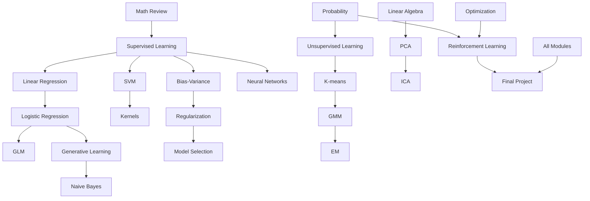

# CS229 Module Dependency Graph

## 1. Global Dependency Flow

这个依赖图的核心含义是：CS229 不是若干算法的并列清单，而是从 math review 到 supervised learning，再扩展到 generative models, kernels, model selection, unsupervised learning 和 RL 的层级结构。Final project 不应脱离这些核心能力，而应从至少一个模块中提出可验证问题。

## 2. Ability Dependency

Linear algebra supports geometry, optimization, PCA, SVM。具体来说，vectors and matrices 支撑数据表示，projections 支撑 least squares 和 PCA，eigendecomposition 支撑 dimensionality reduction，inner products 和 norms 支撑 margin geometry 与 kernels。

Probability supports MLE, MAP, generative models, EM, RL。CS229 中很多 objective 来自 probabilistic assumptions：Gaussian noise 连接 least squares，Bernoulli likelihood 连接 logistic regression，conditional independence 连接 Naive Bayes，latent variables 连接 GMM/EM，transition uncertainty 连接 RL。

Optimization supports GD, Newton method, SVM duality, neural network training。只有理解 objective landscape, gradient, Hessian, constraints 和 duality，才能解释为什么某个算法这样更新、什么时候收敛、什么时候数值不稳定。

Experimental discipline supports model selection, error analysis, final project。没有实验纪律，模型实现只能证明代码能跑，不能证明结论可信。CS229 的每个实验都应包含 baseline, sanity check, metric choice, validation protocol 和 failure mode analysis。

## 3. My Bottleneck Prediction

SVM duality and KKT 可能是第一个明显瓶颈。原因是它同时要求 linear algebra, convex optimization, constraints, Lagrangian 和 geometric margin 直觉；如果只背公式，后续 kernel methods 会变成黑箱。

EM derivation 也可能卡住。E-step 和 M-step 的形式看似算法化，但本质是 latent variable likelihood 的下界优化；如果不理解概率结构，很容易只会写步骤不会解释。

Learning theory 会是概念瓶颈。它要求把 empirical performance 和 true generalization 区分开，并理解 bounds 的意义和局限。这里需要避免把 theorem 当作工程指标，也不能把经验结果当作理论保证。

RL Bellman equations 可能会卡在 value function, policy, transition dynamics 和 iterative update 的关系上。需要用小型 gridworld 例子验证，而不是直接跳到复杂 RL。

Rigorous experiment design 是实践瓶颈。我的项目经验有帮助，但 CS229 仓库需要更明确地写出 baseline, ablation, sanity check 和 error analysis，否则很容易变成结果展示。

Avoiding superficial GitHub documentation 是 portfolio 瓶颈。README 和 notes 不能只写漂亮标题，必须有推导、实现、测试和可复盘实验支撑。

## 4. Study Strategy

每个模块先问 core question：这个模型解决什么问题？它假设数据如何生成或如何可分？它优化什么 objective？它的 failure mode 是什么？

先推导再代码。每个 algorithm 至少先完成手写或 Markdown 推导，再进入 NumPy implementation。代码实现只接受推导能解释的更新规则。

每个实验都要有 sanity check。例如 linear regression 应在无噪声线性数据上接近真实参数；logistic regression 应在可分 toy data 上达到合理分类边界；PCA 应能恢复主方向。

每周写 failure mode。记录模型在哪里失败、为什么失败、是 assumption violation、optimization issue、data issue 还是 metric issue。

每个 commit 都要形成一个可验证产出。可验证产出可以是完成的 note、推导、测试、实验图、错误分析或报告，而不是无边界的文件堆积。
